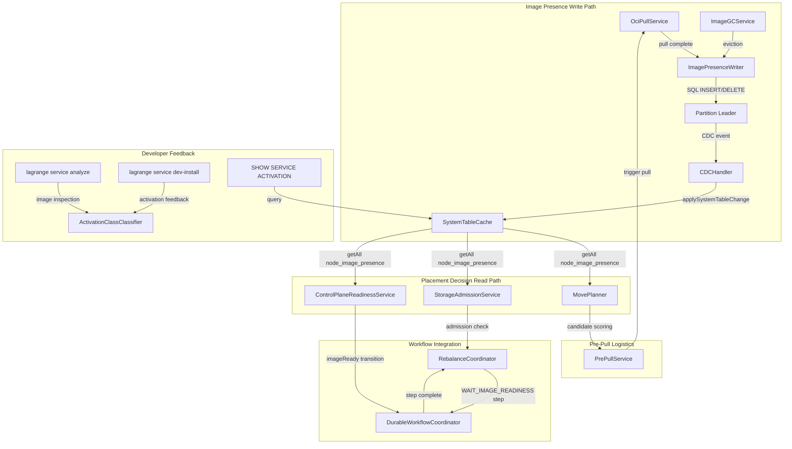
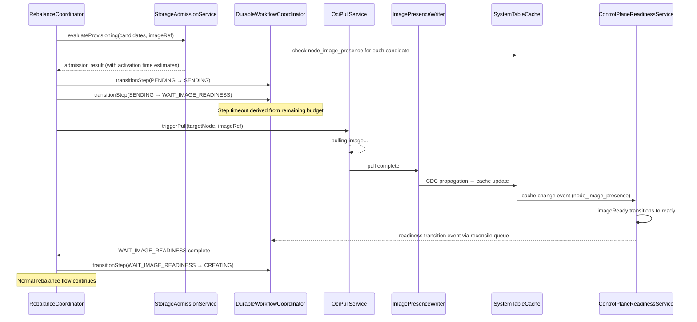

# Design Document: Activation-Cost-Aware Placement

## Overview

This feature extends Lagrange's placement, admission, and rebalance subsystems
to account for OCI container image pull cost — the dominant factor in compute
readiness for container services. Today, placement is purely
storage-dimensional. When `oci_container` services go live, a node that lacks
the required image may need tens of seconds to pull it, making image locality
the primary determinant of rebalance responsiveness.

The design introduces:

1. A CDC-propagated `node_image_presence` system table tracking per-node image
   cache state.
2. An `ActivationClassClassifier` that derives activation class (A/B/C/D) from
   image size and configurable pull throughput.
3. Image locality scoring in `MovePlanner` as an additional placement dimension.
4. Activation-cost admission gating in `StorageAdmissionService` against
   operation timeout budgets.
5. A `WAIT_IMAGE_READINESS` workflow step in `DurableWorkflowCoordinator` for
   durable image pull tracking.
6. An `imageReady` readiness dimension in `ControlPlaneReadinessService`.
7. Background pre-pull logistics, layer sharing awareness, and image GC.
8. Developer feedback tooling: `lagrange service analyze`, dev-install
   feedback, SQL activation metrics, and manifest activation class declaration.

### Design Rationale

The key architectural decision is to model image presence as a CDC-propagated
system table rather than an in-memory side cache. This follows the system
guidelines' single-source-of-truth contract: `SystemTableCache` is the only
read model for cluster metadata, and all mutations flow through SQL/CDC. This
means `MovePlanner` and `StorageAdmissionService` can read image locality from
the same cache they already use for node readiness and storage capacity,
without introducing a parallel data path.

The activation class taxonomy (A < 2s, B 2–10s, C 10–30s, D > 30s) maps
directly to placement behavior: class A services are freely movable (zero
image penalty), while class D services require warm standbys and deliberate
moves. This graduated approach avoids a binary "has image / doesn't have image"
model and lets operators tune the tradeoff via policy knobs.

### Phasing

- **Phase 0.5**: CLI tooling (`service analyze`, dev-install feedback) — no
  runtime changes, pure analysis.
- **Phase 1.0**: `node_image_presence` table, activation class derivation,
  admission gating, `WAIT_IMAGE_READINESS` workflow step, `imageReady`
  readiness dimension, placement scoring.
- **Phase 2.0**: Pre-pull service, layer sharing, image GC, registry locality,
  pull progress reporting.

## Architecture

### Component Ownership Map

| Concern | Owner | Extension Point |
|---------|-------|-----------------|
| Image presence rows | `ImagePresenceWriter` (new) | Single write path for insert/remove |
| Image presence read model | `SystemTableCache` via CDC | Existing cache read pattern |
| Activation class derivation | `ActivationClassClassifier` (new) | Writes to `service_definitions.activation_class` |
| Image locality scoring | `MovePlanner` | New scoring dimension in `sortNodesBySuitability` |
| Activation-cost admission | `StorageAdmissionService` | New check in `evaluateProvisioning` |
| Image readiness workflow step | `DurableWorkflowCoordinator` | New `WAIT_IMAGE_READINESS` step |
| Image readiness dimension | `ControlPlaneReadinessService` | New `imageReady` dimension |
| Background pre-pull | `PrePullService` (new) | Reads MovePlanner scoring, triggers pulls |
| Layer sharing analysis | `LayerSharingAnalyzer` (new) | Feeds into MovePlanner and admission |
| Image GC | `ImageGCService` (new) | LRU eviction with pinning |
| Registry locality | `RegistryLocalityConfig` (new) | Stored in `config` table |
| OCI pull execution | `OciPullService` (new) | Wraps container runtime pull API |
| CLI analyze | `ActivationAnalyzeCommand` (new) | CLI command handler |
| SQL activation metrics | `SqlCore` | New `SHOW SERVICE ACTIVATION` handler |
| Manifest activation class | `RuntimeDescriptorValidator` | New `activation_class` field validation |
| Pull progress events | `OciPullService` | Event emission API |
| Placement policy knobs | `TablePolicyService` | New fields in `placementConstraints` |

### System Data Flow



### Workflow Step Sequence (Rebalance with Image Pull)




## Components and Interfaces

### 1. `node_image_presence` System Table

New CDC-propagated system table. Registered in `TABLES`, classified in
`CDC_PROPAGATED_TABLES` via `cdc-table-policy.js`, schema defined in
`system-table-schemas-constants.js`.

**Propagation rule**: PLACEMENT — read by MovePlanner, admission service,
and readiness service for placement decisions.

```javascript
// In src/constants/tables.js
NODE_IMAGE_PRESENCE: 'node_image_presence',

// Schema (system-table-schemas-constants.js)
{
  tableName: TABLES.NODE_IMAGE_PRESENCE,
  columns: [
    {name: 'node_id', type: COLUMN_TYPE.TEXT, notNull: true},
    {name: 'image_ref', type: COLUMN_TYPE.TEXT, notNull: true},
    {name: 'image_digest', type: COLUMN_TYPE.TEXT, notNull: true},
    {name: 'compressed_size_bytes', type: COLUMN_TYPE.INTEGER, notNull: true},
    {name: 'uncompressed_size_bytes', type: COLUMN_TYPE.INTEGER, notNull: true},
    {name: 'cached_at', type: COLUMN_TYPE.INTEGER, notNull: true},
    {name: 'last_used_at', type: COLUMN_TYPE.INTEGER, notNull: true},
    {name: 'layer_count', type: COLUMN_TYPE.INTEGER, notNull: true},
  ],
  primaryKey: ['node_id', 'image_digest'],
  indices: [
    {name: 'idx_nip_image_digest', columns: ['image_digest']},
    {name: 'idx_nip_node_id', columns: ['node_id']},
  ],
}
```

**CDC policy** (in `cdc-table-policy.js`):
```javascript
[TABLES.NODE_IMAGE_PRESENCE]: createTablePolicy(
  TABLES.NODE_IMAGE_PRESENCE, {
    policyClass: CDC_POLICY_CLASS.CONTROL_INTERNAL_PROPAGATION,
    authorityClass: CDC_AUTHORITY_CLASS.CONTROL,
    internalCachePropagation: true,
    readinessRelevant: false,
    bootstrapHydrationMode: CDC_BOOTSTRAP_HYDRATION_MODE.BOOTSTRAP_ONLY,
    externalCdcAllowed: false,
  },
),
```

**Design decision**: `readinessRelevant: false` because image presence is
not a cluster-wide readiness gate — it's a per-service, per-node dimension.
The `imageReady` dimension in `ControlPlaneReadinessService` is evaluated
on-demand per service, not as a global readiness condition.

### 2. `node_image_layers` System Table (Phase 2)

Non-propagated table for layer-level tracking. Queryable from owning
partition only, used by `LayerSharingAnalyzer`.

```javascript
// In src/constants/tables.js
NODE_IMAGE_LAYERS: 'node_image_layers',

// Schema
{
  tableName: TABLES.NODE_IMAGE_LAYERS,
  columns: [
    {name: 'node_id', type: COLUMN_TYPE.TEXT, notNull: true},
    {name: 'image_digest', type: COLUMN_TYPE.TEXT, notNull: true},
    {name: 'layer_digest', type: COLUMN_TYPE.TEXT, notNull: true},
    {name: 'layer_size_bytes', type: COLUMN_TYPE.INTEGER, notNull: true},
    {name: 'layer_index', type: COLUMN_TYPE.INTEGER, notNull: true},
  ],
  primaryKey: ['node_id', 'image_digest', 'layer_digest'],
  indices: [
    {name: 'idx_nil_layer_digest', columns: ['layer_digest']},
  ],
}
```

**Design decision**: Non-propagated because layer data is high-cardinality
(many layers per image × many images × many nodes). The
`LayerSharingAnalyzer` queries this on-demand from the owning partition
and caches overlap fractions in a derived view, not in `SystemTableCache`.

### 3. `ImagePresenceWriter`

**File**: `src/runtime/image-presence-writer.js`

Single owner for `node_image_presence` row lifecycle. No other component
may insert or delete rows in this table.

```javascript
class ImagePresenceWriter {
  /**
   * @param {Object} options
   * @param {Object} options.cdcIntegrationService - CDC write path
   * @param {Function} options.now - Clock function
   */
  constructor(options = {}) {}

  /**
   * Record image presence after successful pull.
   * Inserts a row into node_image_presence via SQL/CDC.
   * @param {Object} record
   * @param {string} record.nodeId
   * @param {string} record.imageRef
   * @param {string} record.imageDigest
   * @param {number} record.compressedSizeBytes
   * @param {number} record.uncompressedSizeBytes
   * @param {number} record.layerCount
   * @return {Promise<void>}
   */
  async recordPresence(record) {}

  /**
   * Remove image presence after eviction.
   * Deletes the row by primary key (node_id, image_digest).
   * @param {string} nodeId
   * @param {string} imageDigest
   * @return {Promise<void>}
   */
  async removePresence(nodeId, imageDigest) {}

  /**
   * Update last_used_at timestamp when image is accessed.
   * Partial update by primary key only.
   * @param {string} nodeId
   * @param {string} imageDigest
   * @return {Promise<void>}
   */
  async touchPresence(nodeId, imageDigest) {}

  /**
   * Reconcile cache rows against actual local image store on restart.
   * Removes rows for images no longer present on disk.
   * @param {string} nodeId
   * @param {Set<string>} localDigests - Digests present on local disk
   * @return {Promise<void>}
   */
  async reconcileOnRestart(nodeId, localDigests) {}
}
```

### 4. `ActivationClassClassifier`

**File**: `src/runtime/activation-class-classifier.js`

Derives activation class from image metadata. Used by:
- `service_definitions` row population (runtime)
- CLI `service analyze` command
- CLI `service dev-install` feedback
- SQL `SHOW SERVICE ACTIVATION` handler

```javascript
// Constants (src/runtime/activation-class-constants.js)
const ACTIVATION_CLASS = Object.freeze({
  A: 'A',
  B: 'B',
  C: 'C',
  D: 'D',
});

const ACTIVATION_CLASS_THRESHOLD_MS = Object.freeze({
  A_MAX: 2000,    // < 2s
  B_MAX: 10000,   // 2-10s
  C_MAX: 30000,   // 10-30s
  // > 30s = D
});

const ACTIVATION_CLASS_DEFAULT = Object.freeze({
  PULL_THROUGHPUT_BYTES_PER_MS: 50 * 1024,  // ~50 MB/s default
  ACTIVATION_OVERHEAD_MS: 500,               // fixed startup overhead
});

class ActivationClassClassifier {
  /**
   * @param {Object} options
   * @param {Object} options.configProvider - Dynamic config reader
   */
  constructor(options = {}) {}

  /**
   * Derive activation class from compressed image size.
   * @param {number} compressedSizeBytes
   * @return {{
   *   activationClass: string,
   *   estimatedColdActivationMs: number,
   *   pullDurationMs: number,
   * }}
   */
  classify(compressedSizeBytes) {}

  /**
   * Validate a declared activation class against derived class.
   * Returns a warning if declared is more optimistic than derived.
   * @param {string} declaredClass
   * @param {number} compressedSizeBytes
   * @return {{
   *   effectiveClass: string,
   *   warning: string|null,
   * }}
   */
  validateDeclaredClass(declaredClass, compressedSizeBytes) {}

  /**
   * Estimate activation time for a specific node and image.
   * Accounts for image presence (skip pull) and shared layers.
   * @param {Object} options
   * @param {string} options.nodeId
   * @param {string} options.imageDigest
   * @param {number} options.compressedSizeBytes
   * @param {number} [options.presentLayerBytes] - Bytes already cached
   * @return {number} Estimated activation time in ms
   */
  estimateActivationTime(options) {}
}
```

### 5. `MovePlanner` Extension — Image Locality Scoring

Extends `sortNodesBySuitability` with a new image locality dimension.
No new class — extends the existing `MovePlanner`.

```javascript
// New constants (src/rebalancer/activation-placement-constants.js)
const ACTIVATION_PLACEMENT = Object.freeze({
  // Penalty multipliers by activation class
  CLASS_PENALTY: Object.freeze({
    A: 0,      // freely movable
    B: 0.15,   // low penalty
    C: 0.40,   // moderate penalty
    D: 0.80,   // high penalty
  }),
  // Warm node recency window (ms) — default 1 hour
  WARM_RECENCY_WINDOW_MS: 3600000,
  // Warm node bonus (subtracted from score)
  WARM_NODE_BONUS: 0.10,
  // Default sticky preference strength
  DEFAULT_STICKY_PREFERENCE_STRENGTH: 0.5,
});
```

**Extension to `sortNodesBySuitability`**:

```javascript
// Inside sortNodesBySuitability, after existing scoring dimensions:

// Image locality scoring (only for OCI container services)
if (serviceContext?.runtimeKind === RUNTIME_KIND.OCI_CONTAINER) {
  const imageDigest = serviceContext.imageDigest;
  const activationClass = serviceContext.activationClass;
  const stickyStrength = constraints.stickyPreferenceStrength ??
    ACTIVATION_PLACEMENT.DEFAULT_STICKY_PREFERENCE_STRENGTH;

  if (stickyStrength > 0 && imageDigest) {
    const classPenalty =
      ACTIVATION_PLACEMENT.CLASS_PENALTY[activationClass] || 0;
    const penalty = classPenalty * stickyStrength;

    // Check image presence from SystemTableCache
    const presenceA = this.hasImageCached(a.node_id, imageDigest);
    const presenceB = this.hasImageCached(b.node_id, imageDigest);

    if (!presenceA) scoreA += penalty;
    if (!presenceB) scoreB += penalty;

    // Warm node bias
    if (constraints.warmNodeBias && imageDigest) {
      const warmA = this.isWarmNode(a.node_id, imageDigest);
      const warmB = this.isWarmNode(b.node_id, imageDigest);
      if (warmA) scoreA -= ACTIVATION_PLACEMENT.WARM_NODE_BONUS;
      if (warmB) scoreB -= ACTIVATION_PLACEMENT.WARM_NODE_BONUS;
    }
  }
}
```

**New helper methods on `MovePlanner`**:

```javascript
/**
 * Check if a node has a specific image cached.
 * Reads from SystemTableCache (node_image_presence).
 * @param {string} nodeId
 * @param {string} imageDigest
 * @return {boolean}
 */
hasImageCached(nodeId, imageDigest) {}

/**
 * Check if a node is a "warm" node for an image.
 * Warm = image cached AND last_used_at within recency window.
 * @param {string} nodeId
 * @param {string} imageDigest
 * @return {boolean}
 */
isWarmNode(nodeId, imageDigest) {}
```

### 6. `StorageAdmissionService` Extension — Activation Cost Gating

Extends `evaluateProvisioning` to include activation time estimation.

**New method**:

```javascript
/**
 * Estimate activation time for a candidate node.
 * @param {Object} options
 * @param {string} options.nodeId
 * @param {string} options.imageDigest
 * @param {number} options.compressedSizeBytes
 * @param {number} [options.presentLayerBytes]
 * @return {{
 *   estimatedActivationMs: number,
 *   imagePresent: boolean,
 * }}
 */
estimateActivationTime(options) {}
```

**Extension to `evaluateProvisioning`**:

For OCI container service operations, after the existing readiness and
capacity checks per candidate, the method additionally:

1. Reads `node_image_presence` from `SystemTableCache` for the candidate.
2. If image is present: `estimatedActivationMs = ACTIVATION_OVERHEAD_MS`.
3. If image is absent: `estimatedActivationMs = pullDurationMs + ACTIVATION_OVERHEAD_MS`.
4. If `estimatedActivationMs > remainingBudgetMs`: deny with
   `ACTIVATION_TIMEOUT_EXCEEDED` reason code.
5. Evaluates the full candidate set before rejecting (consistent with
   existing admission planning contract §1.4.11).

**New reason code** (in `storage-admission-constants.js`):

```javascript
ACTIVATION_TIMEOUT_EXCEEDED: 'activation_timeout_exceeded',
```

### 7. `DurableWorkflowCoordinator` — `WAIT_IMAGE_READINESS` Step

New workflow step added to `WORKFLOW_STEP` enum:

```javascript
// In src/constants/workflow.js
WAIT_IMAGE_READINESS: 'WAIT_IMAGE_READINESS',
```

**Step behavior** (owned by `RebalanceCoordinator`):

1. Inserted between `SENDING` and `CREATING` when the target node lacks
   the required image.
2. Step timeout derived from remaining operation budget via
   `createChildTimeoutBudget` — never a fresh default.
3. Completion triggered by `imageReady` readiness transition event
   propagated through the owner-key reconcile queue.
4. Timeout produces typed `IMAGE_READINESS_TIMEOUT` classification.
5. Skipped entirely when target node already has the image cached.

**Step transition sequence** (ADD operation with image pull):

```
PENDING → SENDING → WAIT_IMAGE_READINESS → CREATING → SYNCING → ACTIVE
```

**Step transition sequence** (ADD operation, image already cached):

```
PENDING → SENDING → CREATING → SYNCING → ACTIVE
```

### 8. `ControlPlaneReadinessService` — `imageReady` Dimension

New dimension in `CONTROL_PLANE_READINESS_DIMENSION`:

```javascript
// In control-plane-readiness-constants.js
IMAGE_READY: 'imageReady',
```

**Design decision**: `imageReady` is a per-service dimension, not a global
node dimension. A node may be image-ready for service X but not for
service Y. The dimension is evaluated on-demand when a specific service
context is provided, not as part of the global `buildDimensions` call.

**New method on `ControlPlaneReadinessService`**:

```javascript
/**
 * Evaluate image readiness for a specific service on a specific node.
 * @param {string} nodeId
 * @param {string} imageDigest
 * @return {boolean}
 */
isImageReady(nodeId, imageDigest) {}
```

**Readiness transition events**: When `node_image_presence` cache changes
are detected via `handleCacheChange`, the service emits readiness
transition events for affected service definitions, feeding into the
owner-key reconcile queue so pending `WAIT_IMAGE_READINESS` steps can
advance.

### 9. `PrePullService` (Phase 2)

**File**: `src/runtime/pre-pull-service.js`

Background service that proactively pulls images to likely placement targets.

```javascript
class PrePullService {
  /**
   * @param {Object} options
   * @param {Object} options.movePlanner - For candidate scoring
   * @param {Object} options.ociPullService - For triggering pulls
   * @param {Object} options.systemTableCache - For reading service defs
   * @param {Object} options.configProvider - For concurrency limits
   */
  constructor(options = {}) {}

  /**
   * Evaluate and trigger pre-pulls for eligible services.
   * Called periodically by the control-plane reconcile loop.
   * @return {Promise<void>}
   */
  async evaluatePrePulls() {}

  /**
   * Get current pre-pull status for diagnostics.
   * @return {Object} Pre-pull queue state
   */
  getStatus() {}
}
```

**Concurrency control**: Per-node concurrent pull limit stored in `config`
table as `pre_pull_max_concurrent_per_node`. Default: 2.

**Priority**: Class D services before class C. Class A and B are not
pre-pulled (activation cost is low enough).

### 10. `ImageGCService` (Phase 2)

**File**: `src/runtime/image-gc-service.js`

LRU eviction with pinning for active service images.

```javascript
class ImageGCService {
  /**
   * @param {Object} options
   * @param {Object} options.imagePresenceWriter - For eviction writes
   * @param {Object} options.systemTableCache - For reading presence/services
   * @param {Object} options.configProvider - For budget config
   */
  constructor(options = {}) {}

  /**
   * Run GC sweep for a node. Evicts LRU images exceeding budget.
   * Pins images used by active services and warm standbys.
   * @param {string} nodeId
   * @return {Promise<{evicted: number, retained: number}>}
   */
  async sweep(nodeId) {}

  /**
   * Determine if an image is pinned (not evictable).
   * @param {string} nodeId
   * @param {string} imageDigest
   * @return {boolean}
   */
  isPinned(nodeId, imageDigest) {}
}
```

### 11. `OciPullService`

**File**: `src/runtime/oci-pull-service.js`

Wraps the container runtime's image pull API. Single owner for pull
execution and progress reporting.

```javascript
class OciPullService {
  /**
   * @param {Object} options
   * @param {Object} options.imagePresenceWriter - For recording presence
   * @param {Object} options.registryLocalityConfig - For mirror selection
   * @param {Object} options.eventEmitter - For progress events
   * @param {Object} options.configProvider - For progress interval
   */
  constructor(options = {}) {}

  /**
   * Pull an OCI image to the local node.
   * Records presence via ImagePresenceWriter on completion.
   * Emits progress events at configurable interval.
   * @param {Object} options
   * @param {string} options.imageRef
   * @param {string} options.imageDigest
   * @param {string} options.nodeId
   * @return {Promise<{
   *   durationMs: number,
   *   compressedSizeBytes: number,
   *   throughputBytesPerMs: number,
   * }>}
   */
  async pull(options) {}

  /**
   * Check if an image exists in the local container store.
   * Used for restart reconciliation.
   * @param {string} imageDigest
   * @return {Promise<boolean>}
   */
  async existsLocally(imageDigest) {}
}
```

### 12. Placement Policy Knobs

New fields in `placementConstraints` (in `policy-constants.js`):

```javascript
// Added to DEFAULT_TABLE_POLICY.placementConstraints:
stickyPreferenceStrength: ACTIVATION_PLACEMENT
  .DEFAULT_STICKY_PREFERENCE_STRENGTH,
warmNodeBias: false,
prePullEligible: false,
warmStandbyCount: 0,
```

These are also added to `service_definitions` for per-service override.
The effective value is resolved: service definition override > table policy
> default.

### 13. CLI Commands

**`lagrange service analyze`** (Phase 0.5):

```
$ lagrange service analyze ./my-service-image/

  Compressed size:     245 MB
  Uncompressed size:   612 MB
  Layer count:         12
  Est. cold activation: 5.4s
  Activation class:    B

$ lagrange service analyze registry.example.com/app@sha256:abc123

  Compressed size:     1.2 GB
  Uncompressed size:   3.1 GB
  Layer count:         24
  Est. cold activation: 24.5s
  Activation class:    C

  ⚠ Recommendation: Image exceeds class B threshold.
    Consider multi-stage builds, smaller base images,
    or WASM as an alternative runtime.
```

**`lagrange service dev-install` feedback** (Phase 0.5):

After artifact preparation, before installation proceeds:

```
  Image prepared: 245 MB compressed, class B (est. 5.4s cold activation)
```

For class C/D:

```
  ⚠ Image prepared: 1.2 GB compressed, class C (est. 24.5s cold activation)
    Warning: Large image will slow placement and rebalance operations.
    Consider reducing image size.
```

### 14. SQL `SHOW SERVICE ACTIVATION`

New SQL command handled by `SqlCore`:

```sql
SHOW SERVICE ACTIVATION;
SHOW SERVICE ACTIVATION WHERE service_id = 'my-service';
```

Returns:

| service_id | runtime_kind | activation_class | compressed_size_bytes | estimated_cold_activation_ms | warm_node_count | total_node_count |
|------------|-------------|-----------------|----------------------|-----------------------------|-----------------|--------------------|
| my-svc | oci_container | B | 245000000 | 5400 | 2 | 3 |

`warm_node_count` derived from `node_image_presence` rows in
`SystemTableCache`. `estimated_cold_activation_ms` computed using the
same `ActivationClassClassifier` algorithm.


## Data Models

### `node_image_presence` Row Shape

```javascript
{
  node_id: 'node-abc-123',           // TEXT, PK part 1
  image_ref: 'registry.io/app:v1',   // TEXT, human-readable ref
  image_digest: 'sha256:abc123...',  // TEXT, PK part 2, immutable
  compressed_size_bytes: 245000000,  // INTEGER
  uncompressed_size_bytes: 612000000,// INTEGER
  cached_at: 1700000000000,          // INTEGER, epoch ms
  last_used_at: 1700000500000,       // INTEGER, epoch ms
  layer_count: 12,                   // INTEGER
}
```

**Primary key**: `(node_id, image_digest)` — a node can cache multiple
images, and the same image can be on multiple nodes.

**Row lifecycle owner**: `ImagePresenceWriter` exclusively.
- Insert: on pull completion.
- Update (`last_used_at` only): on service start using cached image.
- Delete: on eviction or restart reconciliation.

### `node_image_layers` Row Shape (Phase 2)

```javascript
{
  node_id: 'node-abc-123',           // TEXT, PK part 1
  image_digest: 'sha256:abc123...',  // TEXT, PK part 2
  layer_digest: 'sha256:layer456...',// TEXT, PK part 3
  layer_size_bytes: 52000000,        // INTEGER
  layer_index: 3,                    // INTEGER, position in image
}
```

**Primary key**: `(node_id, image_digest, layer_digest)`.

### `service_definitions` Extension

New columns added to the existing `service_definitions` schema:

```javascript
{name: 'activation_class', type: COLUMN_TYPE.TEXT},
{name: 'compressed_size_bytes', type: COLUMN_TYPE.INTEGER},
{name: 'estimated_cold_activation_ms', type: COLUMN_TYPE.INTEGER},
```

**Field ownership**: `ActivationClassClassifier` owns these fields.
Written during service creation/update when `runtime_kind = oci_container`.

### Placement Policy Extension

New fields in `placementConstraints` object (stored in `table_policies`
JSON or `service_definitions` row):

| Field | Type | Default | Description |
|-------|------|---------|-------------|
| `stickyPreferenceStrength` | number (0.0–1.0) | 0.5 | Image locality penalty multiplier |
| `warmNodeBias` | boolean | false | Prefer recently-used warm nodes |
| `prePullEligible` | boolean | false | Enable background pre-pull |
| `warmStandbyCount` | number (≥0) | 0 | Extra nodes to pin image on |

### Activation Class Constants

| Class | Threshold (ms) | Placement Behavior |
|-------|---------------|-------------------|
| A | < 2000 | Zero image penalty, freely movable |
| B | 2000–10000 | Low penalty (0.15 × strength) |
| C | 10000–30000 | Moderate penalty (0.40 × strength) |
| D | > 30000 | High penalty (0.80 × strength), warm standbys |

### Config Table Entries

New entries in the `config` system table:

| config_key | Default | Description |
|-----------|---------|-------------|
| `activation_pull_throughput_bytes_per_ms` | 51200 (~50 MB/s) | Estimated pull throughput |
| `activation_overhead_ms` | 500 | Fixed activation overhead |
| `pre_pull_max_concurrent_per_node` | 2 | Max concurrent pre-pulls per node |
| `pre_pull_evaluation_interval_ms` | 60000 | Pre-pull evaluation interval |
| `image_gc_budget_bytes` | 10737418240 (10 GB) | Per-node image cache budget |
| `image_gc_sweep_interval_ms` | 300000 (5 min) | GC sweep interval |
| `pull_progress_interval_ms` | 5000 | Pull progress event interval |

### Registry Locality Config (Phase 2)

Stored in `config` table as JSON under key `registry_locality_mapping`:

```javascript
{
  "registries": [
    {
      "endpoint": "registry.us-east.example.com",
      "latencyGroupId": "us-east-1"
    },
    {
      "endpoint": "registry.eu-west.example.com",
      "latencyGroupId": "eu-west-1"
    }
  ],
  "mirrors": {
    "registry.example.com/app": [
      "registry.us-east.example.com/app",
      "registry.eu-west.example.com/app"
    ]
  }
}
```


## Correctness Properties

*A property is a characteristic or behavior that should hold true across all
valid executions of a system — essentially, a formal statement about what the
system should do. Properties serve as the bridge between human-readable
specifications and machine-verifiable correctness guarantees.*

### Property 1: Image presence round trip

*For any* valid image presence record (with valid node_id, image_digest,
compressed_size_bytes, etc.), inserting it via `ImagePresenceWriter.recordPresence`
and then reading it back from `SystemTableCache` (after CDC propagation) should
produce a record with all original fields preserved. Removing it via
`ImagePresenceWriter.removePresence` and reading again should return no record.

**Validates: Requirements 1.1, 1.2, 1.3**

### Property 2: Restart reconciliation preserves only local images

*For any* set of `node_image_presence` rows for a node and *any* set of
locally-present image digests, after `ImagePresenceWriter.reconcileOnRestart`,
the remaining rows should be exactly the intersection: rows whose
`image_digest` is in the local digest set.

**Validates: Requirements 1.5**

### Property 3: Activation class derivation matches threshold ranges

*For any* non-negative compressed image size and *any* positive pull throughput,
the `ActivationClassClassifier.classify` result must satisfy:
- If `estimatedColdActivationMs < 2000` then class is A
- If `2000 <= estimatedColdActivationMs < 10000` then class is B
- If `10000 <= estimatedColdActivationMs < 30000` then class is C
- If `estimatedColdActivationMs >= 30000` then class is D

where `estimatedColdActivationMs = (compressedSizeBytes / pullThroughputBytesPerMs) + overheadMs`.

**Validates: Requirements 2.1, 2.4**

### Property 4: Effective activation class resolution

*For any* service manifest and *any* image size, the effective activation class
must equal the declared `activation_class` if present, otherwise the class
derived from image size. When the declared class is more optimistic than the
derived class (i.e., declared < derived in the A < B < C < D ordering), a
validation warning must be emitted. When declared is equal to or more
conservative than derived, no warning is emitted.

**Validates: Requirements 2.2, 2.3, 14.2, 14.3, 14.4**

### Property 5: Image locality penalty is class × strength

*For any* activation class and *any* `stickyPreferenceStrength` in [0.0, 1.0],
the image locality penalty applied by `MovePlanner` to a node lacking the
required image must equal `CLASS_PENALTY[activationClass] * stickyPreferenceStrength`,
where `CLASS_PENALTY` satisfies `A = 0 < B < C < D`. Nodes that have the
image cached receive zero penalty regardless of class or strength.

**Validates: Requirements 3.1, 3.2, 3.3**

### Property 6: Warm node bias improves score for recently-used images

*For any* two nodes where both have the required image cached, but only one
has `last_used_at` within the recency window, and `warmNodeBias` is enabled,
the recently-used node must have a strictly lower (better) score than the
other node, all else being equal.

**Validates: Requirements 3.4**

### Property 7: Zero strength preserves original scoring

*For any* set of candidate nodes and *any* placement policy with
`stickyPreferenceStrength = 0.0`, the node ordering produced by
`MovePlanner.sortNodesBySuitability` must be identical to the ordering
produced without the image locality feature (i.e., only CPU, memory, disk,
and latency group dimensions contribute).

**Validates: Requirements 3.5, 15.5**

### Property 8: Activation time estimation accounts for image presence

*For any* candidate node, image digest, and compressed image size:
- If the node has the image in `node_image_presence`, the estimated
  activation time must equal `ACTIVATION_OVERHEAD_MS`.
- If the node lacks the image, the estimated activation time must equal
  `(compressedSizeBytes / pullThroughputBytesPerMs) + ACTIVATION_OVERHEAD_MS`.

**Validates: Requirements 4.1, 4.3**

### Property 9: Activation timeout denial with correct reason code

*For any* candidate node where the estimated activation time exceeds the
remaining timeout budget, `StorageAdmissionService` must deny the candidate
with reason code `ACTIVATION_TIMEOUT_EXCEEDED`. The full candidate set must
still be evaluated (i.e., `eligibleNodeIds.length + ineligibleNodes.length`
must equal the input candidate count).

**Validates: Requirements 4.2, 4.4**

### Property 10: WAIT_IMAGE_READINESS step insertion and skip

*For any* rebalance ADD operation targeting a node:
- If the node lacks the required image, the workflow step sequence must
  include `WAIT_IMAGE_READINESS` between `SENDING` and `CREATING`.
- If the node has the required image, the workflow step sequence must
  transition directly from `SENDING` to `CREATING` without
  `WAIT_IMAGE_READINESS`.

**Validates: Requirements 5.1, 5.5**

### Property 11: WAIT_IMAGE_READINESS timeout derives from remaining budget

*For any* operation with a top-level budget and *any* elapsed time before
the `WAIT_IMAGE_READINESS` step begins, the step's timeout must be less
than or equal to the remaining budget (`topLevelBudgetMs - elapsedMs`),
and must never equal a fresh default budget constant.

**Validates: Requirements 5.2**

### Property 12: Image readiness dimension reflects cache state

*For any* node and *any* service definition with an OCI image digest,
`ControlPlaneReadinessService.isImageReady(nodeId, imageDigest)` must
return `true` if and only if `SystemTableCache` contains a
`node_image_presence` row with matching `(node_id, image_digest)`.

**Validates: Requirements 6.1**

### Property 13: Image readiness transition emits reconcile event

*For any* `node_image_presence` cache change that causes `imageReady` to
transition from `false` to `true` for a (node, service) pair, the
`ControlPlaneReadinessService` must emit a readiness transition event
that feeds into the owner-key reconcile queue, enabling pending
`WAIT_IMAGE_READINESS` steps to advance.

**Validates: Requirements 6.4**

### Property 14: Pre-pull concurrency limit

*For any* node, the number of concurrent pre-pull operations initiated by
`PrePullService` must never exceed the configured
`pre_pull_max_concurrent_per_node` value.

**Validates: Requirements 7.2**

### Property 15: Pre-pull priority ordering

*For any* set of pending pre-pull targets, class D services must be
scheduled before class C services. Class A and B services are not
pre-pulled.

**Validates: Requirements 7.3**

### Property 16: Image GC preserves budget invariant

*For any* node, after `ImageGCService.sweep` completes, the total
`compressed_size_bytes` of remaining `node_image_presence` rows for that
node must be less than or equal to the configured `image_gc_budget_bytes`.

**Validates: Requirements 9.1**

### Property 17: Image GC evicts LRU first and never evicts pinned images

*For any* node exceeding the image cache budget, the `ImageGCService` must
evict images in ascending `last_used_at` order (oldest first), and must
never evict an image that is pinned (referenced by an active service on
the node, or within the `warm_standby_count` for any service).

**Validates: Requirements 9.2, 9.3, 9.5**

### Property 18: Layer sharing reduces penalty and estimated pull size

*For any* candidate node with partial layer overlap for a required image,
the `MovePlanner` image locality penalty must be reduced proportionally
to the fraction of required layers already present. Similarly,
`StorageAdmissionService` must subtract the size of present shared layers
from the estimated pull size when computing activation time.

**Validates: Requirements 8.2, 8.3**

### Property 19: Registry mirror selection by lowest latency

*For any* node with a latency group assignment and *any* set of registry
mirrors with known latency group mappings, `OciPullService` must select
the mirror whose latency group has the lowest estimated latency to the
pulling node's latency group.

**Validates: Requirements 10.2**

### Property 20: Activation analysis consistency across surfaces

*For any* image size, the estimated cold activation time and derived
activation class must be identical whether computed by
`ActivationClassClassifier.classify`, the `lagrange service analyze` CLI,
the `lagrange service dev-install` feedback, or the `SHOW SERVICE ACTIVATION`
SQL command.

**Validates: Requirements 11.3, 12.3, 13.4**

### Property 21: CLI analyze output contains all required fields

*For any* valid OCI image artifact, the `lagrange service analyze` output
must contain: compressed size, uncompressed size, layer count, estimated
cold activation time, and derived activation class. When the class is C
or D, the output must additionally contain a packaging recommendation.

**Validates: Requirements 11.1, 11.2**

### Property 22: SHOW SERVICE ACTIVATION returns correct warm node count

*For any* service definition and *any* set of `node_image_presence` rows,
the `warm_node_count` returned by `SHOW SERVICE ACTIVATION` must equal
the count of distinct `node_id` values in `node_image_presence` where
`image_digest` matches the service's required image digest.

**Validates: Requirements 13.1, 13.3**

### Property 23: Placement policy field validation

*For any* placement policy update, `stickyPreferenceStrength` must be
accepted if and only if it is a number in [0.0, 1.0]; `warmNodeBias` and
`prePullEligible` must be accepted if and only if they are booleans;
`warmStandbyCount` must be accepted if and only if it is a non-negative
integer.

**Validates: Requirements 15.1, 15.2, 15.3, 15.4**

### Property 24: Pull progress events contain required fields

*For any* OCI image pull lifecycle, all progress events must contain
`node_id`, `image_ref`, `bytes_pulled`, `total_bytes`, `elapsed_ms`, and
`estimated_remaining_ms`. The terminal completion event must additionally
contain `durationMs` and `throughputBytesPerMs`. The terminal failure
event must contain a typed `reasonCode`.

**Validates: Requirements 16.1, 16.3, 16.4**

### Property 25: Manifest activation_class field validation

*For any* service manifest, the `activation_class` field must be accepted
if and only if its value is one of `A`, `B`, `C`, or `D` (or omitted).
Any other value must be rejected with a validation error.

**Validates: Requirements 14.1**


## Error Handling

### Error Classification

All errors in this feature follow the existing system guidelines: no
swallowed errors, no try/catch for control flow, typed reason codes for
all failure paths.

#### Admission Errors

| Error Code | Trigger | Recovery |
|-----------|---------|----------|
| `ACTIVATION_TIMEOUT_EXCEEDED` | Estimated activation time > remaining budget | Candidate denied; next candidate evaluated |
| `NO_ADMISSIBLE_COHORT_ACTIVATION` | All candidates exceed activation budget | Operation fails with structured diagnostics per candidate |

These are added to the existing `STORAGE_ADMISSION_REASON` enum in
`storage-admission-constants.js`. The admission service evaluates the
full candidate set before producing a final decision (§1.4.11 compliance).

#### Workflow Step Errors

| Error Code | Trigger | Recovery |
|-----------|---------|----------|
| `IMAGE_READINESS_TIMEOUT` | `WAIT_IMAGE_READINESS` step exceeds derived budget | Step fails → operation transitions to terminal failure |
| `IMAGE_PULL_FAILED` | OCI pull returns error | Step fails with typed pull failure reason |

These are typed timeout classifications produced by `buildTimeoutClassification`
from `timeout-budget.js`. The step timeout is always derived from remaining
budget via `createChildTimeoutBudget` — never a fresh default.

#### Pull Errors

| Error Code | Trigger | Recovery |
|-----------|---------|----------|
| `PULL_NETWORK_ERROR` | Network failure during pull | Retry with exponential backoff (pre-pull only) |
| `PULL_REGISTRY_AUTH_ERROR` | Authentication failure | Fail immediately, no retry |
| `PULL_DIGEST_MISMATCH` | Downloaded content doesn't match digest | Fail immediately, security violation |
| `PULL_STORAGE_FULL` | Local disk full during pull | Fail, trigger GC sweep |
| `REGISTRY_FALLBACK` | Preferred mirror unavailable | Fall back to next-nearest mirror |

Pull errors are emitted as typed terminal failure events via the Event
Emission API (Req 16.4).

#### Image GC Errors

| Error Code | Trigger | Recovery |
|-----------|---------|----------|
| `GC_EVICTION_FAILED` | Failed to delete image from local store | Log and skip; retry on next sweep |
| `GC_PRESENCE_WRITE_FAILED` | Failed to remove presence row | Log and retry; row will be cleaned on next reconciliation |

GC errors are non-fatal. The sweep continues processing remaining
candidates. Failed evictions are retried on the next sweep cycle.

#### CLI Errors

| Error Code | Trigger | Recovery |
|-----------|---------|----------|
| `INVALID_ARTIFACT_FORMAT` | Input is not a valid OCI image or WASM module | Descriptive error with expected format |
| `REGISTRY_UNREACHABLE` | Cannot connect to OCI registry | Error with registry endpoint and suggestion to check connectivity |
| `ARTIFACT_NOT_FOUND` | Image ref does not exist in registry | Error with the ref that was not found |

#### Validation Errors

| Error Code | Trigger | Recovery |
|-----------|---------|----------|
| `INVALID_ACTIVATION_CLASS` | Manifest declares class not in {A,B,C,D} | Validation rejection |
| `INVALID_STICKY_STRENGTH` | Value outside [0.0, 1.0] | Policy validation rejection |
| `INVALID_WARM_STANDBY_COUNT` | Negative or non-integer value | Policy validation rejection |

### Error Propagation Rules

1. Admission errors propagate through the existing `buildResult` pattern
   in `StorageAdmissionService` — structured result objects, not thrown
   exceptions.
2. Workflow step errors propagate through `DurableWorkflowCoordinator`'s
   monotonic step transition mechanism — the step transitions to `FAILED`
   with a typed classification.
3. Pull errors propagate as typed events through the Event Emission API
   and as return values from `OciPullService.pull`.
4. CDC propagation failures are handled by the existing CDC retry
   mechanism — no new retry logic is introduced.
5. Cache divergence (e.g., presence row exists but image deleted from
   disk) is detected during restart reconciliation and corrected by
   `ImagePresenceWriter.reconcileOnRestart`.

## Testing Strategy

### Property-Based Testing

Property-based tests use `fast-check` with `{numRuns: 10}` per the
project testing guidelines. Each test references its design property.

#### Core Classification Properties

| Property | Test File | Generator Strategy |
|----------|-----------|-------------------|
| Property 3: Activation class thresholds | `test/runtime/activation-class-classifier.property.test.js` | `fc.nat()` for compressed size, `fc.integer({min: 1})` for throughput |
| Property 4: Effective class resolution | `test/runtime/activation-class-classifier.property.test.js` | `fc.oneof(fc.constant('A'), ..., fc.constant('D'))` for declared class, `fc.nat()` for size |
| Property 25: Manifest field validation | `test/runtime/activation-class-classifier.property.test.js` | `fc.string()` for arbitrary class values |

#### Placement Scoring Properties

| Property | Test File | Generator Strategy |
|----------|-----------|-------------------|
| Property 5: Penalty = class × strength | `test/rebalancer/move-planner-activation.property.test.js` | `fc.oneof` for class, `fc.double({min: 0, max: 1})` for strength |
| Property 6: Warm node bias | `test/rebalancer/move-planner-activation.property.test.js` | Random node pairs with varying `last_used_at` |
| Property 7: Zero strength = original scoring | `test/rebalancer/move-planner-activation.property.test.js` | Random node sets with strength fixed at 0.0 |

#### Admission Properties

| Property | Test File | Generator Strategy |
|----------|-----------|-------------------|
| Property 8: Activation time estimation | `test/rebalancer/storage-admission-activation.property.test.js` | `fc.nat()` for size, `fc.boolean()` for image presence |
| Property 9: Timeout denial + full evaluation | `test/rebalancer/storage-admission-activation.property.test.js` | Random candidate sets with varying budgets |

#### Image Presence Properties

| Property | Test File | Generator Strategy |
|----------|-----------|-------------------|
| Property 1: Presence round trip | `test/runtime/image-presence-writer.property.test.js` | Random image records with valid fields |
| Property 2: Restart reconciliation | `test/runtime/image-presence-writer.property.test.js` | Random row sets and random local digest sets |

#### Workflow Properties

| Property | Test File | Generator Strategy |
|----------|-----------|-------------------|
| Property 10: Step insertion/skip | `test/rebalancer/rebalance-image-readiness.property.test.js` | `fc.boolean()` for image presence on target |
| Property 11: Budget derivation | `test/rebalancer/rebalance-image-readiness.property.test.js` | Random elapsed times within budget range |

#### Readiness Properties

| Property | Test File | Generator Strategy |
|----------|-----------|-------------------|
| Property 12: imageReady reflects cache | `test/control-plane/image-readiness.property.test.js` | Random (nodeId, imageDigest) pairs with random cache state |

#### GC Properties

| Property | Test File | Generator Strategy |
|----------|-----------|-------------------|
| Property 16: Budget invariant | `test/runtime/image-gc-service.property.test.js` | Random image sets with varying sizes, random budget |
| Property 17: LRU + pinning | `test/runtime/image-gc-service.property.test.js` | Random image sets with varying `last_used_at` and active service refs |

#### Policy Validation Properties

| Property | Test File | Generator Strategy |
|----------|-----------|-------------------|
| Property 23: Field validation | `test/policy/activation-policy-validation.property.test.js` | `fc.double()` for strength, `fc.boolean()` for bias, `fc.integer()` for standby count |

### Unit Tests

Unit tests cover specific examples, edge cases, and integration points.

#### Edge Cases

- Empty candidate set for admission (zero candidates)
- All candidates denied by activation timeout (Property 9 edge case)
- `WAIT_IMAGE_READINESS` step timeout at exact budget boundary
  (typed `EXACT_BOUNDARY_HIT` classification)
- Image GC with all images pinned (nothing to evict)
- Restart reconciliation with empty local store (all rows removed)
- Restart reconciliation with all images present (no rows removed)
- `stickyPreferenceStrength = 1.0` (maximum penalty)
- `warmStandbyCount` exceeds total node count (pin on all available)
- Registry mirror fallback when preferred mirror is unavailable
- CLI analyze with invalid artifact format
- `SHOW SERVICE ACTIVATION` with no OCI container services (empty result)

#### Integration Tests

- End-to-end rebalance with image pull: admission → WAIT_IMAGE_READINESS
  → pull → CDC propagation → step advance → CREATING
- Pre-pull triggers pull on likely target, then rebalance skips
  WAIT_IMAGE_READINESS because image is already cached
- Image GC evicts unused image, then rebalance to that node includes
  WAIT_IMAGE_READINESS step
- `SHOW SERVICE ACTIVATION` returns correct warm_node_count after
  image pull completes on a new node

### Test Tagging Convention

Each property test is tagged with a comment referencing the design property:

```javascript
// Feature: activation-cost-aware-placement,
//   Property 3: Activation class derivation matches threshold ranges
test('activation class thresholds', async (t) => {
  await fc.assert(
    fc.property(
      fc.nat(),
      fc.integer({min: 1, max: 1000000}),
      (compressedSize, throughput) => {
        const result = classifier.classify(compressedSize, throughput);
        // ... verify threshold ranges
      },
    ),
    {numRuns: 10},
  );
});
```

### Test Organization

```
test/
  runtime/
    activation-class-classifier.property.test.js   (Properties 3, 4, 25)
    activation-class-classifier.test.js             (unit: edge cases)
    image-presence-writer.property.test.js          (Properties 1, 2)
    image-presence-writer.test.js                   (unit: edge cases)
    image-gc-service.property.test.js               (Properties 16, 17)
    image-gc-service.test.js                        (unit: edge cases)
    oci-pull-service.test.js                        (unit: progress events)
    pre-pull-service.property.test.js               (Properties 14, 15)
  rebalancer/
    move-planner-activation.property.test.js        (Properties 5, 6, 7)
    storage-admission-activation.property.test.js   (Properties 8, 9)
    rebalance-image-readiness.property.test.js      (Properties 10, 11)
  control-plane/
    image-readiness.property.test.js                (Properties 12, 13)
  policy/
    activation-policy-validation.property.test.js   (Property 23)
  cli/
    service-analyze.test.js                         (Property 21, unit)
  query/
    show-service-activation.property.test.js        (Properties 20, 22)
  integration/
    activation-cost-rebalance.integration.test.js   (end-to-end)
```
