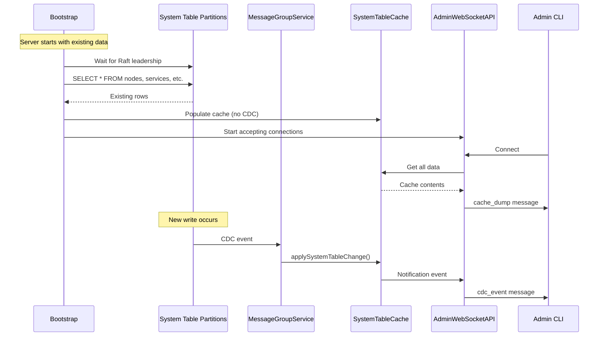

# Design Document: Admin CLI Cache Hydration Fix

## Overview

This design addresses the issue where the Admin CLI shows empty views after server restart. The fix involves two key changes:

1. **Cache Hydration**: After bootstrap completes, query all system table partitions and populate the SystemTableCache with existing data
2. **CDC Event Forwarding**: Ensure the cache emits notifications when updated, and AdminWebSocketAPI broadcasts these to connected clients

The design maintains the existing architecture where each MessageGroupService replica has its own SystemTableCache. Since all replicas receive the same CDC events, any replica's cache can be used - they're all equivalent.

## Architecture

### Current Data Flow (Problem)

```
Fresh Start:
  Bootstrap writes → Partition → CDC event → MessageGroup → Cache → AdminWebSocketAPI → CLI ✓

Restart with existing data:
  Existing SQLite data → (no writes) → (no CDC) → Cache empty → CLI empty ✗
```

### Fixed Data Flow

```
Restart with existing data:
  Bootstrap completes → Hydration queries partitions → Cache populated → AdminWebSocketAPI → CLI ✓

Ongoing updates:
  Write → Partition → CDC event → MessageGroup → Cache → Notification → AdminWebSocketAPI → CLI ✓
```

### Component Interaction



## Components and Interfaces

### CacheHydrationService

New service responsible for populating the cache on startup.

```javascript
class CacheHydrationService {
  constructor(queryEngine, systemTableCache, logger) {
    this.queryEngine = queryEngine;
    this.systemTableCache = systemTableCache;
    this.logger = logger;
  }

  /**
   * Hydrate the cache with existing data from all system table partitions.
   * Called after bootstrap completes and Raft leadership is established.
   * Does NOT generate CDC events - directly populates the cache.
   */
  async hydrateCache() {
    const systemTables = [
      'nodes', 'services', 'tables', 'partitions', 'message_groups', 'indices'
    ];
    
    for (const tableName of systemTables) {
      try {
        const result = await this.queryEngine.executeQuery(
          `SELECT * FROM ${tableName}`
        );
        
        for (const row of result.rows) {
          // Direct cache population - no CDC event
          this.systemTableCache.applySystemTableChange(
            tableName,
            'INSERT',
            row
          );
        }
        
        this.logger.info('Hydrated system table cache', {
          tableName,
          rowCount: result.rows.length,
        });
      } catch (error) {
        // Log error but continue with other tables
        this.logger.error('Failed to hydrate system table', {
          tableName,
          error: error.message,
        });
      }
    }
  }
}
```

### SystemTableCache Modifications

Add notification capability to the existing cache.

```javascript
class SystemTableCache {
  constructor() {
    this.tables = new Map();
    this.listeners = new Set();
  }

  /**
   * Subscribe to cache change notifications.
   * @param {Function} listener - Called with (tableName, operation, record)
   */
  onCacheChange(listener) {
    this.listeners.add(listener);
  }

  /**
   * Apply a change to the cache and notify listeners.
   * @param {string} tableName - The system table name
   * @param {string} operation - INSERT, UPDATE, or DELETE
   * @param {Object} record - The record data
   */
  applySystemTableChange(tableName, operation, record) {
    // Apply the change
    const table = this.tables.get(tableName);
    const key = this.getPrimaryKey(tableName, record);
    
    switch (operation) {
      case 'INSERT':
      case 'UPDATE':
        table.set(key, record);
        break;
      case 'DELETE':
        table.delete(key);
        break;
    }
    
    // Notify listeners (non-blocking)
    setImmediate(() => {
      for (const listener of this.listeners) {
        try {
          listener(tableName, operation, record);
        } catch (error) {
          // Don't let listener errors break the cache
          this.logger?.warn('Cache listener error', { error: error.message });
        }
      }
    });
  }

  /**
   * Get all data from the cache for a cache dump.
   * @returns {Object} All cache data by table name
   */
  getAllData() {
    const data = {};
    for (const [tableName, table] of this.tables) {
      data[tableName] = Array.from(table.values());
    }
    return data;
  }
}
```

### AdminWebSocketAPI Modifications

Subscribe to cache notifications and broadcast to clients.

```javascript
class AdminWebSocketAPI {
  constructor(systemTableCache, queryEngine, logger) {
    this.systemTableCache = systemTableCache;
    this.queryEngine = queryEngine;
    this.logger = logger;
    this.clients = new Set();
    
    // Subscribe to cache changes
    this.systemTableCache.onCacheChange(
      (tableName, operation, record) => this.broadcastCDCEvent(tableName, operation, record)
    );
  }

  /**
   * Handle new client connection.
   */
  handleConnection(socket) {
    this.clients.add(socket);
    
    socket.on('close', () => {
      this.clients.delete(socket);
    });
    
    // Send cache dump
    this.sendCacheDump(socket);
  }

  /**
   * Send full cache dump to a client.
   * If cache is empty, query partitions directly.
   */
  async sendCacheDump(socket) {
    let data = this.systemTableCache.getAllData();
    
    // If cache is empty, query partitions directly
    const isEmpty = Object.values(data).every(arr => arr.length === 0);
    if (isEmpty) {
      data = await this.queryPartitionsForDump();
    }
    
    socket.send(JSON.stringify({
      type: 'cache_dump',
      data,
    }));
  }

  /**
   * Query system table partitions directly for cache dump.
   * Used as fallback when cache is empty.
   */
  async queryPartitionsForDump() {
    const systemTables = [
      'nodes', 'services', 'tables', 'partitions', 'message_groups', 'indices'
    ];
    
    const data = {};
    for (const tableName of systemTables) {
      try {
        const result = await this.queryEngine.executeQuery(
          `SELECT * FROM ${tableName}`
        );
        data[tableName] = result.rows;
      } catch (error) {
        this.logger.warn('Failed to query system table for dump', {
          tableName,
          error: error.message,
        });
        data[tableName] = [];
      }
    }
    return data;
  }

  /**
   * Broadcast CDC event to all connected clients.
   */
  broadcastCDCEvent(tableName, operation, record) {
    const message = JSON.stringify({
      type: 'cdc_event',
      table: tableName,
      operation,
      record,
      timestamp: Date.now(),
    });
    
    for (const client of this.clients) {
      try {
        if (client.readyState === WebSocket.OPEN) {
          client.send(message);
        }
      } catch (error) {
        this.logger.warn('Failed to send CDC event to client', {
          error: error.message,
        });
      }
    }
  }
}
```

### Bootstrap Integration

Integrate cache hydration into the bootstrap process.

```javascript
// In bootstrap-service.js

async completeBootstrap() {
  // ... existing bootstrap phases ...
  
  // Phase 5: Cache Hydration (NEW)
  this.logger.info('Bootstrap Phase 5: Cache Hydration');
  
  const hydrationService = new CacheHydrationService(
    this.queryEngine,
    this.systemTableCache,
    this.logger
  );
  
  await hydrationService.hydrateCache();
  
  this.logger.info('Bootstrap Phase 5 complete: Cache hydrated');
  
  // Phase 6: Start Admin API (existing, but now after hydration)
  this.logger.info('Bootstrap Phase 6: Starting Admin API');
  await this.adminWebSocketAPI.start();
  
  this.logger.info('Bootstrap complete');
}
```

## Data Models

No new data models are required. The existing SystemTableCache structure is used.

## Correctness Properties

*A property is a characteristic or behavior that should hold true across all valid executions of a system-essentially, a formal statement about what the system should do. Properties serve as the bridge between human-readable specifications and machine-verifiable correctness guarantees.*

### Property 1: Cache Hydration Completeness

*For any* server restart with existing partition data, after cache hydration completes, the cache SHALL contain all rows from all system table partitions (nodes, services, tables, partitions, message_groups, indices).

**Validates: Requirements 1.1, 1.2, 1.7**

### Property 2: Partial Hydration Resilience

*For any* hydration attempt where one or more system tables fail to query, the cache SHALL still contain data from the tables that succeeded.

**Validates: Requirements 1.5**

### Property 3: Hydration Does Not Generate CDC

*For any* cache hydration operation, no CDC events SHALL be emitted to the CDC pipeline or to connected Admin CLI clients.

**Validates: Requirements 1.6**

### Property 4: CDC Event Broadcast Completeness

*For any* CDC event applied to the SystemTableCache, all connected Admin CLI clients SHALL receive a cdc_event message containing the table name, operation, record data, and timestamp.

**Validates: Requirements 2.1, 2.3, 2.4**

### Property 5: Cache Dump Completeness

*For any* Admin CLI connection, the cache_dump message SHALL contain arrays for all six system tables (nodes, services, tables, partitions, message_groups, indices) with data matching the current partition contents.

**Validates: Requirements 3.1, 3.3, 3.4**

## Error Handling

### Hydration Failures

- If a system table partition query fails, log the error and continue with other tables
- The cache will have partial data, but the system remains operational
- Admin CLI will show partial data with "N/A" for missing tables

### CDC Broadcast Failures

- If sending to a client fails, log a warning and continue with other clients
- Failed clients are not removed (they may recover)
- Use try/catch around each client send to isolate failures

### Empty Cache Fallback

- If cache is empty when a client connects, query partitions directly
- This handles the edge case where hydration hasn't completed yet
- The direct query result is sent as the cache dump

## Testing Strategy

### Unit Tests

1. **CacheHydrationService**
   - Test hydration populates cache with partition data
   - Test partial failure handling (one table fails, others succeed)
   - Test no CDC events are generated during hydration

2. **SystemTableCache notifications**
   - Test listeners are called on applySystemTableChange
   - Test listener errors don't break the cache
   - Test getAllData returns correct structure

3. **AdminWebSocketAPI CDC forwarding**
   - Test CDC events are broadcast to all connected clients
   - Test disconnected clients don't receive events
   - Test cache dump contains all tables

### Property-Based Tests

1. **Property 1: Cache Hydration Completeness**
   - Generate random partition data
   - Run hydration
   - Verify cache matches partition data

2. **Property 4: CDC Event Broadcast Completeness**
   - Generate random CDC events
   - Apply to cache with multiple connected clients
   - Verify all clients receive all events with correct format

3. **Property 5: Cache Dump Completeness**
   - Generate random cache state
   - Request cache dump
   - Verify dump contains all tables with correct data

### Integration Tests

1. **End-to-end restart scenario**
   - Start server, write data, stop server
   - Restart server
   - Connect Admin CLI
   - Verify all data is visible

2. **Node join scenario**
   - Start seed node with Admin CLI connected
   - Join second node
   - Verify Admin CLI shows new node within 1 second
