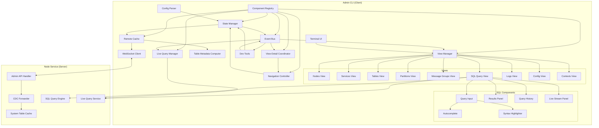
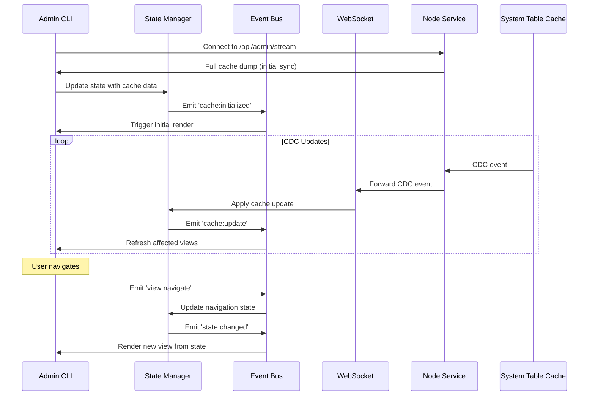
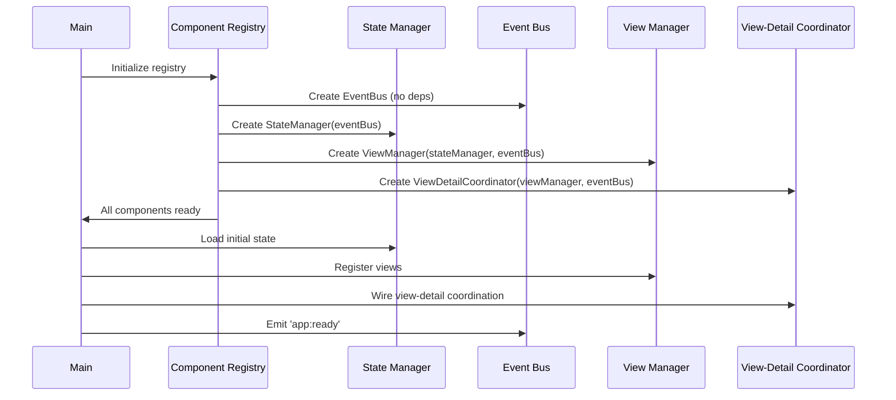

# Design Document: Admin CLI

## Overview

The Admin CLI is a terminal-based curses interface for administering the distributed database system. Inspired by K9s for Kubernetes, it provides real-time visibility into cluster state through a CDC-synchronized local cache, enabling fast navigation without repeated API calls. The CLI includes comprehensive views for nodes, services, tables, partitions, message groups, logs, config, and contexts, plus an interactive SQL query interface with live query support.

The architecture follows a client-server model where:
- **Server Side**: Node Service exposes a WebSocket admin API that streams CDC events (defined in distributed-database-system spec)
- **Client Side**: CLI maintains a Remote_Cache synchronized via CDC, renders views from cache data

Key design principles:
1. **CDC-First**: Real-time updates via CDC streaming, polling only as fallback
2. **Cache-Local**: All navigation reads from local cache, no API calls per view
3. **Keyboard-Driven**: Vim-style navigation with command palette
4. **Hierarchical**: Entity relationships navigable in both directions
5. **Extensible**: Configuration-driven views and plugin architecture
6. **Live Query Support**: Real-time data streaming via LIVE SELECT subscriptions

## Architecture

### High-Level Architecture



### Data Flow



### Component Initialization Flow



## Components and Interfaces

### Library Dependencies

**Terminal UI:**
- `blessed` - High-level terminal interface library with widgets
- `blessed-contrib` - Additional widgets (tables, gauges, charts)
- `chalk` - Terminal string styling

**Networking:**
- `ws` - WebSocket client for CDC streaming
- `node-fetch` - HTTP client for REST fallback

**Configuration:**
- `ajv` - JSON schema validation for config
- `dotenv` - Environment variable support

**Utilities:**
- `lodash` - Data manipulation utilities
- `dayjs` - Date/time formatting

**Testing:**
- `fast-check` - Property-based testing
- `tap` - Test framework

### Remote Cache

The Remote Cache maintains a local copy of system tables synchronized via CDC.

```javascript
class RemoteCache {
  constructor() {
    this.tables = {
      nodes: new Map(),
      services: new Map(),
      partitions: new Map(),
      tables: new Map(),
      message_groups: new Map(),
      indices: new Map(),
      logs: new Map(),
      config: new Map(),
      contexts: new Map()
    };
    this.lastUpdate = null;
    this.cdcLag = 0;
    this.metadataComputer = new TableMetadataComputer(this);
  }

  // Initialize from full dump
  loadFromDump(dump) {
    for (const [tableName, records] of Object.entries(dump)) {
      this.tables[tableName].clear();
      for (const record of records) {
        const key = this.getPrimaryKey(tableName, record);
        this.tables[tableName].set(key, record);
      }
    }
    this.lastUpdate = Date.now();
  }

  // Apply CDC event
  applyCDCEvent(event) {
    const { table, operation, data, key } = event;
    
    switch (operation) {
      case 'INSERT':
      case 'UPDATE':
        this.tables[table].set(key, data);
        break;
      case 'DELETE':
        this.tables[table].delete(key);
        break;
    }
    
    this.lastUpdate = Date.now();
    this.cdcLag = Date.now() - event.timestamp;
    
    return { table, key, operation };
  }

  // Query methods
  getNodes() { return Array.from(this.tables.nodes.values()); }
  getNode(nodeId) { return this.tables.nodes.get(nodeId); }
  
  getServices(filter = {}) {
    let services = Array.from(this.tables.services.values());
    if (filter.nodeId) {
      services = services.filter(s => s.node_id === filter.nodeId);
    }
    if (filter.type) {
      services = services.filter(s => s.service_type === filter.type);
    }
    return services;
  }
  
  getTables() {
    const tables = Array.from(this.tables.tables.values());
    return tables.map(t => this.metadataComputer.computeMetadata(t));
  }
  
  getTable(tableId) {
    const table = this.tables.tables.get(tableId);
    return table ? this.metadataComputer.computeMetadata(table) : undefined;
  }
  
  getPartitions(filter = {}) {
    let partitions = Array.from(this.tables.partitions.values());
    if (filter.tableId) {
      partitions = partitions.filter(p => p.table_id === filter.tableId);
    }
    return partitions;
  }
  
  getMessageGroups() { return Array.from(this.tables.message_groups.values()); }
  
  getLogs(filter = {}) {
    let logs = Array.from(this.tables.logs.values());
    if (filter.level) {
      logs = logs.filter(l => l.level === filter.level);
    }
    if (filter.nodeId) {
      logs = logs.filter(l => l.node_id === filter.nodeId);
    }
    if (filter.serviceId) {
      logs = logs.filter(l => l.service_id === filter.serviceId);
    }
    if (filter.startTime) {
      logs = logs.filter(l => l.timestamp >= filter.startTime);
    }
    if (filter.endTime) {
      logs = logs.filter(l => l.timestamp <= filter.endTime);
    }
    return logs;
  }
  
  getConfig() { return Array.from(this.tables.config.values()); }
  
  getContexts(filter = {}) {
    let contexts = Array.from(this.tables.contexts.values());
    if (filter.type) {
      contexts = contexts.filter(c => c.context_type === filter.type);
    }
    if (filter.namePattern) {
      const pattern = new RegExp(filter.namePattern, 'i');
      contexts = contexts.filter(c => pattern.test(c.name || ''));
    }
    return contexts;
  }
  
  // Persistence
  serialize() {
    const data = {};
    for (const [name, map] of Object.entries(this.tables)) {
      data[name] = Array.from(map.values());
    }
    return JSON.stringify({ data, lastUpdate: this.lastUpdate });
  }
  
  deserialize(json) {
    const { data, lastUpdate } = JSON.parse(json);
    this.loadFromDump(data);
    this.lastUpdate = lastUpdate;
  }
}
```

### Table Metadata Computer

Computes display metadata (partition_count, replica_factor) from cached partition data.

```javascript
class TableMetadataComputer {
  constructor(cache) {
    this.cache = cache;
    this.metadataCache = new Map();
  }
  
  computeMetadata(table) {
    // Check cache first
    const cacheKey = `${table.table_id}_${this.cache.lastUpdate}`;
    if (this.metadataCache.has(cacheKey)) {
      return this.metadataCache.get(cacheKey);
    }
    
    const enriched = {
      ...table,
      partition_count: this.computePartitionCount(table.table_id),
      replica_factor: this.computeReplicaFactor(table.table_id)
    };
    
    this.metadataCache.set(cacheKey, enriched);
    return enriched;
  }
  
  computePartitionCount(tableId) {
    const partitions = this.cache.getPartitions({tableId});
    return partitions.length;
  }
  
  computeReplicaFactor(tableId) {
    const partitions = this.cache.getPartitions({tableId});
    if (partitions.length === 0) return null;
    
    // Count occurrences of each replica_count
    const counts = {};
    for (const partition of partitions) {
      const count = partition.replica_count || 0;
      counts[count] = (counts[count] || 0) + 1;
    }
    
    // Return most common value
    let maxCount = 0;
    let mostCommon = null;
    for (const [value, count] of Object.entries(counts)) {
      if (count > maxCount) {
        maxCount = count;
        mostCommon = parseInt(value, 10);
      }
    }
    
    return mostCommon;
  }
  
  invalidateCache() {
    this.metadataCache.clear();
  }
}
```

### Connection Manager

Handles WebSocket connection with automatic reconnection.

```javascript
class ConnectionManager {
  constructor(config) {
    this.config = config;
    this.ws = null;
    this.reconnectAttempts = 0;
    this.maxReconnectAttempts = 10;
    this.baseDelay = 1000;
    this.maxDelay = 30000;
    this.status = 'disconnected';
    this.onCDCEvent = null;
    this.onStatusChange = null;
  }

  async connect(nodeAddress) {
    const wsUrl = `${nodeAddress.replace('http', 'ws')}/api/admin/stream`;
    
    return new Promise((resolve, reject) => {
      this.ws = new WebSocket(wsUrl);
      
      this.ws.on('open', () => {
        this.status = 'connected';
        this.reconnectAttempts = 0;
        this.onStatusChange?.('connected');
        resolve();
      });
      
      this.ws.on('message', (data) => {
        const message = JSON.parse(data);
        if (message.type === 'cache_dump') {
          this.onCacheDump?.(message.data);
        } else if (message.type === 'cdc_event') {
          this.onCDCEvent?.(message.event);
        } else if (message.type === 'query_result') {
          this.onQueryResult?.(message);
        }
      });
      
      this.ws.on('close', () => {
        this.status = 'disconnected';
        this.onStatusChange?.('disconnected');
        this.scheduleReconnect();
      });
      
      this.ws.on('error', (err) => {
        if (this.status === 'disconnected') {
          reject(err);
        }
      });
    });
  }

  scheduleReconnect() {
    if (this.reconnectAttempts >= this.maxReconnectAttempts) {
      this.onStatusChange?.('failed');
      return;
    }
    
    const delay = Math.min(
      this.baseDelay * Math.pow(2, this.reconnectAttempts),
      this.maxDelay
    );
    
    this.reconnectAttempts++;
    this.status = 'reconnecting';
    this.onStatusChange?.('reconnecting', delay);
    
    setTimeout(() => this.connect(this.currentAddress), delay);
  }

  sendQuery(queryId, sql, params = []) {
    if (this.ws && this.ws.readyState === WebSocket.OPEN) {
      this.ws.send(JSON.stringify({
        type: 'query',
        queryId,
        sql,
        params
      }));
    }
  }

  disconnect() {
    if (this.ws) {
      this.ws.close();
      this.ws = null;
    }
  }
}
```

### Navigation Controller

Manages hierarchical navigation state and breadcrumbs.

```javascript
class NavigationController {
  constructor(cache) {
    this.cache = cache;
    this.stack = [];
    this.currentView = 'nodes';
    this.currentContext = null;
  }

  getCurrentState() {
    return {
      view: this.currentView,
      context: this.currentContext,
      breadcrumb: this.getBreadcrumb()
    };
  }

  getBreadcrumb() {
    const parts = ['Home'];
    for (const item of this.stack) {
      parts.push(this.formatBreadcrumbItem(item));
    }
    return parts.join(' > ');
  }

  formatBreadcrumbItem(item) {
    switch (item.view) {
      case 'nodes': return `Node: ${item.context.nodeId}`;
      case 'services': return `Services`;
      case 'tables': return `Table: ${item.context.tableName}`;
      case 'partitions': return `Partition: ${item.context.partitionId}`;
      case 'message_groups': return `MG: ${item.context.groupId}`;
      case 'sql': return `SQL Query`;
      default: return item.view;
    }
  }

  drillDown(view, context) {
    this.stack.push({ view: this.currentView, context: this.currentContext });
    this.currentView = view;
    this.currentContext = context;
  }

  goBack() {
    if (this.stack.length > 0) {
      const prev = this.stack.pop();
      this.currentView = prev.view;
      this.currentContext = prev.context;
      return true;
    }
    return false;
  }

  goToView(view) {
    this.stack = [];
    this.currentView = view;
    this.currentContext = null;
  }

  jumpToEntity(entityType, entityId) {
    this.stack = [];
    this.currentView = entityType;
    this.currentContext = { [`${entityType}Id`]: entityId };
  }

  getViewData() {
    switch (this.currentView) {
      case 'nodes':
        return this.cache.getNodes();
      case 'services':
        return this.cache.getServices(this.currentContext || {});
      case 'tables':
        return this.cache.getTables();
      case 'partitions':
        return this.cache.getPartitions(this.currentContext || {});
      case 'message_groups':
        return this.cache.getMessageGroups();
      case 'logs':
        return this.cache.getLogs(this.currentContext || {});
      case 'config':
        return this.cache.getConfig();
      case 'contexts':
        return this.cache.getContexts(this.currentContext || {});
      default:
        return [];
    }
  }

  getRelatedCounts(entityType, entityId) {
    switch (entityType) {
      case 'node':
        return {
          services: this.cache.getServices({ nodeId: entityId }).length
        };
      case 'table':
        return {
          partitions: this.cache.getPartitions({ tableId: entityId }).length
        };
      default:
        return {};
    }
  }
}
```

### View Manager

Coordinates view rendering and updates.

```javascript
class ViewManager {
  constructor(screen, cache, navigation) {
    this.screen = screen;
    this.cache = cache;
    this.navigation = navigation;
    this.views = new Map();
    this.currentView = null;
    this.changedRows = new Set();
  }

  registerView(name, viewInstance) {
    this.views.set(name, viewInstance);
  }

  switchView(viewName) {
    if (this.currentView) {
      this.currentView.hide();
    }
    this.currentView = this.views.get(viewName);
    this.currentView.show();
    this.refresh();
  }

  refresh() {
    const data = this.navigation.getViewData();
    const state = this.navigation.getCurrentState();
    this.currentView.render(data, state, this.changedRows);
    this.changedRows.clear();
    this.screen.render();
  }

  onCDCUpdate(change) {
    this.changedRows.add(change.key);
    
    if (this.isChangeRelevant(change)) {
      this.refresh();
      
      setTimeout(() => {
        this.changedRows.delete(change.key);
        this.refresh();
      }, 2000);
    }
  }

  isChangeRelevant(change) {
    const viewTableMap = {
      'nodes': 'nodes',
      'services': 'services',
      'tables': 'tables',
      'partitions': 'partitions',
      'message_groups': 'message_groups'
    };
    return viewTableMap[this.navigation.currentView] === change.table;
  }
}
```

### Base View Class

```javascript
class BaseView {
  constructor(screen, options = {}) {
    this.screen = screen;
    this.options = options;
    this.table = null;
    this.selectedIndex = 0;
    this.filter = '';
    this.sortColumn = null;
    this.sortDirection = 'asc';
  }

  getColumns() {
    return [];
  }

  formatRow(item) {
    return [];
  }

  getRowStatus(item) {
    return 'normal';
  }

  render(data, state, changedRows) {
    let items = this.applyFilter(data);
    items = this.applySort(items);
    
    const rows = items.map(item => {
      const row = this.formatRow(item);
      const status = this.getRowStatus(item);
      const isChanged = changedRows.has(this.getItemKey(item));
      return { row, status, isChanged };
    });
    
    this.renderTable(rows, state);
  }

  applyFilter(data) {
    if (!this.filter) return data;
    const lowerFilter = this.filter.toLowerCase();
    return data.filter(item => 
      JSON.stringify(item).toLowerCase().includes(lowerFilter)
    );
  }

  applySort(data) {
    if (!this.sortColumn) return data;
    return [...data].sort((a, b) => {
      const aVal = a[this.sortColumn];
      const bVal = b[this.sortColumn];
      const cmp = aVal < bVal ? -1 : aVal > bVal ? 1 : 0;
      return this.sortDirection === 'asc' ? cmp : -cmp;
    });
  }

  renderTable(rows, state) {
    const tableData = [this.getColumns()];
    for (const { row, status, isChanged } of rows) {
      tableData.push(this.styleRow(row, status, isChanged));
    }
    this.table.setData(tableData);
  }

  styleRow(row, status, isChanged) {
    const colors = {
      normal: 'white',
      warning: 'yellow',
      error: 'red'
    };
    const color = isChanged ? 'cyan' : colors[status];
    return row.map(cell => `{${color}-fg}${cell}{/}`);
  }
}
```

### Nodes View

```javascript
class NodesView extends BaseView {
  getColumns() {
    return ['Node ID', 'Address', 'Status', 'CPU%', 'Mem%', 'Disk%', 'Services'];
  }

  formatRow(node) {
    return [
      node.node_id,
      node.node_address,
      node.status,
      `${node.cpu_usage_percent.toFixed(1)}%`,
      `${node.memory_usage_percent.toFixed(1)}%`,
      `${node.disk_usage_percent.toFixed(1)}%`,
      String(node.services_count || 0)
    ];
  }

  getRowStatus(node) {
    if (node.status === 'failed') return 'error';
    if (node.cpu_usage_percent > 80 || 
        node.memory_usage_percent > 85 || 
        node.disk_usage_percent > 80) {
      return 'warning';
    }
    return 'normal';
  }

  getItemKey(node) {
    return node.node_id;
  }
}
```

### Tables View

```javascript
class TablesView extends BaseView {
  constructor(screen, options = {}) {
    super(screen, options);
    this.cache = options.cache;
  }

  getColumns() {
    return ['Table Name', 'Partitions', 'Replicas', 'Total Size', 'Policy Summary'];
  }

  formatRow(table) {
    return [
      table.table_name,
      String(table.partition_count || 0),
      String(table.replica_factor || 'N/A'),
      this.formatSize(table.total_size),
      this.formatPolicySummary(table)
    ];
  }

  formatSize(bytes) {
    if (bytes == null) return 'N/A';
    if (bytes === 0) return '0 B';
    const units = ['B', 'KB', 'MB', 'GB', 'TB'];
    const i = Math.floor(Math.log(bytes) / Math.log(1024));
    return `${(bytes / Math.pow(1024, i)).toFixed(1)} ${units[i]}`;
  }

  formatPolicySummary(table) {
    const policies = [];
    
    try {
      const parsed = typeof table.table_policies === 'string' 
        ? JSON.parse(table.table_policies) 
        : table.table_policies;
      
      if (parsed.placement_policy) {
        policies.push(`Placement: ${parsed.placement_policy}`);
      }
      if (parsed.replication_policy) {
        policies.push(`Replication: ${parsed.replication_policy}`);
      }
      if (parsed.consistency_level) {
        policies.push(`Consistency: ${parsed.consistency_level}`);
      }
      if (parsed.durability) {
        policies.push(`Durability: ${parsed.durability}`);
      }
      if (parsed.compression) {
        policies.push(`Compression: ${parsed.compression}`);
      }
    } catch (err) {
      return 'Default';
    }
    
    if (policies.length === 0) return 'Default';
    
    const summary = policies.join(', ');
    return summary.length > 50 ? summary.substring(0, 47) + '...' : summary;
  }

  getRowStatus(table) {
    if (table.partition_count === 0) return 'warning';
    return 'normal';
  }

  getItemKey(table) {
    return table.table_id;
  }
}
```

### Partitions View

```javascript
class PartitionsView extends BaseView {
  constructor(screen, options = {}) {
    super(screen, options);
    this.cache = options.cache;
  }

  getColumns() {
    return ['Partition ID', 'Key Range', 'Replicas', 'Leader Node', 'Size', 'Status'];
  }

  formatRow(partition) {
    return [
      partition.partition_id,
      this.formatKeyRange(partition),
      String(partition.replica_count || 0),
      partition.leader_node_id || 'No Leader',
      this.formatSize(partition.size_bytes),
      partition.status
    ];
  }

  formatKeyRange(partition) {
    const start = partition.partition_key_start || '-∞';
    const end = partition.partition_key_end || '+∞';
    return `[${start}, ${end})`;
  }

  formatSize(bytes) {
    if (bytes == null) return 'N/A';
    if (bytes === 0) return '0 B';
    const units = ['B', 'KB', 'MB', 'GB', 'TB'];
    const i = Math.floor(Math.log(bytes) / Math.log(1024));
    return `${(bytes / Math.pow(1024, i)).toFixed(1)} ${units[i]}`;
  }

  getRowStatus(partition) {
    if (partition.status === 'failed') return 'error';
    if (!partition.leader_node_id) return 'error';
    if (this.isUnderReplicated(partition)) return 'warning';
    return 'normal';
  }

  isUnderReplicated(partition) {
    // Check if actual replica count is less than configured
    return false; // Simplified - would need actual replica data
  }

  getItemKey(partition) {
    return partition.partition_id;
  }
}
```

### SQL Query View

```javascript
class SQLQueryView extends BaseView {
  constructor(screen, options = {}) {
    super(screen, options);
    this.queryInput = null;
    this.resultsPanel = null;
    this.queryHistory = null;
    this.autocomplete = null;
    this.syntaxHighlighter = null;
    this.readOnlyMode = options.readOnlyMode || false;
    this.connectionManager = options.connectionManager;
    this.cache = options.cache;
    this.pendingQueries = new Map();
  }

  initialize() {
    this.queryInput = new QueryInput(this.screen, {
      parent: this.container,
      height: '30%',
      syntaxHighlighter: this.syntaxHighlighter,
      autocomplete: this.autocomplete,
      history: this.queryHistory
    });
    
    this.resultsPanel = new ResultsPanel(this.screen, {
      parent: this.container,
      top: '30%',
      height: '70%'
    });
    
    this.queryHistory = new QueryHistory({
      maxEntries: 100,
      persistPath: '~/.ddb-admin/query_history.json'
    });
    
    this.autocomplete = new TableAutocomplete(this.cache);
    this.syntaxHighlighter = new SQLSyntaxHighlighter();
  }

  async executeQuery() {
    const sql = this.queryInput.getValue();
    if (!sql.trim()) return;
    
    if (this.readOnlyMode && !this.isSelectQuery(sql)) {
      this.showError('Read-only mode: Only SELECT queries are allowed');
      return;
    }
    
    if (this.isDangerousQuery(sql)) {
      const confirmed = await this.showConfirmation(
        'This query may modify data. Are you sure?'
      );
      if (!confirmed) return;
    }
    
    this.queryHistory.add(sql);
    
    const queryId = `query_${Date.now()}_${Math.random().toString(36).substr(2, 9)}`;
    const startTime = Date.now();
    
    this.pendingQueries.set(queryId, { sql, startTime });
    this.connectionManager.sendQuery(queryId, sql);
  }

  handleQueryResult(message) {
    const { queryId, result, error } = message;
    const pending = this.pendingQueries.get(queryId);
    
    if (!pending) return;
    
    const executionTime = Date.now() - pending.startTime;
    this.pendingQueries.delete(queryId);
    
    if (error) {
      this.resultsPanel.displayError({ message: error });
    } else {
      this.resultsPanel.displayResult(result, executionTime);
    }
  }

  isSelectQuery(sql) {
    return /^\s*select\b/i.test(sql);
  }

  isDangerousQuery(sql) {
    const trimmed = sql.trim().toLowerCase();
    if (/^delete\s+from\s+\w+\s*$/i.test(trimmed)) return true;
    if (/^update\s+\w+\s+set\s+[^w]*$/i.test(trimmed) && 
        !/\bwhere\b/i.test(trimmed)) return true;
    return false;
  }
}
```

### Query Input

```javascript
class QueryInput {
  constructor(screen, options = {}) {
    this.screen = screen;
    this.options = options;
    this.value = '';
    this.cursorPosition = 0;
    this.syntaxHighlighter = options.syntaxHighlighter;
    this.autocomplete = options.autocomplete;
    this.history = options.history;
    this.historyIndex = -1;
  }

  getValue() {
    return this.value;
  }

  setValue(value) {
    this.value = value;
    this.cursorPosition = value.length;
    this.render();
  }

  clear() {
    this.value = '';
    this.cursorPosition = 0;
    this.historyIndex = -1;
    this.render();
  }

  handleKey(key) {
    switch (key.full) {
      case 'escape':
        this.clear();
        break;
      case 'backspace':
        this.deleteBackward();
        break;
      case 'delete':
        this.deleteForward();
        break;
      case 'left':
        this.moveCursorLeft();
        break;
      case 'right':
        this.moveCursorRight();
        break;
      case 'up':
        this.navigateHistoryUp();
        break;
      case 'down':
        this.navigateHistoryDown();
        break;
      case 'tab':
        this.triggerAutocomplete();
        break;
      case 'enter':
        this.insertNewline();
        break;
      default:
        if (key.ch) {
          this.insertChar(key.ch);
        }
    }
  }

  insertChar(char) {
    this.value = this.value.slice(0, this.cursorPosition) + 
                 char + 
                 this.value.slice(this.cursorPosition);
    this.cursorPosition++;
    this.render();
  }

  insertNewline() {
    this.insertChar('\n');
  }

  deleteBackward() {
    if (this.cursorPosition > 0) {
      this.value = this.value.slice(0, this.cursorPosition - 1) + 
                   this.value.slice(this.cursorPosition);
      this.cursorPosition--;
      this.render();
    }
  }

  deleteForward() {
    if (this.cursorPosition < this.value.length) {
      this.value = this.value.slice(0, this.cursorPosition) + 
                   this.value.slice(this.cursorPosition + 1);
      this.render();
    }
  }

  navigateHistoryUp() {
    if (this.history && this.historyIndex < this.history.length - 1) {
      this.historyIndex++;
      this.setValue(this.history.getAt(this.historyIndex));
    }
  }

  navigateHistoryDown() {
    if (this.historyIndex > 0) {
      this.historyIndex--;
      this.setValue(this.history.getAt(this.historyIndex));
    } else if (this.historyIndex === 0) {
      this.historyIndex = -1;
      this.clear();
    }
  }

  triggerAutocomplete() {
    if (!this.autocomplete) return;
    
    const context = this.getAutocompleteContext();
    const suggestions = this.autocomplete.getSuggestions(context);
    
    if (suggestions.length === 1) {
      this.applyCompletion(suggestions[0]);
    } else if (suggestions.length > 1) {
      this.showSuggestions(suggestions);
    }
  }

  getAutocompleteContext() {
    return {
      word: this.getCurrentWord(),
      position: this.cursorPosition,
      fullText: this.value
    };
  }

  getCurrentWord() {
    const before = this.value.slice(0, this.cursorPosition);
    const match = before.match(/\w+$/);
    return match ? match[0] : '';
  }

  render() {
    const highlighted = this.syntaxHighlighter 
      ? this.syntaxHighlighter.highlight(this.value)
      : this.value;
    this.widget.setContent(highlighted);
    this.screen.render();
  }
}
```

### Results Panel

```javascript
class ResultsPanel {
  constructor(screen, options = {}) {
    this.screen = screen;
    this.options = options;
    this.currentResult = null;
  }

  displayResult(result, executionTime) {
    this.currentResult = result;
    
    if (result.results && result.results.length > 0) {
      this.displayTable(result.results, {
        rowCount: result.count,
        executionTime,
        partitions: result.partitions,
        tableName: result.tableName
      });
    } else if (result.operation) {
      this.displayWriteResult(result, executionTime);
    } else {
      this.displayEmpty(result.tableName, executionTime);
    }
  }

  displayTable(rows, metadata) {
    if (rows.length === 0) {
      this.displayEmpty(metadata.tableName, metadata.executionTime);
      return;
    }
    
    const columns = Object.keys(rows[0]);
    const tableData = [columns];
    
    for (const row of rows) {
      tableData.push(columns.map(col => this.formatCell(row[col])));
    }
    
    this.table.setData(tableData);
    
    this.statusLine.setContent(
      `${metadata.rowCount} rows | ${metadata.executionTime}ms | ` +
      `Partitions: ${metadata.partitions.join(', ')}`
    );
    
    this.screen.render();
  }

  displayWriteResult(result, executionTime) {
    const message = `${result.operation} completed: ${result.affectedRows || 0} rows affected`;
    const partitions = result.partitions ? result.partitions.join(', ') : 'N/A';
    
    this.messageBox.setContent(
      `{green-fg}✓{/} ${message}\n\n` +
      `Execution time: ${executionTime}ms\n` +
      `Partitions: ${partitions}`
    );
    
    this.screen.render();
  }

  displayError(error) {
    this.messageBox.setContent(
      `{red-fg}✗ Query failed{/}\n\n` +
      `Error: ${error.message}`
    );
    
    this.screen.render();
  }

  displayEmpty(tableName, executionTime) {
    this.messageBox.setContent(
      `{yellow-fg}No results{/}\n\n` +
      `Table: ${tableName}\n` +
      `Execution time: ${executionTime}ms`
    );
    
    this.screen.render();
  }

  formatCell(value) {
    if (value === null) return '{gray-fg}NULL{/}';
    if (value === undefined) return '';
    if (typeof value === 'object') return JSON.stringify(value);
    return String(value);
  }
}
```

### Query History

```javascript
class QueryHistory {
  constructor(options = {}) {
    this.maxEntries = options.maxEntries || 100;
    this.persistPath = options.persistPath;
    this.entries = [];
    this.load();
  }

  add(query) {
    const trimmed = query.trim();
    if (!trimmed) return;
    
    const existingIndex = this.entries.indexOf(trimmed);
    if (existingIndex !== -1) {
      this.entries.splice(existingIndex, 1);
    }
    
    this.entries.unshift(trimmed);
    
    if (this.entries.length > this.maxEntries) {
      this.entries = this.entries.slice(0, this.maxEntries);
    }
    
    this.save();
  }

  getAt(index) {
    return this.entries[index] || null;
  }

  getAll() {
    return [...this.entries];
  }

  get length() {
    return this.entries.length;
  }

  load() {
    if (!this.persistPath) return;
    
    try {
      const path = this.resolvePath(this.persistPath);
      if (fs.existsSync(path)) {
        const data = JSON.parse(fs.readFileSync(path, 'utf8'));
        this.entries = Array.isArray(data) ? data.slice(0, this.maxEntries) : [];
      }
    } catch (error) {
      this.entries = [];
    }
  }

  save() {
    if (!this.persistPath) return;
    
    try {
      const path = this.resolvePath(this.persistPath);
      const dir = require('path').dirname(path);
      if (!fs.existsSync(dir)) {
        fs.mkdirSync(dir, { recursive: true });
      }
      fs.writeFileSync(path, JSON.stringify(this.entries, null, 2));
    } catch (error) {
      // Ignore save errors
    }
  }

  serialize() {
    return JSON.stringify(this.entries);
  }

  deserialize(json) {
    this.entries = JSON.parse(json);
  }

  resolvePath(p) {
    return p.replace(/^~/, require('os').homedir());
  }
}
```

### SQL Syntax Highlighter

```javascript
class SQLSyntaxHighlighter {
  constructor() {
    this.keywords = [
      'SELECT', 'FROM', 'WHERE', 'AND', 'OR', 'NOT',
      'INSERT', 'INTO', 'VALUES', 'UPDATE', 'SET',
      'DELETE', 'ORDER', 'BY', 'ASC', 'DESC',
      'LIMIT', 'OFFSET', 'JOIN', 'LEFT', 'RIGHT',
      'INNER', 'OUTER', 'ON', 'AS', 'NULL',
      'TRUE', 'FALSE', 'IN', 'LIKE', 'BETWEEN'
    ];
    
    this.keywordPattern = new RegExp(
      `\\b(${this.keywords.join('|')})\\b`,
      'gi'
    );
  }

  highlight(sql) {
    let result = sql.replace(this.keywordPattern, '{blue-fg}$1{/}');
    result = result.replace(/'[^']*'/g, '{green-fg}$&{/}');
    result = result.replace(/\b\d+(\.\d+)?\b/g, '{yellow-fg}$&{/}');
    result = result.replace(/\?/g, '{magenta-fg}?{/}');
    return result;
  }

  isKeyword(word) {
    return this.keywords.includes(word.toUpperCase());
  }
}
```

### Logs View

```javascript
class LogsView extends BaseView {
  constructor(screen, options = {}) {
    super(screen, options);
    this.cache = options.cache;
    this.levelFilter = null;
    this.nodeFilter = null;
    this.serviceFilter = null;
    this.timeRangeStart = null;
    this.timeRangeEnd = null;
    this.textFilter = '';
  }

  getColumns() {
    return ['Timestamp', 'Level', 'Node ID', 'Service ID', 'Message'];
  }

  formatRow(log) {
    return [
      this.formatTimestamp(log.timestamp),
      log.level,
      log.node_id || 'N/A',
      log.service_id || 'N/A',
      this.truncateMessage(log.message, 60)
    ];
  }

  formatTimestamp(timestamp) {
    if (!timestamp) return 'N/A';
    const date = new Date(timestamp);
    return date.toISOString().replace('T', ' ').substring(0, 19);
  }

  truncateMessage(message, maxLength) {
    if (!message) return '';
    if (message.length <= maxLength) return message;
    return message.substring(0, maxLength - 3) + '...';
  }

  getRowStatus(log) {
    if (log.level === 'ERROR') return 'error';
    if (log.level === 'WARN') return 'warning';
    return 'normal';
  }

  getItemKey(log) {
    return log.log_id || `${log.timestamp}_${log.node_id}`;
  }

  applyFilters(data) {
    let filtered = data;
    
    if (this.levelFilter) {
      filtered = filtered.filter(log => log.level === this.levelFilter);
    }
    if (this.nodeFilter) {
      filtered = filtered.filter(log => log.node_id === this.nodeFilter);
    }
    if (this.serviceFilter) {
      filtered = filtered.filter(log => log.service_id === this.serviceFilter);
    }
    if (this.timeRangeStart) {
      filtered = filtered.filter(log => log.timestamp >= this.timeRangeStart);
    }
    if (this.timeRangeEnd) {
      filtered = filtered.filter(log => log.timestamp <= this.timeRangeEnd);
    }
    if (this.textFilter) {
      const lowerFilter = this.textFilter.toLowerCase();
      filtered = filtered.filter(log => 
        (log.message || '').toLowerCase().includes(lowerFilter)
      );
    }
    
    return filtered;
  }

  setLevelFilter(level) {
    this.levelFilter = level;
  }

  setNodeFilter(nodeId) {
    this.nodeFilter = nodeId;
  }

  setServiceFilter(serviceId) {
    this.serviceFilter = serviceId;
  }

  setTimeRange(start, end) {
    this.timeRangeStart = start;
    this.timeRangeEnd = end;
  }

  setTextFilter(text) {
    this.textFilter = text;
  }

  clearFilters() {
    this.levelFilter = null;
    this.nodeFilter = null;
    this.serviceFilter = null;
    this.timeRangeStart = null;
    this.timeRangeEnd = null;
    this.textFilter = '';
  }
}
```

### Config View

```javascript
class ConfigView extends BaseView {
  constructor(screen, options = {}) {
    super(screen, options);
    this.cache = options.cache;
  }

  getColumns() {
    return ['Key', 'Value', 'Type', 'Requires Restart', 'Last Modified'];
  }

  formatRow(config) {
    return [
      config.key,
      this.formatValue(config.value, config.type),
      config.type || 'string',
      config.requires_restart ? 'Yes' : 'No',
      this.formatTimestamp(config.updated_at)
    ];
  }

  formatValue(value, type) {
    if (value === null || value === undefined) return 'null';
    if (type === 'json' && typeof value === 'object') {
      const str = JSON.stringify(value);
      return str.length > 40 ? str.substring(0, 37) + '...' : str;
    }
    const str = String(value);
    return str.length > 40 ? str.substring(0, 37) + '...' : str;
  }

  formatTimestamp(timestamp) {
    if (!timestamp) return 'N/A';
    const date = new Date(timestamp);
    return date.toISOString().replace('T', ' ').substring(0, 19);
  }

  getRowStatus(config) {
    if (config.requires_restart && config.pending_restart) return 'warning';
    if (config.value !== config.default_value) return 'warning';
    return 'normal';
  }

  getItemKey(config) {
    return config.key;
  }
}
```

### Contexts View

```javascript
class ContextsView extends BaseView {
  constructor(screen, options = {}) {
    super(screen, options);
    this.cache = options.cache;
    this.typeFilter = null;
  }

  getColumns() {
    return ['Context ID', 'Type', 'Name', 'Created At', 'Updated At'];
  }

  formatRow(context) {
    return [
      context.context_id,
      context.context_type,
      context.name || 'N/A',
      this.formatTimestamp(context.created_at),
      this.formatTimestamp(context.updated_at)
    ];
  }

  formatTimestamp(timestamp) {
    if (!timestamp) return 'N/A';
    const date = new Date(timestamp);
    return date.toISOString().replace('T', ' ').substring(0, 19);
  }

  getRowStatus(context) {
    // Highlight recently updated contexts
    const fiveMinutesAgo = Date.now() - 5 * 60 * 1000;
    if (context.updated_at && context.updated_at > fiveMinutesAgo) {
      return 'warning';
    }
    return 'normal';
  }

  getItemKey(context) {
    return context.context_id;
  }

  setTypeFilter(type) {
    this.typeFilter = type;
  }

  applyFilters(data) {
    if (!this.typeFilter) return data;
    return data.filter(ctx => ctx.context_type === this.typeFilter);
  }
}
```

### Live Query Manager

```javascript
class LiveQueryManager {
  constructor(connectionManager, eventBus) {
    this.connectionManager = connectionManager;
    this.eventBus = eventBus;
    this.subscriptions = new Map();
    this.maxSubscriptions = 100;
  }

  async subscribe(sql, options = {}) {
    if (this.subscriptions.size >= this.maxSubscriptions) {
      throw new Error(`Maximum ${this.maxSubscriptions} concurrent live queries reached`);
    }

    const subscriptionId = `lq_${Date.now()}_${Math.random().toString(36).substr(2, 9)}`;
    
    const subscription = {
      id: subscriptionId,
      sql,
      status: 'pending',
      events: [],
      eventRate: 0,
      partitions: [],
      createdAt: Date.now(),
      lastEventAt: null,
      paused: false
    };

    this.subscriptions.set(subscriptionId, subscription);

    // Send subscription request to server
    this.connectionManager.sendLiveQuery(subscriptionId, sql, options);

    return subscriptionId;
  }

  handleLiveQueryEvent(message) {
    const { subscriptionId, eventType, data, partitions } = message;
    const subscription = this.subscriptions.get(subscriptionId);
    
    if (!subscription) return;

    if (message.type === 'live_query_initial') {
      subscription.status = 'active';
      subscription.partitions = partitions || [];
      subscription.initialResults = data;
      this.eventBus.emit('livequery:initialized', { subscriptionId, data, partitions });
    } else if (message.type === 'live_query_event') {
      if (!subscription.paused) {
        subscription.events.push({
          eventType,
          data,
          timestamp: Date.now()
        });
        subscription.lastEventAt = Date.now();
        this.updateEventRate(subscription);
        this.eventBus.emit('livequery:event', { subscriptionId, eventType, data });
      }
    } else if (message.type === 'live_query_expired') {
      subscription.status = 'expired';
      this.eventBus.emit('livequery:expired', { subscriptionId });
    }
  }

  updateEventRate(subscription) {
    const oneSecondAgo = Date.now() - 1000;
    const recentEvents = subscription.events.filter(e => e.timestamp > oneSecondAgo);
    subscription.eventRate = recentEvents.length;
  }

  pause(subscriptionId) {
    const subscription = this.subscriptions.get(subscriptionId);
    if (subscription) {
      subscription.paused = true;
      this.eventBus.emit('livequery:paused', { subscriptionId });
    }
  }

  resume(subscriptionId) {
    const subscription = this.subscriptions.get(subscriptionId);
    if (subscription) {
      subscription.paused = false;
      this.eventBus.emit('livequery:resumed', { subscriptionId });
    }
  }

  cancel(subscriptionId) {
    const subscription = this.subscriptions.get(subscriptionId);
    if (subscription) {
      this.connectionManager.cancelLiveQuery(subscriptionId);
      this.subscriptions.delete(subscriptionId);
      this.eventBus.emit('livequery:cancelled', { subscriptionId });
    }
  }

  renew(subscriptionId) {
    const subscription = this.subscriptions.get(subscriptionId);
    if (subscription && subscription.status === 'expired') {
      this.connectionManager.renewLiveQuery(subscriptionId);
      subscription.status = 'renewing';
    }
  }

  getSubscription(subscriptionId) {
    return this.subscriptions.get(subscriptionId);
  }

  getAllSubscriptions() {
    return Array.from(this.subscriptions.values());
  }

  getActiveCount() {
    return Array.from(this.subscriptions.values())
      .filter(s => s.status === 'active').length;
  }
}
```

### Live Stream Panel

```javascript
class LiveStreamPanel {
  constructor(screen, options = {}) {
    this.screen = screen;
    this.options = options;
    this.events = [];
    this.maxEvents = options.maxEvents || 1000;
    this.scrollPosition = 0;
  }

  addEvent(eventType, data, timestamp) {
    this.events.push({ eventType, data, timestamp });
    
    if (this.events.length > this.maxEvents) {
      this.events.shift();
    }
    
    this.render();
  }

  render() {
    const visibleEvents = this.getVisibleEvents();
    const lines = visibleEvents.map(event => this.formatEvent(event));
    
    this.widget.setContent(lines.join('\n'));
    this.screen.render();
  }

  formatEvent(event) {
    const time = new Date(event.timestamp).toISOString().substring(11, 23);
    const color = this.getEventColor(event.eventType);
    const data = JSON.stringify(event.data).substring(0, 80);
    
    return `{${color}-fg}${time} ${event.eventType}{/} ${data}`;
  }

  getEventColor(eventType) {
    switch (eventType) {
      case 'INSERT': return 'green';
      case 'UPDATE': return 'yellow';
      case 'DELETE': return 'red';
      default: return 'white';
    }
  }

  getVisibleEvents() {
    const height = this.widget.height - 2;
    const start = Math.max(0, this.events.length - height - this.scrollPosition);
    const end = this.events.length - this.scrollPosition;
    return this.events.slice(start, end);
  }

  scrollUp() {
    if (this.scrollPosition < this.events.length - 1) {
      this.scrollPosition++;
      this.render();
    }
  }

  scrollDown() {
    if (this.scrollPosition > 0) {
      this.scrollPosition--;
      this.render();
    }
  }

  clear() {
    this.events = [];
    this.scrollPosition = 0;
    this.render();
  }
}
```

### Table Autocomplete

```javascript
class TableAutocomplete {
  constructor(cache) {
    this.cache = cache;
  }

  getSuggestions(context) {
    const { word, position, fullText } = context;
    
    const beforeCursor = fullText.slice(0, position).toLowerCase();
    const isAfterFrom = /\b(from|into|update)\s+$/i.test(beforeCursor);
    
    if (isAfterFrom || this.isPartialTableName(word)) {
      return this.getTableSuggestions(word);
    }
    
    return [];
  }

  getTableSuggestions(prefix) {
    const tables = this.cache.getTables();
    const lowerPrefix = (prefix || '').toLowerCase();
    
    return tables
      .map(t => t.table_name)
      .filter(name => name.toLowerCase().startsWith(lowerPrefix))
      .sort();
  }

  isPartialTableName(word) {
    return word && /^[a-z_][a-z0-9_]*$/i.test(word);
  }
}
```

### Command Parser

```javascript
class CommandParser {
  constructor() {
    this.commands = {
      connect: { params: ['address'], description: 'Connect to node' },
      refresh: { params: [], description: 'Force refresh cache' },
      filter: { params: ['pattern'], description: 'Filter current view' },
      sort: { params: ['column', 'direction?'], description: 'Sort by column' },
      goto: { params: ['view'], description: 'Go to view' },
      sql: { params: [], description: 'Open SQL query view' },
      help: { params: [], description: 'Show help' },
      quit: { params: [], description: 'Exit application' }
    };
    this.history = [];
  }

  parse(input) {
    const parts = input.trim().split(/\s+/);
    const commandName = parts[0];
    const args = parts.slice(1);
    
    if (!this.commands[commandName]) {
      return { error: `Unknown command: ${commandName}` };
    }
    
    const command = this.commands[commandName];
    const requiredParams = command.params.filter(p => !p.endsWith('?'));
    
    if (args.length < requiredParams.length) {
      return { error: `Missing parameters for ${commandName}` };
    }
    
    this.history.push(input);
    return { command: commandName, args };
  }

  getCompletions(partial) {
    const parts = partial.split(/\s+/);
    if (parts.length === 1) {
      return Object.keys(this.commands)
        .filter(cmd => cmd.startsWith(partial));
    }
    return [];
  }
}
```

### Configuration Manager

```javascript
class ConfigManager {
  constructor() {
    this.defaults = {
      refresh_interval: 2000,
      default_view: 'nodes',
      color_scheme: 'default',
      cache_persistence: true,
      cache_path: '~/.ddb-admin/cache.json',
      log_path: '~/.ddb-admin/error.log',
      cdc_lag_threshold: 5000
    };
    this.config = { ...this.defaults };
  }

  load() {
    const configPath = path.join(os.homedir(), '.ddb-admin', 'config.json');
    if (fs.existsSync(configPath)) {
      try {
        const fileConfig = JSON.parse(fs.readFileSync(configPath, 'utf8'));
        this.config = { ...this.defaults, ...fileConfig };
      } catch (err) {
        console.warn('Invalid config file, using defaults');
      }
    }
    
    if (process.env.DDB_NODE_ADDRESS) {
      this.config.node_address = process.env.DDB_NODE_ADDRESS;
    }
    if (process.env.DDB_REFRESH_INTERVAL) {
      this.config.refresh_interval = parseInt(process.env.DDB_REFRESH_INTERVAL);
    }
  }

  applyCliArgs(args) {
    if (args.address) this.config.node_address = args.address;
    if (args.refresh) this.config.refresh_interval = args.refresh;
    if (args.view) this.config.default_view = args.view;
    if (args.monochrome) this.config.color_scheme = 'monochrome';
  }

  get(key) {
    return this.config[key];
  }
}
```

## Architectural Components

### State Manager

Centralized state management with event-driven updates and immutable state snapshots.

```javascript
class StateManager {
  constructor(eventBus) {
    this.eventBus = eventBus;
    this.state = {
      connection: {
        status: 'disconnected',
        nodeAddress: null,
        reconnectAttempts: 0
      },
      cache: {
        nodes: new Map(),
        services: new Map(),
        partitions: new Map(),
        tables: new Map(),
        message_groups: new Map(),
        indices: new Map(),
        lastUpdate: null,
        cdcLag: 0
      },
      navigation: {
        currentView: 'nodes',
        context: null,
        stack: [],
        filter: '',
        sortColumn: null,
        sortDirection: 'asc'
      },
      ui: {
        selectedIndex: 0,
        detailPanelVisible: false,
        commandMode: false,
        helpVisible: false,
        changedRows: new Set()
      },
      config: {}
    };
    this.snapshots = [];
    this.maxSnapshots = 50;
  }

  getState(path) {
    if (!path) return this.cloneState(this.state);
    const parts = path.split('.');
    let value = this.state;
    for (const part of parts) {
      value = value[part];
      if (value === undefined) return undefined;
    }
    return this.cloneState(value);
  }

  setState(path, value, options = {}) {
    const oldState = this.cloneState(this.state);
    
    const parts = path.split('.');
    let target = this.state;
    for (let i = 0; i < parts.length - 1; i++) {
      target = target[parts[i]];
    }
    target[parts[parts.length - 1]] = value;
    
    if (!this.validateState()) {
      this.state = oldState;
      throw new Error(`Invalid state transition for path: ${path}`);
    }
    
    if (!options.skipSnapshot) {
      this.createSnapshot(oldState);
    }
    
    this.eventBus.emit('state:changed', { path, value, oldState });
    this.eventBus.emit(`state:${path}`, { value, oldState });
  }

  batchUpdate(updates) {
    const oldState = this.cloneState(this.state);
    
    for (const { path, value } of updates) {
      const parts = path.split('.');
      let target = this.state;
      for (let i = 0; i < parts.length - 1; i++) {
        target = target[parts[i]];
      }
      target[parts[parts.length - 1]] = value;
    }
    
    if (!this.validateState()) {
      this.state = oldState;
      throw new Error('Invalid batch state transition');
    }
    
    this.createSnapshot(oldState);
    this.eventBus.emit('state:changed', { batch: true, updates, oldState });
  }

  createSnapshot(state) {
    this.snapshots.push({
      state: this.cloneState(state),
      timestamp: Date.now()
    });
    if (this.snapshots.length > this.maxSnapshots) {
      this.snapshots.shift();
    }
  }

  restoreSnapshot(index) {
    if (index < 0 || index >= this.snapshots.length) {
      throw new Error('Invalid snapshot index');
    }
    this.state = this.cloneState(this.snapshots[index].state);
    this.eventBus.emit('state:restored', { index });
  }

  getSnapshots() {
    return this.snapshots.map((s, i) => ({
      index: i,
      timestamp: s.timestamp
    }));
  }

  validateState() {
    const validStatuses = [
      'disconnected',
      'connecting',
      'connected',
      'reconnecting',
      'failed'
    ];
    if (!validStatuses.includes(this.state.connection.status)) {
      return false;
    }
    
    const validViews = [
      'nodes',
      'services',
      'tables',
      'partitions',
      'message_groups',
      'sql',
      'logs',
      'config',
      'contexts'
    ];
    if (!validViews.includes(this.state.navigation.currentView)) {
      return false;
    }
    
    if (this.state.navigation.sortDirection && 
        !['asc', 'desc'].includes(this.state.navigation.sortDirection)) {
      return false;
    }
    
    return true;
  }

  cloneState(obj) {
    if (obj instanceof Map) {
      return new Map(obj);
    }
    if (obj instanceof Set) {
      return new Set(obj);
    }
    if (Array.isArray(obj)) {
      return obj.map(item => this.cloneState(item));
    }
    if (obj && typeof obj === 'object') {
      const clone = {};
      for (const [key, value] of Object.entries(obj)) {
        clone[key] = this.cloneState(value);
      }
      return clone;
    }
    return obj;
  }
}
```

### View-Detail Coordinator

Automatic coordination between views and detail panels.

```javascript
class ViewDetailCoordinator {
  constructor(viewManager, eventBus, stateManager) {
    this.viewManager = viewManager;
    this.eventBus = eventBus;
    this.stateManager = stateManager;
    this.viewConfigs = new Map();
    
    this.eventBus.on('view:selection', this.handleSelection.bind(this));
    this.eventBus.on('view:switched', this.handleViewSwitch.bind(this));
  }

  registerView(viewName, config) {
    this.viewConfigs.set(viewName, {
      hasDetails: config.hasDetails !== false,
      detailLayout: config.detailLayout || 'side',
      detailFormatter: config.detailFormatter,
      clearOnSwitch: config.clearOnSwitch !== false
    });
  }

  handleSelection(event) {
    const { viewName, selectedItem, selectedIndex } = event;
    const config = this.viewConfigs.get(viewName);
    
    if (!config || !config.hasDetails) {
      this.hideDetailPanel();
      return;
    }
    
    this.stateManager.batchUpdate([
      { path: 'ui.selectedIndex', value: selectedIndex },
      { path: 'ui.detailPanelVisible', value: true }
    ]);
    
    const formattedDetails = config.detailFormatter 
      ? config.detailFormatter(selectedItem)
      : this.defaultFormatter(selectedItem);
    
    this.showDetailPanel(formattedDetails, config.detailLayout);
  }

  handleViewSwitch(event) {
    const { viewName } = event;
    const config = this.viewConfigs.get(viewName);
    
    if (!config || !config.hasDetails || config.clearOnSwitch) {
      this.hideDetailPanel();
      this.stateManager.setState('ui.detailPanelVisible', false);
    }
  }

  showDetailPanel(content, layout) {
    this.viewManager.showDetailPanel(content, layout);
  }

  hideDetailPanel() {
    this.viewManager.hideDetailPanel();
  }

  defaultFormatter(item) {
    const lines = [];
    for (const [key, value] of Object.entries(item)) {
      lines.push(`${key}: ${JSON.stringify(value)}`);
    }
    return lines.join('\n');
  }
}
```

### Component Registry

Dependency injection and lifecycle management.

```javascript
class ComponentRegistry {
  constructor() {
    this.components = new Map();
    this.factories = new Map();
    this.instances = new Map();
    this.initOrder = [];
  }

  register(name, factory, options = {}) {
    this.factories.set(name, {
      factory,
      dependencies: options.dependencies || [],
      lifecycle: options.lifecycle || 'singleton',
      initialized: false
    });
  }

  get(name) {
    if (this.instances.has(name)) {
      return this.instances.get(name);
    }
    
    const config = this.factories.get(name);
    if (!config) {
      throw new Error(`Component not registered: ${name}`);
    }
    
    const deps = config.dependencies.map(depName => this.get(depName));
    const instance = config.factory(...deps);
    
    if (config.lifecycle === 'singleton') {
      this.instances.set(name, instance);
      this.initOrder.push(name);
    }
    
    config.initialized = true;
    return instance;
  }

  initializeAll() {
    const sorted = this.topologicalSort();
    for (const name of sorted) {
      this.get(name);
    }
  }

  topologicalSort() {
    const visited = new Set();
    const order = [];
    
    const visit = (name) => {
      if (visited.has(name)) return;
      visited.add(name);
      
      const config = this.factories.get(name);
      if (config) {
        for (const dep of config.dependencies) {
          visit(dep);
        }
      }
      
      order.push(name);
    };
    
    for (const name of this.factories.keys()) {
      visit(name);
    }
    
    return order;
  }

  detectCircularDeps() {
    const visiting = new Set();
    const visited = new Set();
    
    const visit = (name, path = []) => {
      if (visiting.has(name)) {
        const cycle = [...path, name].join(' -> ');
        throw new Error(`Circular dependency: ${cycle}`);
      }
      if (visited.has(name)) return;
      
      visiting.add(name);
      const config = this.factories.get(name);
      if (config) {
        for (const dep of config.dependencies) {
          visit(dep, [...path, name]);
        }
      }
      visiting.delete(name);
      visited.add(name);
    };
    
    for (const name of this.factories.keys()) {
      visit(name);
    }
  }

  mock(name, mockInstance) {
    this.instances.set(name, mockInstance);
  }

  getInitOrder() {
    return [...this.initOrder];
  }
}
```

### Event Bus

Central event system with namespaces and priorities.

```javascript
class EventBus {
  constructor(options = {}) {
    this.handlers = new Map();
    this.debugMode = options.debugMode || false;
    this.eventLog = [];
    this.maxLogSize = 1000;
  }

  on(eventName, handler, options = {}) {
    if (!this.handlers.has(eventName)) {
      this.handlers.set(eventName, []);
    }
    
    const handlerConfig = {
      handler,
      priority: options.priority || 0,
      once: options.once || false,
      id: this.generateHandlerId()
    };
    
    this.handlers.get(eventName).push(handlerConfig);
    this.handlers.get(eventName).sort((a, b) => b.priority - a.priority);
    
    return handlerConfig.id;
  }

  once(eventName, handler, options = {}) {
    return this.on(eventName, handler, { ...options, once: true });
  }

  off(eventName, handlerId) {
    if (!this.handlers.has(eventName)) return;
    
    const handlers = this.handlers.get(eventName);
    const index = handlers.findIndex(h => h.id === handlerId);
    if (index !== -1) {
      handlers.splice(index, 1);
    }
  }

  emit(eventName, data) {
    if (this.debugMode) {
      this.logEvent(eventName, data);
    }
    
    this.emitToHandlers(eventName, data);
    this.emitToWildcards(eventName, data);
  }

  emitToHandlers(eventName, data) {
    if (!this.handlers.has(eventName)) return;
    
    const handlers = [...this.handlers.get(eventName)];
    for (const handlerConfig of handlers) {
      try {
        handlerConfig.handler(data);
        
        if (handlerConfig.once) {
          this.off(eventName, handlerConfig.id);
        }
      } catch (err) {
        console.error(`Error in event handler for ${eventName}:`, err);
      }
    }
  }

  emitToWildcards(eventName, data) {
    const parts = eventName.split(':');
    for (let i = 1; i <= parts.length; i++) {
      const wildcardPattern = parts.slice(0, i).join(':') + ':*';
      if (this.handlers.has(wildcardPattern)) {
        this.emitToHandlers(wildcardPattern, { eventName, data });
      }
    }
  }

  logEvent(eventName, data) {
    this.eventLog.push({
      eventName,
      data,
      timestamp: Date.now()
    });
    
    if (this.eventLog.length > this.maxLogSize) {
      this.eventLog.shift();
    }
  }

  getEventLog(filter = {}) {
    let log = [...this.eventLog];
    
    if (filter.eventName) {
      log = log.filter(e => e.eventName.includes(filter.eventName));
    }
    
    if (filter.since) {
      log = log.filter(e => e.timestamp >= filter.since);
    }
    
    return log;
  }

  clearEventLog() {
    this.eventLog = [];
  }

  generateHandlerId() {
    return `handler_${Date.now()}_${Math.random().toString(36).substr(2, 9)}`;
  }
}
```

### Dev Tools

Development and debugging overlay.

```javascript
class DevTools {
  constructor(screen, stateManager, eventBus, componentRegistry) {
    this.screen = screen;
    this.stateManager = stateManager;
    this.eventBus = eventBus;
    this.componentRegistry = componentRegistry;
    this.visible = false;
    this.currentTab = 'state';
    this.overlay = null;
    
    this.metrics = {
      renderTimes: [],
      eventLatencies: []
    };
  }

  toggle() {
    if (this.visible) {
      this.hide();
    } else {
      this.show();
    }
  }

  show() {
    this.visible = true;
    this.createOverlay();
    this.render();
  }

  hide() {
    this.visible = false;
    if (this.overlay) {
      this.overlay.destroy();
      this.overlay = null;
    }
    this.screen.render();
  }

  createOverlay() {
    this.overlay = blessed.box({
      parent: this.screen,
      top: 'center',
      left: 'center',
      width: '80%',
      height: '80%',
      border: { type: 'line' },
      label: ' Dev Tools ',
      tags: true,
      keys: true,
      vi: true,
      scrollable: true,
      alwaysScroll: true
    });
    
    this.overlay.key(['1'], () => this.switchTab('state'));
    this.overlay.key(['2'], () => this.switchTab('events'));
    this.overlay.key(['3'], () => this.switchTab('components'));
    this.overlay.key(['4'], () => this.switchTab('performance'));
    this.overlay.key(['escape', 'q'], () => this.hide());
  }

  switchTab(tab) {
    this.currentTab = tab;
    this.render();
  }

  render() {
    if (!this.overlay) return;
    
    let content = '';
    
    switch (this.currentTab) {
      case 'state':
        content = this.renderStateTab();
        break;
      case 'events':
        content = this.renderEventsTab();
        break;
      case 'components':
        content = this.renderComponentsTab();
        break;
      case 'performance':
        content = this.renderPerformanceTab();
        break;
    }
    
    this.overlay.setContent(content);
    this.screen.render();
  }

  renderStateTab() {
    const state = this.stateManager.getState();
    const snapshots = this.stateManager.getSnapshots();
    
    let content = '{bold}Current State:{/bold}\n\n';
    content += this.formatObject(state, 0);
    content += '\n\n{bold}Snapshots:{/bold}\n';
    content += `Total: ${snapshots.length}\n`;
    
    return content;
  }

  renderEventsTab() {
    const events = this.eventBus.getEventLog();
    
    let content = '{bold}Recent Events:{/bold}\n\n';
    for (const event of events.slice(-20)) {
      const time = new Date(event.timestamp).toISOString();
      content += `{cyan-fg}${time}{/} {yellow-fg}${event.eventName}{/}\n`;
      content += `  ${JSON.stringify(event.data).substring(0, 100)}\n`;
    }
    
    return content;
  }

  renderComponentsTab() {
    const initOrder = this.componentRegistry.getInitOrder();
    
    let content = '{bold}Component Registry:{/bold}\n\n';
    content += 'Initialization Order:\n';
    for (const name of initOrder) {
      content += `  - ${name}\n`;
    }
    
    return content;
  }

  renderPerformanceTab() {
    const avgRenderTime = this.metrics.renderTimes.length > 0
      ? this.metrics.renderTimes.reduce((a, b) => a + b, 0) /
        this.metrics.renderTimes.length
      : 0;
    
    let content = '{bold}Performance Metrics:{/bold}\n\n';
    content += `Average Render Time: ${avgRenderTime.toFixed(2)}ms\n`;
    content += `Render Samples: ${this.metrics.renderTimes.length}\n`;
    
    return content;
  }

  formatObject(obj, indent) {
    const spaces = '  '.repeat(indent);
    let result = '';
    
    for (const [key, value] of Object.entries(obj)) {
      if (value instanceof Map) {
        result += `${spaces}{green-fg}${key}{/}: Map(${value.size})\n`;
      } else if (value instanceof Set) {
        result += `${spaces}{green-fg}${key}{/}: Set(${value.size})\n`;
      } else if (Array.isArray(value)) {
        result += `${spaces}{green-fg}${key}{/}: Array(${value.length})\n`;
      } else if (value && typeof value === 'object') {
        result += `${spaces}{green-fg}${key}{/}:\n`;
        result += this.formatObject(value, indent + 1);
      } else {
        result += `${spaces}{green-fg}${key}{/}: ${JSON.stringify(value)}\n`;
      }
    }
    
    return result;
  }

  trackRenderTime(duration) {
    this.metrics.renderTimes.push(duration);
    if (this.metrics.renderTimes.length > 100) {
      this.metrics.renderTimes.shift();
    }
  }
}
```

### View Model Base Class

Separates business logic from UI rendering.

```javascript
class BaseViewModel {
  constructor(stateManager, eventBus) {
    this.stateManager = stateManager;
    this.eventBus = eventBus;
    this.computedCache = new Map();
    
    this.eventBus.on('state:changed', this.onStateChanged.bind(this));
  }

  getData() {
    throw new Error('getData() must be implemented by subclass');
  }

  applyFilter(data, filter) {
    if (!filter) return data;
    const lowerFilter = filter.toLowerCase();
    return data.filter(item => 
      JSON.stringify(item).toLowerCase().includes(lowerFilter)
    );
  }

  applySort(data, column, direction) {
    if (!column) return data;
    return [...data].sort((a, b) => {
      const aVal = a[column];
      const bVal = b[column];
      const cmp = aVal < bVal ? -1 : aVal > bVal ? 1 : 0;
      return direction === 'asc' ? cmp : -cmp;
    });
  }

  computed(key, computeFn) {
    if (this.computedCache.has(key)) {
      return this.computedCache.get(key);
    }
    const value = computeFn();
    this.computedCache.set(key, value);
    return value;
  }

  onStateChanged() {
    this.computedCache.clear();
    this.eventBus.emit('viewmodel:updated', { viewModel: this });
  }

  getFormattedData() {
    const navState = this.stateManager.getState('navigation');
    let data = this.getData();
    data = this.applyFilter(data, navState.filter);
    data = this.applySort(data, navState.sortColumn, navState.sortDirection);
    return data;
  }
}
```

## Data Models

### CDC Event Format

```javascript
const cdcEvent = {
  type: 'cdc_event',
  event: {
    table: 'nodes',
    operation: 'UPDATE',
    key: 'node-1',
    data: {
      node_id: 'node-1',
      node_address: 'ws://192.168.1.100:8080',
      status: 'active',
      cpu_usage_percent: 45.2
    },
    timestamp: 1704067200000
  }
};
```

### Cache Dump Format

```javascript
const cacheDump = {
  type: 'cache_dump',
  data: {
    nodes: [
      { node_id: 'node-1', node_address: '...', status: 'active', ... }
    ],
    services: [
      { service_id: 'svc-1', service_type: 'partition', node_id: 'node-1', ... }
    ],
    partitions: [
      { partition_id: 'part-1', table_id: 'tbl-1', size_bytes: 262144, ... }
    ],
    tables: [
      { table_id: 'tbl-1', table_name: 'users', total_size: 1048576, ... }
    ],
    message_groups: [...],
    indices: [...]
  }
};
```

### Query Message Format

```javascript
const queryMessage = {
  type: 'query',
  queryId: 'query_1704931200000_abc123',
  sql: 'SELECT * FROM tables WHERE status = ?',
  params: ['active']
};
```

### Query Result Format

```javascript
const queryResult = {
  type: 'query_result',
  queryId: 'query_1704931200000_abc123',
  result: {
    results: [
      { id: 1, name: 'Alice', email: 'alice@example.com' },
      { id: 2, name: 'Bob', email: 'bob@example.com' }
    ],
    count: 2,
    tableName: 'users',
    partitions: ['users_p0', 'users_p1']
  }
};
```

### Navigation State

```javascript
const navigationState = {
  view: 'services',
  context: { nodeId: 'node-1' },
  breadcrumb: 'Home > Node: node-1 > Services',
  filter: '',
  sortColumn: 'service_id',
  sortDirection: 'asc'
};
```

### Configuration Schema

```javascript
const configSchema = {
  type: 'object',
  properties: {
    refresh_interval: { type: 'number', minimum: 500, maximum: 60000 },
    default_view: { type: 'string', enum: ['nodes', 'services', 'tables', 'partitions', 'message_groups', 'sql', 'logs', 'config', 'contexts'] },
    color_scheme: { type: 'string', enum: ['default', 'monochrome', 'high-contrast'] },
    cache_persistence: { type: 'boolean' },
    cache_path: { type: 'string' },
    log_path: { type: 'string' },
    cdc_lag_threshold: { type: 'number', minimum: 1000 },
    keybindings: {
      type: 'object',
      additionalProperties: { type: 'string' }
    }
  }
};
```

## Error Handling

### Connection Errors

1. **Initial Connection Failure**: Display error dialog with retry/exit options
2. **Connection Lost**: Automatic reconnection with exponential backoff
3. **Max Retries Exceeded**: Display failure message, offer manual reconnect

### Cache Errors

1. **Invalid CDC Event**: Log error, skip event, continue processing
2. **Cache Corruption**: Request full cache dump to resync
3. **Persistence Failure**: Log warning, continue without persistence

### UI Errors

1. **Terminal Too Small**: Display minimum size warning overlay
2. **Render Error**: Log error, attempt graceful degradation
3. **Input Error**: Display error in status bar, continue operation

### Query Errors

1. **Syntax Error**: Display error message with position indicator
2. **Table Not Found**: Display error with available table suggestions
3. **Connection Lost**: Display reconnection status, queue query for retry
4. **Timeout**: Display timeout message with option to cancel or wait

### Metadata Computation Errors

1. **Missing Partition Data**: Return 0 for partition_count, null for replica_factor
2. **Invalid Partition Data**: Skip invalid partitions in aggregation, log warning
3. **Cache Unavailable**: Return empty arrays, display "N/A" in UI
4. **Malformed Policy Data**: Display "Default" for policy, log warning

## Correctness Properties

*A property is a characteristic or behavior that should hold true across all valid executions of a system—essentially, a formal statement about what the system should do. Properties serve as the bridge between human-readable specifications and machine-verifiable correctness guarantees.*

### Property 1: View Rendering Completeness
*For any* view (Nodes, Services, Tables, Partitions, Message Groups, SQL) and any set of entities in the cache, the rendered table should contain all required columns with correct data from each entity.
**Validates: Requirements 2.1, 3.2, 4.1, 5.1, 6.1, 7.1**

### Property 2: Filter Correctness
*For any* filter string and any list of entities, the filtered result should contain exactly those entities whose string representation contains the filter string (case-insensitive).
**Validates: Requirements 2.5, 3.6, 4.5**

### Property 3: Drill-Down Filtering
*For any* drill-down navigation from a parent entity to child entities, all displayed children should have a foreign key reference to the selected parent.
**Validates: Requirements 2.3, 3.1, 4.2**

### Property 4: Sort Correctness
*For any* column and sort direction, the resulting list should be correctly sorted by that column in the specified direction.
**Validates: Requirements 2.6**

### Property 5: CDC Cache Consistency
*For any* sequence of CDC events applied to the Remote Cache, the cache state should match the expected state after applying each event's operation (INSERT adds, UPDATE modifies, DELETE removes).
**Validates: Requirements 12.2, 12.3, 13.4**

### Property 6: Warning Highlighting
*For any* entity with a warning condition (high resource usage, failed status, insufficient replicas), the rendered row should have warning or error styling applied.
**Validates: Requirements 2.4, 5.6, 6.4**

### Property 7: Breadcrumb Accuracy
*For any* navigation depth, the breadcrumb should accurately reflect the complete path from root to current view, with correct entity identifiers at each level.
**Validates: Requirements 11.3**

### Property 8: Back Navigation Consistency
*For any* navigation state with depth > 0, pressing back should reduce the navigation depth by exactly 1 and restore the previous view and context.
**Validates: Requirements 11.4**

### Property 9: Related Entity Counts
*For any* entity displayed in a view, the shown counts of related child entities should match the actual counts in the cache.
**Validates: Requirements 11.6**

### Property 10: Cache Serialization Round-Trip
*For any* Remote Cache state, serializing to JSON and deserializing should produce an equivalent cache state with all entities preserved.
**Validates: Requirements 13.7**

### Property 11: Command Parsing Correctness
*For any* valid command string, parsing should produce the correct command name and arguments. For any invalid command, parsing should return an error.
**Validates: Requirements 15.2, 15.5**

### Property 12: Reconnection Backoff
*For any* sequence of connection failures, the reconnection delays should follow exponential backoff pattern (delay doubles each attempt, capped at maximum).
**Validates: Requirements 1.5**

### Property 13: Status Color Mapping
*For any* entity status value, the color mapping should be deterministic: 'active' → green, warning conditions → yellow, 'failed' → red.
**Validates: Requirements 17.1**

### Property 14: Configuration Validation
*For any* valid configuration object, parsing should succeed and produce correct settings. For any invalid configuration, defaults should be used for invalid fields.
**Validates: Requirements 18.2, 18.4**

### Property 15: Query Result Completeness
*For any* successful query execution, the result display SHALL include: row count (for SELECT), affected rows (for write operations), execution time, and partition information.
**Validates: Requirements 7.9, 7.10, 7.12**

### Property 16: Query Error Display
*For any* failed query execution, the results panel SHALL display the error message from the query engine.
**Validates: Requirements 7.11**

### Property 17: Query History Consistency
*For any* sequence of query executions, the query history SHALL contain all executed queries in reverse chronological order, with the most recent query at index 0.
**Validates: Requirements 8.1, 8.2, 8.5**

### Property 18: Query History Bounds
*For any* query history with more than 100 entries, the history SHALL contain exactly 100 entries (the most recent ones).
**Validates: Requirements 8.4**

### Property 19: Query History Persistence Round-Trip
*For any* query history state, serializing to JSON and deserializing SHALL produce an equivalent history with all entries preserved.
**Validates: Requirements 8.3**

### Property 20: Read-Only Mode Enforcement
*For any* SQL statement in read-only mode, if the statement is not a SELECT query, the execution SHALL be rejected with an error message.
**Validates: Requirements 10.3, 10.4**

### Property 21: Dangerous Query Detection
*For any* DELETE statement without a WHERE clause, or UPDATE statement without a WHERE clause, the query SHALL be classified as dangerous and require confirmation.
**Validates: Requirements 10.1**

### Property 22: SQL Keyword Highlighting
*For any* SQL text containing SQL keywords (SELECT, FROM, WHERE, etc.), the syntax highlighter SHALL wrap each keyword with color formatting tags.
**Validates: Requirements 9.1**

### Property 23: Table Name Autocomplete
*For any* partial table name prefix and set of tables in the cache, the autocomplete SHALL return all table names that start with the prefix (case-insensitive).
**Validates: Requirements 9.3**

### Property 24: Query Input Text Handling
*For any* sequence of character insertions and deletions, the query input value SHALL equal the expected result of applying those operations in order.
**Validates: Requirements 7.3, 7.4**

### Property 25: Escape Clears Input
*For any* non-empty query input, pressing Escape SHALL result in an empty input value.
**Validates: Requirements 9.5**

### Property 26: Partition Count Accuracy
*For any* table in the system, the partition_count field should equal the number of partition records with matching table_id in the partitions cache.
**Validates: Requirements 4.6, 4.9**

### Property 27: Replica Factor Most Common
*For any* table with partitions, the replica_factor field should be the most frequently occurring replica_count value among that table's partitions.
**Validates: Requirements 4.7**

### Property 28: Metadata Enrichment Idempotence
*For any* table record, enriching it multiple times should produce the same result as enriching it once (f(x) = f(f(x))).
**Validates: Requirements 4.6, 4.7**

### Property 29: Graceful Degradation
*For any* table record with missing, null, or malformed metadata fields, the enrichment process should complete without throwing errors and should populate missing fields with computed values or appropriate defaults (0, null, "N/A", "Default").
**Validates: Requirements 19.6, 19.7, 19.8, 19.9**

### Property 30: Policy Display Completeness
*For any* table with non-null policy fields (placement_policy, replication_policy, consistency_level, durability, compression), the formatted policy summary string should contain substrings representing each non-null policy field.
**Validates: Requirements 4.11, 4.12, 4.13**

### Property 31: Size Formatting Round Trip
*For any* non-negative size value in bytes, formatting it to a string and then parsing the numeric part should yield a value within 10% of the original (to account for unit conversion and rounding).
**Validates: Requirements 4.8**

### Property 32: CDC Selective Update
*For any* CDC event that modifies a partition, only the table owning that partition should have its metadata recomputed, not all tables in the cache.
**Validates: Requirements 12.10, 13.8**

### Property 33: State Validation Consistency
*For any* state mutation, if the new state is invalid, the state should remain unchanged.
**Validates: Requirements 22.6**

### Property 34: Event Bus Delivery Completeness
*For any* event emitted and any set of registered handlers, all handlers should receive the event.
**Validates: Requirements 25.3**

### Property 35: Component Dependency Resolution
*For any* component with dependencies, the registry should initialize dependencies first.
**Validates: Requirements 24.3, 24.4**

### Property 36: View-Detail Coordination Correctness
*For any* view with detail panel enabled, selecting a row should update the detail panel.
**Validates: Requirements 23.2, 23.3**

### Property 37: State Snapshot Restoration
*For any* state snapshot, restoring it should produce the exact state at snapshot time.
**Validates: Requirements 22.4**

### Property 38: ViewModel Computed Property Caching
*For any* computed property, multiple calls without state change should return cached value.
**Validates: Requirements 27.6**

### Property 39: Event Priority Ordering
*For any* event with multiple handlers at different priorities, handlers execute high to low.
**Validates: Requirements 25.4**

### Property 40: Circular Dependency Detection
*For any* component registry with circular dependencies, detection should throw error.
**Validates: Requirements 24.7**

### Property 41: Logs View Filtering Correctness
*For any* combination of log filters (level, node_id, service_id, time range, text), the filtered result should contain exactly those log entries that match ALL specified filter criteria.
**Validates: Requirements 29.2, 29.3, 29.4, 29.5, 29.6**

### Property 42: Logs Level Color Mapping
*For any* log entry, the row styling should be deterministic: ERROR → red, WARN → yellow, all other levels → normal.
**Validates: Requirements 29.8**

### Property 43: Logs Sorting Correctness
*For any* sort direction (ascending or descending), logs should be correctly ordered by timestamp.
**Validates: Requirements 29.12**

### Property 44: Config View Value Validation
*For any* config value edit, the validation should accept values matching the expected type and reject values that don't match.
**Validates: Requirements 30.5**

### Property 45: Config Default Highlighting
*For any* config entry where value differs from default_value, the row should have warning styling applied.
**Validates: Requirements 30.7**

### Property 46: Contexts View Type Filtering
*For any* context type filter, the filtered result should contain exactly those contexts with matching context_type.
**Validates: Requirements 31.2**

### Property 47: Contexts Recent Update Highlighting
*For any* context with updated_at within the last 5 minutes, the row should have warning styling applied.
**Validates: Requirements 31.4**

### Property 48: Live Query Subscription Limit
*For any* attempt to create a live query subscription when at maximum capacity, the operation should fail with an appropriate error.
**Validates: Requirements 32.11**

### Property 49: Live Query Event Color Mapping
*For any* live query event, the styling should be deterministic: INSERT → green, UPDATE → yellow, DELETE → red.
**Validates: Requirements 32.5**

### Property 50: Live Query Pause/Resume Consistency
*For any* paused live query subscription, events should not be added to the events array until resumed.
**Validates: Requirements 32.7**

### Property 51: Live Query Event Rate Calculation
*For any* live query subscription, the event rate should equal the count of events received in the last second.
**Validates: Requirements 32.10**

### Property 52: Live Stream Panel Scrolling Bounds
*For any* scroll position, the visible events should be within valid bounds of the events array.
**Validates: Requirements 32.12**

### Property 53: Cache Query Methods Completeness
*For any* cache state, getLogs(), getConfig(), and getContexts() should return all entries from their respective tables.
**Validates: Requirements 13.2**

## Testing Strategy

The testing strategy employs both unit tests for specific functionality and property-based tests for universal correctness properties.

### Unit Testing Approach

Unit tests will focus on:
- **UI Component Rendering**: Verify views render correctly with sample data
- **Navigation Flows**: Test drill-down and back navigation sequences
- **Connection Handling**: Test connection, disconnection, and reconnection scenarios
- **Command Parsing**: Test command syntax and error handling
- **Configuration Loading**: Test file, environment, and CLI argument precedence
- **Query Input**: Test character insertion, deletion, cursor movement
- **Results Panel**: Test rendering of different result types
- **Query History**: Test add, retrieve, persistence operations
- **Syntax Highlighter**: Test keyword detection and formatting
- **Autocomplete**: Test suggestion generation
- **Safety Checks**: Test dangerous query detection
- **Table Metadata**: Test partition count and replica factor computation
- **Size Formatting**: Test byte formatting with various values
- **Policy Summary**: Test policy formatting

### Property-Based Testing Framework

We will use **fast-check** for JavaScript property-based testing, configured with minimum 100 iterations per test.

Each property test will be tagged with: **Feature: admin-cli, Property {number}: {property_text}**

### Test Environment Setup

- **Mock WebSocket Server**: For testing CDC streaming without real cluster
- **Sample Cache Data**: Generated test data for all entity types
- **Terminal Mock**: For testing UI rendering without real terminal
- **Mock Query Engine**: For testing query execution without real database
- **Mock Cache**: For testing autocomplete with controlled table data
- **File System Mock**: For testing history persistence

### Key Test Scenarios

1. **Cache Synchronization**: Verify CDC events correctly update cache
2. **View Rendering**: Verify all views render required columns
3. **Navigation**: Verify drill-down and back navigation work correctly
4. **Filtering/Sorting**: Verify filter and sort produce correct results
5. **Reconnection**: Verify exponential backoff on connection loss
6. **Configuration**: Verify config loading and validation
7. **Query Execution**: Verify results are displayed correctly
8. **History Management**: Verify history operations and persistence
9. **Safety Checks**: Verify dangerous query detection
10. **Input Handling**: Verify text editing operations
11. **Autocomplete**: Verify table name suggestions
12. **Metadata Computation**: Verify partition count and replica factor calculations
13. **CDC Metadata Updates**: Verify metadata recomputation on partition changes
14. **Logs View Filtering**: Verify multi-criteria filtering (level, node, service, time, text)
15. **Logs View Streaming**: Verify real-time log updates via CDC
16. **Config View Editing**: Verify config value validation and update flow
17. **Config View Restart Warnings**: Verify restart-required indicators
18. **Contexts View Filtering**: Verify type and name pattern filtering
19. **Contexts View Highlighting**: Verify recently updated context highlighting
20. **Live Query Subscription**: Verify subscription creation and event streaming
21. **Live Query Pause/Resume**: Verify event buffering during pause
22. **Live Query Expiration**: Verify expiration notification and renewal
23. **Live Query Event Rate**: Verify events/sec calculation accuracy
24. **Live Stream Panel Scrolling**: Verify historical event navigation

### Test Configuration

- Property tests: minimum 100 iterations per test
- Unit tests and property tests are complementary - both required for comprehensive coverage
- Property tests focus on universal correctness across all inputs
- Unit tests focus on specific examples, edge cases, and integration points

## Documentation Structure

### docs/cli/README.md
- Installation instructions
- Quick start guide
- System requirements
- Basic usage examples

### docs/cli/USER_GUIDE.md
- Connection management
- View navigation (Nodes, Services, Tables, Partitions, Message Groups, SQL, Logs, Config, Contexts)
- Filtering and sorting
- Detail panels
- Command palette
- SQL Query View usage
- Live Query subscriptions (LIVE SELECT syntax, event streaming, pause/resume)
- Logs View (filtering by level, node, service, time range, text search)
- Config View (viewing and editing configuration, restart warnings)
- Contexts View (viewing function execution contexts, type filtering)
- Troubleshooting

### docs/cli/COMMAND_REFERENCE.md
- Keyboard shortcuts by category
- Command palette commands
- Configuration options
- Environment variables
- Command-line arguments
- Live query commands (subscribe, pause, resume, cancel, renew)
