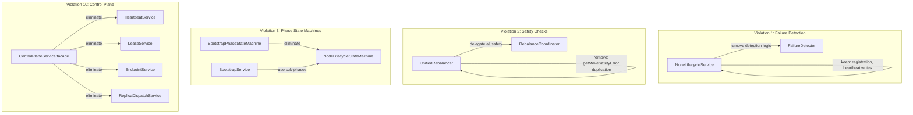

# Design Document: Architecture Violations Cleanup

## Overview

This design addresses 11 architecture violations across the boot, join, and rebalancing flows. The changes are primarily refactoring — removing duplicate logic, consolidating ownership, and routing reads through the SQL engine. No new subsystems are introduced; instead, existing components are brought into compliance with the documented architecture principles.

The changes are organized into three categories:
1. **Overlapping Responsibilities** (Violations 1–4): Remove duplicate logic, consolidate into canonical owners
2. **Architectural Gaps** (Violations 5–9): Fill missing cleanup paths, validation, and explicit trigger definitions
3. **Design Debt** (Violations 10–11): Complete decomposition and enforce read path discipline

## Architecture

The cleanup preserves the existing architecture while enforcing its documented contracts more strictly. No new services or communication paths are introduced.



### Change Strategy

Each violation is addressed by the minimal set of changes needed to restore single-owner compliance:

| Violation | Strategy | Risk |
|-----------|----------|------|
| 1. Duplicate failure detection | Remove detection from NodeLifecycleService, keep write helpers | Low — FailureDetector already canonical |
| 2. Overlapping safety checks | Remove safety logic from UnifiedRebalancer, delegate to coordinator | Low — coordinator already has the logic |
| 3. Multiple phase state machines | Replace BootstrapPhaseStateMachine usage with NodeLifecycleStateMachine sub-phases | Medium — bootstrap flow touches many files |
| 4. Replica state duplication | Audit ReplicaLifecycleManager/ReplicaHandler for independent state maps | Low — delegation already partially done |
| 5. Epoch confusion | Document ownership, remove any secondary epoch sources | Low — mostly documentation |
| 6. MG assignment overlap | Audit for strategy logic outside MessageGroupAssignment | Low — already centralized |
| 7. Bootstrap failure cleanup | Add cleanup procedures to BootstrapService and NodeJoiningService | Medium — new code path |
| 8. Dispatch readiness | Add handler registration check to ReplicaDispatchService | Low — small addition |
| 9. Stabilization resets | Define explicit trigger constants, wire CDC listeners | Low — clarification |
| 10. Control plane facade | Migrate callers, remove ControlPlaneService | Medium — many callers |
| 11. Direct cache reads | Replace cache reads with SQL engine queries in non-infrastructure code | High — many call sites |

## Components and Interfaces

### Violation 1: NodeLifecycleService Changes

**Current state**: NodeLifecycleService contains `detectFailedNodes()`, `startFailureDetection()`, `stopFailureDetection()`, `markNodeFailed()`, `markNodeSuspected()`, and maintains a `knownNodes` Map — all duplicating FailureDetector.

**Target state**: NodeLifecycleService retains only node registration and heartbeat write operations. All failure detection and state transition logic is removed.

```javascript
// REMOVE from NodeLifecycleService:
// - detectFailedNodes()
// - startFailureDetection()
// - stopFailureDetection()
// - markNodeFailed()
// - markNodeSuspected()
// - markNodeActive()
// - knownNodes Map
// - failureDetectionTimer
// - heartbeatTimeoutMs
// - failureDetectionIntervalMs

// KEEP in NodeLifecycleService:
// - registerNode()
// - updateHeartbeat()
// - removeNode()
// - startHeartbeat() / stopHeartbeat()
```

Callers of the removed methods must be updated to use FailureDetector directly.

### Violation 2: UnifiedRebalancer Safety Check Removal

**Current state**: UnifiedRebalancer's `executeMoveViaCoordinator()` calls its own `getMoveSafetyError()` which delegates to `this.rebalanceCoordinator.getMoveSafetyError()`. This creates an unnecessary indirection layer where UnifiedRebalancer wraps the coordinator's safety check.

**Target state**: UnifiedRebalancer removes its own `getMoveSafetyError()` method. The `executeMoveViaCoordinator()` method calls `this.rebalanceCoordinator.getMoveSafetyError()` directly without a local wrapper.

```javascript
// REMOVE from UnifiedRebalancer:
// - getMoveSafetyError() method (the local wrapper)

// CHANGE in executeMoveViaCoordinator():
// Replace: const safetyError = this.getMoveSafetyError(move);
// With:    const safetyError = this.rebalanceCoordinator.getMoveSafetyError({
//            ...move,
//            partitionId: move.partitionId || this.entityId,
//            entityType: move.entityType || this.entityType,
//            entityId: move.entityId || this.entityId,
//          });
```

### Violation 3: BootstrapPhaseStateMachine Elimination

**Current state**: BootstrapPhaseStateMachine tracks phases (NOT_STARTED → INFRASTRUCTURE → MESSAGE_GROUPS → PARTITIONS → REGISTRATION → CACHE_HYDRATION → COMPLETE). NodeLifecycleStateMachine already supports these as sub-phases of the STARTING state.

**Target state**: All BootstrapService code that uses BootstrapPhaseStateMachine is migrated to use NodeLifecycleStateMachine.transitionSubPhase(). The BootstrapPhaseStateMachine file is deleted.

The mapping is:
- `BOOTSTRAP_PHASE.INFRASTRUCTURE` → `BOOTSTRAP_SUB_PHASE.INFRASTRUCTURE`
- `BOOTSTRAP_PHASE.MESSAGE_GROUPS` → `BOOTSTRAP_SUB_PHASE.MESSAGE_GROUPS`
- `BOOTSTRAP_PHASE.PARTITIONS` → `BOOTSTRAP_SUB_PHASE.PARTITIONS`
- `BOOTSTRAP_PHASE.REGISTRATION` → `BOOTSTRAP_SUB_PHASE.REGISTRATION`
- `BOOTSTRAP_PHASE.CACHE_HYDRATION` → `BOOTSTRAP_SUB_PHASE.CACHE_HYDRATION`
- `BOOTSTRAP_PHASE.FAILED` → handled by NodeLifecycleStateMachine transition to STOPPED

Phase duration tracking (currently in BootstrapPhaseStateMachine) will be added to NodeLifecycleStateMachine's sub-phase transitions if not already present.

### Violation 4: Replica State Delegation Audit

**Current state**: ReplicaHandler maintains a `localServices` Map and `inProgressOperations` Map. ReplicaLifecycleManager maintains a `pendingOperations` Map.

**Target state**: 
- `localServices` in ReplicaHandler is acceptable — it tracks live service references (process handles), not replica state. This is operational bookkeeping, not state duplication.
- `inProgressOperations` in ReplicaHandler is acceptable — it's a concurrency guard (dedupe lock), not state tracking.
- `pendingOperations` in ReplicaLifecycleManager is acceptable — it tracks in-flight request/response correlation, not replica state.
- Any Maps that shadow replica status (active/failed/creating etc.) must be removed in favor of ReplicaStateMachine queries.

The audit will verify no component maintains a parallel view of replica lifecycle state.

### Violation 7: Bootstrap Failure Cleanup

**New cleanup procedure** added to BootstrapService and NodeJoiningService:

```javascript
// BootstrapService.cleanupFailedBootstrap()
// Called when any bootstrap phase fails
// 1. Determine which phase failed
// 2. Roll back in reverse order:
//    - CACHE_HYDRATION: clear local cache
//    - REGISTRATION: remove node/service/partition entries from system tables
//    - PARTITIONS: stop and destroy partition services
//    - MESSAGE_GROUPS: stop and destroy message group services
//    - INFRASTRUCTURE: stop message router, clean up connections
// 3. Transition NodeLifecycleStateMachine to STOPPED
// 4. Log cleanup summary

// NodeJoiningService.cleanupFailedJoin()
// Called when any join phase fails
// 1. Remove self-registration from nodes table (if written)
// 2. Remove service entries created during join
// 3. Stop any message group replicas created
// 4. Disconnect from seed node
// 5. Transition NodeLifecycleStateMachine to STOPPED
// 6. Log cleanup summary
```

Cleanup is best-effort: if cleanup itself fails, errors are logged with full context but do not throw (the bootstrap has already failed).

### Violation 8: Dispatch Readiness Validation

**Addition to ReplicaDispatchService.dispatchOperationRow()**:

Before dispatching, verify the target node has a registered handler by checking the services table for an active service entry matching the operation's entity type on the target node.

```javascript
// In dispatchOperationRow(), after isNodeReady() check:
// 1. Determine handler type from operation entity type
// 2. Check services table for active service on target node
// 3. If no handler found, log warning and skip dispatch
// 4. Operation stays in current workflow step for retry
```

### Violation 9: Stabilization Reset Triggers

**Explicit trigger constants** added to rebalancer-constants.js:

```javascript
const STABILIZATION_RESET_TRIGGER = Object.freeze({
  NODE_JOINED: 'node_joined',
  NODE_LEFT: 'node_left',
  NODE_FAILED: 'node_failed',
  REPLICA_FAILED: 'replica_failed',
  POLICY_CHANGED: 'policy_changed',
});
```

Each trigger is wired to `recordStateChange()` via CDC event listeners in UnifiedRebalancer. The existing `recordStateChange()` method already handles the timer reset; this change makes the triggers explicit and documented.

### Violation 10: ControlPlaneService Elimination

**Migration plan**:
1. Identify all callers of ControlPlaneService methods
2. Replace each call with the corresponding decomposed service call
3. Update dependency injection to provide decomposed services directly
4. Remove ControlPlaneService class and file

The decomposed services (HeartbeatService, LeaseService, EndpointService, ReplicaDispatchService) already exist and are fully functional.

### Violation 11: SQL Engine Read Path

**Scope**: Components outside cache/query internals that read directly from SystemTableCache must be migrated to use SQL engine queries.

**Exceptions** (allowed to read cache directly):
- SQL engine internals (query routing, partition resolution)
- Cache hydration during bootstrap
- Raft peer address resolution (performance-critical hot path)
- Admin diagnostic dump (debugging tool, not production read path)

**Migration pattern**:
```javascript
// BEFORE (direct cache read):
const node = this.systemTableCache.get('nodes', nodeId);

// AFTER (SQL engine read):
const result = await this.sqlQueryEngine.executeQuery(
  'SELECT * FROM nodes WHERE node_id = ?', [nodeId]
);
const node = result.rows?.[0] || null;
```

Components to migrate (non-exhaustive, based on grep analysis):
- `ReplicaDispatchService` — reads from nodes and replica_operations tables
- `LeaseService` — reads all nodes for lease sweep
- `EndpointService` — reads node endpoints
- `TablePolicyService` — reads tables and partitions
- `RaftRoleTracker` — reads services table
- `FunctionRegistry` — reads code table
- `ContextManager` — reads contexts table
- `IndexService` — reads indices and partitions tables
- `DynamicConfigService` — reads config table

Note: Some of these reads are in hot paths. The SQL engine already uses the system cache for routing, so the performance impact is the overhead of SQL parsing. For frequently-called reads, we may need to add simple SQL query caching or accept the overhead as the cost of architectural consistency.

## Data Models

No new data models are introduced. The existing system tables (nodes, services, partitions, config, replica_operations, etc.) remain unchanged.

The only data model change is the addition of stabilization reset trigger constants:

```javascript
// New constant in rebalancer-constants.js
const STABILIZATION_RESET_TRIGGER = Object.freeze({
  NODE_JOINED: 'node_joined',
  NODE_LEFT: 'node_left',
  NODE_FAILED: 'node_failed',
  REPLICA_FAILED: 'replica_failed',
  POLICY_CHANGED: 'policy_changed',
});
```

And bootstrap cleanup state tracking (ephemeral, not persisted):

```javascript
// Cleanup context passed through bootstrap failure handler
// Not a new table — just a parameter object
{
  failedPhase: string,        // Which phase failed
  createdPartitions: string[], // Partition IDs created before failure
  createdServices: string[],   // Service IDs created before failure
  createdMessageGroups: string[], // MG IDs created before failure
  registeredNodeId: string | null, // Node ID if registered before failure
}
```


## Correctness Properties

*A property is a characteristic or behavior that should hold true across all valid executions of a system — essentially, a formal statement about what the system should do. Properties serve as the bridge between human-readable specifications and machine-verifiable correctness guarantees.*

### Property 1: Safety check delegation

*For any* move operation passed to UnifiedRebalancer, the safety validation result SHALL be identical to calling RebalanceCoordinator.getMoveSafetyError() directly with the same move — i.e., UnifiedRebalancer does not add, remove, or modify safety checks independently.

**Validates: Requirements 2.2**

### Property 2: Sub-phase transition completeness

*For any* bootstrap phase defined in the former BootstrapPhaseStateMachine (INFRASTRUCTURE, MESSAGE_GROUPS, PARTITIONS, REGISTRATION, CACHE_HYDRATION), NodeLifecycleStateMachine SHALL accept the corresponding sub-phase transition when in the STARTING state.

**Validates: Requirements 3.4**

### Property 3: Seed bootstrap failure cleanup

*For any* bootstrap phase at which a seed node bootstrap can fail, executing the cleanup procedure SHALL result in zero partial entries remaining in the nodes, services, partitions, and message_groups system tables that were created during the failed bootstrap attempt.

**Validates: Requirements 7.1**

### Property 4: Join failure cleanup

*For any* join phase at which a joining node bootstrap can fail, executing the cleanup procedure SHALL result in zero partial entries remaining in the nodes and services system tables that were created during the failed join attempt.

**Validates: Requirements 7.2**

### Property 5: Dispatch handler verification

*For any* replica operation dispatched by ReplicaDispatchService, if the target node does not have a registered handler for the operation's entity type, the dispatch SHALL be skipped and the operation SHALL remain in its current workflow step (unchanged).

**Validates: Requirements 8.1**

### Property 6: Stabilization reset on trigger events

*For any* event in the set {node_joined, node_left, node_failed, replica_failed, policy_changed}, when the event is delivered to UnifiedRebalancer, the stabilization timer SHALL be reset (lastStateChangeTime updated to current time).

**Validates: Requirements 9.1, 9.2, 9.3**

## Error Handling

### Bootstrap Failure Cleanup Errors

- Cleanup is best-effort: if a cleanup step fails (e.g., cannot delete a system table row because the partition leader is unavailable), the error is logged with full context (failed phase, operation attempted, error message) but does not throw.
- The bootstrap failure itself is the primary error; cleanup failure is secondary and must not mask it.
- After cleanup (successful or not), the NodeLifecycleStateMachine transitions to STOPPED.

### Dispatch Readiness Validation Errors

- When a dispatch is skipped due to missing handler registration, a warning is logged with operation ID, target node ID, and entity type.
- The operation remains in its current workflow step. The existing timeout mechanism in RebalanceCoordinator will eventually fail the operation if the handler never becomes available.
- No new error types are introduced; this uses existing logging patterns.

### SQL Engine Migration Errors

- If a SQL engine query fails where a direct cache read previously succeeded, the error is propagated to the caller (same as any SQL query failure).
- During early bootstrap when the SQL engine is not yet available, the documented bootstrap exception applies: direct writes are allowed, and the system transitions to SQL engine reads immediately after bootstrap completes.

### General Error Handling

- All removed code paths (duplicate failure detection, duplicate safety checks, etc.) are simply deleted — no fallback or compatibility shim is maintained.
- If a caller attempts to use a removed method (e.g., `NodeLifecycleService.markNodeFailed()`), it will get a standard JavaScript TypeError for calling an undefined method. This is intentional — it surfaces missed migration points immediately.

## Testing Strategy

### Testing Framework

- Node.js built-in test runner with TAP output
- Property-based testing with fast-check (max 10 iterations per `fc.assert`)
- All tests must complete under 2 seconds
- No skipped tests

### Unit Tests

Unit tests verify specific examples and edge cases for each violation fix:

1. **Violation 1**: Test that NodeLifecycleService no longer has failure detection methods. Test that FailureDetector correctly handles heartbeat timeouts.
2. **Violation 2**: Test that UnifiedRebalancer does not have a `getMoveSafetyError` method. Test that moves are blocked when coordinator returns a safety error.
3. **Violation 3**: Test that BootstrapPhaseStateMachine file is deleted. Test that NodeLifecycleStateMachine handles all bootstrap sub-phases.
4. **Violation 4**: Verify ReplicaLifecycleManager and ReplicaHandler do not maintain independent replica state maps.
5. **Violation 7**: Test cleanup after failure at each bootstrap phase. Test that cleanup errors are logged but not thrown.
6. **Violation 8**: Test dispatch skip when handler is not registered. Test dispatch proceeds when handler is registered.
7. **Violation 9**: Test stabilization reset for each trigger type.
8. **Violation 10**: Test that ControlPlaneService file is deleted. Test that decomposed services work independently.
9. **Violation 11**: Test that migrated components use SQL engine for reads.

### Property-Based Tests

Each correctness property is implemented as a single property-based test:

- **Property 1** (Safety delegation): Generate random move objects, verify UnifiedRebalancer's safety result matches direct coordinator call.
  - Tag: **Feature: architecture-violations-cleanup, Property 1: Safety check delegation**
- **Property 2** (Sub-phase completeness): Generate each bootstrap phase, verify NodeLifecycleStateMachine accepts the sub-phase transition.
  - Tag: **Feature: architecture-violations-cleanup, Property 2: Sub-phase transition completeness**
- **Property 3** (Seed cleanup): Generate random failure phases, verify cleanup leaves no partial state.
  - Tag: **Feature: architecture-violations-cleanup, Property 3: Seed bootstrap failure cleanup**
- **Property 4** (Join cleanup): Generate random join failure phases, verify cleanup leaves no partial state.
  - Tag: **Feature: architecture-violations-cleanup, Property 4: Join failure cleanup**
- **Property 5** (Dispatch verification): Generate random operations with/without registered handlers, verify dispatch behavior.
  - Tag: **Feature: architecture-violations-cleanup, Property 5: Dispatch handler verification**
- **Property 6** (Stabilization reset): Generate random trigger events, verify timer reset.
  - Tag: **Feature: architecture-violations-cleanup, Property 6: Stabilization reset on trigger events**

### Test Configuration

```javascript
// All property tests use max 10 iterations per workspace rules
fc.assert(
  fc.property(/* ... */),
  { numRuns: 10 }
);
```

### Test Organization

- Tests are co-located with the code they test under `test/`
- Property tests are sub-tasks of their parent implementation tasks
- Full test suite runs only at checkpoint tasks
