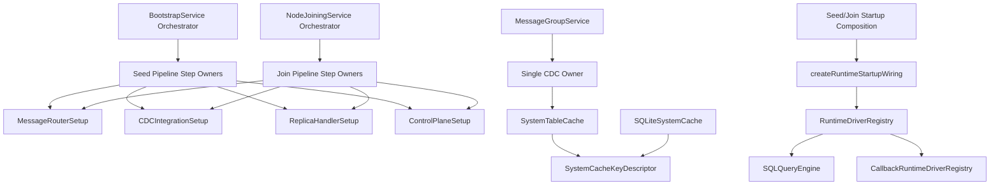

# Design Document: Architecture Ownership Consolidation

## Overview

This design resolves duplication of intent, code, and responsibility by
assigning one owner per concern and forcing all runtime paths through those
owners. It targets six high-risk duplication clusters:

1. Seed bootstrap logic duplicated across monolithic service methods and phase
   classes.
2. Joining logic duplicated across monolithic service methods and phase classes.
3. Shared setup components present but not consistently used in runtime paths.
4. CDC handling split between CDCHandler and MessageGroupService CDC methods.
5. System cache key metadata duplicated across in-memory and SQLite cache
   implementations.
6. Runtime startup wiring instantiable from multiple locations.

The design keeps current behavior but removes parallel implementations and
hidden ownership.

## Goals

- Enforce single-owner architecture for startup, CDC, cache-key metadata, and
  runtime wiring.
- Remove parallel code paths without breaking existing API boundaries.
- Preserve current observable bootstrap/join behavior while centralizing logic.
- Add automated ownership contract tests so duplication regressions fail CI.

## Non-Goals

- Redesigning cluster protocol semantics.
- Changing database schema semantics unrelated to ownership.
- Introducing feature flags that keep old and new owners active in parallel.

## Ownership Map

| Concern | Canonical Owner | Allowed Callers | Forbidden Duplication |
| --- | --- | --- | --- |
| Seed infrastructure setup | `MessageRouterSetup` + seed pipeline step | `BootstrapService` orchestration | Inline router setup logic in multiple places |
| Seed registration/hydration phase logic | Seed pipeline phase owners | `BootstrapService`, optional phase adapters | Independent monolith + phase bodies |
| Joining websocket/setup logic | Joining pipeline phase owners + `MessageRouterSetup` | `NodeJoiningService`, optional phase adapters | Independent duplicate join step bodies |
| CDC integration setup/upgrade | `CDCIntegrationSetup` | Seed/join pipelines | Recreating CDC setup logic in each service |
| Control-plane setup | `ControlPlaneSetup` | Seed/join pipelines | Direct duplicated construction in both services |
| Replica handler setup | `ReplicaHandlerSetup` | Seed/join pipelines | Per-service reimplementation |
| Message-group CDC behavior | `CDCHandler` (or renamed single CDC owner module) | `MessageGroupService` delegation | Parallel logic in service + handler |
| System-table key resolution | `SystemCacheKeyDescriptor` module | All cache implementations | Local PK maps per implementation |
| Runtime wiring | `createRuntimeStartupWiring` at startup boundaries | seed/join startup composition | Implicit fallback wiring construction |

## Target Architecture

## Detailed Design

### 1. Pipeline Ownership Consolidation

#### 1.1 Seed pipeline

- Define canonical seed step owners for:
  - infrastructure
  - message-group creation
  - partition creation
  - system registration
  - cache hydration
  - control-plane activation
- `BootstrapService` remains orchestration boundary and lifecycle event emitter.
- Existing legacy phase entry points become Delegation_Adapters only.

#### 1.2 Joining pipeline

- Define canonical joining step owners for:
  - seed contact/retry
  - websocket/router setup
  - message-group create/join
  - replica handler + control-plane setup
  - state query + ready transition integration
- `NodeJoiningService` remains orchestration boundary and lifecycle event
  emitter.
- Existing joining phase classes become Delegation_Adapters only, if retained.

### 2. Shared Setup Components as Mandatory Runtime Path

The following components become mandatory owners and MUST be called from runtime
paths:

- `MessageRouterSetup`
- `CDCIntegrationSetup`
- `ReplicaHandlerSetup`
- `ControlPlaneSetup`

`BootstrapService` and `NodeJoiningService` may coordinate sequence and wiring
inputs but may not duplicate owner logic internally.

### 3. Single CDC Owner in Message Groups

Define one CDC owner module. Recommended implementation:

- Keep `CDCHandler` as owner.
- `MessageGroupService.subscribeToCDC` delegates to CDC owner.
- `MessageGroupService.applyCDCEvent` delegates to CDC owner.
- The owner is responsible for:
  - subscription gating
  - event ordering policy
  - dedupe policy
  - cache mutation semantics
  - emitted CDC lifecycle events

This removes split semantics between runtime CDC and separately tested handler.

### 4. Canonical System Cache Key Descriptor

Introduce a single descriptor module for system-table key fields.

- Descriptor source: canonical system table schema metadata.
- `SystemTableCache` and `SQLiteSystemCache` import descriptor from the same
  module.
- Startup fails fast when key descriptors are missing for known tables.
- Keep logs excluded from default hydration/subscription lists unless explicitly
  requested.

### 5. Runtime Wiring Ownership

- `createRuntimeStartupWiring` can be called only by startup composition
  boundaries for seed/join node startup.
- `createCallbackDriverRegistry` requires injected registry or explicit startup
  wiring dependency; it must not silently create independent startup owners.
- Partition-callback execution in `SQLQueryEngine` fails closed when runtime
  ownership is absent.

### 6. Delegation-First Migration Rule

To avoid dual-path behavior while refactoring:

1. Extract owner logic into canonical owner module.
2. Replace legacy body with direct delegation call.
3. Verify behavior and tests.
4. Remove legacy duplicate internals.

No fallback toggles or conditional old/new path branching is allowed.

## Data and Control Flow Notes

### Seed bootstrap flow (target)

1. `BootstrapService` orchestrates phase progression and emits lifecycle events.
2. Each phase calls one owner implementation.
3. Shared setup owners initialize router, CDC integration, replica handler, and
   control plane.
4. Cache hydration and CDC subscriptions use canonical table-selection
   definitions.
5. Control plane starts only after ownership-verified dependencies are present.

### Joining flow (target)

1. `NodeJoiningService` orchestrates joining phases and emits lifecycle events.
2. Websocket/connect logic uses `MessageRouterSetup`.
3. CDC and replica/control-plane setup use shared owners.
4. Runtime wiring injected once from startup composition and reused by query and
   callback execution.

## Failure Modes and Handling

- **Missing owner dependency**: Fail fast with owner-specific dependency error.
- **Missing runtime wiring owner**: Reject callback execution with explicit error
  rather than silently creating fallback wiring.
- **Missing key descriptor**: Fail startup/initialization with explicit table
  name.
- **CDC owner not initialized**: Reject CDC operations with explicit owner error.

## Testing Strategy

### Contract tests

- Seed and join orchestrators delegate to owner modules.
- Shared setup components are used in runtime paths.
- Runtime wiring cannot be implicitly created outside startup.

### Behavior parity tests

- Existing bootstrap/join integration tests remain green.
- CDC behavior parity maintained for subscription filtering, ordering, and
  replication semantics.

### Static ownership tests

- Detect forbidden direct construction sites for setup-owned concerns.
- Detect duplicated key-mapping constants outside canonical descriptor.

## Rollout Plan

### Phase 1: Ownership extraction

- Introduce canonical owners and delegation adapters.
- Keep behavior unchanged.

### Phase 2: Duplication removal

- Delete duplicate method bodies and local metadata maps.
- Retain only adapters and owners.

### Phase 3: Enforcement

- Add CI ownership contract tests.
- Update architecture docs and traceability references.

## Architecture Documentation Impact

`architecture.md` must be updated to include:

- owner map for startup, CDC, cache metadata, runtime wiring
- delegated orchestration boundaries for seed/join services
- explicit statement that no dual-path fallback implementations are permitted
