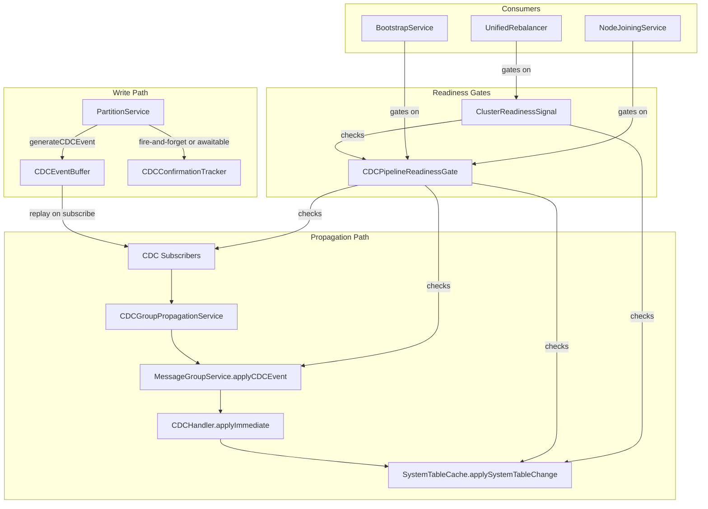

# Design Document: Bootstrap Lifecycle Hardening

## Overview

This design hardens the bootstrap, join, CDC propagation, and rebalance lifecycle by introducing six coordinated improvements:

1. **Awaitable CDC confirmation** — An optional promise-based mechanism that lets callers wait for a write to become visible in the SystemTableCache, without changing the default fire-and-forget behavior.
2. **CDC pipeline readiness gate** — A composite readiness check that bootstrap and join orchestrators gate on before declaring a node READY.
3. **CDC event buffering** — A bounded buffer in PartitionService that captures CDC events generated before subscribers are registered, replaying them once subscriptions activate.
4. **Rebalancer cluster-readiness gate** — A pre-planning check that prevents the rebalancer from making decisions on incomplete cluster state.
5. **Seed bootstrap single-replica optimization** — Seed bootstrap creates 1-replica groups instead of 3, eliminating the redistribution storm when the second node joins.
6. **CDC pipeline observability** — Warning-level logs and metrics for every CDC event that is generated but not delivered, eliminating silent drops.

All changes follow the single-owner, single-path, zero-duplication contract defined in the system guidelines.

## Architecture

The changes touch four layers of the existing architecture:



### Key Design Decisions

1. **CDCConfirmationTracker is a separate component, not embedded in PartitionService.** This keeps PartitionService focused on Raft and SQL, and allows the tracker to be injected only when confirmation is needed. The tracker listens to the `cdcApplied` event emitted by MessageGroupService after CDCHandler applies the event to the cache.

2. **CDCEventBuffer lives inside PartitionService** because it must capture events at the generation site. It replaces the early-return when `cdcSubscribers.size === 0` with buffering logic.

3. **CDCPipelineReadinessGate is a stateless evaluator** that reads from existing state (subscription counts, leader status, cache state). It does not maintain its own state or cache — it queries the owners.

4. **ClusterReadinessSignal composes CDCPipelineReadinessGate** with additional checks. The rebalancer calls it once before its first planning cycle, then falls back to normal stabilization-based scheduling.

5. **Single-replica seed bootstrap** changes the initial replica count from 3 to 1 in the bootstrap configuration constants. The existing rebalancer ADD-move logic handles scaling up when nodes join.

## Components and Interfaces

### CDCConfirmationTracker

**Owner:** CDC confirmation lifecycle
**Location:** `src/cdc/cdc-confirmation-tracker.js`

```javascript
class CDCConfirmationTracker {
  constructor(options) {
    // options.systemTableCache — SystemTableCache instance
    // options.timeoutMs — default confirmation timeout (from constants)
  }

  /**
   * Create a confirmation promise for a specific CDC event.
   * Resolves when the event is applied to SystemTableCache.
   * @param {string} tableName
   * @param {string} primaryKey
   * @param {number} [timeoutMs] — override default timeout
   * @return {Promise<void>}
   */
  awaitConfirmation(tableName, primaryKey, timeoutMs) {}

  /**
   * Called by the CDC pipeline when an event is applied to cache.
   * Resolves any pending confirmation promises matching the event.
   * @param {string} tableName
   * @param {string} operation
   * @param {Object} data
   */
  onEventApplied(tableName, operation, data) {}

  /**
   * Shut down and reject all pending confirmations.
   */
  shutdown() {}
}
```

**Wiring:** The tracker registers as a cache change listener on SystemTableCache via `addListener()`. When `applySystemTableChange` calls `notifyListeners`, the tracker resolves matching pending promises. This avoids adding any new event path — it reuses the existing listener mechanism.

### CDCEventBuffer

**Owner:** Per-partition CDC event buffering
**Location:** `src/partition/cdc-event-buffer.js`

```javascript
class CDCEventBuffer {
  constructor(options) {
    // options.capacity — max buffered events (from constants)
    // options.logger
  }

  /**
   * Buffer a CDC event when no subscribers are present.
   * @param {Object} cdcEvent
   * @return {boolean} true if buffered, false if dropped (capacity exceeded)
   */
  buffer(cdcEvent) {}

  /**
   * Replay all buffered events to the given subscriber callback.
   * Clears the buffer after replay.
   * @param {Function} subscriber — async (cdcEvent) => void
   * @return {Promise<number>} count of replayed events
   */
  async replay(subscriber) {}

  /**
   * @return {number} current buffer size
   */
  size() {}

  /**
   * @return {boolean} true if buffer has events
   */
  hasEvents() {}

  /**
   * Clear all buffered events.
   */
  clear() {}
}
```

**Integration with PartitionService:** In `generateCDCEvent()`, when `cdcSubscribers.size === 0`, instead of returning early, the event is passed to `this.cdcEventBuffer.buffer(cdcEvent)`. When `subscribeToCDC()` is called on the partition, after registering the subscriber, `this.cdcEventBuffer.replay(subscriber)` is called.

### CDCPipelineReadinessGate

**Owner:** CDC pipeline readiness evaluation
**Location:** `src/cdc/cdc-pipeline-readiness-gate.js`

```javascript
class CDCPipelineReadinessGate {
  constructor(options) {
    // options.systemTableCache
    // options.cdcPropagatedTables — from CDC_PROPAGATED_TABLES constant
  }

  /**
   * Evaluate pipeline readiness.
   * @param {Object} context
   * @param {Map} context.partitionServices — partition replicas
   * @param {Map} context.messageGroupServices — message group replicas
   * @return {Object} { ready: boolean, unmetConditions: string[] }
   */
  evaluate(context) {}

  /**
   * Wait for pipeline readiness with timeout.
   * @param {Object} context
   * @param {number} timeoutMs
   * @param {number} [pollIntervalMs]
   * @return {Promise<Object>} readiness result
   */
  async waitForReady(context, timeoutMs, pollIntervalMs) {}
}
```

**Readiness conditions:**
1. **Subscriptions active:** Every table in `CDC_PROPAGATED_TABLES` has at least one CDC subscriber registered on at least one partition replica.
2. **Propagation leader:** At least one message group service reports `isLeaderReplica() === true`.
3. **Pipeline proven:** The SystemTableCache has received at least one change notification (tracked via a one-shot listener).

### ClusterReadinessSignal

**Owner:** Cluster-level readiness for rebalancer
**Location:** `src/rebalancer/cluster-readiness-signal.js`

```javascript
class ClusterReadinessSignal {
  constructor(options) {
    // options.cdcPipelineReadinessGate
    // options.systemTableCache
    // options.expectedNodeCount — number of nodes expected in current formation
  }

  /**
   * Evaluate cluster readiness for rebalancer planning.
   * @param {Object} context — same as CDCPipelineReadinessGate context
   * @return {Object} { ready: boolean, unmetConditions: string[] }
   */
  evaluate(context) {}
}
```

**Readiness conditions:**
1. **CDC pipeline ready:** `CDCPipelineReadinessGate.evaluate()` returns `ready: true`.
2. **Nodes registered:** The SystemTableCache `nodes` table contains at least `expectedNodeCount` entries with ACTIVE status.
3. **Cache hydrated:** The SystemTableCache has entries for all tables in `CDC_PROPAGATED_TABLES`.

### CDCPipelineMetrics

**Owner:** CDC pipeline observability
**Location:** `src/cdc/cdc-pipeline-metrics.js`

```javascript
class CDCPipelineMetrics {
  constructor() {
    this.eventsGenerated = 0;
    this.eventsDelivered = 0;
    this.eventsBuffered = 0;
    this.eventsDropped = 0;
    this.deliveryFailures = 0;
  }

  increment(counter) {}
  getSnapshot() {}
  reset() {}
}
```

This is a simple counter object — no timers, no caches, no state duplication. It is incremented at the generation site (PartitionService), the buffer (CDCEventBuffer), and the delivery site (CDCHandler).

## Data Models

### CDC Confirmation Tracking

No new persistent tables. The confirmation tracker uses an in-memory `Map<string, {resolve, reject, timer}>` keyed by `${tableName}:${primaryKey}`. Entries are created when `awaitConfirmation()` is called and removed when the cache listener fires or the timeout expires.

### CDC Event Buffer

No new persistent tables. The buffer is an in-memory array bounded by `CDC_EVENT_BUFFER_CAPACITY` (constant). Each entry is the same `cdcEvent` object already produced by `generateCDCEvent()`:

```javascript
{
  tableName: string,
  operation: string,    // INSERT, UPDATE, UPSERT, DELETE
  data: Object,
  timestamp: string,    // HLC timestamp
  sourcePartition: string,
  sourceReplica: string
}
```

### CDC Pipeline Metrics

No new persistent tables. In-memory counters only. Exposed via `getSnapshot()` for diagnostic endpoints.

### Constants

New constants file: `src/constants/cdc-lifecycle-constants.js`

```javascript
const CDC_CONFIRMATION_DEFAULT_TIMEOUT_MS = 5000;
const CDC_EVENT_BUFFER_CAPACITY = 1000;
const CDC_PIPELINE_READINESS_POLL_INTERVAL_MS = 100;
const CDC_PIPELINE_READINESS_TIMEOUT_MS = 30000;
const CLUSTER_READINESS_TIMEOUT_MS = 30000;
```

### Bootstrap Configuration Changes

The seed bootstrap replica count changes from 3 to 1 for both partitions and message groups. This is controlled by the existing `INITIAL_REPLICA_IDS` and `INITIAL_MESSAGE_GROUP_REPLICA_IDS` constants. The change reduces these arrays to single-element arrays during seed bootstrap, with the rebalancer scaling up when nodes join.


## Correctness Properties

*A property is a characteristic or behavior that should hold true across all valid executions of a system — essentially, a formal statement about what the system should do. Properties serve as the bridge between human-readable specifications and machine-verifiable correctness guarantees.*

### Property 1: CDC confirmation round-trip

*For any* write to a CDC-propagated system table where CDC confirmation is requested, the returned promise SHALL resolve only after the written data is present in the SystemTableCache, and the cache entry SHALL match the written data.

**Validates: Requirements 1.1**

### Property 2: CDC confirmation timeout rejection

*For any* CDC confirmation request where the CDC pipeline is blocked (no subscribers, no message group leader, or cache apply failure), the confirmation promise SHALL reject with a timeout error after the configured timeout duration, and the error SHALL be descriptive.

**Validates: Requirements 1.3**

### Property 3: Pipeline readiness gate evaluation

*For any* combination of the three readiness conditions (subscriptions active, propagation leader elected, pipeline proven), the CDCPipelineReadinessGate SHALL report `ready: true` if and only if all three conditions are true, and `unmetConditions` SHALL contain exactly the names of the conditions that are false.

**Validates: Requirements 2.1, 2.2, 2.3**

### Property 4: Node state gated by pipeline readiness

*For any* node lifecycle (bootstrap or join), the node state SHALL never transition to READY while the CDCPipelineReadinessGate reports `ready: false`.

**Validates: Requirements 2.5, 2.6**

### Property 5: Buffer captures events with no subscribers

*For any* CDC event generated by a partition leader when no CDC subscribers are registered, the CDCEventBuffer SHALL contain that event, and the buffer size SHALL equal the number of events generated (up to capacity).

**Validates: Requirements 3.1**

### Property 6: Buffer replay preserves generation order

*For any* sequence of CDC events buffered in the CDCEventBuffer, replaying the buffer SHALL deliver events to the subscriber in the exact order they were buffered.

**Validates: Requirements 3.2**

### Property 7: Buffer overflow drops oldest events

*For any* sequence of N CDC events buffered where N exceeds the buffer capacity C, the buffer SHALL contain exactly C events, and those events SHALL be the last C events from the sequence (oldest dropped first).

**Validates: Requirements 3.3**

### Property 8: Buffer replay deduplicates

*For any* set of CDC events where some events were both buffered and subsequently delivered through the normal subscription path, replaying the buffer SHALL not deliver events that were already delivered normally. The total delivery count for each unique event SHALL be exactly one.

**Validates: Requirements 3.4**

### Property 9: Cluster readiness signal evaluation

*For any* combination of the three cluster readiness conditions (CDC pipeline ready, expected nodes registered with ACTIVE status, cache hydrated for all CDC-propagated tables), the ClusterReadinessSignal SHALL report `ready: true` if and only if all three conditions are true, and `unmetConditions` SHALL contain exactly the names of the conditions that are false.

**Validates: Requirements 4.2**

### Property 10: No rebalancer planning while cluster not ready

*For any* rebalancer instance where the ClusterReadinessSignal reports `ready: false`, the rebalancer SHALL not execute any planning cycle. Once the signal reports `ready: true`, the rebalancer SHALL proceed with normal stabilization-based planning.

**Validates: Requirements 4.3, 4.4**

### Property 11: Single-replica immediate leadership

*For any* Raft group created with exactly one replica, that replica SHALL report `isLeader === true` immediately after initialization without requiring an election timeout period.

**Validates: Requirements 5.3**

### Property 12: Single-replica data durability

*For any* sequence of writes committed to a single-replica partition group, all written data SHALL be recoverable by reading from the partition after restart.

**Validates: Requirements 5.5**

### Property 13: CDC metrics accuracy

*For any* sequence of CDC pipeline operations (event generation, successful delivery, buffer drops, delivery failures), the CDCPipelineMetrics snapshot SHALL accurately reflect the cumulative counts: `eventsGenerated` equals total generate calls, `eventsDelivered` equals total successful cache applications, `eventsDropped` equals total buffer overflow drops, and `deliveryFailures` equals total failed deliveries.

**Validates: Requirements 6.4**

## Error Handling

### CDC Confirmation Failures

- **Timeout:** The confirmation promise rejects with a `CDCConfirmationTimeoutError` containing the table name, primary key, and elapsed time. The caller decides whether to retry or proceed without confirmation.
- **Pipeline failure:** If `generateCDCEvent` throws, the confirmation promise rejects with the original error wrapped in a `CDCConfirmationError` identifying the failure stage.
- **Shutdown:** On tracker shutdown, all pending confirmations reject with a `CDCConfirmationShutdownError`.

### CDC Event Buffer Overflow

- When the buffer reaches capacity, the oldest event is evicted. A warning-level log is emitted with `{ droppedCount, bufferCapacity, tableName, partitionId }`. This is not a fatal error — it indicates the subscription setup took longer than expected.

### Pipeline Readiness Gate Timeout

- If the gate does not reach ready within the configured timeout during bootstrap, the bootstrap fails with a descriptive error listing unmet conditions. This is a fatal error for the node — it cannot serve queries without a working CDC pipeline.
- If the gate does not reach ready within the configured timeout during the rebalancer's first check, the rebalancer logs a warning and proceeds with available state. This is non-fatal — the rebalancer may make suboptimal decisions but will self-correct.

### CDC Propagation Message Group Resolution Failure

- `resolveCdcPropagationMessageGroup` currently returns `null` silently. The fix adds a warning-level log with `{ tableName, operation, partitionId, reason: 'no_leader_message_group' }`. The CDC event is still buffered (if buffer is available) or dropped (with a separate drop warning).

### General Error Handling Principles

- All new components follow the existing error handling contract: no swallowed errors, no try/catch for control flow.
- Transient errors (no leader, cache unavailable) are handled by the existing retry mechanisms in the CDC pipeline.
- New error types extend the existing error hierarchy and include structured context for debugging.

## Testing Strategy

### Property-Based Testing

Property-based tests use `fast-check` with `{ numRuns: 10 }` per the workspace testing guidelines. Each property test references its design document property number.

**CDCConfirmationTracker properties:**
- Property 1: Generate random table writes, request confirmation, verify cache contains data after resolution.
- Property 2: Generate random timeout values, block the pipeline, verify rejection timing.

**CDCPipelineReadinessGate properties:**
- Property 3: Generate all 8 combinations of 3 boolean conditions, verify gate output.

**CDCEventBuffer properties:**
- Property 5: Generate random event sequences with zero subscribers, verify buffer contents.
- Property 6: Generate random event sequences, replay, verify ordering.
- Property 7: Generate sequences exceeding capacity, verify oldest-dropped behavior.
- Property 8: Generate overlapping buffered/delivered event sets, verify dedup.

**ClusterReadinessSignal properties:**
- Property 9: Generate all 8 combinations of 3 boolean conditions, verify signal output.

**Rebalancer gating properties:**
- Property 10: Generate rebalancer states with varying readiness, verify no planning when not ready.

**CDCPipelineMetrics properties:**
- Property 13: Generate random sequences of increment operations, verify snapshot accuracy.

### Unit Tests

Unit tests cover specific examples and edge cases:

- CDCConfirmationTracker: confirmation for INSERT, UPDATE, UPSERT, DELETE operations; shutdown behavior; duplicate confirmation requests for same key.
- CDCEventBuffer: empty buffer replay; single event buffer/replay; buffer clear; capacity boundary (exactly at capacity).
- CDCPipelineReadinessGate: bootstrap timeout error message format; specific unmet condition combinations.
- ClusterReadinessSignal: zero nodes registered; partial cache hydration.
- Single-replica bootstrap: verify replica count is 1 after seed bootstrap; verify rebalancer ADD moves after second node joins.
- CDC observability: verify warning logs are emitted for null message group resolution; verify metrics snapshot format.

### Integration Tests

The four failing integration tests are updated to use the new infrastructure:

1. `cdc-propagation.integration.test.js` — Uses `CDCConfirmationTracker.awaitConfirmation()` instead of polling.
2. `control-plane-rebalance.integration.test.js` — Uses `ClusterReadinessSignal` before asserting rebalancer outcomes.
3. `leader-metadata-validation.integration.test.js` — Uses `CDCPipelineReadinessGate.waitForReady()` before assertions.
4. `multi-node-raft-replication.integration.test.js` — Uses `CDCConfirmationTracker.awaitConfirmation()` for cross-node verification.

### Test Configuration

- Property tests: `fast-check` with `{ numRuns: 10 }` (per workspace guidelines)
- Unit tests: must complete in under 2 seconds (per workspace guidelines)
- Integration tests: up to 30 seconds (per workspace guidelines)
- No skipped tests; all tests must pass
- Tag format: `Feature: bootstrap-lifecycle-hardening, Property N: {property_text}`
