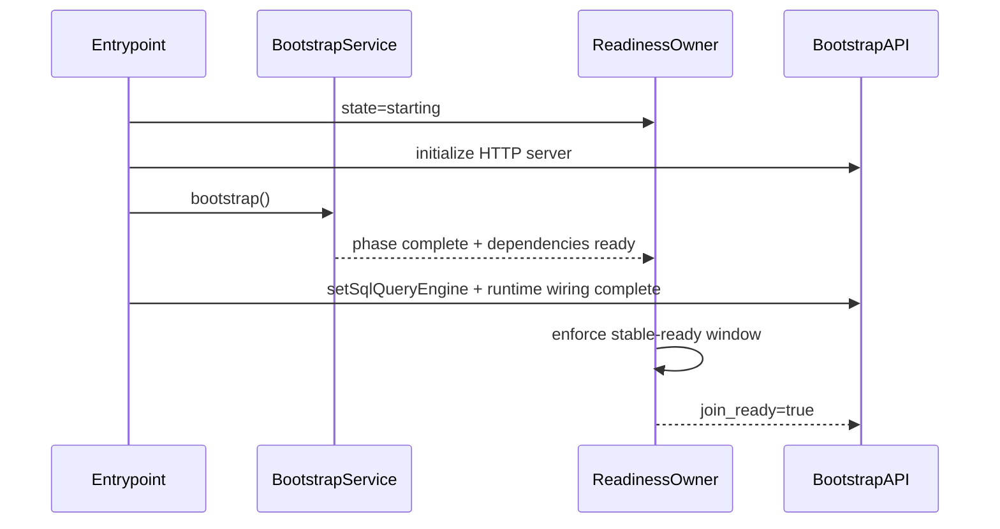
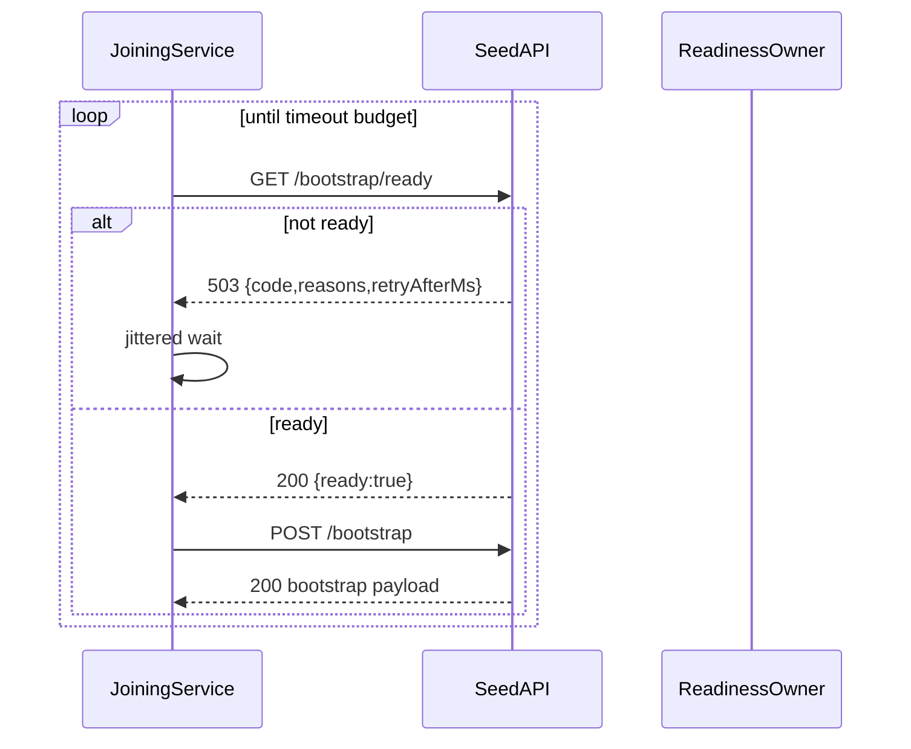

# Design Document: Bootstrap Readiness Signaling Hardening

## Overview

This design introduces a unified readiness contract for seed startup and node
join. It removes ambiguity between liveness and readiness, separates probes
from operations, and aligns distributed harness behavior with production probe
semantics expected by Kubernetes and NGINX.

## Goals

1. Establish a single readiness state owner with explicit transitions.
2. Introduce dedicated low-cost probe endpoints for liveness/startup/readiness.
3. Keep `POST /bootstrap` operational and idempotent, not a probe.
4. Align distributed harness and at least one integration test with real
   networked readiness behavior.
5. Provide deployment-ready probe guidance for Kubernetes/NGINX.

## Non-Goals

1. No change to core placement algorithms or replica balancing logic.
2. No redesign of bootstrap payload schema beyond readiness diagnostics.
3. No introduction of alternate bootstrap operation endpoints.

## Current Gap Summary

1. Integration join can bypass network timing by using in-process Fastify
   injection.
2. Distributed harness uses real network and currently catches readiness
   flapping that integration path does not.
3. Startup gate probing through `POST /bootstrap` couples readiness checking to
   heavy operational behavior.
4. Seed can expose HTTP surfaces before all join-critical dependencies are
   stably ready.

## Architecture

### 1. Readiness State Owner

Create one component (for example `BootstrapReadinessState`) with ownership of:

1. state (`starting`, `bootstrapping`, `warming`, `join_ready`, `degraded`),
2. reasons/blockers (`sql_engine_missing`, `leader_metadata_incomplete`, etc.),
3. transition policy (promotion/demotion hysteresis),
4. endpoint projection (how each probe endpoint maps to state).

This owner is wired once and shared by:

1. Bootstrap API route handlers,
2. entrypoint startup wiring,
3. diagnostics/metrics sinks.

### 2. Endpoint Contract

| Endpoint | Method | Success | Failure | Notes |
| --- | --- | --- | --- | --- |
| `/livez` | `GET` | `200` process alive | `5xx` fatal runtime failure | No dependency checks |
| `/startupz` | `GET` | `200` after bootstrap complete | `503` before complete | Monotonic once complete |
| `/readyz` | `GET` | `200` join/admin safe | `503` with reasons | Hysteresis-protected |
| `/bootstrap/ready` | `GET` | `200` seed join-ready | `503` with retry hint | Lightweight, no snapshot work |
| `/bootstrap` | `POST` | `200` + bootstrap payload | `503` not-ready, `4xx` validation/conflict | Operation endpoint |

### 3. Readiness Hysteresis

Promotion:

1. Probe success must be sustained for configured `readyStableWindowMs`.

Demotion:

1. Readiness demotes after configurable consecutive failures or fatal blocker
   conditions.

Rationale:

1. Avoid transient "single 200 then failure" transitions.
2. Preserve realistic startup timing under CPU saturation and control-plane
   catch-up.

### 4. Startup Dependency Gates

Readiness owner consumes dependency signals from:

1. bootstrap phase completion,
2. SQL query engine availability,
3. leader metadata completeness for required system services,
4. message routing/control-plane initialization status.

`join_ready=true` is allowed only when all required dependency blockers are
clear and hysteresis criteria are satisfied.

### 5. Join Retry Contract

Join client behavior:

1. Retry on timeouts, `503`, and explicit readiness codes.
2. Honor retry hints (`Retry-After` or `retryAfterMs`) when provided.
3. Keep idempotent behavior by `nodeId`.
4. Fail fast on non-retryable classes (`400`, `409`, invalid payload).

### 6. Harness Contract Change

Harness startup gate changes:

1. Probe `GET /bootstrap/ready` (or `/readyz` with join scope) rather than
   `POST /bootstrap`.
2. Keep stable success window enforcement.
3. Report rich diagnostics: attempts, status histogram, last readiness reasons,
   and stable window elapsed.

### 7. Integration Coverage Parity

Add one network-realistic integration path:

1. Seed API listens on real TCP socket (`listen: true`).
2. Join uses real HTTP client (no in-process inject helper).
3. Test asserts readiness transition and successful join under actual listener
   timing.

Fast in-process integration tests remain for broad functional coverage.

## Sequence Flows

### Seed Startup and Readiness



### Joiner Probe and Bootstrap



## API Response Shape

Recommended readiness body:

```json
{
  "ready": false,
  "state": "bootstrapping",
  "reasons": ["sql_engine_missing", "leader_metadata_incomplete"],
  "retryAfterMs": 500,
  "timestamp": 1771708629000
}
```

Not-ready bootstrap operation response:

```json
{
  "success": false,
  "code": "BOOTSTRAP_NOT_READY",
  "phase": "cache_hydration",
  "retryAfterMs": 500
}
```

## Kubernetes and NGINX Profile

Kubernetes baseline profile:

1. `startupProbe` -> `GET /startupz`
2. `readinessProbe` -> `GET /readyz`
3. `livenessProbe` -> `GET /livez`
4. Conservative defaults for early rollout:
   - `periodSeconds: 2`
   - `timeoutSeconds: 1`
   - `startupProbe.failureThreshold: 60`
   - `readinessProbe.failureThreshold: 3`
   - `livenessProbe.failureThreshold: 5`

NGINX guidance:

1. Upstream active health checks target `/readyz`.
2. Do not blindly replay `POST /bootstrap` unless idempotency guarantees are
   explicitly preserved.
3. Prefer retrying lightweight readiness probes over operation retries.

## Observability

Emit:

1. readiness transition events with old/new state and reasons,
2. counters for probe status classes by endpoint,
3. histogram for time spent blocked by each reason,
4. startup timeline markers for bootstrap, SQL wiring, and ready promotion.

## Risks and Mitigations

1. Risk: readiness never promotes due to miswired dependency signal.
   Mitigation: add unit tests for each blocker and synthetic forced-ready test.
2. Risk: premature demotion during short spikes.
   Mitigation: demotion threshold and reason-specific failure classification.
3. Risk: client compatibility breakage.
   Mitigation: additive endpoints, preserve `POST /bootstrap` response fields.

## Testing Strategy

Test-first, in this order:

1. Unit tests for readiness state transitions and hysteresis.
2. Bootstrap API endpoint contract tests (`/livez`, `/startupz`, `/readyz`,
   `/bootstrap/ready`).
3. Join retry tests honoring retry hints and backoff.
4. Harness startup gate tests using new readiness endpoint.
5. Real-network integration join test with actual listening sockets.
6. Distributed baseline rerun to verify diagnostics and failure mode clarity.

## Files Expected to Change

Primary:

1. `src/bootstrap/bootstrap-api.js`
2. `src/bootstrap/bootstrap-api-constants.js`
3. `src/index.js`
4. `src/bootstrap/node-joining-service.js`
5. `test/distributed/harness/cluster.js`

Tests:

1. `test/bootstrap/bootstrap-api.test.js`
2. `test/bootstrap/node-joining-service.test.js`
3. `test/integration/node-join-convergence-slo.integration.test.js`
4. `test/distributed/harness/__tests__/cluster.test.js`

Docs:

1. `README.md` probe section (or equivalent runtime/deployment docs).
