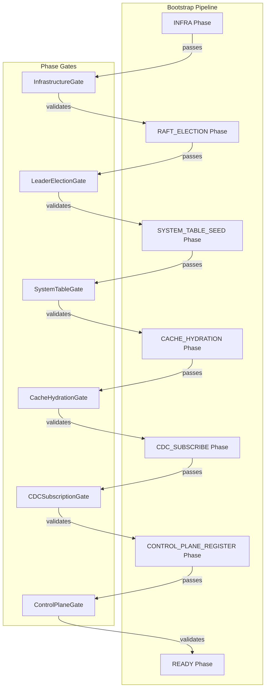

# Design Document: Cluster Reliability Improvements

## Overview

This design addresses remaining gaps in the seed node bootstrap, node joining, and rebalancing flow to make it production-ready. The improvements focus on:

1. **Services-P1 Timeout Investigation** - Diagnosing and fixing the CREATE_REPLICA timeout specific to services-p1
2. **BootstrapStateMachine Enhancement** - Adding explicit phase gates with validation
3. **Cache Hydration Verification** - Ensuring completeness before allowing joins
4. **Integration Test Coverage** - Adding missing tests for leader metadata validation
5. **Deterministic Timeouts** - Ensuring all tests complete within defined limits

## Architecture



## Components and Interfaces

### PhaseGate Interface

Each phase gate validates that the phase completed successfully before allowing progression.

```javascript
/**
 * Phase gate interface for bootstrap validation.
 */
class PhaseGate {
  /**
   * Validate that the phase completed successfully.
   * @param {Object} context - Bootstrap context with services and state.
   * @return {Object} Validation result with success, errors, and diagnostics.
   */
  validate(context) {
    return {
      success: true,
      errors: [],
      diagnostics: {},
    };
  }
}
```

### CacheHydrationGate

Validates that cache hydration is complete with all required leader metadata.

```javascript
/**
 * Gate that validates cache hydration completeness.
 */
class CacheHydrationGate extends PhaseGate {
  /**
   * Validate cache hydration completeness.
   * @param {Object} context - Bootstrap context.
   * @return {Object} Validation result.
   */
  validate(context) {
    const {systemTableCache} = context;
    
    const missingLeaders = getMissingSystemServiceLeaders(systemTableCache);
    
    const hasAllPartitionLeaders = missingLeaders.missingPartitionLeaders.length === 0;
    const hasAllMessageGroupLeaders = missingLeaders.missingMessageGroupLeaders.length === 0;
    const hasAllAddresses = missingLeaders.missingPartitionLeaderAddresses.length === 0 &&
      missingLeaders.missingMessageGroupLeaderAddresses.length === 0;
    
    const success = hasAllPartitionLeaders && hasAllMessageGroupLeaders && hasAllAddresses;
    
    return {
      success,
      errors: success ? [] : ['Cache hydration incomplete'],
      diagnostics: {
        missingPartitionLeaders: missingLeaders.missingPartitionLeaders,
        missingMessageGroupLeaders: missingLeaders.missingMessageGroupLeaders,
        missingPartitionLeaderAddresses: missingLeaders.missingPartitionLeaderAddresses,
        missingMessageGroupLeaderAddresses: missingLeaders.missingMessageGroupLeaderAddresses,
      },
    };
  }
}
```

### Enhanced BootstrapStateMachine

Extends the existing state machine with phase gates and timeout handling.

```javascript
/**
 * Enhanced bootstrap state machine with phase gates.
 */
class EnhancedBootstrapStateMachine extends BootstrapPhaseStateMachine {
  constructor(options = {}) {
    super(options);
    this.phaseGates = new Map();
    this.phaseTimeouts = new Map();
    this.failedPhase = null;
    this.failureReason = null;
  }

  /**
   * Register a gate for a phase.
   * @param {string} phase - Phase name.
   * @param {PhaseGate} gate - Gate instance.
   */
  registerGate(phase, gate) {
    this.phaseGates.set(phase, gate);
  }

  /**
   * Set timeout for a phase.
   * @param {string} phase - Phase name.
   * @param {number} timeoutMs - Timeout in milliseconds.
   */
  setPhaseTimeout(phase, timeoutMs) {
    this.phaseTimeouts.set(phase, timeoutMs);
  }

  /**
   * Validate phase gate before transition.
   * @param {string} targetPhase - Target phase.
   * @param {Object} context - Bootstrap context.
   * @return {Object} Validation result.
   */
  validateGate(targetPhase, context) {
    const currentPhase = this.getCurrentPhase();
    const gate = this.phaseGates.get(currentPhase);
    
    if (!gate) {
      return {success: true, errors: [], diagnostics: {}};
    }
    
    return gate.validate(context);
  }

  /**
   * Transition with gate validation.
   * @param {string} targetPhase - Target phase.
   * @param {Object} context - Bootstrap context.
   * @throws {PhaseGateError} If gate validation fails.
   */
  transitionWithValidation(targetPhase, context) {
    const validation = this.validateGate(targetPhase, context);
    
    if (!validation.success) {
      this.failedPhase = this.getCurrentPhase();
      this.failureReason = validation;
      throw new PhaseGateError(this.getCurrentPhase(), validation);
    }
    
    this.transition(targetPhase);
  }

  /**
   * Check if bootstrap failed.
   * @return {boolean} True if failed.
   */
  hasFailed() {
    return this.failedPhase !== null;
  }

  /**
   * Get failure details.
   * @return {Object|null} Failure details or null.
   */
  getFailureDetails() {
    if (!this.failedPhase) {
      return null;
    }
    return {
      phase: this.failedPhase,
      reason: this.failureReason,
    };
  }
}
```

### Services-P1 Diagnostic Logger

Adds detailed timing diagnostics for services-p1 operations.

```javascript
/**
 * Diagnostic logger for services-p1 operations.
 */
class ServicesP1DiagnosticLogger {
  constructor(logger) {
    this.logger = logger;
    this.operationTimings = new Map();
  }

  /**
   * Start timing an operation.
   * @param {string} operationId - Operation ID.
   * @param {string} step - Step name.
   */
  startStep(operationId, step) {
    const key = `${operationId}:${step}`;
    this.operationTimings.set(key, {
      step,
      startedAt: Date.now(),
    });
  }

  /**
   * End timing an operation step.
   * @param {string} operationId - Operation ID.
   * @param {string} step - Step name.
   * @param {Object} metadata - Additional metadata.
   */
  endStep(operationId, step, metadata = {}) {
    const key = `${operationId}:${step}`;
    const timing = this.operationTimings.get(key);
    
    if (timing) {
      const elapsed = Date.now() - timing.startedAt;
      this.logger.debug('Services-p1 operation step completed', {
        operationId,
        step,
        elapsedMs: elapsed,
        ...metadata,
      });
      this.operationTimings.delete(key);
    }
  }

  /**
   * Log operation timeout with all collected timings.
   * @param {string} operationId - Operation ID.
   * @param {Object} metadata - Additional metadata.
   */
  logTimeout(operationId, metadata = {}) {
    const pendingSteps = [];
    for (const [key, timing] of this.operationTimings) {
      if (key.startsWith(operationId)) {
        pendingSteps.push({
          step: timing.step,
          elapsedMs: Date.now() - timing.startedAt,
        });
      }
    }
    
    this.logger.error('Services-p1 operation timeout', {
      operationId,
      pendingSteps,
      ...metadata,
    });
  }
}
```

## Data Models

### PhaseGateResult

```javascript
{
  success: boolean,           // Whether gate validation passed
  errors: Array<string>,      // Error messages if failed
  diagnostics: {
    missingPartitionLeaders: Array<string>,
    missingMessageGroupLeaders: Array<string>,
    missingPartitionLeaderAddresses: Array<string>,
    missingMessageGroupLeaderAddresses: Array<string>,
    // Additional diagnostic data per gate type
  },
}
```

### BootstrapFailureDetails

```javascript
{
  phase: string,              // Phase that failed
  reason: PhaseGateResult,    // Gate validation result
  elapsedMs: number,          // Time spent in phase before failure
  timestamp: number,          // When failure occurred
}
```

### ServicesP1OperationTiming

```javascript
{
  operationId: string,        // Operation ID
  steps: Array<{
    step: string,             // Step name
    startedAt: number,        // Start timestamp
    completedAt: number,      // Completion timestamp (if completed)
    elapsedMs: number,        // Duration
  }>,
  totalElapsedMs: number,     // Total operation duration
  timedOut: boolean,          // Whether operation timed out
}
```


## Correctness Properties

*A property is a characteristic or behavior that should hold true across all valid executions of a system—essentially, a formal statement about what the system should do. Properties serve as the bridge between human-readable specifications and machine-verifiable correctness guarantees.*

### Property 1: Concurrent Services Table Writes Complete

*For any* set of concurrent write operations to the services table from different partitions, all operations SHALL complete without blocking each other, and the final state SHALL reflect all writes.

**Validates: Requirements 1.3**

### Property 2: Phase Gate Failure Diagnostics

*For any* phase gate failure in the BootstrapStateMachine, the failure result SHALL contain the phase name, specific errors, and diagnostic details including any missing leaders or incomplete data.

**Validates: Requirements 3.2, 3.3, 3.6**

### Property 3: Phase Transition Gate Invariant

*For any* phase transition in the BootstrapStateMachine, the transition SHALL only succeed if the current phase's gate validation passes. If the gate fails, the transition SHALL be blocked and the state machine SHALL remain in the current phase.

**Validates: Requirements 3.4**

### Property 4: Cache Hydration Leader Metadata Completeness

*For any* cache hydration verification, the verification SHALL check that leader metadata exists for all partitions and all message groups. The verification SHALL pass only if every partition has a leader service with address and every message group has a leader service with address.

**Validates: Requirements 4.2, 4.3**

### Property 5: Incomplete Cache Hydration Reporting

*For any* incomplete cache hydration state, the verification result SHALL report the specific partitions missing leaders, message groups missing leaders, and any leaders missing addresses.

**Validates: Requirements 4.4**

### Property 6: LeaderReadinessGate Missing Leader Detection

*For any* system cache state with missing or partial leader metadata, the getMissingSystemServiceLeaders function SHALL correctly identify all missing partition leaders, missing message group leaders, and leaders with missing addresses. The function SHALL return empty arrays only when all leaders are present with complete metadata.

**Validates: Requirements 5.2, 5.3, 5.4**

## Error Handling

### Phase Gate Failures

- When a phase gate fails, the BootstrapStateMachine captures the failure details
- The failure includes the phase name, validation errors, and diagnostic data
- The state machine transitions to a failed state and prevents further progression
- Logs include structured data for debugging (missing leaders, elapsed time, etc.)

### Services-P1 Timeout Handling

- When services-p1 CREATE_REPLICA times out, diagnostic logging captures timing for each step
- Steps tracked: services table insert start/end, CREATE_REPLICA send, ACK wait
- Timeout errors include the operation ID and all collected timing data
- The system does not retry automatically - the coordinator handles retry logic

### Cache Hydration Failures

- If cache hydration is incomplete, the gate returns detailed missing leader information
- The bootstrap process does not proceed until hydration is complete
- Join requests are rejected with LEADER_METADATA_INCOMPLETE error including missing details

### Self-Referential Write Failures

- If services-p1 fails to write to itself, the error is logged with full context
- The operation does not deadlock - it either succeeds or fails with an error
- CDC propagation failures are logged separately from write failures

## Testing Strategy

### Unit Tests

Unit tests verify specific examples and edge cases:

1. **LeaderReadinessGate**
   - Returns empty arrays when all leaders present
   - Identifies missing partition leaders
   - Identifies missing message group leaders
   - Handles partial metadata (some present, some missing)
   - Identifies leaders with missing addresses

2. **CacheHydrationGate**
   - Passes when all leader metadata complete
   - Fails when partition leaders missing
   - Fails when message group leaders missing
   - Returns diagnostic details on failure

3. **EnhancedBootstrapStateMachine**
   - Blocks transition when gate fails
   - Allows transition when gate passes
   - Records failure details on gate failure
   - Tracks phase durations correctly

4. **ServicesP1DiagnosticLogger**
   - Records step start times
   - Calculates step durations
   - Logs timeout with pending steps

### Property-Based Tests

Property-based tests use fast-check to verify universal properties across many generated inputs. Each test runs with `{numRuns: 10}` per testing guidelines.

1. **Concurrent Services Table Writes** - Generate random concurrent write operations, verify all complete
2. **Phase Gate Failure Diagnostics** - Generate random failure scenarios, verify diagnostics present
3. **Phase Transition Gate Invariant** - Generate random gate results, verify transition behavior
4. **Cache Hydration Completeness** - Generate random cache states, verify verification correctness
5. **Missing Leader Detection** - Generate random cache states with missing leaders, verify detection

### Integration Tests

Integration tests verify end-to-end behavior with real Raft consensus:

1. **Leader Metadata Validation on Join**
   - Bootstrap seed node
   - Simulate incomplete leader metadata
   - Verify join fails with LEADER_METADATA_INCOMPLETE
   - Verify error contains missing leader details

2. **Complete Leader Metadata Allows Join**
   - Bootstrap seed node with complete metadata
   - Verify join succeeds
   - Verify joining node receives accurate system state

3. **Services-P1 Self-Referential Write**
   - Bootstrap seed node
   - Trigger services-p1 to write to itself
   - Verify write completes without deadlock
   - Verify CDC propagates to cache

4. **Bootstrap Phase Gate Enforcement**
   - Bootstrap seed node
   - Verify each phase gate is validated
   - Verify progression only after gate passes

### Test Timeout Configuration

Per testing guidelines:
- Unit tests: 2 second hard limit
- Integration tests: 30 second limit
- Property tests: 10 iterations with `{numRuns: 10}`

Test configuration should use shorter timeouts than production:
- Leadership wait: 1000ms (vs 5000ms production)
- ACK timeout: 5000ms (vs 30000ms production)
- Stabilization period: 100ms (vs 5000ms production)
