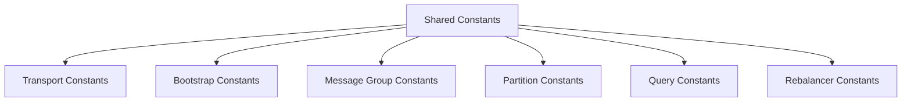

# Design Document: Codebase Constants Centralization

## Overview

This design centralizes all scalar literals (strings and numbers) into constants
so the system has a single source of truth for every value. Constants are split
into shared modules (used across subsystems) and per-system-part modules (owned
by a specific subsystem). Tooling enforces the rule so new literals cannot be
introduced without an explicit, documented override.

## Architecture



## Constants Layout

### Shared Constants Directory

Create a shared constants directory under `src/constants/` for values used by
multiple subsystems:

- `numbers.js` (NUM.ZERO, NUM.ONE, NUM.NEGATIVE_ONE)
- `time.js` (TIME_MS.HEARTBEAT_INTERVAL, TIME_MS.DELIVERY_TIMEOUT)
- `addresses.js` (ADDRESS.SEPARATOR, ENTITY_TYPE.PARTITION, ENTITY_TYPE.SERVICE)
- `tables.js` (TABLES.NODES, TABLES.SERVICES, TABLES.MESSAGE_GROUPS)
- `messages.js` (MESSAGE_TYPE.NODE_STATE_UPDATE, MESSAGE_TYPE.REPLICA_OP)
- `sql.js` (SQL.INSERT_REPLICA_OPERATION, SQL.UPDATE_SERVICE_ROLE)
- `errors.js` (ERRORS.NO_LEADER_AVAILABLE, ERRORS.INVALID_ADDRESS_FORMAT)
- `logging.js` (LOG_MSG.BOOTSTRAP_STARTED, LOG_MSG.CACHE_HYDRATED)
- `index.js` (aggregator re-export)

### Per-System-Part Constants

Each subsystem under `src/` owns a constants module for local values:

- `src/transport/constants.js`
- `src/bootstrap/constants.js`
- `src/message-group/constants.js`
- `src/partition/constants.js`
- `src/query/constants.js`
- `src/rebalancer/constants.js`
- `src/control-plane/constants.js`
- `src/node/constants.js`
- `src/cache/constants.js`
- `src/cdc/constants.js`
- `src/config/constants.js`
- `src/admin/constants.js`
- `src/cli/constants.js`
- `src/storage/constants.js`

Per-part constants may import shared constants, but shared modules must never
import per-part modules to avoid cycles. The aggregator is for discovery and
tooling, not for production imports.

## Naming Conventions

- Use `UPPER_SNAKE_CASE` for constant names.
- Encode units in numeric constant names (`_MS`, `_BYTES`, `_COUNT`).
- Group related constants under frozen objects (for example `TABLES`, `TIME_MS`,
  `MESSAGE_TYPE`).
- Prefer descriptive names over short aliases to avoid reintroducing ambiguity.

Example:

```js
export const TIME_MS = Object.freeze({
  HEARTBEAT_INTERVAL: 5000,
  DELIVERY_TIMEOUT: 8000,
});
```

## Literal Policy and Overrides

- Inline string and numeric literals are disallowed outside constant modules.
- Allowed inline strings are limited to module specifiers in `import`/`require`.
- A `literal-ok:` comment allows a narrowly scoped exception with justification.

Example:

```js
// literal-ok: array index is clearer than NUM.ZERO in this loop
for (let i = 0; i < list.length; i += NUM.ONE) {
  ...
}
```

## Enforcement Tooling

Implement a literal-check script or ESLint rule that walks the AST and reports
string or numeric literals in non-constant modules. The rule must:

- Ignore module specifiers.
- Allow literals inside `src/constants/**` and `**/constants.js`.
- Allow `literal-ok:` comments with justification.
- Fail CI if violations exist.

## Migration Strategy

1. Create shared and per-part constants modules.
2. For each subsystem, move literals into its constants module and update
   imports.
3. Remove duplicate values by reusing shared constants.
4. Update tests and scripts to use the same constants.
5. Enable the literal enforcement rule after each subsystem is migrated.

## Risks and Mitigations

- **Large diff surface**: Migrate per subsystem to keep reviews manageable.
- **Import cycles**: Keep shared constants free of per-part imports.
- **Readability**: Use descriptive names and allow `literal-ok` when needed.
