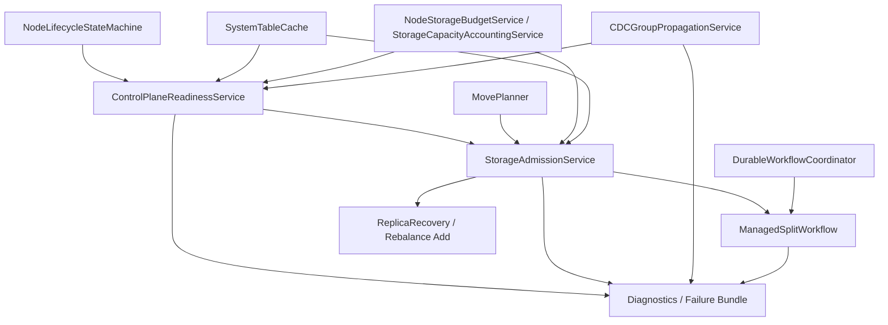

# Design Document: Control-Plane Admission and Partition-Split Reliability

## Overview

This design defines a target architecture for the control-plane path that
decides whether topology-changing workflows may proceed and how those decisions
are surfaced to operators and tests.

The design centers on five outcomes:

1. Separate control-plane readiness from generic node liveness
2. Expand `StorageAdmissionService` into the single provisioning admission owner
3. Make blocked split admission a durable workflow outcome
4. Make metadata publication mode explicit and reusable
5. Standardize timeout budgets and exact-boundary failure classification

The design is intentionally broader than managed partition split. The point is
to make the whole control-plane area easier to reason about, not just patch one
workflow.

## Architecture



## Components and Interfaces

### ControlPlaneReadinessService

`ControlPlaneReadinessService` becomes the single owner for multi-dimensional
readiness classification.

#### Responsibilities

1. Read canonical owner state from lifecycle, cache, publication, and storage
   owners
2. Compute separate readiness dimensions instead of one coarse ready/not-ready
   flag
3. Produce stable reason codes for non-ready dimensions
4. Expose machine-readable readiness snapshots for diagnostics and admission

#### Output Shape

```javascript
{
  nodeId: 'node-1',
  dimensions: {
    processAlive: true,
    clusterMemberHealthy: true,
    routingReady: true,
    loadReady: true,
    placementEligible: false,
    controlPlaneWritable: false,
    metadataPublicationHealthy: true,
  },
  reasons: [
    {
      code: 'control_plane_write_unhealthy',
      dimension: 'controlPlaneWritable',
      sourceOwner: 'AuthoritativeMutationHelper',
      observedAt: '2026-03-04T19:35:12.442Z',
    },
  ],
}
```

#### Ownership Boundaries

`ControlPlaneReadinessService` does not:

1. perform placement planning
2. execute workflows
3. own metadata publication policy
4. mutate canonical owner state directly

It only reads from canonical owners and publishes a normalized readiness model.

### StorageAdmissionService Expansion

`StorageAdmissionService` already exists as the admission owner for
ADD/REPLACE/SPLIT capacity increases. This design extends that owner rather
than introducing a parallel admission service.

#### Responsibilities

1. Consume readiness output from `ControlPlaneReadinessService`
2. Consume capacity/accounting state from storage owners
3. Consume placement constraints from `MovePlanner` and `TablePolicyService`
4. Decide whether a topology-changing workflow may safely provision replicas
5. Return one structured admission result

#### Admission Result Shape

```javascript
{
  allowed: false,
  decisionType: 'blocked',
  operationType: 'partition_split',
  requiredReplicaCount: 2,
  eligibleNodeIds: ['node-2'],
  ineligibleNodes: [
    {
      nodeId: 'node-3',
      failedDimensions: ['placementEligible', 'controlPlaneWritable'],
      reasonCodes: [
        'insufficient_placement_eligible_nodes',
        'control_plane_write_unhealthy',
      ],
    },
  ],
  blockingReasons: [
    'insufficient_placement_eligible_nodes',
  ],
  decisionTimestamp: '2026-03-04T19:35:12.442Z',
}
```

#### Required Reason Codes

The owner must provide stable reason codes, including:

1. `insufficient_placement_eligible_nodes`
2. `storage_budget_exhausted`
3. `metadata_publication_degraded`
4. `control_plane_write_unhealthy`
5. `owner_row_visibility_unhealthy`
6. `source_quorum_not_routable`
7. `policy_constraint_unsatisfied`

### ManagedSplitWorkflow Integration

`ManagedSplitWorkflow` remains the owner of managed split orchestration, but it
stops computing its own target eligibility model.

#### New Split Lifecycle

1. `candidate_detected`
2. `admission_pending`
3. `blocked` or `deferred`
4. `admitted`
5. `child_partitions_provisioning`
6. `child_partitions_bootstrapped`
7. `backfill_active`
8. `catchup_active`
9. `cutover_ready`
10. `cutover_committed`
11. `source_retiring`
12. `completed`

#### Required Behavior

1. Admission denial is persisted in durable workflow state
2. Admission denial does not masquerade as an execution failure
3. Admission results are stored in compact workflow metadata for diagnostics
4. Re-evaluation of blocked/deferred splits is idempotent

### Metadata Publication Mode

`CDCGroupPropagationService` remains the canonical owner for metadata
publication mode and degradation policy.

#### Publication Modes

1. `grouped`
2. `conservative_fanout`
3. `repair_only`

#### Required Output

```javascript
{
  currentMode: 'conservative_fanout',
  reasonCode: 'grouped_delivery_failure',
  enteredAt: '2026-03-04T19:34:57.110Z',
  recentTransitions: [
    {
      from: 'grouped',
      to: 'conservative_fanout',
      reasonCode: 'grouped_delivery_failure',
      changedAt: '2026-03-04T19:34:57.110Z',
    },
  ],
}
```

Callers do not select modes. They only observe the canonical owner output.

### Timeout Budget Contract

The system introduces one canonical timeout-budget model for control-plane
operations.

#### Rules

1. Each top-level operation starts with one total budget
2. Nested operations consume remaining budget, not fresh constants
3. Each sub-operation has a minimum viable starting budget
4. Deadline-exhaustion reasons are structured and stable
5. Exact-boundary failures are preserved as diagnostics signals

#### Timeout Classification Shape

```javascript
{
  operationId: 'op-123',
  classification: 'absolute_deadline_exhausted',
  configuredBudgetMs: 30000,
  remainingBudgetMs: 0,
  boundaryHit: true,
  nestedOperation: 'system_table_visibility_wait',
}
```

## Data Flow

### Split Admission Flow

1. `PartitionSplitMergeManager` detects a candidate
2. `ManagedSplitWorkflow` enters `admission_pending`
3. `ManagedSplitWorkflow` requests admission from `StorageAdmissionService`
4. `StorageAdmissionService` consumes:
   - readiness from `ControlPlaneReadinessService`
   - capacity/accounting state
   - policy/planner constraints
   - canonical cache state
5. `StorageAdmissionService` returns `admitted`, `blocked`, or `deferred`
6. `ManagedSplitWorkflow` persists that result through
   `DurableWorkflowCoordinator`
7. Diagnostics and failure bundles read the persisted admission state

### Readiness and Publication Flow

1. Canonical owners publish their state
2. `ControlPlaneReadinessService` projects it into per-node readiness vectors
3. `StorageAdmissionService` consumes those vectors
4. Diagnostics surfaces consume the same vectors without recomputing them

## Diagnostics Surface

The design requires one structured diagnostics surface that can be included in
reports and failure bundles.

### Required Sections

1. Per-node readiness vector
2. Per-node placement eligibility explanation
3. Current publication mode and recent transitions
4. Admission decision for each affected workflow
5. Timeout-budget failure classification

### Failure Bundle Requirements

The bundle must explain:

1. whether the split was never admitted
2. why nodes were ineligible
3. whether metadata publication was degraded
4. whether the failure involved exact-boundary timeouts

## Migration Strategy

### Phase 1: Readiness Owner

Introduce `ControlPlaneReadinessService` and route diagnostics through it.

### Phase 2: Admission Expansion

Expand `StorageAdmissionService` to consume readiness and return structured
provisioning decisions.

### Phase 3: Split Workflow Adoption

Remove split-local eligibility checks and route `ManagedSplitWorkflow` through
the admission owner.

### Phase 4: Shared Adoption

Adopt the same admission owner for replacement replica and rebalance-add
workflows.

### Phase 5: Timeout Contract

Introduce the canonical timeout-budget contract and migrate exact-boundary-prone
control-plane paths to it.

## Industry Reference Patterns

This design follows patterns commonly used in mature distributed systems:

1. Readiness/health projection is separate from placement admission
2. Placement admission is separate from the workflow that moves data
3. Online split/reshard is a staged workflow with blocked/deferred states
4. Metadata publication has one owner with explicit degraded modes

Reference material:

1. CockroachDB distribution layer:
   https://www.cockroachlabs.com/docs/stable/architecture/distribution-layer
2. YugabyteDB tablet splitting:
   https://docs.yugabyte.com/preview/architecture/docdb-sharding/tablet-splitting/
3. Vitess resharding:
   https://vitess.io/docs/22.0/user-guides/configuration-advanced/resharding/

## Risks and Mitigations

### Risk 1: Another Parallel Admission Layer

Mitigation:
Expand `StorageAdmissionService` instead of creating a second admission owner.

### Risk 2: Diagnostics Re-Derive State

Mitigation:
Require diagnostics to consume `ControlPlaneReadinessService`,
`StorageAdmissionService`, and workflow metadata directly.

### Risk 3: Split Workflow Keeps Local Eligibility Logic

Mitigation:
Add owner-path tests proving split consumes admission from the canonical owner.

### Risk 4: Timeout Contract Becomes Documentation Only

Mitigation:
Require targeted regression tests for exact-boundary failures and require
callers to classify deadline exhaustion through the shared contract.
