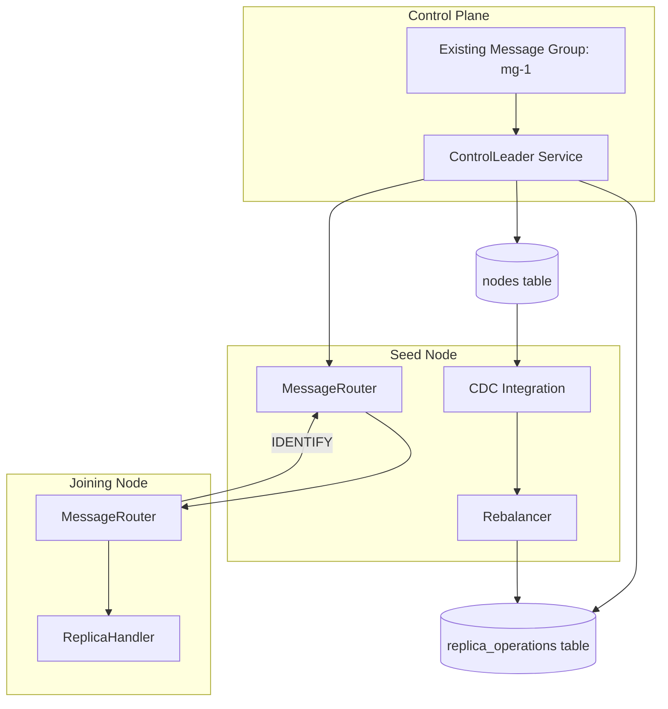
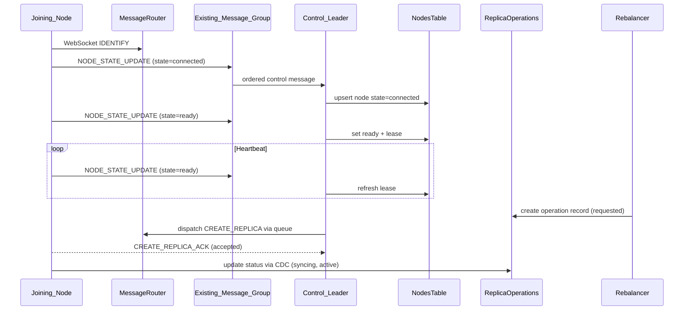

# Design Document: Control Plane Communication Simplification

## Overview

This design retains message groups and WebSockets but simplifies the
communication architecture by centralizing control plane actions on the leader
of the existing message group (no new message group type is introduced).
Registration, readiness, heartbeats, and replica operation dispatch are ordered
through that existing message group stream, while all state is stored in system
tables and disseminated by CDC. All system table writes follow a single SQL ->
partition -> CDC -> cache path, and write routing uses services.raft_role as
the sole leader source. Reads may use any replica because replicas converge to
the same state. A per-node outbound queue provides backpressure for remote
deliveries, and replica operations are tracked via durable job records with a
single execution path.

## Architecture



## Control Plane Message Flow



## Components and Interfaces

### ControlPlaneService

- Runs only on the existing message-group leader (Control_Leader role).
- Handles ordered control messages:
  - `NODE_STATE_UPDATE`
  - `REPLICA_OPERATION_DISPATCH`
- Writes state to system tables (nodes and replica_operations).
- Performs periodic lease expiry checks and updates node readiness.

### MessageRouter

- Maintains WebSocket connection map (IDENTIFY only).
- Provides `enqueueDeliver` / `deliverWithAck` through an Outbound_Node_Queue.
- Enforces per-node concurrency and cancels pending work on disconnect.

### NodeJoiningService

- Uses HTTP only for bootstrap info.
- Establishes WebSocket and sends `NODE_STATE_UPDATE` (state=connected) through
  the existing message group.
- Sends `NODE_STATE_UPDATE` (state=ready) after lifecycle manager init and
  leadership.
- Sends periodic `NODE_STATE_UPDATE` (state=ready) once ready.

### Rebalancer

- Writes Replica_Operation_Records to the system table.
- Never dispatches operations directly; dispatch is done by the Control_Leader.
- Filters ready nodes based on readiness lease in the nodes table.

### ReplicaHandler

- Sole execution path for CREATE and REMOVE operations.
- Updates replica_operations status via CDC.
- Uses operation_id for idempotency.

## Data Models

### Nodes Table Additions

```sql
ALTER TABLE nodes
  ADD COLUMN ready_lease_expires_at INTEGER;
-- Use existing last_heartbeat column for heartbeat timestamps.
```

### Replica Operations Table (required fields)

```text
operation_id (primary key)
operation_type (create|remove)
partition_id
replica_id
target_node_id
status (requested|accepted|syncing|active|removed|failed)
requested_at
updated_at
error_message
```

## Algorithms

### Lease Refresh

```text
onHeartbeat(nodeId, now):
  update nodes set
    last_heartbeat = now,
    ready_lease_expires_at = now + lease_ms
  where node_id = nodeId
```

### Lease Expiry Sweep

```text
periodic sweep:
  for each node where ready_lease_expires_at <= now:
    set ws_connection_state = disconnected
```

### Operation Dispatch

```text
onReplicaOperationRecord(record):
  if record.status != requested: return
  if node not ready: return
  enqueue deliver CREATE/REMOVE to target node
  on ack: update status = accepted
```

### Outbound Queue

```text
enqueue(nodeId, delivery):
  push to per-node queue
  run at most N in-flight per node
  fail pending items on disconnect
```

## Correctness Properties

### Property 1: Single Control Plane Path

For any control action (registration, readiness, heartbeat, dispatch), the
processing occurs only on the Control_Leader and results in a single system
table update.

### Property 2: No Operations to Unready Nodes

For any replica operation dispatch, the target node passes readiness lease
checks before a CREATE/REMOVE message is sent.

### Property 3: Durable Operation Status

For any operation, status transitions are recorded in the replica_operations
system table and observed by CDC.

### Property 4: Bounded Delivery Concurrency

For any node, outbound deliveries never exceed the configured per-node
concurrency limit.

### Property 5: Single Write Leader Source

For any system table write, routing uses services.raft_role as the sole leader
source and does not consult partitions.leader_node_id.
