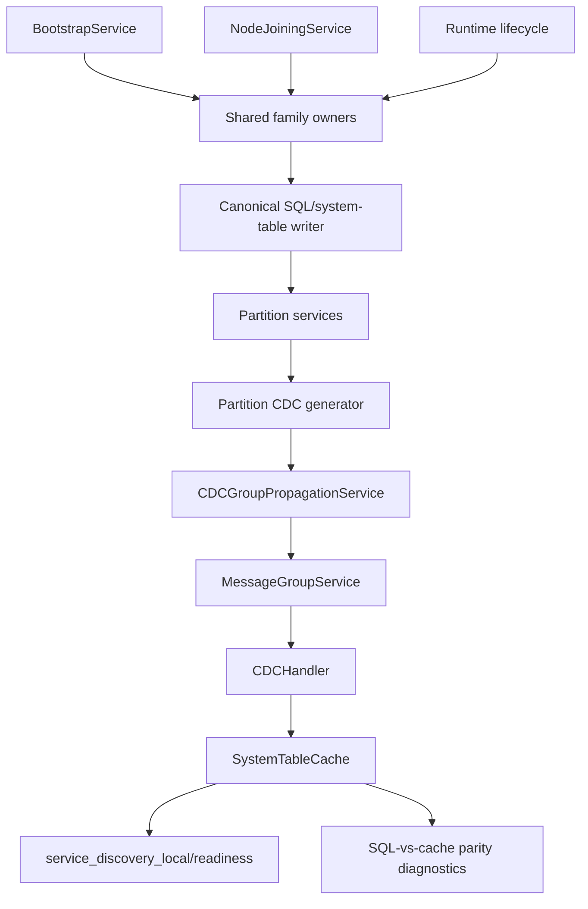

# Design Document: Control-Plane Metadata Ownership Closure

## Overview

This design removes control-plane metadata deviations from the system
guidelines by enforcing one owner model across bootstrap, join, runtime,
propagation, cache application, and discovery/readiness observation.

The design is driven by concrete failures already observed:

1. control-plane rows in local SQL can exist while the same rows are missing
   from local `SystemTableCache`
2. later-created topology metadata can converge differently from bootstrap-time
   metadata
3. safe CDC propagation can claim success without actual remote target
   resolution
4. startup/join code still contains ad hoc direct-cache or pre-subscription
   exceptions
5. readiness diagnostics can infer `sys-postgres-wire` status from the wrong
   table family

The target architecture is strict:

1. one row owner per control-plane table family
2. one propagation owner for all CDC-propagated control-plane events
3. one cache-application owner
4. one generic pre-subscription cache handoff
5. one authoritative read model per readiness/discovery concern

## Goals

1. Remove bootstrap/join/runtime divergence for control-plane metadata writes.
2. Eliminate ad hoc table-specific CDC subscription and propagation behavior
   within the same architectural area.
3. Make `SystemTableCache` convergence a first-class invariant rather than an
   assumed side effect.
4. Make discovery and preload diagnostics truthfully report which authoritative
   control-plane rows are present or missing.
5. Encode enough owner precision that future bypasses become obvious and
   test-detectable.

## Non-Goals

1. Redesigning non-control-plane user-table data routing.
2. Introducing new long-lived local caches beyond the authoritative
   `SystemTableCache`.
3. Adding fallback feature flags that keep old and new ownership paths active
   in parallel.
4. Converting cache-backed discovery into SQL-backed discovery at runtime.

## Decision Summary

| Decision ID | Decision |
| --- | --- |
| D1 | Control-plane tables are managed by family-level owners, not by scattered service methods. |
| D2 | `CDCGroupPropagationService` is the single propagation owner for control-plane CDC fanout. |
| D3 | `CDCHandler` remains the single cache-application owner for propagated control-plane rows. |
| D4 | Pre-subscription correctness is handled by one generic cache handoff, not table-specific direct-cache exceptions. |
| D5 | `sys-postgres-wire` discovery is derived from `service_definitions` + `service_endpoints`, not `services`. |
| D6 | Propagation success requires preserved event metadata and real remote target resolution where applicable. |
| D7 | SQL-vs-cache parity is a required diagnostic and test surface for control-plane metadata. |
| D8 | Exceptions must be documented in the owner matrix and removed by explicit migration tasks. |

## Affected Table Families and Target Owners

### Family A: Cluster Identity Metadata

Tables:

- `nodes`
- `node_endpoints`

Target owner model:

- Row creation owner: `NodeRegistrationOwner`
- Field owners:
  - node identity and readiness fields: `NodeRegistrationOwner` /
    `NodeLifecycleStateMachine`
  - endpoint identity and transport status fields: `NodeEndpointRegistry`
- Forbidden writers:
  - direct ad hoc bootstrap/join SQL helpers outside the shared owner
  - cache-derived repair logic

### Family B: Service Catalog Metadata

Tables:

- `service_definitions`
- `service_endpoints`

Target owner model:

- Row creation owner: `ServiceCatalogOwner`
- Field owners:
  - definition identity/profile/runtime fields: `ServiceDefinitionRegistry`
  - endpoint identity/health/runtime metadata fields:
    `ServiceEndpointRegistry` / `RuntimeEndpointWriter`
- Forbidden writers:
  - bootstrap-only registration helpers containing standalone ownership logic
  - readiness code that treats `services` as the authoritative source for
    `sys-postgres-wire`

### Family C: Replica Lifecycle Metadata

Tables:

- `services`

Target owner model:

- Row creation owner: `ReplicaStateMachine`
- Field owners:
  - identity fields: row creation owner only
  - lifecycle/status/progress/error fields: `ReplicaStateMachine`
  - consensus role fields (`raft_role`): consensus/partition role owner only
- Forbidden writers:
  - status updaters that implicitly insert missing rows
  - code that rewrites foreign-owned fields from stale cache reads

### Family D: Table Topology Metadata

Tables:

- `tables`
- `partitions`
- `replica_operations`

Target owner model:

- Row creation owner: `TableTopologyMetadataOwner`
- Field owners:
  - table identity/schema metadata: `TableTopologyMetadataOwner`
  - partition topology rows: `TableTopologyMetadataOwner`
  - replica operation lifecycle rows: `ReplicaOperationOwner`
- Forbidden writers:
  - benchmark-specific or table-specific registration paths
  - later-created-table logic that bypasses the family owner

## Canonical Owner Matrix

| Table family | Row creation owner | Field owners | Propagated | Read-model consumers |
| --- | --- | --- | --- | --- |
| `nodes`, `node_endpoints` | `NodeRegistrationOwner` | `NodeLifecycleStateMachine`, `NodeEndpointRegistry` | Yes | transport registry, cluster discovery |
| `service_definitions`, `service_endpoints` | `ServiceCatalogOwner` | `ServiceDefinitionRegistry`, `ServiceEndpointRegistry` | Yes | `service_discovery_local()`, admin readiness |
| `services` | `ReplicaStateMachine` | `ReplicaStateMachine`, consensus-role owner | Yes | topology readiness, routing, leadership views |
| `tables`, `partitions`, `replica_operations` | `TableTopologyMetadataOwner` | `TableTopologyMetadataOwner`, `ReplicaOperationOwner` | Yes | preload gate, routing, table readiness |

This matrix must be copied into steering documentation and referenced by tests.

## Target Architecture

## Detailed Design

### 1. Shared Family Owners Replace Scattered Row Logic

Each affected table family gets one shared owner boundary used by bootstrap,
join, and runtime code.

#### 1.1 Node and endpoint registration

Current problem:

- node and endpoint registration is split between bootstrap/join service logic
  and other control-plane code

Target:

- `NodeRegistrationOwner` owns row creation for `nodes`
- `NodeEndpointRegistry` owns row creation and mutation for `node_endpoints`
- bootstrap and joining flows delegate only

#### 1.2 Service catalog registration

Current problem:

- built-in meta service definitions/endpoints are registered through helper code
  that behaves like an owner but is still scoped as bootstrap/join utility

Target:

- `ServiceCatalogOwner` is the family-level owner
- `registerBuiltInMetaServiceDefinitions` and
  `registerBuiltInMetaServiceEndpoints` become delegation adapters or are
  absorbed into the owner
- runtime endpoint writes also route through the same family contract

#### 1.3 Replica lifecycle

Current problem:

- `services` row creation and lifecycle mutation can be bypassed or partially
  reconstructed outside the state machine

Target:

- `ReplicaStateMachine` remains the canonical owner
- all `services` row creation and lifecycle mutation routes through it
- missing-row behavior fails closed instead of re-creating rows from partial
  state

#### 1.4 Table topology metadata

Current problem:

- later-created table metadata can behave differently from bootstrap-time
  topology rows

Target:

- one `TableTopologyMetadataOwner` handles `tables`, `partitions`, and
  `replica_operations`
- benchmark and non-benchmark tables use the same owner path

### 2. One Propagation Owner With Preserved Event Identity

Current problem:

- partition-origin events can lose authoritative metadata before propagation
- safe-mode fallback can report success with no resolved remote targets

Target:

- `CDCGroupPropagationService` owns all control-plane fanout
- propagation payload always preserves:
  - `tableName`
  - `operation`
  - `data`
  - `timestamp`
  - `causeId`
- success requires real delivery semantics

#### 2.1 Propagation invariants

1. local authoritative apply occurs exactly once
2. remote targets are resolved from authoritative topology rows
3. zero-target fallback is explicit failure or degraded-state reporting, never
   silent success
4. retry scheduling uses preserved event identity

### 3. One Cache-Application Owner Across All Modes

Current problem:

- immediate apply, replay, and startup exceptions can use different row shapes
  or different code paths

Target:

- `CDCHandler` remains the only component allowed to mutate
  `SystemTableCache` for propagated rows
- all paths use the same ordering, dedupe, and schema watermark semantics

#### 3.1 Generic pre-subscription cache handoff

This replaces ad hoc exceptions like direct cache seeding in join logic.

Behavior:

1. canonical owner issues the authoritative system-table write
2. if the table is in `CDC_PROPAGATED_TABLES` and local subscriptions are not
   yet active, the write is handed to a generic
   `PreSubscriptionCacheHandoffOwner`
3. the handoff invokes the same `CDCHandler` apply semantics used for normal
   CDC
4. once subscriptions are active, handoff is disabled and normal CDC is the
   only path

This keeps one rule for all propagated control-plane tables instead of one
special case per table.

### 4. Discovery and Readiness Read Models Use Authoritative Families

Current problem:

- `service_discovery_local()` depends on `SystemTableCache`, but some
  diagnostics infer pgwire presence from `services`, which is the wrong family

Target:

- service discovery and pgwire readiness use `service_definitions` +
  `service_endpoints`
- topology readiness uses `tables`, `partitions`, `services`, and
  `replica_operations`
- diagnostics never mix those families incorrectly

### 5. SQL-vs-Cache Parity Becomes a First-Class Invariant

Current problem:

- control-plane investigation currently requires manual ad hoc comparison of
  local SQL and local cache

Target:

- one reusable parity probe compares local SQL rows and local cache rows for
  all affected families
- distributed diagnostics include parity results automatically when preload,
  discovery, or admin readiness fails
- root-cause labeling prefers concrete mismatch evidence over generic timeout
  categories

#### 5.1 Parity result shape

For each table:

- expected row count
- cache row count
- SQL-only keys
- cache-only keys
- mismatched keys with differing fields
- latest cache watermark metadata

## Migration Plan

### Phase 1: Owner matrix and delegation closure

1. create family owners and field-ownership contracts
2. convert bootstrap/join helpers into delegation adapters
3. remove scattered write bodies

### Phase 2: propagation and cache-application closure

1. preserve `timestamp` and `causeId` through propagation
2. tighten zero-target fallback handling
3. add generic pre-subscription cache handoff
4. remove table-specific direct-cache exceptions

### Phase 3: read-model and diagnostics closure

1. fix discovery/readiness to read authoritative table families only
2. add generic SQL-vs-cache parity probes
3. update root-cause classification to consume parity signals

### Phase 4: enforcement and documentation

1. add contract/unit/integration/distributed tests
2. update steering docs with the owner matrix
3. add completion gates requiring production-path proof

## Risks and Mitigations

1. **Risk:** bootstrap/join regressions while consolidating owners.
   **Mitigation:** delegation-first migration and startup-path integration
   tests.
2. **Risk:** duplicate local cache mutation remains hidden.
   **Mitigation:** forbid non-owner cache writes and add targeted owner-path
   tests.
3. **Risk:** discovery logic still reads proxy tables.
   **Mitigation:** authoritative read-model tests for `sys-postgres-wire`.
4. **Risk:** later-created tables still diverge from bootstrap-time rows.
   **Mitigation:** family-level topology owner and post-create parity tests.
5. **Risk:** future exceptions creep back in.
   **Mitigation:** owner matrix in steering docs plus CI contract tests.

## Testing Strategy

### Unit and contract tests

1. owner delegation tests for bootstrap and join
2. field ownership tests for `services`, `service_endpoints`, and
   `node_endpoints`
3. propagation tests preserving `timestamp` and `causeId`
4. cache handoff tests proving no table-specific direct-cache exception is
   required

### Integration tests

1. bootstrap/join test proving `service_definitions` and `service_endpoints`
   converge into local cache on every node
2. later-created table test proving `tables`, `partitions`, and `services`
   converge identically across nodes
3. parity tests proving local SQL and local cache agree after startup and after
   later topology changes

### Distributed tests

1. `diag-admin-discovery` style parity diagnostics for control-plane families
2. baseline preload/admin-ready scenarios using the new parity bundle
3. regression tests for zero-target propagation failure and pre-subscription
   cache handoff behavior

## Documentation Impact

The following steering docs must be updated to match implementation:

1. `.kiro/steering/system guidelines.md`
2. `.kiro/steering/testing-guidelines.md`
3. `.kiro/steering/architecture.md`

They must all reference the same control-plane owner matrix and the same
generic rules:

1. one owner per row family
2. one owner per field subset
3. one propagation owner
4. one cache-application owner
5. no undocumented startup/join cache exceptions
