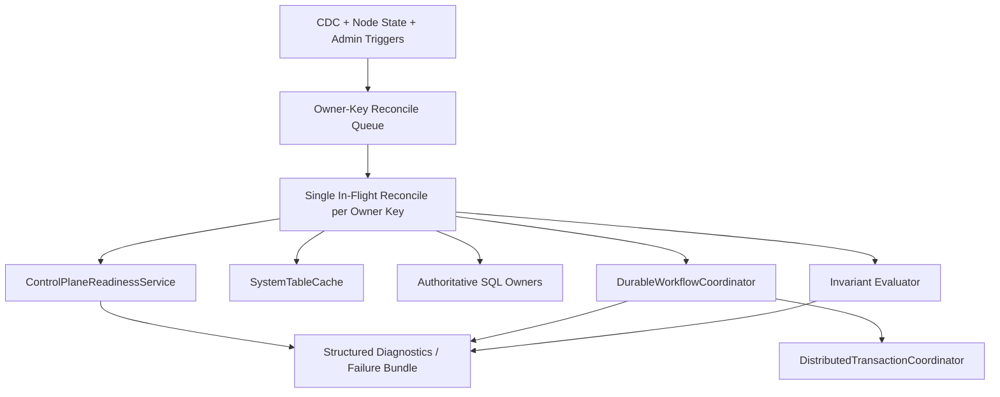

# Design Document: Control-Plane Predictability and Determinism

## Overview

This design defines a control-plane architecture that remains deterministic
under node churn, degraded propagation, and high operation overlap.

The primary goal is not just to pass a harness run. The goal is to remove
surprise behavior by making progression ownership, workflow transitions, read
contracts, timeout semantics, and invariants explicit and shared.

This design reuses existing building blocks where possible:

1. `DurableWorkflowCoordinator` for durable step progression
2. `DistributedTransactionCoordinator` for atomic multi-row transitions
3. `SystemTableCache` as the steady-state read model for CDC-propagated
   metadata
4. `ControlPlaneReadinessService` as canonical readiness projection

## Design Goals

1. One progression owner path per control-plane concern
2. One durable monotonic workflow model for topology-changing operations
3. One read-model contract per decision (no cache/SQL fallback blends)
4. One timeout-budget contract with typed timeout classifications
5. One invariant surface that fails fast when ownership contracts are violated

## Non-Goals

1. Introduce special-case degraded-mode logic paths
2. Preserve indefinite dual owner paths
3. Depend on full 7-node harness runs for first-line bug reproduction

## Target Architecture

## Core Design Decisions

### 1. Owner-Key Reconcile Queue as the Only Progression Entry

Each control-plane concern (dispatch, rebalance progression, split progression)
uses one owner-keyed reconcile queue.

Rules:

1. Events enqueue owner keys and reason codes.
2. Event handlers do not run long progression logic inline.
3. At most one reconcile execution is active per owner key.
4. Broad polling loops are restricted to explicit recovery sweeps with typed
   diagnostics.

### 2. Durable Monotonic Workflow State

All topology-changing operations use durable workflow steps with monotonic
transitions.

Rules:

1. Workflow transitions persist `previousStep`, `nextStep`, `reason`,
   `timestamp`, and `ownerKey`.
2. Transitions do not move backward except through explicit terminal recovery
   steps.
3. Split/rebalance/replace progression follows the same durable workflow
   contract.

### 3. Transactional Transition Commit

When a transition must atomically update multiple authoritative rows, the owner
path uses `DistributedTransactionCoordinator` rather than ad-hoc write ordering.

Rules:

1. Transition state and authoritative ownership rows commit in one transaction
   when atomicity is required.
2. The workflow transition is not considered committed until transaction commit
   succeeds.
3. Recovery replays are idempotent by operation id and step id.

### 4. Canonical Read-Model Contract

Each decision declares one read-model source of truth.

Rules:

1. CDC-propagated control-plane metadata decisions read from
   `SystemTableCache` in steady state.
2. SQL reads are limited to authoritative writes, explicit recovery sweeps, and
   diagnostics reconciliation.
3. A single decision path cannot mix cache and SQL fallback for equivalent
   semantics.
4. Cache/authoritative divergence is emitted as typed diagnostics, not hidden
   by silent fallback behavior.

### 5. Unified Readiness Input for Admission and Progression

`ControlPlaneReadinessService` remains the canonical readiness projection.

Rules:

1. Admission and progression owners consume the same readiness snapshot model.
2. Readiness dimensions and reason codes are stable and machine-readable.
3. Decisions persist the readiness snapshot id/version used at decision time.

### 6. Fencing for Stale Owner Self-Disqualification

All claim- and readiness-dependent transitions include fencing context.

Rules:

1. Claims persist owner epoch or lease token.
2. Reconcile execution validates fence before applying a transition.
3. Stale fences are rejected as typed events and surfaced in diagnostics.

### 7. Canonical Timeout-Budget Tree

Control-plane operations use one budget tree.

Rules:

1. Top-level operation starts one absolute budget.
2. Sub-operations derive from remaining budget only.
3. Sub-operations cannot start below minimum viable budget.
4. Timeouts are classified into stable categories:
   - `local_scheduler_starvation`
   - `remote_call_timeout`
   - `publication_wait_timeout`
   - `cache_visibility_timeout`
   - `absolute_deadline_exhausted`
5. Exact-boundary hits are hard correctness bugs and must emit structured data.

### 8. Always-On Invariants

Invariant evaluation runs continuously or at bounded checkpoints.

Required initial invariant set:

1. Canonical leader uniqueness by owner rows
2. Workflow step monotonicity
3. No orphan in-flight operation without owner key
4. Claim exclusivity by operation id and owner key
5. No dual active progression owners for same owner key

## Data Flow

### Standard Progression Flow

1. Trigger arrives (CDC/state/admin) and is normalized into an owner key event.
2. Owner key is enqueued.
3. Reconcile executor claims owner key and validates fence.
4. Executor reads canonical readiness and canonical decision read model.
5. Executor computes next step and commits transition durably.
6. Invariants execute at transition boundary.
7. Diagnostics snapshot is emitted with decision reason and timeout context.

### Recovery Sweep Flow

1. Recovery sweep scans for stale/incomplete operations by typed policy.
2. Sweep enqueues owner keys into the same reconcile queue.
3. The same owner reconcile path handles recovery work; no alternate mutation
   path exists.

## Diagnostics Model

Failure artifacts must include:

1. Reconcile queue state by owner key
2. Latest workflow transition history with reasons
3. Readiness snapshot used by each decision
4. Fence token validation failures
5. Timeout classification and budget snapshots
6. Invariant breach records (hard vs soft)

## Migration Plan

### Phase 1: Queue and Owner-Path Consolidation

1. Introduce owner-key reconcile queue where still missing.
2. Move event-triggered direct progression into enqueue-only handlers.
3. Leave recovery sweeps enabled but route through same queue.

Exit gate:

1. No direct long-running progression remains in event handlers.
2. Per-owner-key single in-flight contract is enforced by tests.

### Phase 2: Workflow + Transaction Unification

1. Migrate topology progression to explicit durable step transitions.
2. Use `DistributedTransactionCoordinator` for atomic step+row transitions.

Exit gate:

1. No ad-hoc multi-row progression commits remain in target paths.
2. Workflow transition history is complete and monotonic.

### Phase 3: Read-Model and Readiness Closure

1. Remove decision paths that mix cache and SQL fallback semantics.
2. Enforce canonical readiness snapshot consumption across owners.

Exit gate:

1. Each decision path declares one read-model contract.
2. Divergence events are typed and visible in diagnostics.

### Phase 4: Timeout and Invariant Enforcement

1. Convert target operations to canonical budget tree.
2. Enable hard invariant gate checks in deterministic test layers.

Exit gate:

1. Timeout classes are emitted for all control-plane timeout outcomes.
2. Hard invariant violations fail regression tests.

### Phase 5: Dual-Path Removal and Architecture Sync

1. Remove temporary migration toggles and duplicate logic.
2. Update `architecture.md` and steering docs with final owner map.

Exit gate:

1. No remaining dual progression paths for migrated concerns.
2. Documentation matches implementation owner boundaries.

## Risks and Mitigations

1. Risk: migration introduces temporary duplicate logic.
   Mitigation: each phase has explicit dual-path removal criteria.
2. Risk: added invariants create noisy failures.
   Mitigation: typed hard/soft severity and immediate deterministic regression.
3. Risk: transaction scope grows too broad.
   Mitigation: limit transactional boundary to authoritative state that must be
   atomically consistent for one workflow step.
