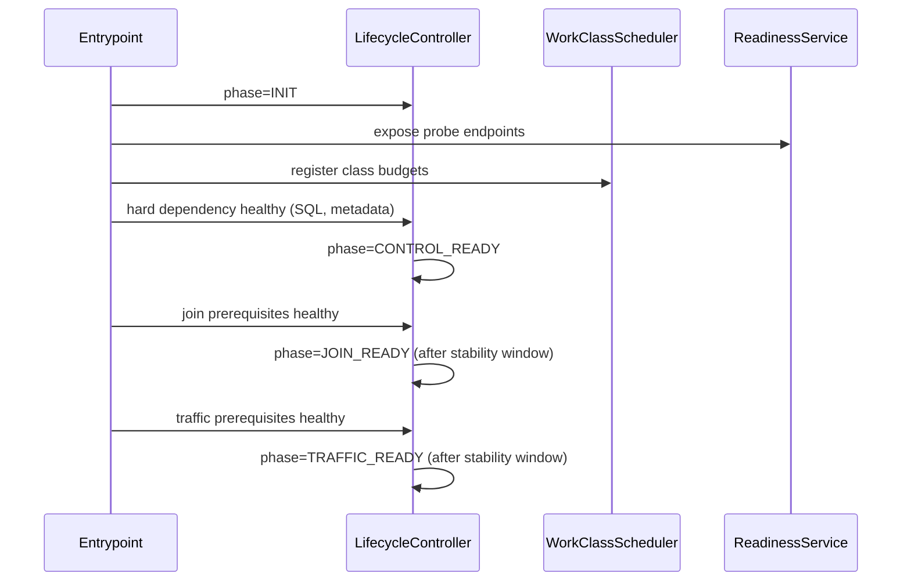
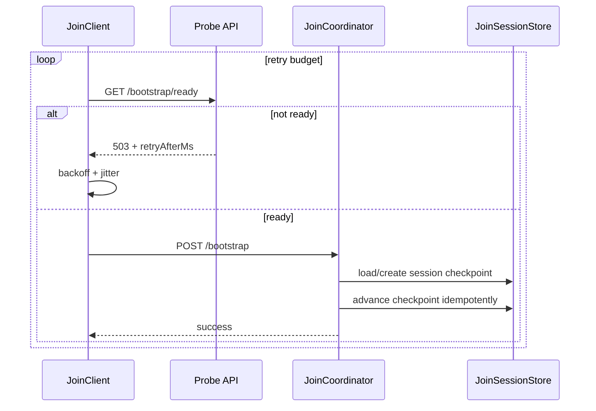

# Design Document: Control-Plane Readiness and Workload Isolation Hardening

## Overview

This design hardens startup and join behavior by separating critical
control-plane progression from non-critical background workload pressure.

The design introduces:

1. one lifecycle state owner,
2. explicit probe semantics,
3. workload-class scheduling with reserved capacity,
4. durable idempotent join sessions,
5. deterministic startup and shutdown sequencing.

## Goals

1. Make startup/join correctness independent from logs/CDC/observability load.
2. Ensure probe semantics are stable for Kubernetes and NGINX.
3. Make join retry/replay safe across transient failures and restarts.
4. Catch distributed failure modes in integration CI with deterministic tests.

## Non-Goals

1. No redesign of core partition placement algorithms.
2. No replacement of current SQL engine implementation.
3. No immediate removal of existing client bootstrap contracts.

## Design Principles

1. One owner per concern: lifecycle and readiness state have exactly one owner.
2. Critical path isolation: control-plane work has guaranteed capacity.
3. Monotonic clarity: probes expose explicit phase + reasons, not heuristics.
4. Retry safety: join is idempotent, checkpointed, and resumable.
5. Additive migration: roll out behind flags, then cut over fully.

## Architecture

### 1. Lifecycle Controller

Introduce `LifecycleController` as the single state owner.

Responsibilities:

1. Persist and expose current phase.
2. Validate and execute legal transitions.
3. Track blockers and degraded reasons.
4. Emit transition events and metrics.

Phases:

1. `INIT`
2. `CONTROL_READY`
3. `JOIN_READY`
4. `TRAFFIC_READY`
5. `DEGRADED`

Transition constraints:

1. Forward-only progression for normal startup.
2. `DEGRADED` can be entered from any ready phase with explicit reason.
3. Recovery from `DEGRADED` returns to the highest legal ready phase after
   blocker clearance and stability checks.

### 2. Probe Service Projection

Introduce `ReadinessService` backed exclusively by `LifecycleController`.

Endpoint mapping:

| Endpoint | Meaning | Success | Failure |
| --- | --- | --- | --- |
| `GET /livez` | Process alive | `200` | `5xx` |
| `GET /startupz` | Startup completed | `200` | `503` |
| `GET /readyz` | Traffic-safe | `200` | `503` |
| `GET /bootstrap/ready` | Join-safe probe | `200` | `503` |

Response shape:

```json
{
  "ready": false,
  "phase": "CONTROL_READY",
  "reasons": ["LEADER_METADATA_INCOMPLETE"],
  "retryAfterMs": 500,
  "timestamp": 1771749000000
}
```

Rules:

1. `GET /bootstrap/ready` is lightweight and non-mutating.
2. `POST /bootstrap` remains operational; not used for readiness probing.
3. `startupz` is monotonic after first success unless fatal process failure.

### 3. Dependency Classification

Introduce central dependency classifier in lifecycle domain:

1. Hard dependencies (block progression):
   - SQL/query-routing control-plane availability,
   - leader metadata required for join,
   - membership/lease prerequisites.
2. Soft dependencies (degrade only):
   - logs shipping backlog,
   - non-critical observability exporters,
   - optional background maintenance.

This classification is stored in constants and consumed only by
`LifecycleController`.

### 4. Work-Class Scheduler

Introduce `WorkClassScheduler` to isolate resources by workload criticality.

Classes:

1. `A` critical control-plane work.
2. `B` replication/data maintenance work.
3. `C` observability/background work.

Required behaviors:

1. Reserve execution slots and/or DB budget for class A.
2. Enforce fairness so class B progresses without starving class A.
3. Apply shedding/defer policy to class C under pressure.
4. Export queue depth and shed/defer counters by class.

Integration points:

1. Bootstrap/join operations are class A.
2. Replication maintenance remains class B.
3. `LogsTableService` flush and optional CDC fanout are class C.

### 5. Durable Join Coordinator

Introduce `JoinCoordinator` with `JoinSessionStore`.

Session model:

- Key: `node_id`, `session_id`
- Fields:
  - `phase`
  - `checkpoint`
  - `attempt_count`
  - `last_error_code`
  - `retry_after_ms`
  - `updated_at`

Join steps are explicit checkpoints:

1. `SESSION_CREATED`
2. `MEMBERSHIP_WRITTEN`
3. `LEASE_ASSIGNED`
4. `HANDSHAKE_COMPLETED`
5. `FINALIZED`

Retry behavior:

1. Replays restart from latest completed checkpoint.
2. Duplicate effects are prevented by checkpoint guards.
3. Non-retryable terminal errors persist terminal session status.

### 6. Startup and Shutdown Sequencing

Startup sequence:

1. Listener may start early.
2. Lifecycle remains `INIT`/not-ready until hard dependencies are healthy.
3. Promote to `CONTROL_READY`, then `JOIN_READY`, then `TRAFFIC_READY`.
4. Apply stability window before `JOIN_READY`/`TRAFFIC_READY` success.

Shutdown sequence:

1. Enter draining/degraded non-ready state immediately.
2. Stop accepting new join/traffic operations.
3. Perform lease handoff/release with deadline.
4. Exit after drain deadline or completion.

## Sequence Flows

### Startup



### Join with Retry and Resume



## API and Error Contract

`POST /bootstrap` not-ready response:

```json
{
  "success": false,
  "code": "BOOTSTRAP_NOT_READY",
  "phase": "CONTROL_READY",
  "reasons": ["LEADER_METADATA_INCOMPLETE"],
  "retryAfterMs": 500
}
```

Retry classification:

1. Retryable: timeout, `503`, explicit not-ready codes.
2. Terminal: validation errors, conflict classes requiring human/action change.

## Kubernetes and NGINX Profile

Kubernetes mapping:

1. `startupProbe -> /startupz`
2. `readinessProbe -> /readyz`
3. `livenessProbe -> /livez`

Initial baseline values for rollout:

1. `periodSeconds: 2`
2. `timeoutSeconds: 1`
3. `startupProbe.failureThreshold: 60`
4. `readinessProbe.failureThreshold: 3`
5. `livenessProbe.failureThreshold: 5`

NGINX guidance:

1. Use `/readyz` for upstream health checks.
2. Retry readiness probes, not `POST /bootstrap`, for startup unready responses.
3. Preserve idempotency expectations when retrying bootstrap operations.

## Observability

Emit and store:

1. lifecycle transition events (`from`, `to`, `reasons`, `timestamp`),
2. phase duration and blocked duration by reason,
3. probe response counters by endpoint and status class,
4. work-class queue depth and shed/defer counters,
5. join session retry/resume counters.

## Rollout Strategy

Feature flags:

1. `lifecycleControllerEnabled`
2. `probeFromLifecycleEnabled`
3. `workClassSchedulerEnabled`
4. `durableJoinSessionsEnabled`

Phased rollout:

1. Enable lifecycle controller shadow mode and compare diagnostics.
2. Cut probes to lifecycle source.
3. Enable scheduler with class-A reservation and class-C shedding.
4. Enable durable join sessions.
5. Remove legacy readiness logic after parity soak.

Rollback triggers:

1. `JOIN_READY` P95 regression beyond SLO threshold.
2. Increased bootstrap terminal error rate.
3. Probe flapping above configured tolerance.

## Testing Strategy

1. Unit tests for lifecycle transitions and dependency classification.
2. Unit tests for scheduler fairness and class-C shedding.
3. Unit tests for join checkpoint idempotency and restart resume.
4. Integration tests with real listener + HTTP join under load.
5. Integration fault tests for SQL delay, metadata lag, class-C saturation.
6. Distributed harness gates using lightweight readiness probe.

## Files Expected to Change

Primary:

1. `src/bootstrap/bootstrap-service.js`
2. `src/bootstrap/bootstrap-api.js`
3. `src/bootstrap/node-joining-service.js`
4. `src/index.js`
5. `src/logging/logs-table-service.js`

New modules (expected):

1. `src/bootstrap/lifecycle-controller.js`
2. `src/bootstrap/readiness-service.js`
3. `src/bootstrap/join-coordinator.js`
4. `src/runtime/work-class-scheduler.js`
5. `src/bootstrap/join-session-store.js`

Tests:

1. `test/bootstrap/bootstrap-api.test.js`
2. `test/bootstrap/node-joining-service.test.js`
3. `test/integration/node-join-convergence-slo.integration.test.js`
4. `test/distributed/harness/__tests__/cluster.test.js`
