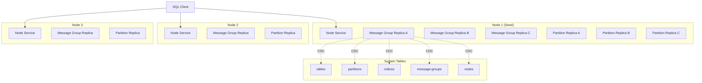

# Architecture



## Core Principles

1. **Universal Partition Architecture**: ALL tables (system tables and user tables) are implemented as partitions with odd-numbered Raft replicas (minimum 3)
2. **Fully Autonomous Management**: The system makes ALL replica placement and count decisions - no manual operator control
3. **Self-Describing**: All system metadata is stored within the database itself using the same infrastructure as user data
4. **Consensus-Based**: Both data storage and messaging use Raft for consistency
5. **Horizontally Scalable**: Add nodes to increase capacity and fault tolerance
6. **Policy-Driven**: Configurable policies control partition behavior and replica placement decisions
7. **One Way**: Each functionality has exactly one implementation - no fallbacks, no alternatives
8. **Best-of-Breed Libraries**: Leverage proven, mature libraries rather than building custom solutions
9. **Unified Rebalancing**: Same rebalancing logic for partitions and message groups, driven by policies
10. **System Cache as Single Source of Truth**: All nodes maintain an in-memory cache of system tables, synchronized via CDC

## System Cache Seeding Architecture

### Overview

The system cache is the single source of truth for cluster metadata on every node. All nodes maintain an in-memory cache of system tables that is kept synchronized through Change Data Capture (CDC) events. This architecture eliminates the need for bootstrap directories and ensures consistent query routing across all nodes.

### System Tables

The following system tables store cluster metadata:

| Table | Purpose | Key Information |
|-------|---------|-----------------|
| **nodes** | Node registry | Node IDs, addresses, status |
| **partitions** | Partition metadata | Partition IDs, key ranges, table assignments |
| **services** | Service registry | Partition/message group replicas, addresses, Raft roles |
| **tables** | Table metadata | Table schemas, policies |
| **message_groups** | Message group metadata | Message group IDs, replica counts |
| **replica_operations** | Rebalancing operations | Pending splits, merges, replica moves |

### Bootstrap Process

#### Seed Node Bootstrap

The seed node faces a chicken-and-egg problem: it needs to write to system tables to populate the cache, but SQL routing requires the cache to find partition leaders. The solution is a temporary **bootstrap mode** with direct write capability.

**Bootstrap Phases:**

1. **Infrastructure Phase**
   - Create node service
   - Initialize message router

2. **Message Groups Phase**
   - Create message group replicas

3. **Partitions Phase**
   - Create partition services for system tables
   - Partitions are local but cache is empty

4. **Registration Phase (Bootstrap Mode)**
   - **Enable bootstrap mode** with reference to local partition services
   - Write initial data **directly** to local partitions (bypassing SQL routing)
   - Register message groups, services, tables, and partitions
   - **Disable bootstrap mode** immediately after writes complete

5. **Cache Hydration Phase**
   - Read all system table data from local partitions
   - Populate system cache with complete cluster state
   - Cache now ready for normal SQL routing

6. **Post-Bootstrap**
   - All writes route through SQL engine
   - SQL engine uses system cache to find partition leaders
   - Single code path, no fallbacks

**Bootstrap Mode Characteristics:**

- **Temporary**: Only active during seed node registration phase
- **Direct Writes**: Bypass SQL routing, write directly to local partition services
- **Single Use**: Disabled immediately after registration completes
- **Seed Node Only**: Joining nodes never use bootstrap mode
- **No Legacy Code**: Cleanly removed after use, no fallback mechanisms

#### Joining Node Bootstrap

Joining nodes receive complete system table snapshots from the seed node and hydrate their cache immediately.

**Bootstrap Phases:**

1. **HTTP Bootstrap Request**
   - Contact seed node via `/bootstrap` endpoint
   - Receive bootstrap response with complete system table snapshots

2. **Cache Hydration**
   - Extract system table snapshots from bootstrap response
   - Insert all records into local system cache
   - Cache now contains complete cluster state

3. **CDC Subscription**
   - Subscribe to CDC events for all system tables
   - Cache will be updated as cluster state changes

4. **Node Registration**
   - Register self in nodes table using SQL query
   - Query routes through system cache to partition leader
   - CDC event propagates to all nodes

5. **Ready**
   - Node is ready to serve queries
   - All queries route through system cache

### Query Routing

All SQL queries route through the system cache to find partition leaders:

**Query Flow:**

```
SQL Query (SELECT/INSERT/UPDATE/DELETE)
  ↓
1. Parse SQL → Determine target table and operation
  ↓
2. System Cache → Find partitions for table
  ↓
3. Partition Resolver → Determine which partition(s) to query
  ↓
4. System Cache → Find partition leader address from services table
  ↓
5. Message Router → Deliver query to leader address
  ↓
6. Return Results → Aggregate results from all queried partitions
```

**Example:**

```
SELECT * FROM users WHERE user_id = 123
  ↓
System Cache: partitions table → Find partitions for 'users'
  ↓
Partition Resolver: Determine partition for key 123 → partition_id = 'p1'
  ↓
System Cache: services table → Find leader for 'p1' → address = 'node2/partition/r1'
  ↓
Message Router: Deliver query to 'node2/partition/r1'
  ↓
Return results
```

**Key Points:**

- **No Bootstrap Directories**: System cache is the only source of partition information
- **Consistent Routing**: All nodes use the same cache-based routing logic
- **Leader Preference**: System table queries prefer partition leaders for consistency
- **Clear Errors**: Queries fail with explicit errors if cache is missing data

### CDC Synchronization

Change Data Capture keeps the system cache synchronized across all nodes:

**CDC Flow:**

```
Node A: INSERT INTO nodes (node_id, address, ...) VALUES (...)
  ↓
Partition Leader: Write to SQLite storage
  ↓
CDC Service: Generate change event
  ↓
Message Group: Broadcast event to all nodes
  ↓
All Nodes: Receive CDC event
  ↓
All Nodes: Update local system cache
  ↓
All Nodes: Can now route queries to new node
```

**CDC Event Types:**

- **INSERT**: New record added to system table
- **UPDATE**: Existing record modified
- **DELETE**: Record removed from system table

**Eventual Consistency:**

- All nodes eventually have the same view of system tables
- CDC events propagate within milliseconds
- Queries may briefly route to stale information during propagation
- Raft consensus ensures writes are consistent

### Bootstrap Response Structure

The bootstrap response contains complete snapshots of all system tables:

```javascript
{
  success: true,
  seedNodeId: 'node-1',
  seedNodeAddress: 'http://node-1:8080',
  seedNodeWsAddress: 'ws://node-1:8081',
  messageGroupAssignment: {...},
  
  // Complete system table snapshots
  systemTableSnapshots: {
    nodes: [{node_id: '...', address: '...', status: '...', ...}],
    partitions: [{partition_id: '...', table_name: '...', ...}],
    services: [{service_id: '...', address: '...', raft_role: '...', ...}],
    tables: [{table_id: '...', table_name: '...', schema: {...}, ...}],
    message_groups: [{message_group_id: '...', replica_count: 3, ...}],
    replica_operations: [{operation_id: '...', operation_type: '...', ...}],
  },
  
  readyNodes: ['node-1'],
  tablePolicies: {...},
  currentEpoch: {...},
  clusterConfig: {...},
  timestamp: 1234567890,
}
```

### Architecture Benefits

1. **Single Source of Truth**: System cache is the only source of cluster metadata
2. **No Bootstrap Directories**: Eliminates temporary workarounds and fallback mechanisms
3. **Consistent Routing**: All nodes use the same cache-based routing logic
4. **Automatic Synchronization**: CDC keeps all nodes up-to-date
5. **Fast Bootstrap**: Joining nodes receive complete state in one HTTP request
6. **Clear Error Handling**: Explicit errors when cache is missing data
7. **Single Code Path**: No legacy code or fallback mechanisms
