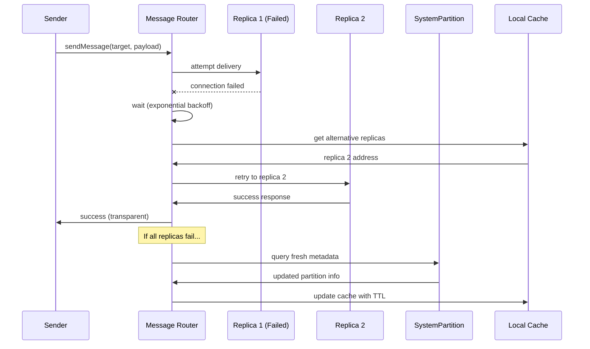

# Simplified Retry Protocol

The system uses a simplified retry protocol with exponential backoff instead of complex redirect handling.

## Design Philosophy

- **Simple Retry**: On failure, retry with exponential backoff
- **Client-Side Load Balancing**: Try different replicas from partition metadata
- **No Redirect Responses**: Services simply fail requests they can't handle
- **Direct System Queries**: On repeated failures, query system partition for fresh metadata

## Retry Strategy

**Exponential Backoff Configuration:**
```javascript
const retryConfig = {
  maxRetries: 3,
  initialDelayMs: 100,
  maxDelayMs: 2000,
  backoffMultiplier: 2,
  jitterFactor: 0.1  // ±10% randomization
};
```

**Retry Logic:**
```javascript
async function sendMessageWithRetry(targetService, message, options = {}) {
  const retries = options.retries || 0;
  const maxRetries = options.maxRetries || retryConfig.maxRetries;
  
  try {
    return await sendMessage(targetService, message);
  } catch (error) {
    if (retries >= maxRetries) {
      throw new MaxRetriesExceededError(
        `Failed after ${maxRetries} retries`,
        { originalError: error, targetService }
      );
    }
    
    // Calculate delay with exponential backoff and jitter
    const baseDelay = Math.min(
      retryConfig.initialDelayMs * Math.pow(retryConfig.backoffMultiplier, retries),
      retryConfig.maxDelayMs
    );
    const jitter = baseDelay * retryConfig.jitterFactor * (Math.random() - 0.5);
    const delay = baseDelay + jitter;
    
    await sleep(delay);
    
    // Try alternative replica if available
    const alternativeTarget = selectAlternativeReplica(targetService);
    const nextTarget = alternativeTarget || targetService;
    
    return sendMessageWithRetry(nextTarget, message, {
      ...options,
      retries: retries + 1
    });
  }
}
```

## Alternative Replica Selection

When a request fails, try a different replica from the same partition:

```javascript
function selectAlternativeReplica(failedServiceAddress) {
  // Parse service address to extract partition ID
  const partitionId = extractPartitionId(failedServiceAddress);
  if (!partitionId) return null;
  
  // Query local cache for partition replicas
  const partition = localCache.getPartition(partitionId);
  if (!partition || !partition.replicas) return null;
  
  // Filter out the failed address
  const alternatives = partition.replicas
    .map(r => r.serviceAddress)
    .filter(addr => addr !== failedServiceAddress);
  
  if (alternatives.length === 0) return null;
  
  // Round-robin or random selection
  return alternatives[Math.floor(Math.random() * alternatives.length)];
}
```

## Cache Refresh on Repeated Failures

If multiple retries fail, refresh metadata from system partition:

```javascript
async function refreshPartitionMetadata(partitionId) {
  // Query system partition directly for fresh data
  const freshData = await querySystemPartition(
    `SELECT * FROM partitions WHERE partition_id = ?`,
    [partitionId]
  );
  
  if (freshData) {
    // Update local cache with TTL
    localCache.setPartition(partitionId, freshData, {
      ttl: 30000  // 30 seconds
    });
    return freshData;
  }
  
  return null;
}
```

## Local Cache with TTL

Services maintain a simple local cache of system metadata with time-to-live:

```javascript
class LocalMetadataCache {
  constructor(defaultTTL = 30000) {  // 30 seconds default
    this.cache = new Map();
    this.defaultTTL = defaultTTL;
  }
  
  set(key, value, options = {}) {
    const ttl = options.ttl || this.defaultTTL;
    const expiresAt = Date.now() + ttl;
    
    this.cache.set(key, {
      value,
      expiresAt,
    });
  }
  
  get(key) {
    const entry = this.cache.get(key);
    if (!entry) return null;
    
    // Check if expired
    if (Date.now() > entry.expiresAt) {
      this.cache.delete(key);
      return null;
    }
    
    return entry.value;
  }
  
  getPartition(partitionId) {
    return this.get(`partition:${partitionId}`);
  }
  
  setPartition(partitionId, data, options) {
    this.set(`partition:${partitionId}`, data, options);
  }
}
```

## Retry Flow Diagram



## Benefits of Simplified Approach

**Compared to Complex Redirect Protocol:**

1. **Simpler Implementation**: ~200 lines instead of ~1000 lines
2. **Easier to Debug**: Standard retry pattern, no redirect chains to trace
3. **No Protocol Overhead**: No redirect response parsing or cache update hints
4. **Works with Any Failure**: Connection failures, timeouts, errors all handled uniformly
5. **Self-Healing**: Cache TTL ensures stale data is eventually refreshed

**Trade-offs:**

- Slightly higher latency on first failure (retry delay vs immediate redirect)
- No explicit cache correction hints (relies on TTL expiration)
- May retry to same failed replica if cache is stale (mitigated by alternative selection)

**When This Works Well:**

- Leader elections are infrequent (Raft is stable)
- Cache TTL (30s) is acceptable for metadata freshness
- Network failures are transient (retry succeeds quickly)
- System partition is highly available (3+ replicas)

## Graceful Cache Staleness Handling

The system handles cache staleness through simple TTL-based expiration and query-on-miss.

### Cache Miss Handling

When a cache lookup misses (expired or not present), query the system partition directly:

```javascript
async function getPartitionMetadata(partitionId) {
  // Check local cache first
  let metadata = localCache.getPartition(partitionId);
  
  if (metadata) {
    return metadata;  // Cache hit
  }
  
  // Cache miss - query system partition
  metadata = await querySystemPartition(
    `SELECT * FROM partitions WHERE partition_id = ?`,
    [partitionId]
  );
  
  if (metadata) {
    // Store in cache with TTL
    localCache.setPartition(partitionId, metadata, {
      ttl: 30000  // 30 seconds
    });
  }
  
  return metadata;
}
```

### Metrics and Monitoring

Track cache performance for observability:

```javascript
class CacheMetrics {
  constructor() {
    this.hits = 0;
    this.misses = 0;
    this.queries = 0;
    this.errors = 0;
  }
  
  recordHit() { this.hits++; }
  recordMiss() { this.misses++; }
  recordQuery() { this.queries++; }
  recordError() { this.errors++; }
  
  getHitRate() {
    const total = this.hits + this.misses;
    return total > 0 ? this.hits / total : 0;
  }
  
  getStats() {
    return {
      hits: this.hits,
      misses: this.misses,
      queries: this.queries,
      errors: this.errors,
      hitRate: this.getHitRate(),
    };
  }
}
```

### Benefits of TTL-Based Approach

1. **Simple**: No complex staleness detection or proactive refresh logic
2. **Predictable**: Cache behavior is deterministic (TTL expiration)
3. **Self-Healing**: Stale data is automatically refreshed after TTL
4. **Low Overhead**: No background refresh tasks or miss counters
5. **Works with Failures**: Query failures don't corrupt cache state

### Configuration

```javascript
const cacheConfig = {
  defaultTTL: 30000,        // 30 seconds for most metadata
  partitionTTL: 30000,      // Partition metadata
  nodeTTL: 60000,           // Node metadata (changes less frequently)
  serviceTTL: 30000,        // Service metadata
  maxCacheSize: 10000,      // Maximum cache entries
};
```
