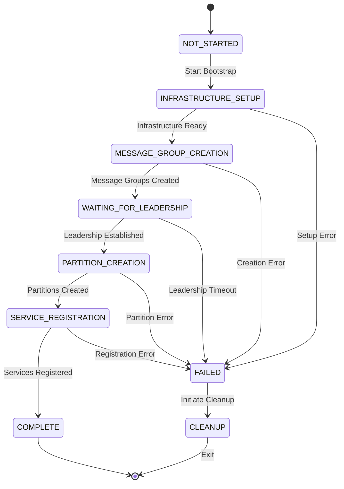
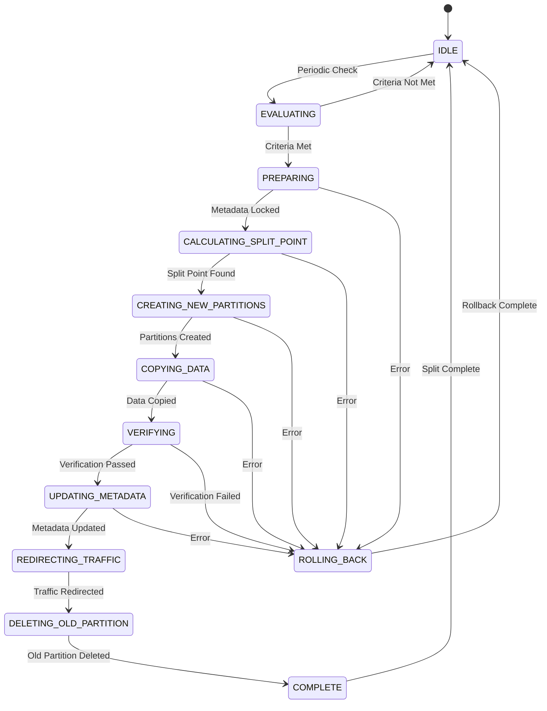
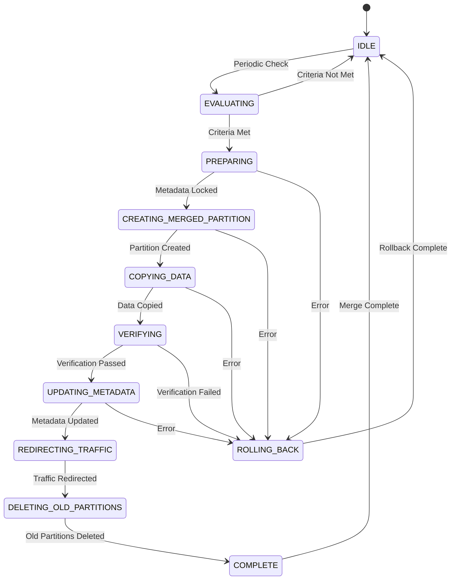
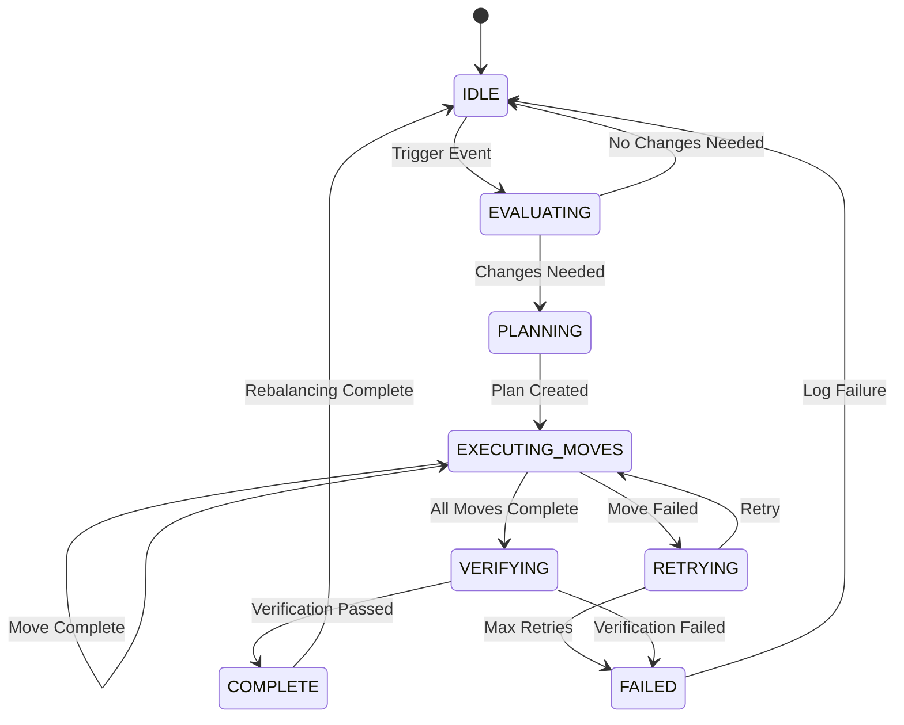

# State Machines for Critical Operations

This section defines detailed state machines for critical operations in the distributed database system. Each state machine ensures atomic, recoverable operations with clear failure handling.

## 1. Bootstrap State Machine

The bootstrap process initializes a new node, either as the seed node or joining an existing cluster.

### States



### State Definitions

| State | Description | Entry Actions | Exit Conditions |
|-------|-------------|---------------|-----------------|
| **NOT_STARTED** | Initial state before bootstrap begins | None | User initiates bootstrap |
| **INFRASTRUCTURE_SETUP** | Setting up basic infrastructure | Load config, initialize logger, setup network | Infrastructure ready OR error |
| **MESSAGE_GROUP_CREATION** | Creating message group replicas | Create message group services, register handlers | All message groups created OR error |
| **WAITING_FOR_LEADERSHIP** | Waiting for Raft leadership | Poll for leadership status | Leadership established OR timeout (30s) |
| **PARTITION_CREATION** | Creating partition replicas | Create partition services, register with transport | All partitions created OR error |
| **SERVICE_REGISTRATION** | Registering services in system tables | Write service metadata via CDC | Registration complete OR error |
| **COMPLETE** | Bootstrap successfully completed | Log success summary | Terminal state |
| **FAILED** | Bootstrap failed at some step | Log error with context | Cleanup initiated |
| **CLEANUP** | Cleaning up partially initialized services | Stop services, delete data, release resources | Cleanup complete |


### Transition Logic

```javascript
class BootstrapStateMachine {
  constructor(nodeId, seedNodeAddress) {
    this.state = 'NOT_STARTED';
    this.nodeId = nodeId;
    this.seedNodeAddress = seedNodeAddress;
    this.createdServices = [];
    this.error = null;
  }
  
  async execute() {
    try {
      await this.transition('INFRASTRUCTURE_SETUP');
      await this.setupInfrastructure();
      
      await this.transition('MESSAGE_GROUP_CREATION');
      await this.createMessageGroups();
      
      await this.transition('WAITING_FOR_LEADERSHIP');
      await this.waitForLeadership();
      
      await this.transition('PARTITION_CREATION');
      await this.createPartitions();
      
      await this.transition('SERVICE_REGISTRATION');
      await this.registerServices();
      
      await this.transition('COMPLETE');
      logger.info('Bootstrap completed successfully', {
        nodeId: this.nodeId,
        servicesCreated: this.createdServices.length,
      });
    } catch (error) {
      await this.handleFailure(error);
    }
  }
  
  async transition(newState) {
    const oldState = this.state;
    this.state = newState;
    logger.info('Bootstrap state transition', {
      nodeId: this.nodeId,
      from: oldState,
      to: newState,
    });
  }
  
  async handleFailure(error) {
    this.error = error;
    await this.transition('FAILED');
    logger.error('Bootstrap failed', {
      nodeId: this.nodeId,
      state: this.state,
      error: error.message,
      stack: error.stack,
    });
    
    await this.transition('CLEANUP');
    await this.cleanup();
    process.exit(1);
  }
}
```

### Failure Recovery

- **Any state → FAILED**: Log error with full context (which step, which service, error details)
- **FAILED → CLEANUP**: Stop all created services, delete partial data
- **CLEANUP → Exit**: Exit with non-zero code
- **Retry**: Operator restarts node, bootstrap begins from NOT_STARTED


## 2. Partition Split State Machine

The partition split operation divides one partition into two adjacent partitions.

### States



### State Definitions

| State | Description | Entry Actions | Exit Conditions |
|-------|-------------|---------------|-----------------|
| **IDLE** | Partition operating normally | None | Periodic evaluation trigger |
| **EVALUATING** | Checking if split criteria are met | Query partition size and traffic metrics | Criteria met OR not met |
| **PREPARING** | Preparing for split operation | Lock partition metadata, log split initiation | Ready OR error |
| **CALCULATING_SPLIT_POINT** | Finding median PRIMARY KEY value | Query for median key | Split point found OR error |
| **CREATING_NEW_PARTITIONS** | Creating two new partition Raft groups | Create partition services with new key ranges | Partitions created OR error |
| **COPYING_DATA** | Copying data to new partitions | Bulk copy rows based on key ranges | Copy complete OR error |
| **VERIFYING** | Verifying data integrity | Compare row counts, checksums | Verification passed OR failed |
| **UPDATING_METADATA** | Atomically updating system tables | Two-phase commit for metadata | Metadata updated OR error |
| **REDIRECTING_TRAFFIC** | Routing queries to new partitions | Update routing tables | Traffic redirected |
| **DELETING_OLD_PARTITION** | Removing old partition | Stop old partition services, delete data | Deletion complete |
| **COMPLETE** | Split successfully completed | Log success, update metrics | Return to IDLE |
| **ROLLING_BACK** | Reverting failed split | Delete new partitions, restore old partition | Rollback complete |

### Atomicity Guarantees

- **Two-Phase Metadata Update**: System tables updated atomically
- **Rollback on Failure**: Any failure before UPDATING_METADATA → full rollback
- **Idempotency**: Split can be retried safely after failure
- **No Data Loss**: Old partition retained until verification passes


## 3. Partition Merge State Machine

The partition merge operation combines two adjacent partitions into one.

### States



### State Definitions

| State | Description | Entry Actions | Exit Conditions |
|-------|-------------|---------------|-----------------|
| **IDLE** | Partitions operating normally | None | Periodic evaluation trigger |
| **EVALUATING** | Checking if merge criteria are met | Query combined size and traffic | Criteria met OR not met |
| **PREPARING** | Preparing for merge operation | Lock both partition metadata, verify adjacency | Ready OR error |
| **CREATING_MERGED_PARTITION** | Creating new merged partition Raft group | Create partition with combined key range | Partition created OR error |
| **COPYING_DATA** | Copying data from both old partitions | Bulk copy from both sources | Copy complete OR error |
| **VERIFYING** | Verifying data integrity | Compare row counts, checksums | Verification passed OR failed |
| **UPDATING_METADATA** | Atomically updating system tables | Two-phase commit for metadata | Metadata updated OR error |
| **REDIRECTING_TRAFFIC** | Routing queries to merged partition | Update routing tables | Traffic redirected |
| **DELETING_OLD_PARTITIONS** | Removing old partitions | Stop old services, delete data | Deletion complete |
| **COMPLETE** | Merge successfully completed | Log success, update metrics | Return to IDLE |
| **ROLLING_BACK** | Reverting failed merge | Delete merged partition, restore old partitions | Rollback complete |

### Merge Ownership Rule

**CRITICAL**: Only the partition with the lower key range evaluates and initiates merges with its right neighbor. This prevents conflicts where both partitions try to merge simultaneously.


## 4. Replica Rebalancing State Machine

The rebalancing operation moves replicas across nodes to achieve optimal distribution.

### States



### State Definitions

| State | Description | Entry Actions | Exit Conditions |
|-------|-------------|---------------|-----------------|
| **IDLE** | No rebalancing in progress | None | Trigger event (node join/leave, periodic check) |
| **EVALUATING** | Assessing current replica distribution | Query current replicas, node stats, policies | Changes needed OR not needed |
| **PLANNING** | Calculating optimal replica placement | Generate list of moves (add/remove/move) | Plan created |
| **EXECUTING_MOVES** | Executing replica moves one at a time | Add replica, sync data, remove old replica | Move complete OR failed |
| **RETRYING** | Retrying failed move | Exponential backoff, retry | Retry OR max retries exceeded |
| **VERIFYING** | Verifying final replica distribution | Check replica counts, distribution | Verification passed OR failed |
| **COMPLETE** | Rebalancing successfully completed | Log success, update metrics | Return to IDLE |
| **FAILED** | Rebalancing failed | Log failure, alert operator | Return to IDLE |

### Rebalancing Triggers

- **Critical (Immediate)**: Replica count below minimum
- **High Priority**: Node failure detected
- **Medium Priority**: Node join
- **Low Priority**: Periodic check (every 5 minutes with jitter)

### Concurrency Handling

- Each partition/message group leader rebalances independently
- No coordination between leaders
- Eventual consistency - system converges to stable state
- Conflicts resolved by Raft (only one leader can commit changes)


## State Machine Invariants

All state machines maintain these invariants:

1. **Single Active State**: Each operation is in exactly one state at any time
2. **Atomic Transitions**: State transitions are atomic and logged
3. **Rollback Capability**: Failed operations can roll back to previous stable state
4. **Idempotency**: Operations can be safely retried after failure
5. **Observability**: All state transitions are logged with full context
6. **Timeout Protection**: Long-running states have timeouts to prevent hangs

## State Persistence

State machines persist their state to survive crashes:

```javascript
class StateMachinePersistence {
  async saveState(stateMachine) {
    await this.db.insert('state_machine_checkpoints', {
      operation_id: stateMachine.id,
      operation_type: stateMachine.type,
      current_state: stateMachine.state,
      context: JSON.stringify(stateMachine.getContext()),
      timestamp: Date.now(),
    });
  }
  
  async loadState(operationId) {
    const checkpoint = await this.db.query(
      'SELECT * FROM state_machine_checkpoints WHERE operation_id = ? ' +
      'ORDER BY timestamp DESC LIMIT 1',
      [operationId]
    );
    
    if (!checkpoint) return null;
    
    return {
      state: checkpoint.current_state,
      context: JSON.parse(checkpoint.context),
    };
  }
  
  async resumeOperation(operationId) {
    const savedState = await this.loadState(operationId);
    if (!savedState) return;
    
    // Recreate state machine and resume from saved state
    const stateMachine = this.createStateMachine(savedState.context);
    stateMachine.state = savedState.state;
    await stateMachine.resume();
  }
}
```
