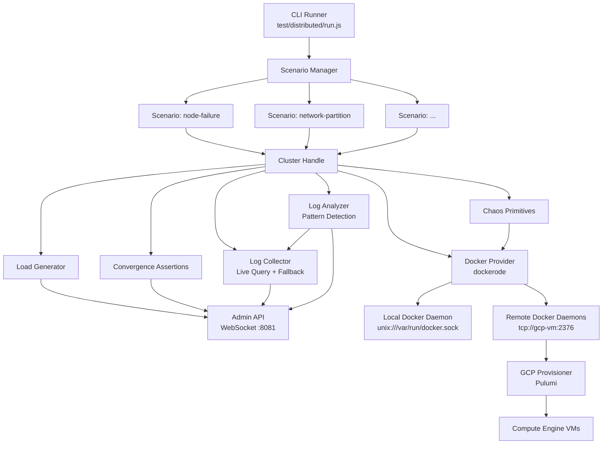
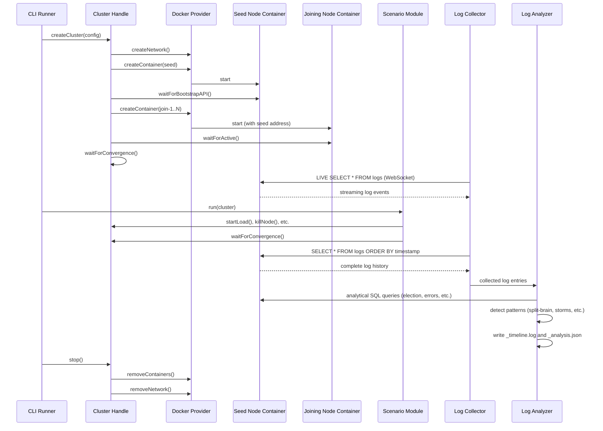

# Design Document: Distributed Testing Framework

## Overview

The distributed testing framework provides Docker-based isolation for running real-world distributed system tests. It uses a layered architecture: a Docker provider manages container lifecycle, a cluster abstraction orchestrates multi-node clusters, chaos primitives inject faults, load generators drive traffic, and assertions verify correctness. A CLI runner discovers and executes scenario modules.

The key design insight is that Docker is the single abstraction layer for both local and cloud testing. Locally, the harness talks to the local Docker daemon via Unix socket. On GCP, the same harness talks to remote Docker daemons over TCP on Pulumi-provisioned VMs. Scenarios are completely portable — they interact only with the Cluster handle, never with Docker or infrastructure directly.

## Architecture



### Component Interaction Flow



## Components and Interfaces

### Docker Provider (`test/distributed/harness/docker-provider.js`)

Wraps `dockerode` to manage container lifecycle. Supports both local and remote Docker daemons.

```javascript
class DockerProvider {
  /**
   * @param {Object} config
   * @param {string} [config.socketPath] - Local Docker socket path
   * @param {string} [config.host] - Remote Docker host (tcp://host:port)
   */
  constructor(config) {}

  /** Create a Docker bridge network for the cluster. */
  async createNetwork(name, labels) {}

  /** Build an image from a Dockerfile. */
  async buildImage(contextPath, tag, dockerfile) {}

  /** Create and start a container. Returns container info with IP. */
  async createContainer(options) {}
  // options: { name, image, network, env, labels, resourceLimits }

  /** Stop a container gracefully (SIGTERM). */
  async stopContainer(containerId) {}

  /** Kill a container (SIGKILL). */
  async killContainer(containerId) {}

  /** Pause a container (SIGSTOP). */
  async pauseContainer(containerId) {}

  /** Unpause a container (SIGCONT). */
  async unpauseContainer(containerId) {}

  /** Restart a container preserving volumes. */
  async restartContainer(containerId) {}

  /** Execute a command inside a running container. */
  async execInContainer(containerId, cmd) {}

  /** Get container logs (stdout + stderr). */
  async getContainerLogs(containerId, options) {}

  /** Stream container logs in real-time. */
  streamContainerLogs(containerId, callback) {}

  /** Remove a container and its volumes. */
  async removeContainer(containerId) {}

  /** Remove a network. */
  async removeNetwork(networkId) {}

  /** Disconnect a container from a network. */
  async disconnectFromNetwork(networkId, containerId) {}

  /** Connect a container to a network. */
  async connectToNetwork(networkId, containerId) {}

  /** List containers by label filter. */
  async listContainers(labels) {}

  /** Get container inspect info (IP address, state, etc.). */
  async inspectContainer(containerId) {}
}
```

### Cluster (`test/distributed/harness/cluster.js`)

The unified cluster abstraction. Scenarios interact exclusively with this interface.

```javascript
/**
 * Create a cluster.
 * @param {Object} config
 * @param {number} config.size - Number of nodes
 * @param {Object} config.docker - Docker connection config
 * @param {string} [config.docker.socketPath] - Local socket
 * @param {Array<string>} [config.docker.hosts] - Remote daemon addresses
 * @param {number} [config.nodesPerHost] - Max containers per host
 * @param {string} config.image - Docker image tag
 * @param {Object} [config.timeouts] - Timeout overrides
 * @param {Object} [config.resourceLimits] - Per-container resource limits
 * @returns {Cluster}
 */
function createCluster(config) {}

class Cluster {
  /** Start the cluster: create network, start seed, start joiners. */
  async start() {}

  /** Stop and remove all containers, networks, volumes. */
  async stop() {}

  /** Get a node handle by ID. */
  getNode(id) {}

  /** Get all node handles. */
  getNodes() {}

  /** Pick a random non-seed node ID. */
  randomNonSeed() {}

  /** Wait for cluster convergence (all partitions healthy). */
  async waitForConvergence(options) {}
  // options: { timeout, quietWindowMs, targetVoterCount }

  /** Assert all nodes agree on cluster state. */
  async assertConsistency() {}

  /** Assert data integrity across replicas. */
  async assertDataIntegrity(table, expectedRows) {}

  // --- Chaos Primitives ---
  async killNode(id) {}
  async stopNode(id) {}
  async pauseNode(id) {}
  async unpauseNode(id) {}
  async restartNode(id) {}
  async partitionNetwork(groupA, groupB) {}
  async healPartition() {}
  async slowNetwork(nodeId, options) {}
  async corruptDisk(nodeId, path) {}

  // --- Load Generation ---
  startLoad(options) {}
  // options: { opsPerSec, duration, operations }
}
```

### Node Handle

Each node in the cluster is represented by a lightweight handle:

```javascript
class NodeHandle {
  constructor(id, containerId, ip, role, dockerProvider) {}

  /** Query the Admin API via WebSocket. */
  async query(sql) {}

  /** Get node status from Admin API. */
  async getStatus() {}

  /** Get container logs. */
  async getLogs(options) {}

  /** Check if node is reachable. */
  async isReachable() {}
}
```

### Chaos Primitives (`test/distributed/harness/chaos.js`)

Encapsulates fault injection operations. Each primitive delegates to the Docker Provider.

```javascript
class ChaosPrimitives {
  constructor(dockerProvider, nodes, networkId) {}

  async killNode(nodeId) {}
  async stopNode(nodeId) {}
  async pauseNode(nodeId) {}
  async unpauseNode(nodeId) {}
  async restartNode(nodeId) {}

  /**
   * Partition network: disconnect groupA from groupB.
   * Creates secondary networks for each group.
   */
  async partitionNetwork(groupA, groupB) {}
  async healPartition() {}

  /** Add network delay via tc qdisc netem. */
  async slowNetwork(nodeId, { latency, jitter }) {}

  /** Corrupt a file inside the container. */
  async corruptDisk(nodeId, filePath) {}
}
```

### Load Generator (`test/distributed/harness/load-generator.js`)

Drives SQL traffic against the cluster via Admin API WebSocket connections.

```javascript
class LoadGenerator {
  constructor(nodes, options) {}
  // options: { opsPerSec, duration, operations }

  /** Start generating load. Returns a LoadRun handle. */
  start() {}
}

class LoadRun {
  /** Wait for the load run to complete. */
  async waitComplete() {}

  /** Get current metrics snapshot. */
  getMetrics() {}
  // Returns: { total, success, failed, errors, latency: { p50, p95, p99 }, opsPerSec }

  /** Cancel the load run early. */
  cancel() {}
}
```

### Convergence Assertions (`test/distributed/harness/assertions.js`)

Reuses the SLO pattern from `node-join-convergence-slo.integration.test.js`.

```javascript
const CONVERGENCE_DEFAULTS = {
  settleTimeoutMs: 30000,
  quietWindowMs: 5000,
  maxSustainedOverTargetMs: 2000,
  sampleIntervalMs: 250,
  targetVoterCount: 3,
};

/**
 * Wait for cluster convergence.
 * Polls Admin API on all reachable nodes.
 */
async function waitForConvergence(nodes, options) {}

/**
 * Assert all nodes agree on cluster state.
 * Queries services, nodes, partitions tables on each node.
 */
async function assertConsistency(nodes) {}

/**
 * Assert data integrity across replicas.
 * Reads from multiple nodes and compares results.
 */
async function assertDataIntegrity(nodes, table, expectedRows) {}
```

### Log Collector (`test/distributed/harness/log-collector.js`)

Collects cluster logs via live query subscription to the `logs` system table. Falls back to Docker container stdout/stderr when the cluster is unreachable.

```javascript
class LogCollector {
  constructor(outputDir) {}

  /**
   * Start live query subscription on a cluster node.
   * Connects to Admin API WebSocket and subscribes with
   * LIVE SELECT * FROM logs (or filtered variant).
   * Buffers received events in memory.
   * @param {NodeHandle} node - Node to subscribe through
   * @param {string} [filter] - Optional WHERE clause (e.g., "level = 'error'")
   */
  async startLiveSubscription(node, filter) {}

  /**
   * Build the subscription SQL query.
   * @param {string} [filter] - Optional WHERE clause
   * @returns {string} e.g., "LIVE SELECT * FROM logs" or
   *   "LIVE SELECT * FROM logs WHERE level = 'error'"
   */
  buildSubscriptionQuery(filter) {}

  /**
   * Run final SELECT to capture complete log history before teardown.
   * Executes: SELECT * FROM logs ORDER BY timestamp
   * @param {NodeHandle} node - Node to query
   * @returns {Array<Object>} Complete log entries
   */
  async collectFinalSnapshot(node) {}

  /**
   * Fall back to Docker container stdout/stderr collection.
   * Used only when cluster is unreachable for live queries.
   * @param {DockerProvider} dockerProvider
   * @param {Array<NodeHandle>} nodes
   */
  async collectContainerFallback(dockerProvider, nodes) {}

  /**
   * Get the buffered log events from the live subscription.
   * @returns {Array<Object>} Buffered log entries
   */
  getBuffer() {}

  /**
   * Get last N entries from the buffer.
   * @param {number} n - Number of lines
   * @returns {Array<Object>} Last N log entries
   */
  getTail(n) {}

  /**
   * Write collected logs to structured output directory.
   * Writes per-node logs to {outputDir}/{scenarioName}/{nodeId}.log
   * Writes unified timeline to {outputDir}/{scenarioName}/_timeline.log
   * @param {string} scenarioName
   * @param {Array<Object>} logEntries - From buffer or final snapshot
   * @param {Array<string>} nodeIds
   */
  async writeOutput(scenarioName, logEntries, nodeIds) {}

  /** Stop the live query subscription and clean up. */
  async stopSubscription() {}
}
```

### Log Analyzer (`test/distributed/harness/log-analyzer.js`)

Processes collected log entries to produce a unified timeline and detect distributed system anomalies. Runs analytical SQL queries against the `logs` table before teardown.

```javascript
/**
 * Pattern detection thresholds (configurable).
 */
const ANALYZER_DEFAULTS = {
  electionStormMultiplier: 4,     // threshold = partitionCount * multiplier
  stuckRebalanceTimeoutMs: 60000, // operations exceeding this are flagged
  cdcDelayThresholdMs: 5000,     // CDC propagation delay threshold
  repeatedErrorThreshold: 3,      // routing errors to same address
};

class LogAnalyzer {
  constructor(outputDir, options) {}

  /**
   * Run analytical SQL queries against the logs table via Admin API.
   * Queries:
   *   - SELECT * FROM logs WHERE message LIKE '%leader_elected%'
   *     ORDER BY timestamp
   *   - SELECT node_id, partition_id, COUNT(*) FROM logs
   *     WHERE message LIKE '%leader_elected%'
   *     GROUP BY node_id, partition_id
   *   - SELECT * FROM logs WHERE level = 'error' ORDER BY timestamp
   * @param {NodeHandle} node - Node to query through
   * @returns {Object} Raw query results for pattern analysis
   */
  async runAnalyticalQueries(node) {}

  /**
   * Detect split-brain: two nodes claiming leadership for same
   * partition simultaneously.
   * @param {Array<Object>} leaderEvents - Leader election log entries
   * @returns {Array<Object>} Detected split-brain anomalies
   */
  detectSplitBrain(leaderEvents) {}

  /**
   * Detect election storms: leader changes exceeding
   * partitionCount * electionStormMultiplier.
   * @param {Array<Object>} leaderCounts - Grouped leader change counts
   * @param {number} partitionCount
   * @returns {Array<Object>} Detected election storm anomalies
   */
  detectElectionStorms(leaderCounts, partitionCount) {}

  /**
   * Detect stuck rebalancing: operations not completing within
   * expected time.
   * @param {Array<Object>} logEntries - All log entries
   * @returns {Array<Object>} Detected stuck rebalance anomalies
   */
  detectStuckRebalancing(logEntries) {}

  /**
   * Detect message delivery failures: repeated routing errors
   * to same address.
   * @param {Array<Object>} errorEntries - Error-level log entries
   * @returns {Array<Object>} Detected routing failure anomalies
   */
  detectMessageDeliveryFailures(errorEntries) {}

  /**
   * Detect CDC propagation delays: events exceeding threshold.
   * @param {Array<Object>} logEntries - All log entries
   * @returns {Array<Object>} Detected CDC delay anomalies
   */
  detectCDCDelays(logEntries) {}

  /**
   * Produce the complete analysis from collected logs and query results.
   * @param {Array<Object>} logEntries - All collected log entries
   * @param {Object} queryResults - Results from runAnalyticalQueries
   * @param {number} partitionCount - Cluster partition count
   * @returns {Object} Analysis result:
   *   { timeline, errors, patterns, summary }
   */
  analyze(logEntries, queryResults, partitionCount) {}

  /**
   * Write analysis output files.
   * Writes {outputDir}/{scenarioName}/_timeline.log
   * Writes {outputDir}/{scenarioName}/_analysis.json
   * @param {string} scenarioName
   * @param {Object} analysis - Result from analyze()
   */
  async writeAnalysis(scenarioName, analysis) {}
}
```

#### Analysis Output Format (`_analysis.json`)

```json
{
  "timeline": [
    { "timestamp": "...", "node_id": "...", "level": "info", "message": "..." }
  ],
  "errors": [
    { "timestamp": "...", "node_id": "...", "level": "error", "message": "..." }
  ],
  "patterns": [
    {
      "type": "split_brain",
      "severity": "critical",
      "details": {
        "partition_id": "...",
        "nodes": ["node-1", "node-2"],
        "timestamp_range": ["...", "..."]
      }
    },
    {
      "type": "election_storm",
      "severity": "warning",
      "details": {
        "partition_id": "...",
        "leader_changes": 25,
        "threshold": 20
      }
    }
  ],
  "summary": {
    "total_entries": 1500,
    "by_level": { "info": 1200, "warn": 250, "error": 50 },
    "by_node": { "node-1": 500, "node-2": 500, "node-3": 500 },
    "by_subsystem": { "raft": 400, "rebalancer": 300, "query": 800 },
    "anomaly_count": 2,
    "anomaly_types": ["split_brain", "election_storm"]
  }
}
```

### GCP Provisioner (`test/distributed/harness/gcp-provisioner.js`)

Uses Pulumi with `@pulumi/gcp` to provision Compute Engine VMs.

```javascript
class GCPProvisioner {
  constructor(config) {}
  // config: { project, zone, machineType, vmCount, preemptible }

  /**
   * Provision VMs and return Docker daemon connection targets.
   * @returns {Promise<Array<string>>} Docker host addresses (tcp://ip:2376)
   */
  async provision() {}

  /** Tear down all provisioned infrastructure. */
  async destroy() {}
}
```

### CLI Runner (`test/distributed/run.js`)

Entry point for executing distributed test scenarios.

```javascript
// Usage:
//   node test/distributed/run.js --config local.json
//   node test/distributed/run.js --config local.json --scenario node-failure
//   node test/distributed/run.js --config gcp-small.json --output results.json
```

### Report Writer (`test/distributed/harness/report-writer.js`)

Produces structured JSON reports.

```javascript
class ReportWriter {
  constructor(outputPath) {}

  /** Add a scenario result. */
  addResult(scenarioName, result) {}
  // result: { passed, duration, loadMetrics, convergenceTiming, error, stackTrace }

  /** Write the final report to disk. */
  async write() {}
}
```

## Data Models

### Cluster Configuration (JSON)

```json
{
  "size": 5,
  "docker": {
    "socketPath": "/var/run/docker.sock"
  },
  "image": "distributed-db:test",
  "timeouts": {
    "nodeStartup": 30000,
    "convergence": 30000,
    "quietWindow": 5000,
    "scenarioDefault": 120000
  },
  "convergence": {
    "targetVoterCount": 3,
    "settleTimeoutMs": 30000,
    "quietWindowMs": 5000,
    "maxSustainedOverTargetMs": 2000,
    "sampleIntervalMs": 250
  },
  "resourceLimits": {
    "memory": "512m",
    "cpus": "1.0"
  },
  "load": {
    "defaultOpsPerSec": 100,
    "defaultDuration": "30s"
  }
}
```

### GCP Configuration (JSON)

```json
{
  "size": 20,
  "docker": {
    "hosts": ["tcp://gcp-vm-1:2376", "tcp://gcp-vm-2:2376"]
  },
  "nodesPerHost": 10,
  "image": "distributed-db:test",
  "gcp": {
    "project": "my-project",
    "zone": "us-central1-a",
    "machineType": "e2-standard-4",
    "vmCount": 2,
    "preemptible": true
  }
}
```

### Node Info (internal)

```javascript
{
  id: 'node-1',              // Logical node ID (UUID)
  containerId: 'abc123...',  // Docker container ID
  containerName: 'ddb-test-node-1',
  ip: '172.18.0.2',          // Container IP on bridge network
  role: 'seed' | 'joiner',
  ports: {
    rest: 8080,
    admin: 8081,
    ws: 9080,
  },
  hostIndex: 0,              // Which Docker host (for multi-host)
}
```

### Scenario Result (internal)

```javascript
{
  scenario: 'node-failure-rebalance',
  passed: true,
  duration: 45230,
  startedAt: '2024-01-15T10:30:00Z',
  loadMetrics: {
    total: 5000,
    success: 4998,
    failed: 2,
    errors: 0,
    latency: { p50: 12, p95: 45, p99: 120 },
    opsPerSec: 166.5,
  },
  convergenceTiming: {
    settledAfterMs: 8500,
    leaderChanges: 4,
    maxOverTargetMs: 1200,
  },
  analysisSummary: {
    total_entries: 1500,
    by_level: { info: 1200, warn: 250, error: 50 },
    anomaly_count: 0,
    anomaly_types: [],
  },
  error: null,
  stackTrace: null,
  logs: 'test-output/node-failure-rebalance/',
}
```

### Test Report (JSON output)

```javascript
{
  timestamp: '2024-01-15T10:35:00Z',
  config: 'local.json',
  summary: {
    total: 6,
    passed: 5,
    failed: 1,
    duration: 320000,
  },
  scenarios: [
    // Array of Scenario Result objects
  ],
}
```


## Correctness Properties

*A property is a characteristic or behavior that should hold true across all valid executions of a system — essentially, a formal statement about what the system should do. Properties serve as the bridge between human-readable specifications and machine-verifiable correctness guarantees.*

### Property 1: Distinct Container IPs

*For any* cluster size N (where N >= 2), when N containers are created on the same Docker bridge network, all N containers SHALL receive distinct IP addresses, enabling all containers to bind identical ports without conflict.

**Validates: Requirements 1.1, 1.3**

### Property 2: Container Environment Configuration

*For any* container creation request with a given node ID, node address, seed address, and data directory, the created container's environment variables SHALL include NODE_ID, NODE_ADDRESS, SEED_NODE_ADDRESS, and DATA_DIR matching the requested values.

**Validates: Requirements 1.2, 3.2**

### Property 3: Container Cleanup Completeness

*For any* container that is created and then removed via the Docker_Provider, the container and its associated volumes SHALL no longer exist in Docker's container list.

**Validates: Requirements 1.5**

### Property 4: Cluster Stop Cleanup

*For any* cluster that is started with N nodes and then stopped, all N containers, the bridge network, and all associated volumes SHALL be removed from Docker.

**Validates: Requirements 2.5**

### Property 5: Multi-Host Container Distribution

*For any* cluster configuration with `docker.hosts` of length H and `nodesPerHost` limit P, no single Docker host SHALL have more than P containers, and the total container count SHALL equal the requested cluster size (up to H * P).

**Validates: Requirements 2.3**

### Property 6: Pause-Unpause Round Trip

*For any* running container, pausing and then unpausing it SHALL return the container to the running state.

**Validates: Requirements 4.3**

### Property 7: Restart Data Preservation

*For any* node container with data written to its data volume, restarting the container SHALL preserve the data volume contents.

**Validates: Requirements 4.4**

### Property 8: Network Partition Round Trip

*For any* cluster of N nodes partitioned into two non-empty groups A and B, after `partitionNetwork(A, B)` nodes within the same group SHALL be able to communicate and nodes across groups SHALL NOT. After `healPartition()`, all nodes SHALL be able to communicate with all other nodes.

**Validates: Requirements 4.5, 4.6**

### Property 9: Convergence Threshold Configuration

*For any* set of convergence options (settleTimeoutMs, quietWindowMs, targetVoterCount, maxSustainedOverTargetMs), the convergence assertion SHALL use the provided values instead of defaults.

**Validates: Requirements 5.2**

### Property 10: Load Generator Rate Accuracy

*For any* target opsPerSec and duration, the Load_Generator's actual operation rate SHALL be within 20% of the target rate (accounting for connection overhead and scheduling jitter).

**Validates: Requirements 6.1**

### Property 11: Load Metrics Accuracy

*For any* sequence of operations with known success/failure outcomes and measured latencies, the Load_Generator metrics SHALL accurately report total count, success count, failure count, and latency percentiles (p50, p95, p99) consistent with the recorded latencies.

**Validates: Requirements 6.3**

### Property 12: Log Output Directory Structure

*For any* scenario name and set of node IDs, the log collector SHALL write per-node logs to paths matching `{outputDir}/{scenarioName}/{nodeId}.log` and a unified timeline to `{outputDir}/{scenarioName}/_timeline.log`.

**Validates: Requirements 7.5**

### Property 21: Log Event Buffering Completeness

*For any* sequence of N log events received via live query subscription, the Log_Collector's buffer SHALL contain exactly N entries in the order they were received.

**Validates: Requirements 7.2**

### Property 22: Filtered Subscription Query Construction

*For any* optional filter predicate string, `buildSubscriptionQuery(filter)` SHALL return `LIVE SELECT * FROM logs` when no filter is provided, and `LIVE SELECT * FROM logs WHERE {filter}` when a filter is provided.

**Validates: Requirements 7.3**

### Property 23: Buffer Tail Extraction

*For any* buffer of M log entries and requested tail size N, `getTail(N)` SHALL return exactly `min(M, N)` entries corresponding to the last entries in the buffer.

**Validates: Requirements 7.7**

### Property 24: Analysis Structure Completeness

*For any* set of log entries with mixed levels and node IDs, the Log_Analyzer's `analyze()` output SHALL contain: a `timeline` array sorted by timestamp containing all entries, an `errors` array containing only error-level entries, a `patterns` array, and a `summary` with `by_level` counts matching the actual level distribution and `by_node` counts matching the actual node distribution.

**Validates: Requirements 13.1, 13.9**

### Property 25: Anomaly Pattern Detection

*For any* set of log entries containing injected anomaly patterns (split-brain leader claims, election changes exceeding threshold, stuck operations, repeated routing errors to same address, CDC delays exceeding threshold), the Log_Analyzer SHALL detect and report all present anomaly types in the `patterns` array with correct type labels and relevant details.

**Validates: Requirements 13.3, 13.4, 13.5, 13.6, 13.7**

### Property 13: Scenario Discovery

*For any* directory containing N JavaScript files that export a `run(cluster)` function, the CLI_Runner SHALL discover exactly N scenarios.

**Validates: Requirements 9.1**

### Property 14: Scenario Filtering

*For any* set of discovered scenarios and a `--scenario` filter value, the CLI_Runner SHALL execute only scenarios whose name matches the filter.

**Validates: Requirements 9.2**

### Property 15: Report Completeness

*For any* set of K scenario results (each with name, pass/fail, duration, and optional load metrics), the generated JSON report SHALL contain exactly K scenario entries, each with all required fields (name, passed, duration, convergenceTiming, error).

**Validates: Requirements 9.5, 12.2**

### Property 16: Report Summary Accuracy

*For any* set of scenario results with P passed and F failed, the report summary SHALL have `total === P + F`, `passed === P`, `failed === F`, and `duration` equal to the sum of individual durations.

**Validates: Requirements 12.3**

### Property 17: Report Load Metrics Inclusion

*For any* scenario result that includes load generation metrics, the report entry for that scenario SHALL include latency percentiles (p50, p95, p99) and throughput (opsPerSec).

**Validates: Requirements 12.4**

### Property 18: Configuration Defaults

*For any* partial configuration object with missing fields, parsing it SHALL produce a complete configuration with all missing fields filled by default values.

**Validates: Requirements 11.5**

### Property 19: GCP Provisioner Address Format

*For any* set of provisioned VMs, the GCP_Provisioner SHALL return Docker daemon addresses matching the format `tcp://{ip}:{port}`.

**Validates: Requirements 8.6**

### Property 20: Configuration Parsing Round Trip

*For any* valid configuration object, serializing it to JSON and parsing it back SHALL produce an equivalent configuration object.

**Validates: Requirements 11.1**

## Error Handling

### Container Lifecycle Errors

- Container start timeout: collect logs, remove failed container, throw descriptive error with logs attached
- Container not found (killed externally): mark node as dead in cluster state, skip during assertions
- Docker daemon unreachable: throw connection error with host details, attempt cleanup of known resources

### Network Errors

- Network partition commands fail: log warning, attempt rollback of partial disconnects
- `tc` command not available in container: throw error suggesting the container image needs `iproute2` package

### Load Generator Errors

- All nodes unreachable: stop load generation, record error, return partial metrics
- WebSocket connection drops: reconnect to another node, increment failure counter
- Rate limiting backpressure: reduce actual rate, log warning

### Scenario Errors

- Unhandled exception in scenario: catch at runner level, mark failed, collect logs, continue to next scenario
- Scenario timeout: cancel load generators, collect logs, mark as timed out

### GCP Provisioning Errors

- Pulumi stack creation fails: report error with Pulumi output, no cleanup needed
- VM fails to start: retry once, then report failure
- `pulumi destroy` fails: log error, provide manual cleanup instructions

## Testing Strategy

### Unit Tests

Unit tests verify individual components in isolation using mocked Docker and WebSocket dependencies.

Focus areas:
- Configuration parsing and default merging
- Container environment variable assembly
- Multi-host container distribution logic
- Scenario discovery and filtering
- Report generation and summary computation
- Log output path construction
- Latency percentile calculation
- CLI argument parsing

### Property-Based Tests

Property-based tests use `fast-check` (already a project dependency) to verify universal properties across generated inputs. Each property test references a specific design property.

Configuration: `{numRuns: 10}` per the project testing guidelines.

Tag format: **Feature: distributed-testing-framework, Property {N}: {title}**

Properties to implement:
- Property 2: Container env var configuration (generate random node configs, verify env vars)
- Property 5: Multi-host distribution (generate random cluster sizes and host counts, verify distribution)
- Property 11: Load metrics accuracy (generate random operation sequences, verify metric computation)
- Property 12: Log output directory structure (generate random scenario names and node IDs, verify paths include per-node logs and _timeline.log)
- Property 13: Scenario discovery (generate random file lists, verify discovery count)
- Property 14: Scenario filtering (generate random scenario names and filters, verify filtering)
- Property 15: Report completeness (generate random scenario results, verify report structure)
- Property 16: Report summary accuracy (generate random pass/fail counts, verify summary)
- Property 18: Configuration defaults (generate partial configs, verify defaults applied)
- Property 20: Configuration round trip (generate random configs, verify serialization round trip)
- Property 21: Log event buffering completeness (generate random event sequences, verify buffer contains all in order)
- Property 22: Filtered subscription query construction (generate random filter strings, verify query format)
- Property 23: Buffer tail extraction (generate random buffers and tail sizes, verify correct tail)
- Property 24: Analysis structure completeness (generate random log entries with mixed levels/nodes, verify analysis output structure and counts)
- Property 25: Anomaly pattern detection (generate log entries with injected anomaly patterns, verify all patterns detected)

### Integration Tests

Integration tests require a running Docker daemon and verify end-to-end behavior:

- Create and destroy a 3-node cluster on local Docker
- Execute chaos primitives (kill, pause, restart) on real containers
- Network partition and heal with connectivity verification
- Load generation against a real cluster
- Convergence assertion against a real cluster
- Full scenario execution through CLI runner

These tests are slower and should be run separately from unit tests, gated behind a `--integration` flag or separate npm script.

### Test Organization

```
test/distributed/
  harness/
    __tests__/
      docker-provider.test.js       # Unit tests for Docker provider
      cluster.test.js               # Unit tests for cluster abstraction
      chaos.test.js                 # Unit tests for chaos primitives
      load-generator.test.js        # Unit tests + property tests for load gen
      assertions.test.js            # Unit tests for convergence assertions
      log-collector.test.js         # Unit + property tests for log collection
      log-analyzer.test.js          # Unit + property tests for log analysis
      report-writer.test.js         # Unit + property tests for reporting
      config-parser.test.js         # Unit + property tests for config
      scenario-discovery.test.js    # Property tests for discovery/filtering
    __integration__/
      cluster-lifecycle.test.js     # Full cluster create/destroy
      chaos-primitives.test.js      # Real chaos operations
      load-generation.test.js       # Real load against cluster
      convergence.test.js           # Real convergence assertions
```
