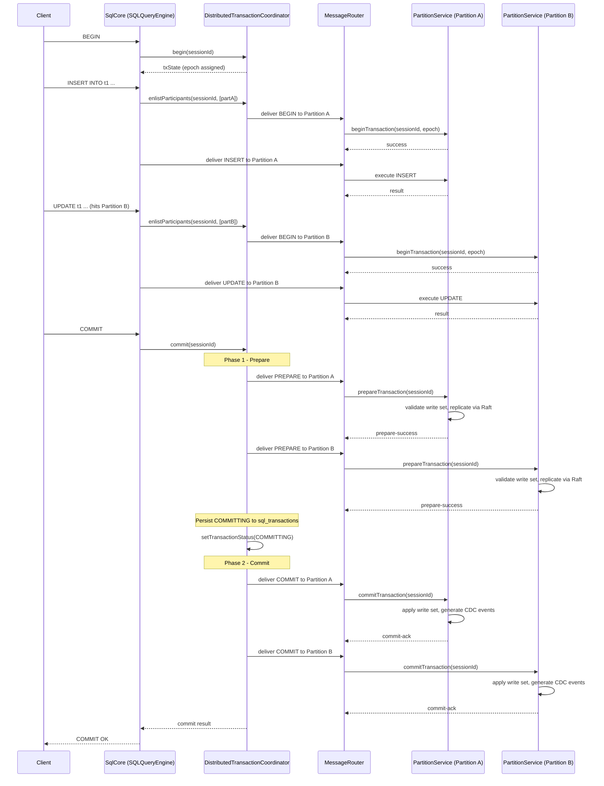
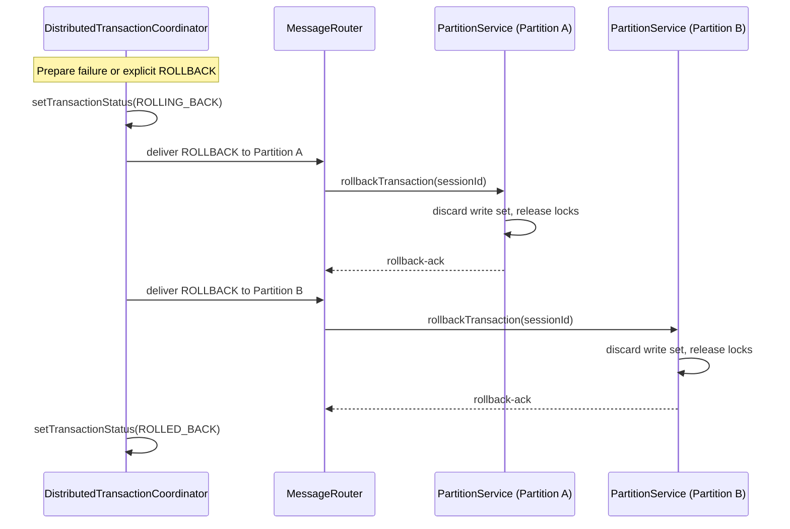
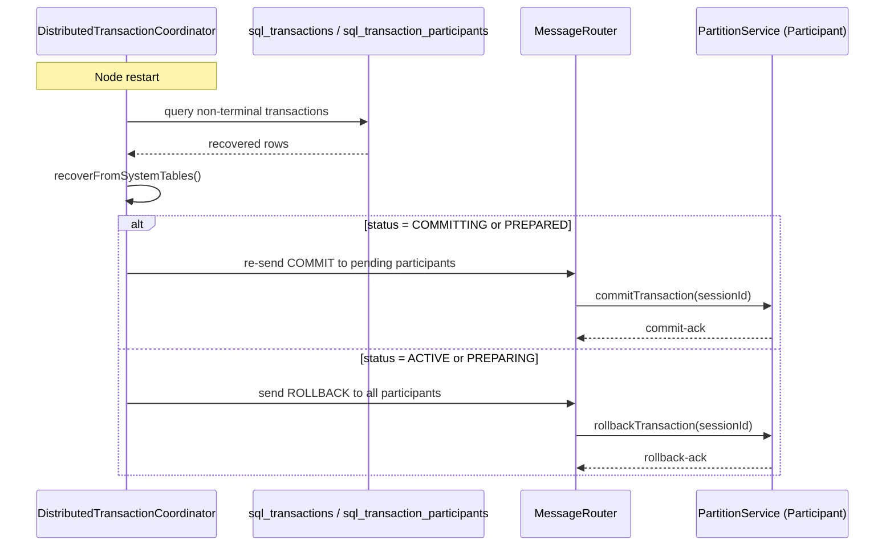

# Design Document: Distributed Transactions

## Overview

This design completes the distributed transaction support in Lagrange by
implementing partition-level prepare, atomic cross-partition commit/rollback,
coordinator crash recovery, snapshot isolation for multi-partition reads,
write conflict detection, and transaction timeout/cleanup.

The existing `DistributedTransactionCoordinator` already owns the 2PC state
machine skeleton, transaction state tables (`sql_transactions`,
`sql_transaction_participants`, `sql_write_operations`), idempotent participant
enlistment, and participant callbacks for begin/commit/rollback. The
`prepareParticipant` callback is currently a no-op stub wired in
`SQLQueryEngine`. `PartitionService` has `beginTransaction`,
`commitTransaction`, and `rollbackTransaction` but no `prepareTransaction`.

This design fills those gaps while strictly conforming to the system guidelines:
single owner per concern, no fallback code paths, all communication through
`MessageRouter`, no ad-hoc caches, and constants-only scalars.

### Design Decisions and Rationale

1. **Extend existing owners rather than create new ones.**
   `DistributedTransactionCoordinator` remains the sole 2PC owner.
   `PartitionService` gains `prepareTransaction` as the participant-side
   owner. No new coordinator or participant class is introduced.

2. **Raft log for prepared state durability.**
   Prepared write sets are replicated through the existing Raft log
   (`liferaft`) before returning prepare-success. This reuses the existing
   replication path (`replicateTransactionCommit` pattern) and avoids a
   separate WAL or durability mechanism.

3. **Epoch-based snapshot isolation.**
   Transaction epochs are derived from a monotonically increasing counter
   on the coordinator node (seeded from `config.current_epoch` via CDC).
   This avoids distributed clock synchronization while providing a
   consistent ordering for snapshot boundaries.

4. **Write-write conflict detection at prepare time.**
   Conflicts are detected during the prepare phase by comparing write sets
   against committed write sets from concurrent transactions. This is the
   standard first-committer-wins strategy for snapshot isolation.

5. **Timeout budget derivation from control-plane timeout policy.**
   Transaction timeouts use `createTopLevelOperationBudget` from
   `src/control-plane/timeout-budget.js`, consistent with all other
   control-plane operations. No fresh default budgets.

## Architecture

### Component Interaction Flow



### Rollback Flow



### Recovery Flow



## Components and Interfaces

### Modified Components

#### 1. DistributedTransactionCoordinator (owner: 2PC state machine)

**Changes:**
- Wire `prepareParticipant` callback to deliver `PREPARE` operation via
  `MessageRouter` (replacing the no-op stub in `SQLQueryEngine`).
- Add `transactionEpoch` field to transaction records, assigned at
  `begin()` time from a monotonically increasing epoch source.
- Persist `transaction_epoch` in `sql_transactions` table.
- Add timeout budget tracking per transaction using
  `createTopLevelOperationBudget`.
- Add periodic recovery sweep method that queries `sql_transactions` for
  stuck non-terminal transactions beyond timeout budget.
- Restore `transactionEpoch` during `recoverFromSystemTables`.

**New constructor option:**
- `epochSource`: function returning the next monotonic epoch value.

**Interface (unchanged methods with new behavior):**
- `begin(sessionId)` — now assigns `transactionEpoch` from epoch source.
- `commit(sessionId)` — `runCommitProtocol` now sends real PREPARE messages.
- `rollback(sessionId)` — unchanged.
- `recoverFromSystemTables(payload)` — now restores epoch from persisted rows.
- `resumeRecoveredTransactions()` — unchanged (already handles recovery replay).

**New methods:**
- `startRecoverySweep()` — periodic sweep for stuck transactions.
- `stopRecoverySweep()` — stops the periodic sweep.

#### 2. PartitionService (owner: partition-level transaction state)

**Changes:**
- Add `prepareTransaction(sessionId)` method.
- Modify `beginTransaction` to accept and store `transactionEpoch`.
- Modify read path to respect snapshot epoch (read-your-own-writes +
  committed-before-epoch visibility).
- Add write set tracking per active transaction for conflict detection.
- Add prepared state map for transactions that have passed prepare.
- Add prepared state reconstruction from Raft log on leader election.
- Add local prepared-state hold timeout.

**New methods:**
- `prepareTransaction(sessionId)` — validates write set, checks conflicts,
  replicates prepared state through Raft, returns prepare-success/failure.
- `reconstructPreparedState()` — called on leader election to rebuild
  prepared transaction state from Raft log entries.
- `checkWriteConflicts(writeSet, epoch)` — checks write set against
  committed writes from concurrent transactions.
- `releasePreparedState(sessionId)` — releases locks and write set for
  a prepared transaction (called on commit, rollback, or timeout).

**Transaction message handling extension:**
The existing `handleTransactionMessage` dispatch in `PartitionService` gains
a `PREPARE` case that calls `prepareTransaction`.

#### 3. SQLQueryEngine (owner: SQL execution dispatch)

**Changes:**
- Wire `prepareParticipant` callback to call
  `deliverTransactionOperation(sessionId, partitionId, QUERY_OPERATION.PREPARE)`
  instead of the current no-op.
- Pass `transactionEpoch` in the BEGIN message delivered to participants.
- Add `PREPARE` to the `deliverTransactionOperation` error handling.

### New Constants

Added to `src/query/query-constants.js`:
- `QUERY_OPERATION.PREPARE` — the prepare operation type.
- `QUERY_ERROR_CODE.PREPARE_FAILED` — prepare phase failure.
- `QUERY_ERROR_CODE.WRITE_CONFLICT` — write-write conflict detected.
- `QUERY_ERROR_CODE.SNAPSHOT_EXPIRED` — snapshot version history pruned.
- `QUERY_ERROR_CODE.PREPARE_LOST` — prepared state lost after failover.

Added to `src/partition/partition-constants.js`:
- `PARTITION_SERVICE_OPERATION.PREPARE_TRANSACTION` — prepare operation.
- `PARTITION_SERVICE_ERROR_MSG.PREPARE_CONFLICT` — conflict error message.
- `PARTITION_SERVICE_ERROR_MSG.NO_ACTIVE_TRANSACTION_PREPARE` — no active
  transaction for prepare.
- `PARTITION_SERVICE_ERROR_MSG.SNAPSHOT_EXPIRED` — snapshot expired message.
- `PARTITION_SERVICE_LOG_MSG.PREPARING_TRANSACTION` — prepare log message.
- `PARTITION_SERVICE_LOG_MSG.PREPARED_STATE_RECONSTRUCTED` — reconstruction
  log message.
- `PARTITION_SERVICE_SQL.SAVEPOINT_PREPARE` — SQLite savepoint for prepare.

Added to `src/query/distributed/distributed-transaction-coordinator.js`
(extending existing constants):
- `TRANSACTION_STATUS.PREPARED` — already exists, no change needed.

Added to `src/control-plane/timeout-budget.js`:
- `TIMEOUT_BUDGET_DEFAULT.TRANSACTION_BUDGET_MS` — default transaction
  timeout budget.
- `TIMEOUT_BUDGET_DEFAULT.PREPARED_HOLD_TIMEOUT_MS` — participant-side
  prepared state hold timeout.

### Unchanged Components

- `DurableWorkflowCoordinator` — already composed by
  `DistributedTransactionCoordinator`; no changes needed.
- `MessageRouter` — used as-is for all transaction message delivery.
- `SystemTableCache` — transaction tables are non-propagated; no cache
  changes needed.
- `CDCHandler` — CDC events generated by `PartitionService.commitTransaction`
  on the data partitions; no changes to CDC pipeline.

## Data Models

### sql_transactions (schema extension)

New column added to existing schema:

| Column | Type | Description |
|--------|------|-------------|
| `transaction_epoch` | INTEGER | Monotonic epoch assigned at BEGIN time for snapshot isolation |
| `timeout_deadline` | INTEGER | Absolute timestamp (ms) when the transaction budget expires |

### sql_transaction_participants (unchanged)

Existing schema is sufficient. The `status` column already tracks
participant lifecycle through ACTIVE → PREPARING → PREPARED → COMMITTING →
COMMITTED (or ROLLING_BACK → ROLLED_BACK).

### sql_write_operations (unchanged)

Existing schema is sufficient for write operation tracking.

### Partition-Local State (in-memory, per PartitionService)

| Field | Type | Description |
|-------|------|-------------|
| `activeTransactions` | `Map<sessionId, TransactionState>` | Active transactions with epoch and write set |
| `preparedTransactions` | `Map<sessionId, PreparedState>` | Prepared transactions awaiting commit/rollback |
| `committedWriteLog` | `Array<CommitRecord>` | Recent committed write sets for conflict detection |

**TransactionState:**
```
{
  sessionId: string,
  epoch: number,
  writeSet: Set<string>,    // row keys modified
  readSet: Set<string>,     // row keys read (for conflict detection)
  startTime: number,
  operations: Array<Object>
}
```

**PreparedState:**
```
{
  sessionId: string,
  epoch: number,
  writeSet: Set<string>,
  raftLogIndex: number,     // Raft log index of the prepare entry
  preparedAt: number,       // timestamp for hold timeout
}
```

**CommitRecord:**
```
{
  epoch: number,            // epoch at which this transaction committed
  writeSet: Set<string>,    // row keys that were written
  committedAt: number       // timestamp for pruning
}
```

### Raft Log Entry for Prepared State

The prepare operation is replicated through the Raft log as a new entry type:

```
{
  type: 'PREPARE_TRANSACTION',
  sessionId: string,
  epoch: number,
  writeSet: Array<string>,  // serialized row keys
  timestamp: number
}
```

On leader election, the new leader scans recent Raft log entries for
`PREPARE_TRANSACTION` entries that have not been followed by a corresponding
`COMMIT` or `ROLLBACK` entry, and reconstructs `preparedTransactions` from
them.

### Snapshot Read Visibility Rule

For a read within transaction T with epoch E:
1. A row is visible if it was committed by a transaction with epoch < E.
2. A row written by T itself is always visible (read-your-own-writes).
3. Uncommitted rows from other transactions are never visible.

Implementation: each committed row carries a `commit_epoch` metadata value.
The read path filters rows where `commit_epoch < transaction_epoch` OR the
row is in the current transaction's write set.

### Write Conflict Detection Rule

During prepare of transaction T with epoch E:
1. For each row key K in T's write set, check if any transaction with
   epoch > E has committed a write to K since T began.
2. If such a committed write exists, T has a write-write conflict and
   prepare fails.

This implements first-committer-wins: the transaction that commits first
wins; the transaction that prepares second detects the conflict.


## Correctness Properties

*A property is a characteristic or behavior that should hold true across all
valid executions of a system — essentially, a formal statement about what the
system should do. Properties serve as the bridge between human-readable
specifications and machine-verifiable correctness guarantees.*

### Property 1: Prepare reflects conflict status

*For any* transaction with a write set on a participant, calling prepare SHALL
return success if and only if the write set has no conflicts with write sets
committed by concurrent transactions at higher epochs. If a conflict exists,
prepare SHALL return failure with a conflict description.

**Validates: Requirements 1.1, 1.2, 6.1**

### Property 2: Decision persistence precedes participant messages

*For any* transaction reaching a commit or rollback decision, the coordinator
SHALL persist the decision status to `sql_transactions` before delivering
any commit or rollback message to any participant. The persistence callback
invocation timestamp must precede all participant message delivery timestamps.

**Validates: Requirements 2.1, 3.1**

### Property 3: Prepare failure triggers rollback for all participants

*For any* transaction where at least one participant returns prepare-failure,
the coordinator SHALL initiate the rollback protocol for all enlisted
participants and transition the transaction to a terminal rolled-back state.

**Validates: Requirements 2.5, 6.2**

### Property 4: Participant message delivery retries with bounded backoff

*For any* participant that fails to acknowledge a commit, rollback, or
recovery message, the coordinator SHALL retry delivery. The retry count
SHALL be bounded and the delay between retries SHALL increase with
exponential backoff.

**Validates: Requirements 2.3, 3.3, 4.5**

### Property 5: Commit applies write set and generates CDC events

*For any* prepared transaction on a participant, receiving a commit message
SHALL apply the prepared write set to the SQLite store and generate CDC
events for every committed write. The participant SHALL return a commit
acknowledgement and transition to COMMITTED status.

**Validates: Requirements 2.2, 2.4**

### Property 6: Rollback discards write set and releases locks

*For any* active or prepared transaction on a participant, receiving a
rollback message SHALL discard the write set, release held locks, and
return a rollback acknowledgement. Rolling back a session with no active
or prepared transaction SHALL also return success (idempotent).

**Validates: Requirements 3.2, 3.5**

### Property 7: Recovery drives transactions to correct terminal state

*For any* set of non-terminal transaction rows recovered from
`sql_transactions` and `sql_transaction_participants`, the coordinator
SHALL drive each transaction to the correct terminal state:
COMMITTING/PREPARED transactions resume commit; ACTIVE/PREPARING
transactions are rolled back. After recovery replay, every recovered
transaction SHALL be in a terminal state (COMMITTED or ROLLED_BACK).

**Validates: Requirements 4.1, 4.2, 4.3, 4.4**

### Property 8: Transaction epoch round-trip through persistence

*For any* transaction, the `transaction_epoch` assigned at begin time SHALL
be persisted to `sql_transactions`. When the coordinator recovers that
transaction from persisted rows, the restored `transaction_epoch` SHALL
equal the originally assigned value.

**Validates: Requirements 7.4, 7.5**

### Property 9: Epoch monotonicity

*For any* sequence of transactions begun on the same coordinator, the
assigned `transaction_epoch` values SHALL be strictly monotonically
increasing.

**Validates: Requirements 5.1, 7.1**

### Property 10: Snapshot read visibility

*For any* transaction T with epoch E on a participant, a read SHALL return
only rows committed by transactions with epoch < E, plus uncommitted rows
from T's own write set (read-your-own-writes). Uncommitted rows from other
transactions SHALL never be visible.

**Validates: Requirements 5.2, 5.3, 7.3**

### Property 11: Write set tracking and cleanup

*For any* transaction on a participant, the write set SHALL accurately
reflect all row keys modified during the transaction. When the transaction
reaches a terminal state (committed or rolled back), the conflict tracking
state for that transaction's write set SHALL be released.

**Validates: Requirements 6.3, 6.4, 6.5**

### Property 12: Prepare replicates through Raft before returning

*For any* successful prepare on a participant, the prepared write set SHALL
be replicated through the Raft log before the prepare-success response is
returned. The Raft log index of the prepare entry SHALL be recorded in the
prepared state.

**Validates: Requirements 1.3, 8.1**

### Property 13: Prepared state reconstruction after leader election

*For any* partition with prepared transactions, after a Raft leader election
the new leader SHALL reconstruct the prepared state from Raft log entries.
A commit or rollback message received after reconstruction SHALL succeed
as if no leader change occurred.

**Validates: Requirements 8.2, 8.3, 8.4**

### Property 14: Transaction timeout triggers rollback

*For any* transaction that exceeds its timeout budget, the coordinator SHALL
initiate the rollback protocol for all enlisted participants. The timeout
budget SHALL be derived from the control-plane timeout policy via
`createTopLevelOperationBudget`, not a fresh default.

**Validates: Requirements 9.1, 9.2**

### Property 15: Participant prepared-state hold timeout

*For any* prepared transaction on a participant, if the coordinator does not
deliver a commit or rollback decision within the configured hold period,
the participant SHALL release the prepared state and locks autonomously.

**Validates: Requirements 9.3**

### Property 16: Recovery sweep resolves stuck transactions

*For any* transaction stuck in a non-terminal state beyond its timeout
budget, the coordinator's periodic recovery sweep SHALL detect it and
drive it to a terminal state (rollback for ACTIVE/PREPARING, commit
resume for COMMITTING/PREPARED).

**Validates: Requirements 9.5**

### Property 17: Epoch propagation in begin message

*For any* participant enlistment, the begin message delivered via
`MessageRouter` SHALL include the transaction's `transaction_epoch` so
the participant can establish its snapshot boundary.

**Validates: Requirements 7.2**

## Error Handling

### Coordinator-Side Errors

| Error Condition | Handling |
|----------------|----------|
| Prepare failure from any participant | Abort transaction, initiate rollback for all participants. Return `WRITE_CONFLICT` or `PREPARE_FAILED` error code to client. |
| Commit delivery failure after decision persisted | Retry with bounded exponential backoff. Transaction remains in COMMITTING until all participants acknowledge. Recovery sweep picks up if coordinator crashes. |
| Rollback delivery failure | Retry with bounded exponential backoff. Transaction remains in ROLLING_BACK until all participants acknowledge. |
| Transaction timeout exceeded | Initiate rollback protocol. Return `TIMEOUT` error code to client. |
| Recovery finds unknown status | Set transaction to FAILED, log structured diagnostic. |
| Epoch source unavailable | Fail `begin()` with typed error. Do not fall back to wall clock. |

### Participant-Side Errors

| Error Condition | Handling |
|----------------|----------|
| Prepare for non-existent session | Return prepare-failure with `NO_ACTIVE_TRANSACTION_PREPARE` error. |
| Write conflict detected during prepare | Return prepare-failure with `PREPARE_CONFLICT` error and conflict description (conflicting row keys, conflicting transaction epoch). |
| Commit for non-prepared session | Return commit-failure. Coordinator will retry or recover. |
| Rollback for non-existent session | Return rollback-success (idempotent). |
| Snapshot expired (version history pruned) | Return `SNAPSHOT_EXPIRED` error. Coordinator aborts transaction. |
| Prepared state lost after failover | Return `PREPARE_LOST` error when commit/rollback arrives. Coordinator treats as prepare failure and rolls back. |
| Prepared-state hold timeout | Release prepared state, log structured diagnostic with transaction ID and hold duration. Next commit/rollback from coordinator gets `PREPARE_LOST`. |

### Error Propagation

All errors are propagated as structured response objects through
`MessageRouter`. No errors are swallowed. Transient errors (network
timeouts, temporary leader unavailability) trigger retries with bounded
exponential backoff. Permanent errors (conflicts, missing transactions)
are surfaced immediately to the coordinator for decision.

## Testing Strategy

### Dual Testing Approach

This feature requires both unit tests and property-based tests:

- **Unit tests**: Specific examples, edge cases, error conditions, and
  integration points between coordinator and participant.
- **Property tests**: Universal properties across all valid inputs using
  randomized transaction scenarios.

### Property-Based Testing Configuration

- **Library**: `fast-check` (already available in the project)
- **Iterations**: 10 per property test (per workspace testing guidelines)
- **Tag format**: `Feature: distributed-transactions, Property {N}: {title}`

Each correctness property from the design document maps to exactly one
property-based test. The test generates random inputs (session IDs,
partition IDs, write sets, epoch values, participant counts) and verifies
the property holds.

### Unit Test Focus Areas

- Prepare with no active transaction returns failure (edge case from 1.4)
- Idempotent rollback for non-existent session (edge case from 3.4)
- Snapshot expired error when version history is pruned (edge case from 5.5)
- Prepare-lost after failed Raft log reconstruction (edge case from 8.5)
- Diagnostic event emission on prepared-state hold timeout (example from 9.4)
- Recovery blocks new transactions on recovered session IDs (example from 4.6)
- Prepare callback wiring replaces no-op stub (example from 1.5)

### Test Organization

- Coordinator property tests:
  `test/query/distributed-transaction-coordinator.property.test.js`
- Participant property tests:
  `test/partition/partition-transaction.property.test.js`
- Coordinator unit tests: extend existing
  `test/query/distributed-transaction-coordinator.test.js`
- Participant unit tests: extend existing partition test files

### Integration Test Considerations

Integration tests covering multi-node scenarios (actual Raft failover,
cross-node message delivery, CDC event propagation after distributed
commit) belong in the distributed test harness and are out of scope for
the unit/property test layer defined here.
