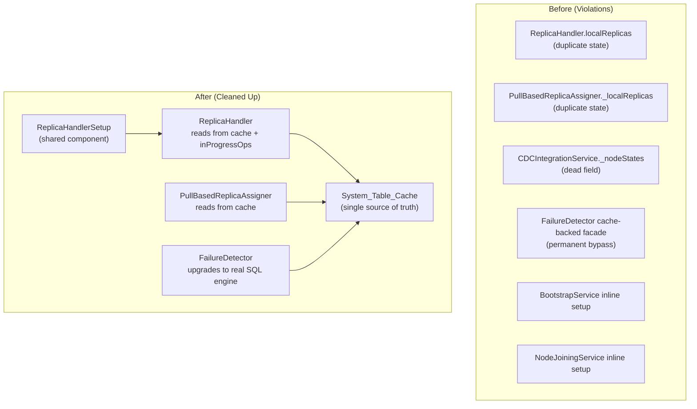

# Design Document: Guideline Violations Cleanup

## Overview

This design addresses seven guideline violations found during a codebase audit. The changes fall into three categories:

1. **State deduplication** (Violations 1–3): Remove local state maps that duplicate what the System_Table_Cache already provides. This includes a dead `_nodeStates` field in CDCIntegrationService, the `localReplicas` map in ReplicaHandler, and the `_localReplicas` map in PullBasedReplicaAssigner.

2. **Magic string elimination** (Violations 4–5): Centralize terminal replica status constants and replace inline string literals in SQL queries across the rebalancer files.

3. **Architectural cleanup** (Violations 6–7): Make FailureDetector upgrade from its cache-backed SQL facade to the real SQL engine, and wire in the existing but unused ReplicaHandlerSetup shared component.

All changes are internal refactors. No new features are added. The public API surface of each component remains compatible, though some methods change their backing data source.

## Architecture

The changes align the codebase with two core architectural principles:

**Single Source of Truth for State**: The System_Table_Cache (updated via CDC events) is the authoritative source for replica state. Components that maintained parallel state maps (ReplicaHandler, PullBasedReplicaAssigner) will read from the cache instead. The trade-off is that cache updates arrive with slight delay after CDC propagation, but the user has explicitly accepted this in favor of consistency across the distributed system.

**No Duplicate Code Paths**: The FailureDetector's cache-backed SQL facade creates a second query path. It will be retained only during early bootstrap and replaced with the real SQL engine as soon as it's available. The ReplicaHandlerSetup shared component will replace duplicated inline setup logic in both bootstrap services.



## Components and Interfaces

### 1. CDCIntegrationService (Violation 1)

**Change**: Remove the dead `this._nodeStates = new Map()` field from the constructor.

**Impact**: None. The field is never read or written. All node state tracking is handled by `CDCEventHandler._nodeStates`.

### 2. ReplicaHandler (Violation 2)

**Change**: Remove `this.localReplicas` Map. Replace all reads with System_Table_Cache queries. Retain `this.inProgressOperations` for transient in-flight tracking. Add a `this.localServices` Map that stores only partition service references (needed for shutdown and voter-readiness checks on the live service object).

**Interface changes**:

- `getLocalReplica(replicaId)` → queries `systemTableCache.get(SystemTableName.SERVICES, replicaId)` and merges with `inProgressOperations` and `localServices` for transient state
- `getAllLocalReplicas()` → queries `systemTableCache.filter(SystemTableName.SERVICES, row => row.node_id === this.nodeId)`
- `registerExistingReplica(replicaInfo)` → stores only the service reference in `localServices`
- `handleCreateReplica()` → idempotency checks use cache + inProgressOperations
- `handleRemoveReplica()` → existence/status checks use cache + inProgressOperations

**Key design decision**: The `inProgressOperations` Map is retained because it tracks operations that have been acknowledged but not yet persisted to the services table via CDC. This is genuinely local transient state, not a duplicate of system state.

The `localServices` Map stores live PartitionService object references keyed by replicaId. The system cache cannot store live objects, so this map is necessary for:
- Calling `service.shutdown()` during removal
- Calling `service.getRole()` during voter-readiness checks
- Calling `service.syncFromLeader()` during creation

### 3. PullBasedReplicaAssigner (Violation 3)

**Change**: Remove `this._localReplicas` Map entirely. The assigner delegates replica creation to ReplicaHandler and does not need its own status tracking.

**Interface changes**:

- `createLocalReplicas()` → no longer updates `_localReplicas`, just delegates to ReplicaHandler and returns results
- `syncReplicaData()` → no longer updates `_localReplicas`, delegates to ReplicaHandler for status
- `getLocalReplicaStatus()` → delegates to ReplicaHandler's `getLocalReplica()` (which reads from cache)
- `getAllLocalReplicas()` → removed (callers should use ReplicaHandler or cache directly)

### 4. Replica Status Constants (Violation 4)

**Change**: Add `TERMINAL_STATUSES` array and `TERMINAL_STATUS_SQL_CLAUSE` string to `src/rebalancer/replica-status.js`.

```javascript
const TERMINAL_STATUSES = [
  ReplicaStatus.ACTIVE,
  ReplicaStatus.REMOVED,
  ReplicaStatus.FAILED,
];

const TERMINAL_STATUS_SQL_CLAUSE =
  TERMINAL_STATUSES.map((s) => `'${s}'`).join(', ');
```

### 5. Unified Rebalancer & Rebalance Coordinator SQL (Violations 4–5)

**Change**: Replace all inline status string literals in SQL queries with references to `TERMINAL_STATUS_SQL_CLAUSE`. Add direction constants for `adjustToOddCount`.

```javascript
// In replica-status.js (new exports)
const ADJUST_DIRECTION = Object.freeze({
  UP: 'up',
  DOWN: 'down',
});

// In unified-rebalancer.js - SQL_BUDGET becomes:
const SQL_BUDGET = Object.freeze({
  SELECT_REBALANCE_BUDGET:
    'SELECT config_value FROM config WHERE config_key = ? LIMIT 1',
  SELECT_IN_FLIGHT_COUNT:
    `SELECT COUNT(*) AS count FROM replica_operations
     WHERE status NOT IN (${TERMINAL_STATUS_SQL_CLAUSE})`,
});

// In rebalance-coordinator.js - SQL becomes:
const SQL = Object.freeze({
  // ... all queries use TERMINAL_STATUS_SQL_CLAUSE instead of inline strings
});
```

### 6. FailureDetector SQL Engine Upgrade (Violation 6)

**Change**: Add an `upgradeSqlQueryEngine(sqlQueryEngine)` method. The existing `createCacheBackedSqlQueryEngine()` remains for early bootstrap. A boolean flag `_usingCacheBackedFacade` tracks whether the facade is still in use.

```javascript
upgradeSqlQueryEngine(sqlQueryEngine) {
  if (!sqlQueryEngine) return;
  this.sqlQueryEngine = sqlQueryEngine;
  this._usingCacheBackedFacade = false;
}
```

The caller (NodeService or bootstrap code) calls `upgradeSqlQueryEngine()` once the real SQL engine is initialized.

### 7. ReplicaHandlerSetup Wiring (Violation 7)

**Change**: Replace the inline `initializeReplicaHandler()` methods in both `BootstrapService` and `NodeJoiningService` with calls to `ReplicaHandlerSetup.create()`.

The existing `ReplicaHandlerSetup.create()` already accepts all needed parameters. The caller-specific `createPartitionService` factory function is passed as a parameter, preserving the different partition creation logic each bootstrap path needs.

After `ReplicaHandlerSetup.create()` returns, the caller still handles:
- Registering bootstrap-created partitions with the handler
- Registering replicas with the state machine
- Any caller-specific post-setup logic

## Data Models

No new data models are introduced. The changes affect how existing data is accessed:

| Component | Before | After |
|-----------|--------|-------|
| ReplicaHandler replica state | `this.localReplicas` Map | `systemTableCache.get/filter(SERVICES)` + `inProgressOperations` + `localServices` |
| PullBasedReplicaAssigner replica state | `this._localReplicas` Map | Delegates to ReplicaHandler / cache |
| CDCIntegrationService node state | `this._nodeStates` (dead) | Removed (CDCEventHandler owns it) |
| Rebalancer terminal statuses | Inline `'active', 'removed', 'failed'` | `TERMINAL_STATUSES` / `TERMINAL_STATUS_SQL_CLAUSE` |
| FailureDetector SQL engine | Cache-backed facade (permanent) | Cache-backed facade (bootstrap only) → real SQL engine |


## Correctness Properties

*A property is a characteristic or behavior that should hold true across all valid executions of a system — essentially, a formal statement about what the system should do. Properties serve as the bridge between human-readable specifications and machine-verifiable correctness guarantees.*

### Property 1: ReplicaHandler idempotency uses cache state

From prework 2.2 and 2.3: The idempotency check for CREATE/REMOVE requests must read replica state from the System_Table_Cache rather than a local map. For any replica in any status in the cache, the handler's idempotency response should match what the cache reports.

*For any* replica ID and any status value in the services table of the System_Table_Cache, when a CREATE_REPLICA request arrives for that replica, the ReplicaHandler's idempotency response should reflect the status from the cache (ALREADY_EXISTS for active, IN_PROGRESS for creating/syncing).

**Validates: Requirements 2.2, 2.3**

### Property 2: Terminal status SQL clause consistency

From prework 4.4: The SQL NOT IN clause must be built programmatically from the TERMINAL_STATUSES constant. This ensures the SQL and the constant never drift apart.

*For any* status value, that status is in the TERMINAL_STATUSES array if and only if it appears in the TERMINAL_STATUS_SQL_CLAUSE string.

**Validates: Requirements 4.1, 4.4**

### Property 3: FailureDetector SQL engine upgrade

From prework 6.2: After upgrading, all queries must go through the real SQL engine, not the cache-backed facade.

*For any* query executed by the FailureDetector after `upgradeSqlQueryEngine()` has been called with a real engine, the real SQL engine's `executeQuery` method should be invoked (not the cache-backed facade).

**Validates: Requirements 6.2, 6.3**

## Error Handling

These changes are internal refactors. Error handling follows existing patterns:

- **Cache miss during idempotency check**: If the System_Table_Cache does not contain a replica entry, the ReplicaHandler treats it as "not found" and proceeds with creation. The `inProgressOperations` map provides a secondary check for operations that have been acknowledged but not yet propagated through CDC.
- **FailureDetector upgrade failure**: If `upgradeSqlQueryEngine()` is called with a null/undefined engine, it is a no-op. The facade continues operating.
- **ReplicaHandlerSetup validation**: The existing `DependencyError` throws in `ReplicaHandlerSetup.create()` are preserved. Missing required dependencies fail fast.

## Testing Strategy

### Property-Based Tests

Property-based tests use `fast-check` with `{numRuns: 10}` per workspace guidelines.

- **Property 1** (ReplicaHandler idempotency): Generate random replica states in a mock cache, send CREATE_REPLICA requests, verify responses match cache state. Tag: `Feature: guideline-violations-cleanup, Property 1: ReplicaHandler idempotency uses cache state`
- **Property 2** (Terminal status SQL clause): Generate random status strings, check membership in TERMINAL_STATUSES matches presence in TERMINAL_STATUS_SQL_CLAUSE. Tag: `Feature: guideline-violations-cleanup, Property 2: Terminal status SQL clause consistency`
- **Property 3** (FailureDetector upgrade): Generate random SQL queries, verify they route to the real engine after upgrade. Tag: `Feature: guideline-violations-cleanup, Property 3: FailureDetector SQL engine upgrade`

### Unit Tests

Unit tests verify specific examples and edge cases:

- CDCIntegrationService constructor does not have `_nodeStates` field
- ReplicaHandler constructor does not have `localReplicas` status-tracking Map
- PullBasedReplicaAssigner constructor does not have `_localReplicas` Map
- ReplicaHandler `registerExistingReplica` stores service reference in `localServices`
- FailureDetector creates cache-backed facade when no SQL engine provided
- FailureDetector `upgradeSqlQueryEngine` replaces facade
- ReplicaHandlerSetup.create() accepts and uses `createPartitionService` factory
- TERMINAL_STATUSES contains exactly [active, removed, failed]
- adjustToOddCount works with ADJUST_DIRECTION constants

### Test Framework

- Node.js built-in test runner (`node:test`)
- `fast-check` for property-based tests (max 10 iterations)
- All tests must complete in under 2 seconds
- No skipped tests
