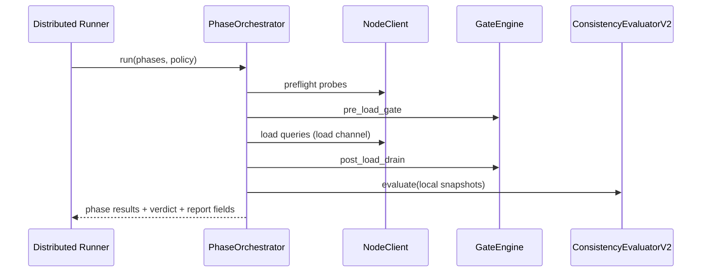
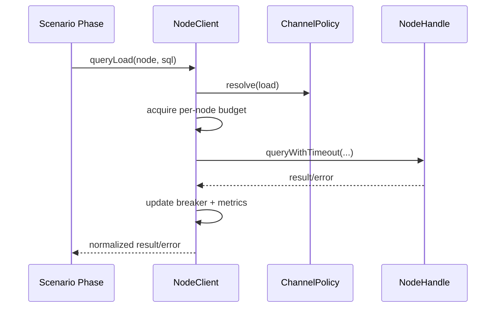

# Design Document: Harness NodeClient and Phase Orchestration Hardening

## Overview

This design restructures the distributed harness around explicit module ownership:

1. `NodeClient` owns all node I/O and channel policies.
2. `PhaseOrchestrator` owns scenario phase sequencing.
3. `GateEngine` owns polling/hysteresis and subset fallback behavior.
4. `ConsistencyEvaluatorV2` owns local-snapshot verification and verdict grading.

The target is to reduce timing brittleness, eliminate duplicated gate logic, and
make benchmark behavior easier to understand and evolve.

## Goals

1. Decouple workload traffic policy from control-plane diagnostics.
2. Make scenario execution a deterministic state machine with explicit outputs.
3. Verify consistency from local evidence rather than distributed fanout.
4. Preserve measurable load metrics even when post-load control visibility is
   temporarily degraded.
5. Improve maintainability via clear module boundaries and single ownership.

## Non-Goals

1. Redesigning core partition placement or rebalancer algorithms.
2. Replacing existing distributed run CLI or playback artifact format.
3. Changing application-level SQL semantics.

## Design Principles

1. One owner per concern: no duplicated query/gate/verification logic.
2. Policy is data: channel behavior configured by centralized policy objects.
3. Deterministic phase flow: no ad hoc phase transitions.
4. Evidence-first verification: compare local snapshots before distributed probes.
5. Additive diagnostics: new fields extend reports without breaking consumers.

## Proposed Architecture

### 1. `NodeClient`

Create `test/distributed/harness/node-client.js` as the single harness node-I/O API.

#### Responsibilities

1. Route operations by channel (`load`, `control`, `probe`, `snapshot`).
2. Apply channel-specific timeout, retry, breaker, and in-flight budgets.
3. Normalize errors with channel and policy context.
4. Emit operation telemetry counters.

#### Public Interface

```javascript
class NodeClient {
  async queryLoad(node, sql, params = [], context = {}) {}
  async queryControl(node, sql, params = [], context = {}) {}
  async probeReadiness(node, scope, context = {}) {}
  async fetchControlSnapshot(node, context = {}) {}
  getPolicySnapshot() {}
  getMetricsSnapshot() {}
}
```

#### Channel Policy Model

```javascript
const CHANNEL = Object.freeze({
  LOAD: 'load',
  CONTROL: 'control',
  PROBE: 'probe',
  SNAPSHOT: 'snapshot',
});

const CHANNEL_POLICY = Object.freeze({
  load: {
    timeoutMs: 2000,
    maxInFlightPerNode: 2,
    retryBudget: 0,
    circuitBreakerThreshold: 1,
    cooldownMs: 5000,
  },
  control: {
    timeoutMs: 15000,
    maxInFlightPerNode: 4,
    retryBudget: 1,
    circuitBreakerThreshold: 3,
    cooldownMs: 5000,
  },
  probe: {
    timeoutMs: 1000,
    maxInFlightPerNode: 2,
    retryBudget: 0,
  },
  snapshot: {
    timeoutMs: 2000,
    maxInFlightPerNode: 2,
    retryBudget: 1,
  },
});
```

### 2. `PhaseOrchestrator`

Create `test/distributed/harness/phase-orchestrator.js`.

#### Phase Contract

Each phase implements:

```javascript
async function executePhase(context) {
  return {
    status: 'ok' | 'warn' | 'fail',
    artifacts: {},
    warnings: [],
    errors: [],
  };
}
```

#### Canonical State Machine

```text
preflight -> converge -> pre_load_gate -> load -> post_load_drain -> verify -> teardown
```

Rules:

1. Transition only to the next legal phase.
2. `status=fail` in a hard-assertion phase aborts remaining phases except
   teardown.
3. `status=warn` records degradation and continues per policy.

### 3. `GateEngine`

Create `test/distributed/harness/gate-engine.js` as reusable logic for quiescence
and drain.

#### Inputs

1. candidate nodes,
2. node probe function,
3. global condition function,
4. timeout, poll interval, stable window,
5. subset fallback policy.

#### Output

```javascript
{
  mode: 'all_ready' | 'subset_ready' | 'failed',
  includedNodeIds: [],
  excludedNodeIds: [],
  attempts: number,
  stableElapsedMs: number,
  reasonHistogram: {},
}
```

#### Algorithm Summary

1. Poll node probes + global condition.
2. Track all-ready stability and last-known-good subset.
3. Return `all_ready` after stable window.
4. At timeout, if allowed and subset is usable, return `subset_ready`.
5. Otherwise fail with detailed reasons.

### 4. Local Control Snapshot Contract

System-side addition: local-only snapshot query/endpoint consumed by harness.

Preferred API shape:

- endpoint: `GET /api/admin/control-snapshot?scope=local`
- or equivalent query command with explicit local scope.

#### Snapshot Schema (v1)

```json
{
  "schemaVersion": 1,
  "nodeId": "...",
  "capturedAt": 1771783000000,
  "nodes": ["..."],
  "partitions": ["..."],
  "leaders": {"partition-id": "node-address"},
  "replicaOperations": {
    "inFlightCount": 0,
    "statusHistogram": {"creating": 0, "syncing": 0}
  }
}
```

Constraints:

1. local-state read only,
2. no distributed operation fanout,
3. bounded execution time.

### 5. `ConsistencyEvaluatorV2`

Create `test/distributed/harness/consistency-evaluator.js`.

#### Responsibilities

1. collect local snapshots from reachable nodes,
2. compare node/partition/leader invariants,
3. classify verdict and produce machine-readable diffs.

#### Verdict Model

```javascript
{
  verdict: 'consistent' | 'inconsistent' | 'insufficient_evidence',
  hardFailure: boolean,
  coverage: {
    reachableNodes: number,
    snapshotNodes: number,
  },
  mismatches: [],
  evidenceWarnings: [],
}
```

Classification:

1. `inconsistent` => hard fail.
2. `insufficient_evidence` => warning or fail according to policy.
3. `consistent` => pass.

### 6. Assertion Policy Engine

Add policy module for hard/soft assertion mapping.

Inputs:

1. phase results,
2. evaluator verdict,
3. configured escalation policy.

Outputs:

1. scenario status,
2. confidence level,
3. warning/failure summaries.

Default policy for benchmark profiles:

1. load/data integrity issues => hard fail,
2. post-load evidence shortfall => warning (`pass_with_warnings`) unless explicitly
   escalated.

### 7. Integration in `postgres-baseline-comparison`

Scenario should become declarative:

1. define phase list,
2. define channel policy overrides,
3. define hard/soft assertion policy,
4. run orchestrator and map artifacts into report.

Existing bespoke loops in scenario file should be moved into shared modules.

## Sequence Flows

### Benchmark Run



### Node I/O Path



## Data and Reporting Changes

Add report fields under scenario details:

1. `phaseTimeline`
2. `verification.verdict`
3. `verification.coverage`
4. `verification.mismatches`
5. `verification.evidenceWarnings`
6. `policy.hardSoftClassification`

Add per-channel operation stats:

1. request count,
2. timeout count,
3. breaker open count,
4. budget deny count,
5. retry count.

## Failure Handling

1. Any hard assertion failure immediately marks scenario failed.
2. Soft assertion warnings are accumulated and surfaced with confidence level.
3. Teardown always runs.
4. All phase failures include phase id, channel, policy, and node scope.

## Testing Strategy

1. Unit tests: NodeClient channel policy behavior and isolation.
2. Unit tests: phase transition legality and phase result contract.
3. Unit tests: GateEngine all-ready and subset fallback behavior.
4. Unit tests: evaluator verdict classification and mismatch diffs.
5. Scenario tests: benchmark flow uses orchestrator phases and shared gate.
6. Integration tests: local snapshot consistency under partial queryability.

## Rollout Plan

1. Introduce new modules with contract tests.
2. Cut scenario to orchestrator path and remove direct legacy loops.
3. Cut assertions to `ConsistencyEvaluatorV2`.
4. Update benchmark configs with explicit channel policies.
5. Run distributed baseline comparison and document metric deltas.

## Expected File Changes

Harness:

1. `test/distributed/harness/node-client.js` (new)
2. `test/distributed/harness/phase-orchestrator.js` (new)
3. `test/distributed/harness/gate-engine.js` (new)
4. `test/distributed/harness/consistency-evaluator.js` (new)
5. `test/distributed/harness/assertions.js`
6. `test/distributed/harness/cluster.js`
7. `test/distributed/harness/load-generator.js`
8. `test/distributed/harness/constants.js`

Scenarios/tests:

1. `test/distributed/scenarios/postgres-baseline-comparison.js`
2. `test/distributed/harness/__tests__/load-generator.test.js`
3. `test/distributed/harness/__tests__/cluster.test.js`
4. `test/distributed/harness/__tests__/postgres-baseline-comparison-scenario.test.js`
5. new tests for node-client, gate-engine, phase-orchestrator,
   consistency-evaluator.

System-facing contract:

1. admin snapshot endpoint/query implementation and tests in runtime code.
