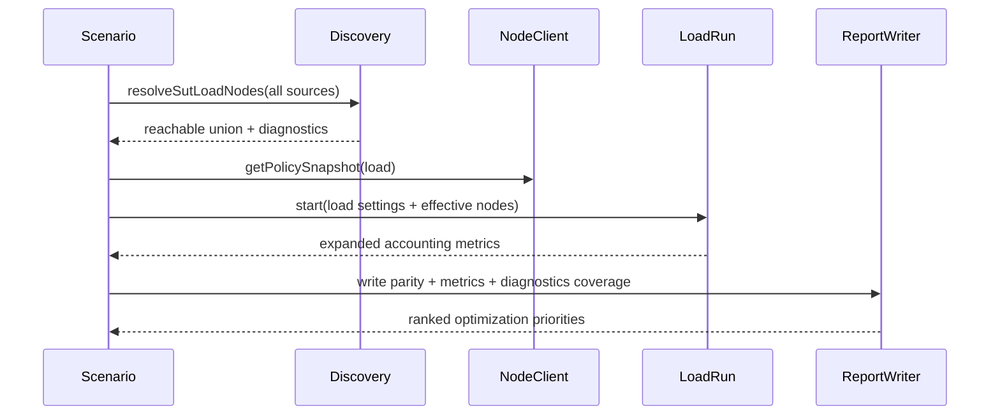

# Design Document: Harness Throughput Parity Optimization

## Overview

This design upgrades the benchmark harness so optimization work is driven by fair
SUT-vs-Postgres comparisons and consistent run telemetry.

The design addresses four high-impact bottlenecks seen in February 24, 2026
runs:

1. effective SUT load fanout often collapses to one node,
2. admission limits can silently dominate throughput,
3. dispatch backlog is large but not fully accounted,
4. some diagnostic surfaces are missing or unstable across runs.

## Goals

1. Enforce explicit load parity between SUT and baseline runs.
2. Remove under-discovery behavior that narrows SUT load fanout.
3. Make admission and queue pressure measurable with stable schema.
4. Increase diagnostic coverage for optimization attribution.
5. Keep module ownership aligned with system guidelines.

## Non-Goals

1. Redesigning the core distributed write path in this spec.
2. Replacing the existing benchmark scenario or report framework.
3. Changing baseline identity semantics beyond cache path stability.

## Design Principles

1. One owner per concern and one code path per concern.
2. Additive report schema changes where possible.
3. Explicit mismatch diagnostics over implicit behavior.
4. Metrics-first decisions for optimization priorities.

## Proposed Changes

### 1. Load Parity Evaluator

Add a parity evaluator in
`test/distributed/scenarios/postgres-baseline-comparison.js` that computes and
stores a parity contract in report details.

#### Contract Shape

```json
{
  "status": "matched|mismatched",
  "reasons": ["..."],
  "configured": {
    "workload": "benchmark_events_mixed",
    "operations": ["INSERT", "SELECT"],
    "durationSeconds": 30,
    "targetOpsPerSec": 120,
    "clients": 8,
    "loadMaxInFlight": 128,
    "loadNodeMaxInFlight": 2
  },
  "effective": {
    "sutLoadNodeCount": 1,
    "baselineLoadNodeCount": 8,
    "sutChannelPolicy": {
      "maxInFlightPerNode": 2,
      "timeoutMs": 4000
    }
  }
}
```

#### Behavior

1. Compare configured and effective dimensions.
2. Emit mismatch reasons with stable codes.
3. Respect profile policy (`failOnParityMismatch`).

### 2. Aggregated SUT Discovery Selection

Update `resolveSutLoadNodes(...)` so discovered node ids are aggregated across
all discovery sources instead of stopping at the first non-empty source.

#### Algorithm

1. Query each source and collect discovered node ids plus exclusion reasons.
2. Union discovered node ids across successful source snapshots.
3. Map union to candidates and run readiness probes.
4. Return reachable union and full per-source diagnostics.

### 3. Unified Admission Policy Resolution

Use a single effective policy view for load channel settings by combining:

1. benchmark config (`loadNodeMaxInFlight`, `loadQueryTimeoutMs`),
2. resolved NodeClient load channel policy,
3. load-generator per-node caps.

Emit this resolved policy in report details so hidden caps are impossible.

### 4. Dispatch Accounting Expansion

Extend `LoadRun` metrics in `test/distributed/harness/load-generator.js`.

#### New Fields

1. `targetOperations`
2. `scheduledOperations`
3. `dispatchedOperations`
4. `undispatchedOperations`
5. `undispatchedByReason`
6. `perNode` counters (dispatched, success, attemptErrors, admissionSignals)

#### Rules

1. `targetOperations` equals duration * target ops/sec.
2. `dispatchedOperations + undispatchedOperations` equals
   `targetOperations`.
3. Queue delay stats remain unchanged and always emitted.

### 5. Stable Baseline Cache Path

Keep cache identity hash unchanged, but move cache path resolution to a stable
report-directory anchor instead of per-run playback output basename.

Proposed default path:

`<report_dir>/.baseline-cache/postgres/<key>.json`

This preserves per-machine/profile identity while enabling reuse across runs with
different report filenames.

### 6. Diagnostics Completeness Contract

For `performanceDiagnostics` in scenario results:

1. include diagnostics object when samples exist,
2. otherwise emit `diagnosticsCoverage` with explicit reason codes,
3. surface coverage in `standardSummary.writePathAttributionSummary`.

This removes silent null diagnostics from optimization workflows.

### 7. Optimization Priority Signal Extensions

Extend priority building in `report-writer` with two new signal families:

1. `dispatch_queue_pressure`
2. `admission_throttling_pressure`

Signal evidence should include queue-delay p95/p99, undispatched ratio,
budget-denial ratio, and effective load-node fanout.

## Data Flow Updates



## Report Schema Additions

Additive fields under scenario benchmark details:

1. `parity`
2. `effectiveAdmissionPolicy`
3. `loadAccounting`
4. `diagnosticsCoverage`

Additive fields in load metrics:

1. `targetOperations`
2. `dispatchedOperations`
3. `undispatchedOperations`
4. `undispatchedByReason`
5. `perNode`

## Correctness and Invariants

1. No mismatch between configured policy and effective policy without explicit
   reason codes.
2. `targetOperations` accounting must balance every run.
3. Discovery diagnostics must include all attempted sources.
4. Cache identity remains profile/machine bound.
5. Existing report consumers continue to function with additive fields.

## Testing Strategy

1. Unit tests for discovery aggregation union and diagnostics shape.
2. Unit tests for load accounting invariants and reason counters.
3. Unit tests for stable cache path behavior.
4. Scenario tests for parity mismatch classification and policy escalation.
5. Report-writer tests for new optimization signals and ranking.

## Rollout Plan

1. Land additive schema fields first.
2. Land discovery aggregation and accounting.
3. Enable parity warning mode in benchmark profiles.
4. Promote to fail-on-mismatch after one clean benchmark cycle.
5. Record baseline before/after metrics in spec report notes.
