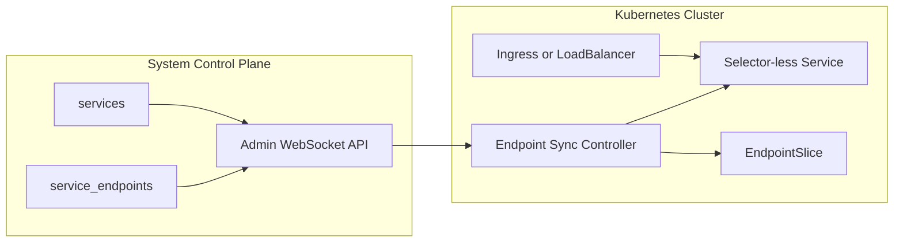

# Design Document: Kubernetes Endpoint Sync Controller

## Overview

This design adds a Kubernetes-native integration layer for runtime-managed
replicated services.

Instead of changing internal ownership, a Kubernetes-side controller projects
canonical endpoint metadata (`service_endpoints`) into Kubernetes discovery
resources:

1. selector-less `Service`
2. managed `EndpointSlice`

The system remains source-of-truth for service lifecycle, placement, and
endpoint publication. Kubernetes receives a read-only projection.

## Goals

1. Preserve single owner model for runtime service placement/lifecycle.
2. Provide Kubernetes-native discovery for replicated runtime services.
3. Make customer installation straightforward through a Helm chart.
4. Keep reconciliation deterministic and idempotent.

## Non-Goals

1. Replacing internal replica placement with Kubernetes scheduling.
2. Running endpoint sync controller inside each system node process.
3. Maintaining multiple source metadata paths.
4. Supporting mixed-port endpoints for one stable Service in strict mode.

## Architecture



## Key Design Decisions

### 1. Controller Runs in Kubernetes, Not in Node Runtime

Deployment unit is a Kubernetes controller Deployment installed by customers
(Helm chart). This avoids coupling internal runtime lifecycle with Kubernetes
API clients.

### 2. Source-of-Truth Remains `service_endpoints`

The controller reads endpoint state through Admin API query execution and never
writes internal metadata.

Default source query projection:

```sql
SELECT
  endpoint_id,
  service_id,
  node_id,
  protocol,
  address,
  port,
  health_status,
  metadata,
  updated_at
FROM service_endpoints
```

Optional joins or additional predicates are allowed only for filtering. Endpoint
address/port/health ownership remains the canonical row.

### 3. Logical Service Grouping Uses Metadata Name First

Endpoint rows are grouped by logical identity:

1. `metadata.service_name` when present
2. fallback `service_id`

Grouping key:

`<logicalServiceName>|<protocol>`

This keeps a stable Service identity even if replica-level IDs vary.

### 4. Strict Port Mode by Default

Each grouped logical service must have one unique port.

If multiple ports are present in one group under strict mode:

1. do not reconcile Service/EndpointSlice changes for that group
2. emit warning event and failure metric
3. continue reconciling other groups

### 5. Selector-Less Service + Managed EndpointSlice

For each group, controller reconciles:

1. one selector-less Service (`spec.selector` omitted)
2. one or more EndpointSlices labeled with
   `kubernetes.io/service-name=<service-name>`

EndpointSlices are chunked by configurable max endpoints per slice.

### 6. Single Reconcile Loop

One periodic reconcile loop performs:

1. read source rows
2. compute desired resources
3. apply upserts
4. garbage collect stale managed resources

No dual stream-vs-poll ownership path is introduced in this version.

## Detailed Design

### A. Configuration Contract

Environment variables:

1. `ENDPOINT_SYNC_ADMIN_STREAM_URL` (required)
2. `ENDPOINT_SYNC_ADMIN_AUTH_TOKEN` (optional)
3. `ENDPOINT_SYNC_INTERVAL_MS` (default `5000`)
4. `ENDPOINT_SYNC_PROTOCOL_ALLOWLIST` (default `postgresql`)
5. `ENDPOINT_SYNC_SERVICE_ID_ALLOWLIST` (optional comma list)
6. `ENDPOINT_SYNC_HEALTHY_ONLY` (default `true`)
7. `ENDPOINT_SYNC_TARGET_NAMESPACE` (default controller namespace)
8. `ENDPOINT_SYNC_STRICT_PORT_MODE` (default `true`)
9. `ENDPOINT_SYNC_UNHEALTHY_POLICY` (`exclude` or `not_ready`)
10. `ENDPOINT_SYNC_MAX_ENDPOINTS_PER_SLICE` (default `100`)
11. `ENDPOINT_SYNC_SERVICE_NAME_PREFIX` (default `svc`)
12. `ENDPOINT_SYNC_LEADER_ELECTION_ENABLED` (default `true`)
13. `ENDPOINT_SYNC_LEASE_NAME` (default `endpoint-sync-controller`)

### B. Source Client

The controller uses Admin WebSocket query flow:

1. connect to `/api/admin/stream`
2. send `{"type":"query","queryId":"...","sql":"...","params":[]}`
3. parse `query_result` rows

A query failure is a reconcile failure; no destructive cleanup is executed on
failed source reads.

### C. Desired-State Model

Internal desired object:

```text
DesiredExport {
  logicalServiceName,
  protocol,
  port,
  endpoints[] {
    endpointId,
    nodeId,
    address,
    port,
    healthStatus,
    metadata
  }
}
```

Filtering order:

1. protocol allowlist
2. service allowlist
3. health policy

### D. Naming Strategy

Service name template:

`<prefix>-<logical-service-name>-<protocol>`

Normalization:

1. lower-case
2. replace invalid DNS-1123 characters with `-`
3. trim repeated `-`
4. max length 63 with deterministic hash suffix

EndpointSlice name template:

`<service-name>-<slice-index>`

### E. EndpointSlice Construction

1. `metadata.labels["kubernetes.io/service-name"] = <service-name>`
2. managed label: `endpointsync.system/managed = "true"`
3. `ports[0].name = <protocol>`
4. `ports[0].port = <port>`
5. endpoint conditions:
   - healthy -> `ready: true`
   - unhealthy with `not_ready` policy -> `ready: false`

Address type handling:

1. parse endpoint address as IPv4, IPv6, or FQDN
2. create separate EndpointSlices per address type as required by Kubernetes

### F. Reconciliation Sequence

Per loop:

1. read source rows
2. build desired exports
3. reconcile Services (create/update)
4. reconcile EndpointSlices (replace managed slices for each service group)
5. remove stale managed resources no longer desired
6. emit metrics/log summary

### G. Garbage Collection Rules

Managed resources are identified by labels:

1. `endpointsync.system/managed=true`
2. `endpointsync.system/source=service_endpoints`
3. `endpointsync.system/service-key=<logical|protocol>`

Only resources with managed labels are eligible for cleanup.

### H. Security

RBAC scope:

1. `services` (core API)
2. `endpointslices` (`discovery.k8s.io`)
3. `leases` (`coordination.k8s.io`) for leader election
4. optional `events` for reconcile diagnostics

Source auth token is injected from Kubernetes Secret.

### I. Observability

Metrics:

1. `endpoint_sync_reconcile_duration_ms`
2. `endpoint_sync_reconcile_failures_total`
3. `endpoint_sync_exported_services`
4. `endpoint_sync_exported_endpoints`
5. `endpoint_sync_port_conflict_total`

Structured log dimensions:

1. `serviceKey`
2. `serviceName`
3. `protocol`
4. `endpointCount`
5. `result`

### J. Helm Example Deliverable

Example chart path:

`examples/kubernetes-endpoint-sync-controller/helm/system-endpoint-sync-controller/`

Chart includes:

1. Deployment
2. ServiceAccount
3. ClusterRole + ClusterRoleBinding
4. optional metrics Service
5. values for source URL, allowlists, sync interval, strict port mode,
   leader election, and secret refs

## Failure Handling

### Source Unavailable

1. Reconcile iteration fails and increments failure metric.
2. Existing projected resources remain unchanged.
3. Next interval retries.

### Port Conflict in Group

1. Group marked failed for current iteration.
2. Event + warning log emitted.
3. Other groups continue reconciling.

### Kubernetes API Write Failure

1. Reconcile iteration records failure.
2. Partial successes are kept (idempotent loop will converge later).
3. Next interval retries remaining drift.

## Rollout Plan

1. Ship sample chart under `examples/` for early customer evaluation.
2. Add controller implementation with unit and integration coverage.
3. Document production hardening (HA replicas, PDB, network policy, TLS).
4. Promote chart from example to supported packaging once validated.
