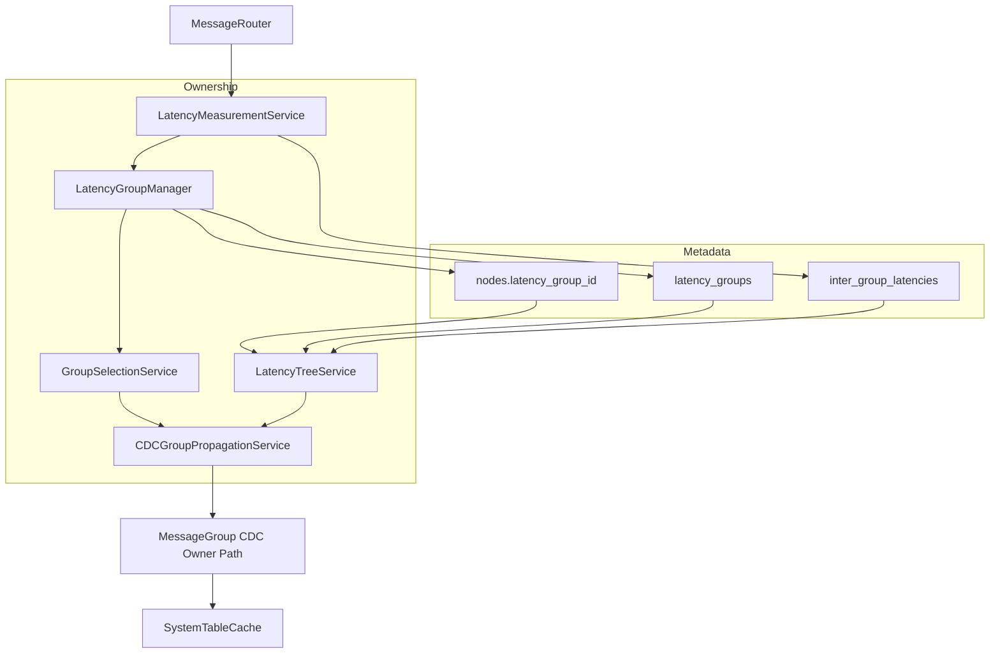

# Design Document: Latency-Aware Topology

## Overview

Latency-aware topology introduces **node latency groups** and **group-level CDC
propagation** to improve scaling and locality in multi-region deployments.

The design is built around current architectural ownership constraints:

- authoritative metadata in system tables via SQL/CDC
- single owner per concern
- startup-owned wiring and shared setup components
- no duplicated fallback implementations

## Goals

- Group nodes by measured RTT and persist membership in system metadata.
- Provide deterministic representative/coordinator selection per group.
- Add topology-aware CDC propagation mode that reduces cross-group fanout.
- Expose topology in admin/observability surfaces.

## Non-Goals

- Replacing core consensus/quorum mechanics.
- Introducing a second metadata cache layer outside SystemTableCache.
- Enabling long-term dual-path (legacy + topology-aware) ownership.

## Architecture

## Owner Map

| Concern | Owner | Notes |
| --- | --- | --- |
| RTT ping/pong sampling | `LatencyMeasurementService` | Uses MessageRouter transport primitives |
| Group assignment/reassignment | `LatencyGroupManager` | Uses authoritative table data only |
| Representative/coordinator selection | `GroupSelectionService` | Deterministic algorithm |
| Latency tree construction | `LatencyTreeService` | In-memory derived view; not persisted |
| Group-level CDC propagation | `CDCGroupPropagationService` | Delegates final apply path to existing CDC owner |

No other component may duplicate these responsibilities.

## Data Model

### 1. `nodes` extension

- Add `latency_group_id`
- Add `last_latency_check_at`
- Add `latency_assignment_state`

### 2. `latency_groups`

- `group_id` (pk)
- `representative_node_id`
- `coordinator_node_id`
- `state`
- `created_at`
- `updated_at`

### 3. `inter_group_latencies`

- `source_group_id`
- `target_group_id`
- `latency_ms`
- `sample_count`
- `last_measured_at`

Primary key: `(source_group_id, target_group_id)`

All mutations are performed through existing SQL/CDC write paths.

## Algorithms

### 1. Group assignment

1. Read active groups from cache/query path.
2. Measure RTT to each representative.
3. Select closest group under threshold.
4. If none match, create new group and assign node.
5. Persist assignment via SQL/CDC.

### 2. Deterministic selection

Representative/coordinator derived deterministically from active group members
(e.g., stable sort key + policy constraints). Selection is recomputed when
membership changes.

### 3. Latency tree build

- Build weighted graph from `inter_group_latencies`.
- Compute rooted tree from local node's group.
- Publish derived neighbor order to propagation service.

Tree is derived runtime state and never persisted as a second source of truth.

### 4. CDC propagation mode

- For each target group, one coordinator receives inter-group ingress.
- Coordinator redistributes locally using existing CDC apply path owner.
- If topology is unavailable, use explicit safe propagation mode and emit
  warning.

## Flow Integration

### Bootstrap

1. Seed initializes base system tables.
2. Latency topology tables are included in schema and cache hydration metadata.
3. Seed exposes latency group hints in bootstrap response.

### Joining

1. Node joins cluster using existing join flow.
2. After router/connect readiness, node starts latency measurements.
3. Node becomes fully assigned when group metadata write commits via CDC.

## Configuration

Define centrally (constants + dynamic config where appropriate):

- `latency.group_threshold_ms`
- `latency.recalc_interval_ms`
- `latency.recalc_jitter_ratio`
- `latency.ping_timeout_ms`
- `latency.ping_retry_count`
- `latency.smoothing_alpha`
- `latency.propagation_mode` (`grouped` or safe fallback mode)

All values validated at startup; invalid values fail fast.

## Failure Handling

- Representative unreachable: recompute representative and persist.
- Coordinator unreachable: recompute coordinator and persist.
- Missing topology data: switch propagation mode, preserve correctness, log
  explicit degradation.
- Partial measurement failures: keep prior stable assignment until next
  successful cycle.

## Observability

- Info logs: assignment changes, representative/coordinator changes.
- Debug logs: RTT samples, recalculation inputs/results, tree recompute details.
- Metrics:
  - group count
  - reassignment count
  - representative failovers
  - coordinator failovers
  - grouped propagation fanout stats

## Testing Strategy

### Unit

- Assignment decision rules
- Deterministic selection rules
- RTT smoothing and timeout behavior
- Tree construction validity

### Property

- Deterministic selection convergence from identical metadata snapshots
- Reassignment stability under bounded RTT fluctuation
- No duplicate owner path usage for assignment and propagation

### Integration

- Seed + join assignment completion
- Representative/coordinator failover
- Grouped propagation correctness
- Safe mode fallback behavior

## Migration and Rollout

### Phase 1: Metadata and read-path readiness

- Add schema/constants/cache support.
- Keep propagation behavior functionally equivalent to current mode.

### Phase 2: Assignment and selection lifecycle

- Enable measurement, assignment, and deterministic selection.
- Add observability and admin visibility.

### Phase 3: Grouped CDC propagation

- Enable grouped mode behind explicit rollout config.
- Remove duplicate/legacy propagation code paths after validation.

## Documentation Impact

Update `.kiro/steering/architecture.md` with:

- owner map for latency topology services
- metadata flow through SQL/CDC path
- grouped CDC propagation mode and fallback semantics
