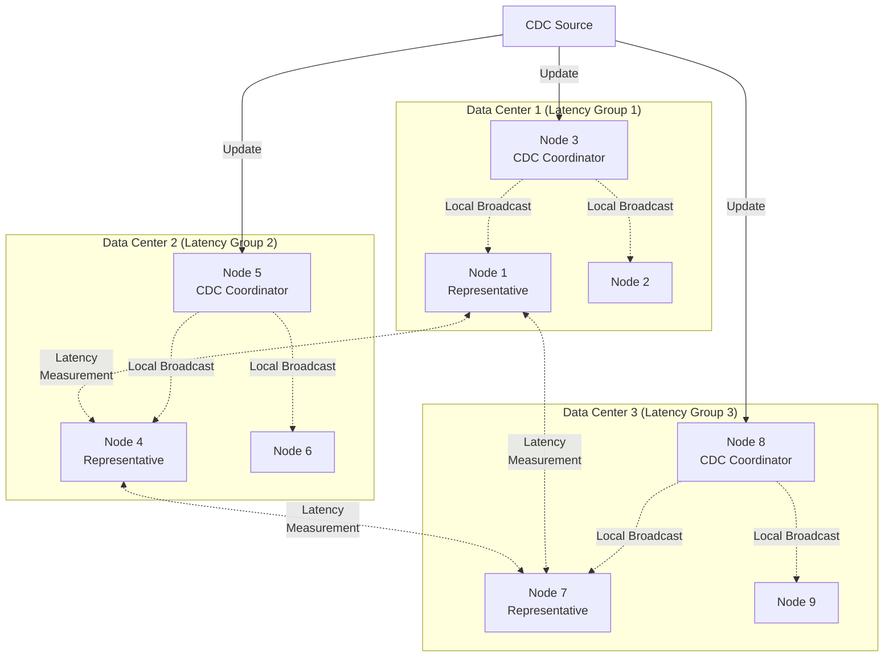
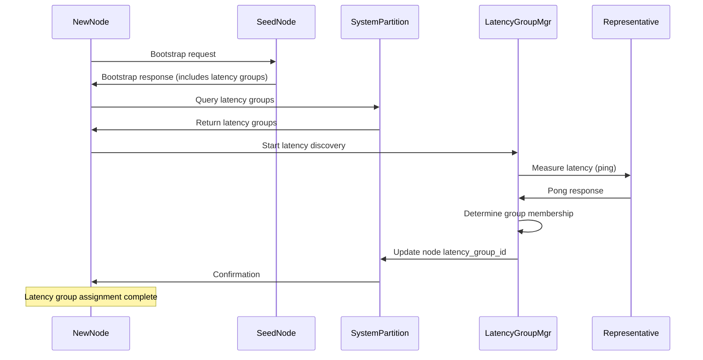

# Design Document: Latency-Aware Topology

## Overview

The latency-aware topology system organizes nodes into latency groups based on measured network latency, enabling the distributed database to scale to thousands of nodes across multiple data centers. The system dynamically assigns nodes to latency groups, computes hierarchical routing trees locally, and optimizes CDC propagation by broadcasting to one coordinator per latency group for local redistribution.

This design addresses the fundamental challenge of scaling distributed systems across geographic regions: as the number of nodes grows, broadcasting updates to every node becomes prohibitively expensive. By organizing nodes into latency groups and using hierarchical propagation, the system reduces CDC broadcast complexity from O(nodes) to O(latency_groups), enabling efficient scaling to thousands of nodes.

## Architecture



### Core Principles

1. **Latency-Based Clustering**: Nodes automatically group themselves based on measured network latency
2. **Dynamic Membership**: Latency group membership recalculates periodically to adapt to network changes
3. **Local Tree Computation**: Each node computes its own latency tree from CDC-propagated membership data
4. **Hierarchical CDC**: Updates propagate to one coordinator per group, then redistribute locally
5. **Deterministic Selection**: Representatives and coordinators are selected deterministically for consistency
6. **Self-Organizing**: No central coordinator - nodes make autonomous decisions based on shared state

## Components and Interfaces

### Latency Measurement Service

The Latency Measurement Service handles ping-pong exchanges to measure round-trip latency between nodes.

**Responsibilities:**
- Send ping messages to latency group representatives
- Respond to ping messages immediately
- Calculate round-trip latency from ping-pong exchanges
- Track measurement history for stability
- Use exponential moving average to smooth latency measurements

**Interface:**
```javascript
class LatencyMeasurementService {
  async measureLatency(targetNodeAddress)
  async handlePingRequest(sourceNodeId)
  async handlePongResponse(targetNodeId, sendTimestamp)
  getSmoothedLatency(targetNodeId)
  getLatencyHistory(targetNodeId)
}
```

**Ping-Pong Protocol:**
```javascript
// Ping message format
{
  type: 'LATENCY_PING',
  sourceNodeId: 'node-uuid',
  timestamp: Date.now(),
  messageId: 'ping-uuid'
}

// Pong response format
{
  type: 'LATENCY_PONG',
  targetNodeId: 'node-uuid',
  originalTimestamp: 1234567890,
  messageId: 'ping-uuid'
}
```

**Latency Calculation:**
```javascript
async measureLatency(targetNodeAddress) {
  const sendTime = Date.now();
  const pingMessage = {
    type: 'LATENCY_PING',
    sourceNodeId: this.nodeId,
    timestamp: sendTime,
    messageId: uuid.v4()
  };
  
  const pongResponse = await this.sendPingWithTimeout(
    targetNodeAddress,
    pingMessage,
    5000  // 5 second timeout
  );
  
  const receiveTime = Date.now();
  const rtt = receiveTime - sendTime;
  
  // Update exponential moving average
  const alpha = 0.3;  // Smoothing factor
  const previousLatency = this.latencyCache.get(targetNodeAddress) || rtt;
  const smoothedLatency = alpha * rtt + (1 - alpha) * previousLatency;
  
  this.latencyCache.set(targetNodeAddress, smoothedLatency);
  
  return smoothedLatency;
}
```

### Latency Group Manager

The Latency Group Manager handles latency group discovery, membership, and recalculation.

**Responsibilities:**
- Discover existing latency groups from system tables
- Measure latency to all known latency group representatives
- Determine appropriate latency group membership
- Create new latency groups when necessary
- Schedule periodic recalculation with jitter
- Update nodes table with membership changes

**Interface:**
```javascript
class LatencyGroupManager {
  async discoverLatencyGroups()
  async determineGroupMembership()
  async createLatencyGroup()
  async joinLatencyGroup(groupId)
  async leaveLatencyGroup(groupId)
  scheduleRecalculation()
  async recalculateGroupMembership()
}
```

**Group Discovery and Membership Algorithm:**
```javascript
async determineGroupMembership() {
  // Query system tables for all latency groups
  const latencyGroups = await this.queryLatencyGroups();
  
  if (latencyGroups.length === 0) {
    // No groups exist - create first group
    return await this.createLatencyGroup();
  }
  
  // Measure latency to each group's representative
  const measurements = [];
  for (const group of latencyGroups) {
    const representative = await this.getGroupRepresentative(group.group_id);
    if (!representative) continue;
    
    const latency = await this.latencyMeasurement.measureLatency(
      representative.node_address
    );
    
    measurements.push({
      groupId: group.group_id,
      latency: latency
    });
  }
  
  // Sort by latency (closest first)
  measurements.sort((a, b) => a.latency - b.latency);
  
  // Check if closest group is below threshold
  const threshold = config.get('latency.groupThresholdMs');
  if (measurements[0].latency < threshold) {
    return await this.joinLatencyGroup(measurements[0].groupId);
  }
  
  // No suitable group found - create new one
  return await this.createLatencyGroup();
}
```

**Recalculation Scheduling:**
```javascript
scheduleRecalculation() {
  const baseInterval = config.get('latency.recalculationIntervalMs');
  const jitterFactor = 0.25;  // ±25% jitter
  
  const jitter = baseInterval * jitterFactor * (Math.random() - 0.5);
  const delay = baseInterval + jitter;
  
  setTimeout(async () => {
    await this.recalculateGroupMembership();
    this.scheduleRecalculation();  // Schedule next recalculation
  }, delay);
}

async recalculateGroupMembership() {
  const currentGroupId = this.currentLatencyGroupId;
  const newGroupId = await this.determineGroupMembership();
  
  if (newGroupId !== currentGroupId) {
    logger.info('Latency group membership changed', {
      nodeId: this.nodeId,
      oldGroupId: currentGroupId,
      newGroupId: newGroupId
    });
    
    // Update nodes table with new membership
    await this.updateNodeLatencyGroup(newGroupId);
  }
}
```

### Latency Tree Builder

The Latency Tree Builder computes a minimum spanning tree of latency groups for efficient routing.

**Responsibilities:**
- Build minimum spanning tree from latency group membership data
- Use node's own latency group as tree root
- Compute routing paths to all other latency groups
- Recompute tree when latency group membership changes
- Provide routing queries for CDC propagation

**Interface:**
```javascript
class LatencyTreeBuilder {
  async buildTree()
  getRoutingPath(targetGroupId)
  getNeighborGroups()
  getTreeDepth()
  visualizeTree()
}
```

**Tree Construction Algorithm:**

The system uses Prim's algorithm to build a minimum spanning tree from the perspective of each node's latency group. This approach is well-suited for distributed systems where each node needs its own routing perspective.

```javascript
async buildTree() {
  // Get all latency groups and inter-group latencies
  const groups = await this.queryLatencyGroups();
  const latencies = await this.queryInterGroupLatencies();
  
  // Build adjacency matrix
  const adjacency = this.buildAdjacencyMatrix(groups, latencies);
  
  // Run Prim's algorithm with own group as root
  const mst = this.primsAlgorithm(adjacency, this.currentGroupId);
  
  // Convert MST to routing table
  this.routingTable = this.buildRoutingTable(mst);
  
  return mst;
}

primsAlgorithm(adjacency, rootGroupId) {
  const visited = new Set([rootGroupId]);
  const mst = new Map();  // child -> parent mapping
  const edges = [];
  
  // Initialize edges from root
  for (const [neighbor, latency] of adjacency.get(rootGroupId)) {
    edges.push({ from: rootGroupId, to: neighbor, latency });
  }
  
  while (visited.size < adjacency.size && edges.length > 0) {
    // Sort edges by latency (minimum first)
    edges.sort((a, b) => a.latency - b.latency);
    
    // Find minimum edge to unvisited node
    let minEdge = null;
    for (const edge of edges) {
      if (!visited.has(edge.to)) {
        minEdge = edge;
        break;
      }
    }
    
    if (!minEdge) break;
    
    // Add edge to MST
    visited.add(minEdge.to);
    mst.set(minEdge.to, minEdge.from);
    
    // Add edges from newly visited node
    for (const [neighbor, latency] of adjacency.get(minEdge.to)) {
      if (!visited.has(neighbor)) {
        edges.push({ from: minEdge.to, to: neighbor, latency });
      }
    }
    
    // Remove edges to visited nodes
    edges = edges.filter(e => !visited.has(e.to));
  }
  
  return mst;
}

buildRoutingTable(mst) {
  // Convert parent pointers to routing paths
  const routing = new Map();
  
  for (const [child, parent] of mst.entries()) {
    // For each group, determine next hop
    routing.set(child, parent);
  }
  
  return routing;
}

getRoutingPath(targetGroupId) {
  // Return next hop toward target group
  if (targetGroupId === this.currentGroupId) {
    return null;  // Already at target
  }
  
  // Walk up tree from target to find path
  const path = [];
  let current = targetGroupId;
  
  while (current && current !== this.currentGroupId) {
    path.unshift(current);
    current = this.routingTable.get(current);
  }
  
  // Return first hop (neighbor group)
  return path.length > 0 ? path[0] : null;
}
```

### CDC Coordinator Selector

The CDC Coordinator Selector deterministically selects coordinator nodes within each latency group.

**Responsibilities:**
- Select CDC coordinator for local latency group
- Use deterministic selection algorithm (e.g., lowest node_id)
- Handle coordinator failure and replacement
- Provide coordinator lookup for other groups

**Interface:**
```javascript
class CDCCoordinatorSelector {
  async selectLocalCoordinator()
  async getCoordinatorForGroup(groupId)
  isLocalCoordinator()
  async handleCoordinatorFailure(groupId, failedNodeId)
}
```

**Coordinator Selection Algorithm:**
```javascript
async selectLocalCoordinator() {
  // Get all nodes in local latency group
  const groupNodes = await this.queryNodesInGroup(this.currentGroupId);
  
  if (groupNodes.length === 0) {
    return null;
  }
  
  // Sort by node_id (deterministic)
  groupNodes.sort((a, b) => a.node_id.localeCompare(b.node_id));
  
  // Select first active node
  for (const node of groupNodes) {
    if (node.status === 'active') {
      return node.node_id;
    }
  }
  
  return null;
}

isLocalCoordinator() {
  const coordinator = await this.selectLocalCoordinator();
  return coordinator === this.nodeId;
}

async handleCoordinatorFailure(groupId, failedNodeId) {
  // Coordinator failure detected - select new coordinator
  const newCoordinator = await this.selectLocalCoordinator();
  
  if (newCoordinator === this.nodeId) {
    logger.info('Became CDC coordinator for latency group', {
      nodeId: this.nodeId,
      groupId: groupId,
      previousCoordinator: failedNodeId
    });
    
    // Start coordinator duties
    await this.startCoordinatorDuties();
  }
}
```

### Hierarchical CDC Propagator

The Hierarchical CDC Propagator handles CDC update distribution through latency groups.

**Responsibilities:**
- Receive CDC updates from system tables
- Propagate updates to coordinators in all latency groups
- Redistribute updates locally within latency group (if coordinator)
- Use latency tree for efficient routing
- Handle coordinator failures with retry

**Interface:**
```javascript
class HierarchicalCDCPropagator {
  async propagateCDCUpdate(update)
  async redistributeLocally(update)
  async sendToCoordinator(groupId, update)
  async handlePropagationFailure(groupId, update)
}
```

**CDC Propagation Flow:**
```javascript
async propagateCDCUpdate(update) {
  // Get all latency groups
  const groups = await this.queryLatencyGroups();
  
  // Send to coordinator in each group
  const propagationPromises = groups.map(async (group) => {
    if (group.group_id === this.currentGroupId) {
      // Local group - redistribute directly
      return await this.redistributeLocally(update);
    } else {
      // Remote group - send to coordinator
      return await this.sendToCoordinator(group.group_id, update);
    }
  });
  
  // Wait for all propagations (with timeout)
  await Promise.allSettled(propagationPromises);
}

async redistributeLocally(update) {
  // Get all nodes in local latency group
  const localNodes = await this.queryNodesInGroup(this.currentGroupId);
  
  // Send update to each local node
  const redistributionPromises = localNodes.map(async (node) => {
    if (node.node_id === this.nodeId) {
      return;  // Skip self
    }
    
    try {
      await this.messageGroup.sendMessage(node.node_address, {
        type: 'CDC_UPDATE',
        update: update
      });
    } catch (error) {
      logger.warn('Failed to redistribute CDC update locally', {
        targetNode: node.node_id,
        error: error.message
      });
    }
  });
  
  await Promise.allSettled(redistributionPromises);
}

async sendToCoordinator(groupId, update) {
  const coordinator = await this.coordinatorSelector.getCoordinatorForGroup(groupId);
  
  if (!coordinator) {
    logger.warn('No coordinator found for latency group', { groupId });
    return;
  }
  
  try {
    await this.messageGroup.sendMessage(coordinator.node_address, {
      type: 'CDC_UPDATE_FOR_GROUP',
      groupId: groupId,
      update: update
    });
  } catch (error) {
    logger.error('Failed to send CDC update to coordinator', {
      groupId: groupId,
      coordinator: coordinator.node_id,
      error: error.message
    });
    
    await this.handlePropagationFailure(groupId, update);
  }
}
```

### Latency Group Representative Selector

The Latency Group Representative Selector manages representative node designation for latency measurements.

**Responsibilities:**
- Select representative for local latency group
- Use deterministic selection (e.g., lowest node_id)
- Handle representative failure and replacement
- Provide representative lookup for all groups

**Interface:**
```javascript
class LatencyGroupRepresentativeSelector {
  async selectLocalRepresentative()
  async getRepresentativeForGroup(groupId)
  isLocalRepresentative()
  async handleRepresentativeFailure(groupId, failedNodeId)
}
```

**Representative Selection:**
```javascript
async selectLocalRepresentative() {
  // Get all nodes in local latency group
  const groupNodes = await this.queryNodesInGroup(this.currentGroupId);
  
  if (groupNodes.length === 0) {
    return null;
  }
  
  // Sort by node_id (deterministic)
  groupNodes.sort((a, b) => a.node_id.localeCompare(b.node_id));
  
  // Select first active node
  for (const node of groupNodes) {
    if (node.status === 'active') {
      return node.node_id;
    }
  }
  
  return null;
}
```

## Data Models

### Latency Groups Table

```sql
CREATE TABLE latency_groups (
  group_id TEXT PRIMARY KEY,
  created_at INTEGER NOT NULL,
  representative_node_id TEXT,
  status TEXT NOT NULL DEFAULT 'active', -- active, inactive
  FOREIGN KEY (representative_node_id) REFERENCES nodes(node_id)
);
```

### Nodes Table Extension

The existing `nodes` table is extended with a latency group membership column:

```sql
ALTER TABLE nodes ADD COLUMN latency_group_id TEXT;
ALTER TABLE nodes ADD COLUMN last_latency_check INTEGER;
ALTER TABLE nodes ADD FOREIGN KEY (latency_group_id) REFERENCES latency_groups(group_id);
```

### Inter-Group Latency Cache

This table stores measured latencies between latency groups for tree construction:

```sql
CREATE TABLE inter_group_latencies (
  source_group_id TEXT NOT NULL,
  target_group_id TEXT NOT NULL,
  latency_ms REAL NOT NULL,
  measured_at INTEGER NOT NULL,
  measured_by_node_id TEXT NOT NULL,
  PRIMARY KEY (source_group_id, target_group_id),
  FOREIGN KEY (source_group_id) REFERENCES latency_groups(group_id),
  FOREIGN KEY (target_group_id) REFERENCES latency_groups(group_id),
  FOREIGN KEY (measured_by_node_id) REFERENCES nodes(node_id)
);
```

## Bootstrap Integration

When a new node joins the cluster, it integrates with the latency-aware topology system:



**Bootstrap Sequence:**

1. **Initial Bootstrap**: New node receives basic cluster information from seed node
2. **Query Latency Groups**: New node queries system partition for all latency groups
3. **Latency Measurement**: New node measures latency to each group's representative
4. **Group Selection**: New node joins closest group or creates new group
5. **Membership Update**: New node updates its latency_group_id in nodes table
6. **CDC Propagation**: Membership change propagates via CDC to all nodes
7. **Tree Recomputation**: Nodes recompute latency trees with new membership

## Error Handling

### Representative Failure

When a latency group representative fails:

1. **Detection**: Nodes detect representative failure through heartbeat monitoring
2. **Selection**: Deterministic selection algorithm chooses new representative
3. **Update**: New representative_node_id written to latency_groups table
4. **Propagation**: CDC propagates representative change to all nodes
5. **Remeasurement**: Nodes remeasure latency to new representative on next recalculation

### Coordinator Failure

When a CDC coordinator fails:

1. **Detection**: Nodes detect coordinator failure through message delivery failures
2. **Selection**: Deterministic selection algorithm chooses new coordinator
3. **Takeover**: New coordinator begins receiving and redistributing CDC updates
4. **Retry**: Failed CDC updates are retried to new coordinator
5. **Logging**: Coordinator changes logged for observability

### Latency Group Isolation

When a latency group becomes isolated from others:

1. **Detection**: Latency measurements to other groups timeout
2. **Local Operation**: Isolated group continues operating independently
3. **CDC Buffering**: CDC updates buffer for later propagation
4. **Reconnection**: When connectivity restores, buffered updates propagate
5. **Tree Recomputation**: Latency trees recompute with restored connectivity

### Network Partition

When network partitions occur:

1. **Partition Detection**: Nodes detect inability to reach other latency groups
2. **Independent Operation**: Each partition operates independently
3. **Raft Consensus**: Raft ensures consistency within each partition
4. **Partition Healing**: When network heals, partitions reconcile
5. **Conflict Resolution**: Raft log reconciliation resolves conflicts

## Configuration

```javascript
const latencyConfig = {
  // Latency group membership
  groupThresholdMs: 20,              // Maximum latency to join group
  recalculationIntervalMs: 300000,   // 5 minutes
  recalculationJitterFactor: 0.25,   // ±25% jitter
  
  // Latency measurement
  pingTimeoutMs: 5000,               // Ping timeout
  smoothingFactor: 0.3,              // Exponential moving average alpha
  measurementSamples: 3,             // Samples per measurement
  
  // CDC propagation
  coordinatorCount: 1,               // Coordinators per group
  propagationTimeoutMs: 10000,       // CDC propagation timeout
  retryAttempts: 3,                  // Retry attempts on failure
  retryDelayMs: 1000,                // Delay between retries
  
  // Tree construction
  treeRebuildIntervalMs: 60000,      // 1 minute
  maxTreeDepth: 10,                  // Maximum tree depth
  
  // Caching
  interGroupLatencyTTL: 300000,      // 5 minutes
  representativeCacheTTL: 60000      // 1 minute
};
```

## Testing Strategy

The testing strategy employs both unit tests for component functionality and property-based tests for correctness properties.

### Unit Testing Approach

Unit tests will focus on:
- **Latency Measurement**: Ping-pong protocol and RTT calculation
- **Group Discovery**: Membership determination algorithm
- **Tree Construction**: Prim's algorithm correctness
- **Coordinator Selection**: Deterministic selection logic
- **CDC Propagation**: Hierarchical distribution flow
- **Failure Handling**: Representative and coordinator failover

### Property-Based Testing Framework

We will use **fast-check** for JavaScript property-based testing, configured with minimum 100 iterations per test.

Each property test will be tagged with: **Feature: latency-aware-topology, Property {number}: {property_text}**

### Test Environment Setup

- **Mock Latency**: Simulate varying latencies between nodes
- **Multi-Datacenter Simulation**: Create virtual data centers with latency islands
- **Failure Injection**: Simulate representative and coordinator failures
- **Network Partition**: Test partition and healing scenarios
- **Scale Testing**: Test with hundreds of simulated nodes

## Correctness Properties

*A property is a characteristic or behavior that should hold true across all valid executions of a system—essentially, a formal statement about what the system should do. Properties serve as the bridge between human-readable specifications and machine-verifiable correctness guarantees.*

### Property 1: Latency Group Membership Validity
*For any* node in the system, if it is a member of a latency group, then either the measured latency to that group's representative is below the threshold, or no other group has latency below the threshold
**Validates: Requirements 1.2, 1.3**

### Property 2: Latency Group Creation Necessity
*For any* node that creates a new latency group, all existing latency groups should have measured latency above the threshold
**Validates: Requirements 1.3, 1.4**

### Property 3: Recalculation Periodicity
*For any* node, latency group membership recalculation should occur at intervals within the configured range (base interval ± jitter)
**Validates: Requirements 2.1, 2.6**

### Property 4: Membership Adaptation
*For any* node, if a closer latency group becomes available during recalculation, the node should switch to that group
**Validates: Requirements 2.3**

### Property 5: CDC Propagation Completeness
*For any* latency group membership change, the update should propagate via CDC to all nodes in the system
**Validates: Requirements 3.3**

### Property 6: Latency Tree Validity
*For any* node's computed latency tree, it should form a valid spanning tree connecting all latency groups with the node's group as root
**Validates: Requirements 4.2, 4.4**

### Property 7: Latency Tree Minimality
*For any* node's computed latency tree, the total edge weight should be minimal (or near-minimal) among all possible spanning trees
**Validates: Requirements 4.2**

### Property 8: Ping-Pong Round Trip
*For any* ping message sent to a representative, a pong response should be received within the timeout period, and the calculated latency should equal the round-trip time
**Validates: Requirements 5.1, 5.2, 5.3**

### Property 9: CDC Coordinator Coverage
*For any* latency group, exactly one node should be designated as the CDC coordinator at any given time
**Validates: Requirements 6.1, 6.3**

### Property 10: Local CDC Redistribution
*For any* CDC update received by a coordinator, it should be redistributed to all nodes within the coordinator's latency group
**Validates: Requirements 6.2**

### Property 11: Hierarchical CDC Routing
*For any* CDC update propagating to a distant latency group, it should route through intermediate groups according to the latency tree
**Validates: Requirements 6.5, 6.6**

### Property 12: Representative Determinism
*For any* latency group, all nodes should compute the same representative node using the deterministic selection algorithm
**Validates: Requirements 7.1, 7.3**

### Property 13: Representative Failover
*For any* representative failure, a new representative should be selected from the remaining active nodes in the group
**Validates: Requirements 7.2, 7.4**

### Property 14: Bootstrap Latency Discovery
*For any* new node completing bootstrap, it should receive latency group information and immediately begin latency measurements
**Validates: Requirements 8.1, 8.2, 8.3**

### Property 15: Inter-Group Latency Consistency
*For any* pair of latency groups, the measured inter-group latency should be consistent across nodes that measure it (within measurement variance)
**Validates: Requirements 9.1, 9.3**

### Property 16: Configuration Validity
*For any* latency configuration parameter, it should be validated at startup and use sensible defaults when not configured
**Validates: Requirements 10.4, 10.5**

### Property 17: Latency Group Lifecycle
*For any* latency group with no member nodes, it should be marked as inactive but remain in the system for potential reuse
**Validates: Requirements 11.2, 11.3**

### Property 18: Coordinator Failure Recovery
*For any* CDC coordinator failure, a new coordinator should be selected and CDC propagation should resume within the retry timeout
**Validates: Requirements 12.1, 12.2**

### Property 19: Partition Independence
*For any* network partition, latency groups within each partition should continue operating independently
**Validates: Requirements 12.5**

### Property 20: Latency Measurement Logging
*For any* latency group membership change, it should be logged at info level with relevant metadata
**Validates: Requirements 13.1**

### Property 21: Message Group Latency Awareness
*For any* message routing decision, the message group should consider latency group membership when available
**Validates: Requirements 14.1, 14.2**
