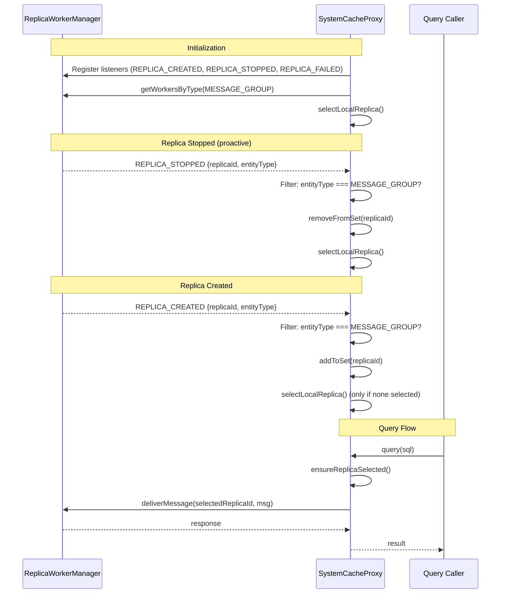

# Design Document: Message Group Resilient Proxy

## Overview

This design makes SystemCacheProxy event-driven by wiring it to ReplicaWorkerManager lifecycle events. Instead of discovering a dead replica reactively (on query failure), the proxy is notified proactively when replicas are created, stopped, or crash. Health-aware selection avoids routing queries to unhealthy workers.

The design prioritizes simplicity for the common case: most nodes have exactly one message group replica. Event-driven notification and re-selection add near-zero overhead in that scenario.

### Key Design Decisions

1. **Event filtering in the handler** — SystemCacheProxy registers for all replica events but filters to `MESSAGE_GROUP` entity type. This avoids coupling ReplicaWorkerManager to proxy-specific event channels.
2. **No retry in sendCacheQuery** — The reactive retry-on-failure path is removed. Proactive event-driven re-selection is the single mechanism for switching replicas. This follows the "no legacy/fallback code" principle.
3. **Health-aware but not health-obsessed** — Selection prefers healthy replicas but falls back to any available replica if all are unhealthy. A single unhealthy replica is better than no replica.
4. **Bound listener references** — Listeners are stored as bound method references so they can be cleanly removed during shutdown.
5. **Remove dual selection paths** — `NodeService._primaryMessageGroup`, `setPrimaryMessageGroup()`, and `_getLocalMessageGroupReplica()` are a parallel replica selection mechanism that contradicts the "one code path" rule. These are removed; NodeService delegates to SystemCacheProxy for all cache access.
6. **Remove polling fallback** — `ensureReplicaSelected()` no longer polls `getWorkersByType()`. With event-driven wiring, if no replica is selected, it's because none exist. The method just checks and throws.
7. **Remove `onReplicaSetChanged()`** — This public method becomes dead code once event handlers manage the set directly. Removed to avoid two mechanisms for set updates.
8. **Rename `updateLocalReplicaSet()` to `loadInitialReplicaSet()`** — Only called once during `initialize()` for the initial snapshot. After that, events maintain the set incrementally.

## Architecture



## Components and Interfaces

### 1. WORKER_EVENT Constants (worker-constants.js)

Add the missing event constants that ReplicaWorkerManager already emits:

```javascript
const WORKER_EVENT = Object.freeze({
  INITIALIZED: 'initialized',
  STARTED: 'started',
  STOPPED: 'stopped',
  FAILED: 'failed',
  REPLICA_CREATED: 'replica_created',
  REPLICA_STOPPED: 'replica_stopped',
  REPLICA_FAILED: 'replica_failed',
});
```

### 2. SystemCacheProxy Changes (system-cache-proxy.js)

#### New Constructor Parameter

```javascript
constructor(options = {}) {
  // ... existing validation ...
  this.workerManager = options.workerManager;

  // Bound listener references for clean removal
  this._onReplicaCreated = null;
  this._onReplicaStopped = null;
  this._onReplicaFailed = null;
}
```

#### New: registerEventListeners()

Called during `initialize()`. Registers bound listeners on `workerManager` for the three lifecycle events.

```javascript
registerEventListeners() {
  this._onReplicaCreated = this.handleReplicaCreated.bind(this);
  this._onReplicaStopped = this.handleReplicaStopped.bind(this);
  this._onReplicaFailed = this.handleReplicaFailed.bind(this);

  this.workerManager.on(WORKER_EVENT.REPLICA_CREATED, this._onReplicaCreated);
  this.workerManager.on(WORKER_EVENT.REPLICA_STOPPED, this._onReplicaStopped);
  this.workerManager.on(WORKER_EVENT.REPLICA_FAILED, this._onReplicaFailed);
}
```

#### New: removeEventListeners()

Called during `shutdown()`. Removes all registered listeners.

```javascript
removeEventListeners() {
  if (this._onReplicaCreated) {
    this.workerManager.removeListener(
      WORKER_EVENT.REPLICA_CREATED, this._onReplicaCreated
    );
  }
  if (this._onReplicaStopped) {
    this.workerManager.removeListener(
      WORKER_EVENT.REPLICA_STOPPED, this._onReplicaStopped
    );
  }
  if (this._onReplicaFailed) {
    this.workerManager.removeListener(
      WORKER_EVENT.REPLICA_FAILED, this._onReplicaFailed
    );
  }
  this._onReplicaCreated = null;
  this._onReplicaStopped = null;
  this._onReplicaFailed = null;
}
```

#### New: Event Handlers

Each handler filters by `entityType === WORKER_ENTITY_TYPE.MESSAGE_GROUP`, then updates the local replica set and re-selects as needed.

```javascript
handleReplicaCreated(event) {
  if (event.entityType !== WORKER_ENTITY_TYPE.MESSAGE_GROUP) return;
  this.localReplicaIds.add(event.replicaId);
  if (!this.selectedReplicaId) {
    this.selectLocalReplica();
  }
}

handleReplicaStopped(event) {
  if (event.entityType !== WORKER_ENTITY_TYPE.MESSAGE_GROUP) return;
  this.localReplicaIds.delete(event.replicaId);
  if (this.selectedReplicaId === event.replicaId) {
    this.selectedReplicaId = null;
    this.selectLocalReplica();
  }
}

handleReplicaFailed(event) {
  if (event.entityType !== WORKER_ENTITY_TYPE.MESSAGE_GROUP) return;
  this.localReplicaIds.delete(event.replicaId);
  if (this.selectedReplicaId === event.replicaId) {
    this.selectedReplicaId = null;
    this.selectLocalReplica();
  }
}
```

#### Modified: selectLocalReplica() — Health-Aware

```javascript
selectLocalReplica() {
  // If current selection is still valid and healthy, keep it
  if (this.selectedReplicaId &&
      this.localReplicaIds.has(this.selectedReplicaId)) {
    const handle = this.workerManager.getWorker(this.selectedReplicaId);
    if (handle && handle.healthStatus !== WORKER_HEALTH_STATUS.UNHEALTHY) {
      return;
    }
  }

  const replicaIds = Array.from(this.localReplicaIds);
  if (replicaIds.length === NUM.ZERO) {
    this.selectedReplicaId = null;
    return;
  }

  // Prefer healthy replicas
  const healthyId = replicaIds.find((id) => {
    const handle = this.workerManager.getWorker(id);
    return handle && handle.healthStatus !== WORKER_HEALTH_STATUS.UNHEALTHY;
  });

  // Fall back to any available if all unhealthy
  this.selectedReplicaId = healthyId || replicaIds[NUM.ZERO];
}
```

#### Renamed: `updateLocalReplicaSet()` → `loadInitialReplicaSet()`

Only called once during `initialize()`. Queries `getWorkersByType(MESSAGE_GROUP)` for the initial snapshot. After initialization, events maintain the set incrementally.

#### Removed: `onReplicaSetChanged()`

Dead code once event handlers manage the set directly. Removed to avoid two mechanisms for set updates.

#### Modified: `ensureReplicaSelected()` — No Polling Fallback

No longer calls `updateLocalReplicaSet()` + `selectLocalReplica()`. Just checks and throws.

```javascript
ensureReplicaSelected() {
  if (!this.selectedReplicaId) {
    throw new Error(PROXY_ERROR_MSG.NO_LOCAL_REPLICA);
  }
}
```

#### Modified: sendCacheQuery() — Remove Retry

The catch block no longer retries. It logs and re-throws.

```javascript
async sendCacheQuery(message) {
  this.ensureReplicaSelected();

  const response = await this.workerManager.deliverMessage(
    this.selectedReplicaId,
    message,
  );

  return response;
}
```

#### New: shutdown()

```javascript
shutdown() {
  this.removeEventListeners();
  this.selectedReplicaId = null;
  this.localReplicaIds.clear();
  this.initialized = false;
}
```

### 3. NodeService Cleanup — Remove Dual Selection Path

`NodeService` currently has `_primaryMessageGroup`, `setPrimaryMessageGroup()`, and `_getLocalMessageGroupReplica()` — a parallel replica selection mechanism that contradicts the "one code path" rule. These are removed.

**Removed from NodeService:**
- `_primaryMessageGroup` field
- `setPrimaryMessageGroup()` method
- `_getLocalMessageGroupReplica()` method
- The fallback `SystemTableCache` creation in `getSystemTableCache()` (the proxy is the single path)

**Changed in NodeService:**
- `getSystemTableCache()` and `getReadOnlySystemTableCache()` delegate to a `systemCacheProxy` reference set during bootstrap.

**Changed in Bootstrap:**
- `BootstrapService` and `NodeJoiningService` set `nodeService.systemCacheProxy` after creating the proxy.
- `setPrimaryMessageGroup()` calls are removed from both bootstrap paths.

### 4. Bootstrap Integration

Both `BootstrapService.createSystemCacheProxy()` and `NodeJoiningService.createSystemCacheProxyForJoin()` already pass `workerManager` to the constructor. The new `initialize()` method will automatically register event listeners.

During shutdown, `BootstrapService` currently sets `this.systemCacheProxy = null`. It should call `this.systemCacheProxy.shutdown()` first.

## Data Models

No new data models. The existing `WorkerReplicaHandle` structure (with `replicaId`, `entityType`, `healthStatus`) provides all information needed for health-aware selection.

Event payloads emitted by ReplicaWorkerManager:

```javascript
// REPLICA_CREATED
{ replicaId: string, entityType: string, unifiedAddress: string }

// REPLICA_STOPPED
{ replicaId: string, entityType: string }

// REPLICA_FAILED
{ replicaId: string, entityType: string, error: string, unifiedAddress: string }
```


## Correctness Properties

*A property is a characteristic or behavior that should hold true across all valid executions of a system — essentially, a formal statement about what the system should do. Properties serve as the bridge between human-readable specifications and machine-verifiable correctness guarantees.*

### Property 1: Removal event triggers re-selection

*For any* set of local message group replicas and any replica in that set, when a REPLICA_STOPPED or REPLICA_FAILED event is emitted for that replica, the replica should be removed from the proxy's local set, and if it was the selected replica, a different replica should be selected (or null if none remain).

**Validates: Requirements 2.1, 2.2, 2.3, 4.1, 4.2, 4.3**

### Property 2: Created replica is added and selected when none exists

*For any* message group replica ID, when a REPLICA_CREATED event is emitted and no replica is currently selected, the new replica should be added to the local set and become the selected replica.

**Validates: Requirements 3.1, 3.2**

### Property 3: Created replica does not displace existing healthy selection

*For any* proxy state with a healthy selected replica and any new replica ID, when a REPLICA_CREATED event is emitted, the previously selected replica should remain selected.

**Validates: Requirements 3.3**

### Property 4: Health-aware selection prefers healthy replicas

*For any* set of replicas with mixed health statuses, selection should return a healthy replica when at least one exists. When all replicas are unhealthy, selection should return the first available replica rather than null.

**Validates: Requirements 5.1, 5.2, 5.3**

### Property 5: Partition replica events are ignored

*For any* event with entityType of PARTITION, the proxy's local replica set and selected replica should remain unchanged after the event is processed.

**Validates: Requirements 6.3**

### Property 6: Failed queries propagate errors without retry

*For any* cache query that fails with an error, the proxy should propagate the same error to the caller without attempting a retry or re-selection.

**Validates: Requirements 7.1**

### Property 7: NodeService delegates cache access to SystemCacheProxy

*For any* call to `getSystemTableCache()` on NodeService after bootstrap, the returned object should be the SystemCacheProxy instance set during bootstrap — not a separately created SystemTableCache.

**Validates: Requirements 8.1**

## Error Handling

| Scenario | Behavior |
|----------|----------|
| Query to selected replica fails | Error propagates to caller. Proactive events handle re-selection. |
| No local replicas available | `ensureReplicaSelected()` throws `NO_LOCAL_REPLICA` error. |
| All replicas unhealthy | Selection falls back to first available replica. |
| Event for unknown replica ID | Ignored — `Set.delete()` on non-existent key is a no-op. |
| Shutdown called before initialize | `removeEventListeners()` safely checks for null references. |
| Event arrives after shutdown | Listeners are removed during shutdown, so events are not received. |

## Testing Strategy

### Unit Tests

- Verify WORKER_EVENT constants include the three new event names.
- Verify `initialize()` registers exactly 3 listeners on workerManager.
- Verify `shutdown()` removes all registered listeners.
- Verify `sendCacheQuery()` does not retry on failure.
- Verify edge case: last replica stopped → selectedReplicaId is null.
- Verify edge case: all replicas unhealthy → still selects one.

### Property-Based Tests

Use `fast-check` with `node:test` (tap). Each property test runs with `{numRuns: 10}` per workspace testing guidelines.

- **Property 1**: Generate random replica sets (1–5 replicas), pick one to stop/fail, verify removal and re-selection invariants.
  - Tag: **Feature: message-group-resilient-proxy, Property 1: Removal event triggers re-selection**
- **Property 2**: Generate random replica IDs, start with empty proxy, emit REPLICA_CREATED, verify selection.
  - Tag: **Feature: message-group-resilient-proxy, Property 2: Created replica is added and selected when none exists**
- **Property 3**: Generate random existing selection + new replica ID, emit REPLICA_CREATED, verify selection unchanged.
  - Tag: **Feature: message-group-resilient-proxy, Property 3: Created replica does not displace existing healthy selection**
- **Property 4**: Generate random replica sets with random health statuses, verify healthy preference.
  - Tag: **Feature: message-group-resilient-proxy, Property 4: Health-aware selection prefers healthy replicas**
- **Property 5**: Generate random partition events, verify proxy state unchanged.
  - Tag: **Feature: message-group-resilient-proxy, Property 5: Partition replica events are ignored**
- **Property 6**: Generate random query messages, mock deliverMessage to throw, verify error propagates.
  - Tag: **Feature: message-group-resilient-proxy, Property 6: Failed queries propagate errors without retry**
- **Property 7**: Set a SystemCacheProxy on NodeService, call getSystemTableCache(), verify it returns the proxy.
  - Tag: **Feature: message-group-resilient-proxy, Property 7: NodeService delegates cache access to SystemCacheProxy**

### PBT Library

`fast-check` — already used in this project. No new dependencies.
