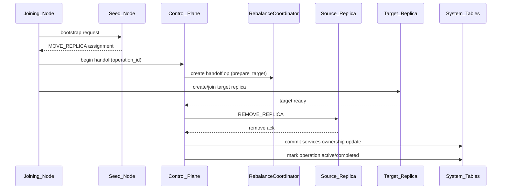

# Design Document: Node Boot/Join Rebalance Hardening

## Overview

This design closes correctness gaps in boot/join and replica rebalancing with a
single objective: one consistent control-plane workflow for ownership, routing,
and readiness.

Primary fixes:

1. Transactional MOVE_REPLICA handoff with explicit source teardown.
2. Message-group rebalancer wiring parity with partitions.
3. Durable epoch propagation using `config.current_epoch` + CDC.
4. Strict readiness/hydration gates that block on missing leader addresses.
5. Runtime-path consolidation for lifecycle and CDC triggers.

## Goals

- Guarantee single-owner semantics for moved replica IDs.
- Ensure topology lookups converge after service relocation.
- Make message-group balancing executable end-to-end in runtime.
- Prevent nodes from progressing with incomplete routing metadata.
- Eliminate architecture drift between documented and active runtime paths.

## Non-Goals

- No change to user-facing SQL semantics.
- No introduction of alternate/fallback control-plane write paths.
- No partial dual-mode support for old and new operation schemas.

## Overlap Elimination Plan

For explicit owner mapping, contradiction tracking, and execution order for
runtime-path convergence, see:

- `.kiro/specs/node-boot-join-rebalance-hardening/architecture-overlap-plan.md`

## Single-Path Contract

| Concern | Owner | Contract |
| --- | --- | --- |
| Placement planning | `MovePlanner` | `UnifiedRebalancer` must not maintain a second planning implementation |
| Operation lifecycle | `RebalanceCoordinator` + `replica_operations` | step transitions are monotonic and idempotent |
| Dispatch | `ReplicaDispatchService` | operation dispatch requires atomic `PENDING -> SENDING` claim |
| Leader discovery for writes | `services` via system cache/SQL routing | no write-path dependence on alternate leader caches |
| Readiness gating | shared readiness policy | rebalancer/dispatch use the same readiness predicate |
| Epoch propagation | `config.current_epoch` + CDC | no secondary epoch authority or out-of-band epoch source |

## Architecture

## Component Changes

### 1) MOVE_REPLICA Handoff Orchestrator

- Introduce explicit handoff phase execution in join/control-plane flow.
- Persist phase/state in `replica_operations`.
- Enforce ordering:
  - `prepare_target`
  - `verify_target`
  - `remove_source`
  - `commit_metadata`
- On failure, mark operation failed and keep one authoritative owner.

### 2) Peer Address Resolver Behavior

- Keep bootstrap `peerAddresses` only for early join connectivity.
- Resolve steady-state addresses from `services` via system cache.
- Add refresh/invalidation on service CDC updates for moved replicas.
- Add diagnostics for temporary fallback use.

### 3) CREATE_SELF_HOSTED Registration Completion

- In join self-hosted path:
  - upsert `message_groups` row for group
  - upsert one `services` row per replica
- Make registration part of join success criteria.

### 4) Message-Group Rebalancer Runtime Wiring

- Instantiate UnifiedRebalancer for message-group leaders.
- Provide message-group specific entity identity through canonical operation
  fields (see data model section).
- Route dispatched operations to message-group lifecycle handler, not
  partition-only handler.
- Update replica discovery to query `services` for `service_type=message_group`.

### 5) Epoch Durability + CDC Wiring

- Persist canonical epoch JSON at `config.current_epoch`.
- Seed path initializes if missing.
- Join path loads canonical epoch before proposing.
- Wire `cdcIntegrationService.setEpochManager(...)` in active runtime paths.
- Handle epoch change CDC to apply only newer epochs.

### 6) Strict Readiness/Hydration Gates

- Bootstrap/join waits use a shared readiness counter that includes:
  - missing leaders
  - missing leader node IDs
  - missing leader addresses
- Hydration verification becomes hard-fail for required system tables.
- Disallow writer/routing mode swap until gate passes.

### 7) Runtime Consolidation

- Converge on one node-state enum used by runtime lifecycle code.
- Remove or integrate duplicate/unused bootstrap phase and CDC handler paths.
- Ensure node-state rebalance trigger path is instantiated, singular, and tested.

## Data Model Changes

### replica_operations canonical entity identity

Current schema is partition-centric (`partition_id`). Introduce canonical
entity fields:

- `entity_type` (`partition` | `message_group`)
- `entity_id` (partition_id or group_id)

Migration approach:

1. Add `entity_type`, `entity_id` columns.
2. Backfill existing partition rows with `entity_type='partition'` and
   `entity_id=partition_id`.
3. Update coordinator/rebalancer queries to use entity fields.
4. Remove partition-only assumptions from dispatch.

## Correctness Properties

### Property 1: Single-Owner Handoff

For any successful MOVE_REPLICA, exactly one active owner exists for the moved
replica ID.

### Property 2: Routable Post-Handoff Address

For any moved replica, post-commit peer resolution returns the new node address
from system cache.

### Property 3: Self-Hosted Registration Completeness

For any CREATE_SELF_HOSTED join success, all replicas have active `services`
rows and group metadata in `message_groups`.

### Property 4: Message-Group Rebalancer Executability

For any message-group leader, UnifiedRebalancer can compute and dispatch
message-group operations through coordinator+dispatch paths.

### Property 5: Epoch Convergence

For any epoch update to `config.current_epoch`, all nodes eventually apply the
latest epoch and reject stale updates.

### Property 6: Strict Readiness Blocking

If any leader address is missing, bootstrap/join readiness gate remains blocked.

## Error Handling

- Handoff failures: operation marked failed with phase + reason, no split owner.
- CDC epoch parse/apply errors: logged with node/epoch context; stale ignored.
- Readiness timeout errors include missing leader/address categories.
- Hydration failures stop bootstrap/join and prevent route-mode swap.

## Testing Strategy

All bug fixes follow test-first policy (failing test before implementation).

### Priority tests from architecture review

1. MOVE_REPLICA teardown/handoff correctness.
2. Message-group rebalancer runtime wiring and operation routing.
3. Leader readiness gating with missing addresses.

### Proposed test files

- `test/integration/move-replica-handoff.integration.test.js`
- `test/bootstrap/create-self-hosted-registration.test.js`
- `test/rebalancer/message-group-rebalancer-wiring.test.js`
- `test/rebalancer/message-group-operation-routing.integration.test.js`
- `test/bootstrap/system-leader-readiness-address-gate.test.js`
- `test/bootstrap/cache-hydration-strictness.test.js`
- `test/cdc/current-epoch-propagation.integration.test.js`
