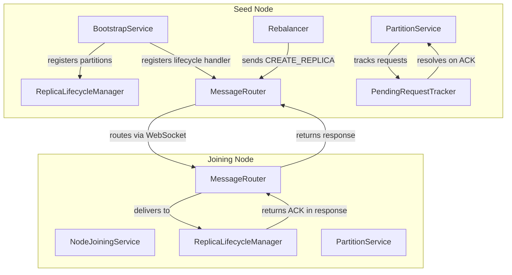

# Design Document: Node Joining Rebalancer Fixes

## Overview

This design addresses inter-node communication issues that occur when a new node joins an existing cluster. The fixes target four main problem areas:

1. **Bootstrap/Joining Asymmetry** - Seed node partitions created during bootstrap are not tracked by ReplicaLifecycleManager, causing "replica not found" errors during rebalancing
2. **Rebalancer Bombardment** - Rebalancers immediately generate moves when detecting suboptimal state, overwhelming joining nodes
3. **EventEmitter Memory Leaks** - Multiple `once` listeners accumulate for ACK events that never arrive or have mismatched request IDs
4. **ACK Routing Issues** - ACKs emitted on one service instance don't reach handlers waiting on a different instance

The solution consolidates ACK handling into a Map-based request tracker, adds a stabilization period to the rebalancer, and ensures seed node partitions are properly registered.

## Architecture



## Components and Interfaces

### PendingRequestTracker

New class to manage pending lifecycle requests, replacing EventEmitter-based ACK handling.

```javascript
class PendingRequestTracker {
  constructor(options = {}) {
    this.pendingRequests = new Map();
    this.defaultTimeoutMs = options.defaultTimeoutMs || 30000;
    this.cleanupIntervalMs = options.cleanupIntervalMs || 60000;
    this.cleanupTimer = null;
  }

  /**
   * Track a pending request.
   * @param {string} requestId - Unique request ID.
   * @param {Object} metadata - Request metadata (type, targetNode, etc.).
   * @return {Promise<Object>} Promise that resolves with ACK or rejects on timeout.
   */
  track(requestId, metadata = {}) {
    return new Promise((resolve, reject) => {
      const timeoutMs = metadata.timeoutMs || this.defaultTimeoutMs;
      
      const timeoutId = setTimeout(() => {
        this.pendingRequests.delete(requestId);
        reject(new Error(`ACK timeout after ${timeoutMs}ms for request ${requestId}`));
      }, timeoutMs);

      this.pendingRequests.set(requestId, {
        resolve,
        reject,
        timeoutId,
        metadata,
        startedAt: Date.now(),
      });
    });
  }

  /**
   * Resolve a pending request with an ACK.
   * @param {string} requestId - Request ID from ACK.
   * @param {Object} ack - ACK response.
   * @return {boolean} True if request was found and resolved.
   */
  resolve(requestId, ack) {
    const pending = this.pendingRequests.get(requestId);
    if (pending) {
      clearTimeout(pending.timeoutId);
      this.pendingRequests.delete(requestId);
      pending.resolve(ack);
      return true;
    }
    return false;
  }

  /**
   * Check if a request is pending.
   * @param {string} requestId - Request ID to check.
   * @return {boolean} True if request is pending.
   */
  hasPending(requestId) {
    return this.pendingRequests.has(requestId);
  }

  /**
   * Get count of pending requests.
   * @return {number} Number of pending requests.
   */
  getPendingCount() {
    return this.pendingRequests.size;
  }

  /**
   * Clear all pending requests (for shutdown).
   */
  clear() {
    for (const [requestId, pending] of this.pendingRequests) {
      clearTimeout(pending.timeoutId);
      pending.reject(new Error('Tracker shutdown'));
    }
    this.pendingRequests.clear();
    if (this.cleanupTimer) {
      clearInterval(this.cleanupTimer);
      this.cleanupTimer = null;
    }
  }
}
```

### RebalancerStabilizationMixin

Adds stabilization period logic to UnifiedRebalancer.

```javascript
// Configuration additions to UnifiedRebalancer
this.stabilizationPeriodMs = config.get('rebalancer.stabilizationPeriodMs') || 5000;
this.minStabilizationMs = 1000;
this.maxStabilizationMs = 10000;
this.lastStateChangeTime = null;
this.stabilizationTimer = null;

/**
 * Check if stabilization period has elapsed since last state change.
 * @return {boolean} True if stable.
 */
isStabilized() {
  if (!this.lastStateChangeTime) {
    return true;
  }
  const elapsed = Date.now() - this.lastStateChangeTime;
  return elapsed >= this.stabilizationPeriodMs;
}

/**
 * Record a state change and reset stabilization timer.
 * @param {string} reason - Reason for state change.
 */
recordStateChange(reason) {
  this.lastStateChangeTime = Date.now();
  
  // Cancel any pending stabilization check
  if (this.stabilizationTimer) {
    clearTimeout(this.stabilizationTimer);
  }
  
  // Schedule check after stabilization period
  this.stabilizationTimer = setTimeout(() => {
    this.checkRebalance();
  }, this.stabilizationPeriodMs);
}
```

### BootstrapService Modifications

Register partitions with ReplicaLifecycleManager after bootstrap.

```javascript
/**
 * Register bootstrap-created partitions with ReplicaLifecycleManager.
 * @param {ReplicaLifecycleManager} lifecycleManager - Manager instance.
 * @param {Map<string, PartitionService>} partitions - Created partitions.
 */
registerPartitionsWithLifecycleManager(lifecycleManager, partitions) {
  for (const [replicaId, partition] of partitions) {
    lifecycleManager.registerExistingReplica({
      replicaId: replicaId,
      partitionId: partition.partitionId,
      tableName: partition.tableName,
      status: 'active',
      service: partition,
    });
  }
}

/**
 * Register lifecycle handler with MessageRouter.
 * @param {MessageRouter} messageRouter - Router instance.
 * @param {ReplicaLifecycleManager} lifecycleManager - Manager instance.
 */
registerLifecycleHandler(messageRouter, lifecycleManager) {
  const lifecycleAddress = `${this.nodeId}/lifecycle`;
  
  messageRouter.register(lifecycleAddress, async (envelope) => {
    const message = envelope.payload || envelope;
    
    if (message.type === 'CREATE_REPLICA') {
      return await lifecycleManager.handleCreateReplica(message);
    } else if (message.type === 'REMOVE_REPLICA') {
      return await lifecycleManager.handleRemoveReplica(message);
    }
    
    return {acknowledged: false, error: 'Unknown message type'};
  });
}
```

### ReplicaLifecycleManager Modifications

Add method to register existing replicas.

```javascript
/**
 * Register an existing replica (created during bootstrap).
 * @param {Object} replicaInfo - Replica information.
 */
registerExistingReplica(replicaInfo) {
  const {replicaId, partitionId, tableName, status, service} = replicaInfo;
  
  if (this.localReplicas.has(replicaId)) {
    this.logger.debug('Replica already registered', {replicaId});
    return;
  }
  
  this.localReplicas.set(replicaId, {
    replicaId,
    partitionId,
    tableName,
    status: status || 'active',
    service,
  });
  
  this.logger.info('Registered existing replica', {
    replicaId,
    partitionId,
    nodeId: this.nodeId,
  });
}
```

### PartitionService Modifications

Replace EventEmitter-based ACK handling with PendingRequestTracker.

```javascript
// In constructor
this.pendingRequestTracker = new PendingRequestTracker({
  defaultTimeoutMs: 30000,
});

/**
 * Deliver a message and wait for ACK using PendingRequestTracker.
 * @param {Object} transport - Transport instance.
 * @param {string} targetAddress - Target address.
 * @param {Object} message - Message to send.
 * @param {number} timeoutMs - Timeout in milliseconds.
 * @return {Promise<Object>} ACK response.
 */
async deliverWithAck(transport, targetAddress, message, timeoutMs = 30000) {
  const requestId = message.request_id;
  
  // Start tracking the request
  const ackPromise = this.pendingRequestTracker.track(requestId, {
    type: message.type,
    targetAddress,
    timeoutMs,
  });
  
  try {
    // Send the message
    const result = await transport.deliver(targetAddress, message);
    
    // Extract ACK from response if present
    const ack = this.extractAckFromResponse(result, requestId);
    if (ack) {
      // Resolve via tracker (clears timeout)
      this.pendingRequestTracker.resolve(requestId, ack);
      return ack;
    }
    
    // Wait for ACK via tracker
    return await ackPromise;
  } catch (error) {
    // Ensure cleanup on error
    this.pendingRequestTracker.resolve(requestId, {
      request_id: requestId,
      status: 'error',
      error: error.message,
    });
    throw error;
  }
}

/**
 * Extract ACK from transport response.
 * @param {Object} result - Transport result.
 * @param {string} requestId - Expected request ID.
 * @return {Object|null} ACK or null.
 */
extractAckFromResponse(result, requestId) {
  if (!result) return null;
  
  // Direct ACK in result
  if (result.request_id === requestId) {
    return result;
  }
  
  // Nested in result.result
  if (result.result?.request_id === requestId) {
    return result.result;
  }
  
  // Deeply nested
  if (result.result?.result?.request_id === requestId) {
    return result.result.result;
  }
  
  return null;
}
```

## Data Models

### PendingRequest

```javascript
{
  requestId: string,        // Unique request identifier
  resolve: Function,        // Promise resolve callback
  reject: Function,         // Promise reject callback
  timeoutId: number,        // setTimeout ID for cleanup
  metadata: {
    type: string,           // 'CREATE_REPLICA' or 'REMOVE_REPLICA'
    targetAddress: string,  // Target node/lifecycle address
    targetNodeId: string,   // Target node ID
    replicaId: string,      // Replica being created/removed
    timeoutMs: number,      // Timeout duration
  },
  startedAt: number,        // Timestamp when request started
}
```

### RebalancerState

```javascript
{
  lastStateChangeTime: number,    // Timestamp of last state change
  stabilizationPeriodMs: number,  // Configured stabilization period
  stabilizationTimer: number,     // setTimeout ID for stabilization check
  pendingMoves: Map<string, {     // Existing pending moves map
    type: string,
    replicaId: string,
    nodeId: string,
    startedAt: number,
    status: string,
  }>,
}
```


## Correctness Properties

*A property is a characteristic or behavior that should hold true across all valid executions of a system—essentially, a formal statement about what the system should do. Properties serve as the bridge between human-readable specifications and machine-verifiable correctness guarantees.*

### Property 1: Partition Registration Invariant

*For any* partition created during bootstrap and registered with ReplicaLifecycleManager, the localReplicas map SHALL contain an entry for that replica_id with correct partition metadata.

**Validates: Requirements 1.1, 1.2**

### Property 2: Registered Partition Removal Succeeds

*For any* partition that has been registered with ReplicaLifecycleManager, a REMOVE_REPLICA request for that replica SHALL return status 'initiated' (not 'not_found').

**Validates: Requirements 1.3**

### Property 3: Stabilization Period Configuration Bounds

*For any* stabilization period configuration value, the effective value SHALL be clamped to the range [1000ms, 10000ms] with a default of 5000ms.

**Validates: Requirements 2.1**

### Property 4: Stabilization Waiting Before Moves

*For any* state change detected by the Rebalancer (node join or suboptimal state), no moves SHALL be executed until the stabilization period has elapsed.

**Validates: Requirements 2.2, 2.3**

### Property 5: State Re-evaluation After Stabilization

*For any* Rebalancer that has waited through the stabilization period, the state SHALL be re-evaluated before executing moves, and moves SHALL only be generated if the state is still suboptimal.

**Validates: Requirements 2.4**

### Property 6: Stabilization Timer Reset

*For any* state change that occurs during an active stabilization period, the stabilization timer SHALL be reset, extending the wait period.

**Validates: Requirements 2.5**

### Property 7: Pending Request Tracking Round-Trip

*For any* lifecycle message sent via deliverWithAck, if an ACK with matching request_id is received (either in response or via event), the promise SHALL resolve with that ACK.

**Validates: Requirements 3.2, 3.3**

### Property 8: Timeout Cleanup

*For any* pending request that times out, the request SHALL be removed from the pending tracker and the promise SHALL be rejected with a timeout error.

**Validates: Requirements 3.4**

### Property 9: Shutdown Cleanup

*For any* PartitionService shutdown, all pending requests in the tracker SHALL be cleared and their promises rejected.

**Validates: Requirements 3.5**

### Property 10: Lifecycle Handler Address Format

*For any* node ID, the lifecycle handler address SHALL be exactly `${nodeId}/lifecycle`.

**Validates: Requirements 4.2**

### Property 11: Lifecycle Message Delegation

*For any* CREATE_REPLICA or REMOVE_REPLICA message received by the lifecycle handler, the message SHALL be delegated to the corresponding ReplicaLifecycleManager method and the ACK SHALL be returned.

**Validates: Requirements 4.3, 4.4, 4.5**

### Property 12: Move Deduplication

*For any* pending move in the Rebalancer's pending_move_map, the Rebalancer SHALL NOT generate a duplicate move (same type and target) when calculating moves.

**Validates: Requirements 5.1, 5.2, 5.3**

### Property 13: Move Completion Cleanup

*For any* move that completes (success or failure) or times out, the move SHALL be removed from the pending_move_map.

**Validates: Requirements 5.4, 5.5**

### Property 14: ACK Extraction From Response

*For any* transport response containing an ACK (at any nesting level), the deliverWithAck method SHALL extract and return the ACK immediately without waiting for events.

**Validates: Requirements 6.1, 6.2, 6.3, 6.4**

## Error Handling

### Transport Failures

- If transport.deliver() fails, the pending request is cleaned up and the error is propagated
- Timeout errors include the request_id for debugging
- Network errors are logged with target address and message type

### Stabilization Period Errors

- If state evaluation fails during stabilization check, the error is logged and the next check is scheduled
- Timer cleanup is performed on shutdown to prevent memory leaks

### Registration Errors

- If partition registration fails, the error is logged but does not block bootstrap completion
- Duplicate registration attempts are idempotent (no error, just logged)

### ACK Extraction Errors

- If ACK cannot be extracted from response, the tracker continues waiting for event-based ACK
- Malformed ACKs (missing request_id) are logged and ignored

## Testing Strategy

### Unit Tests

Unit tests verify specific examples and edge cases:

1. **PendingRequestTracker**
   - Track and resolve a request
   - Track and timeout a request
   - Clear all pending requests
   - Check hasPending for existing/non-existing requests

2. **ReplicaLifecycleManager.registerExistingReplica**
   - Register a new replica
   - Attempt duplicate registration (idempotent)
   - Verify localReplicas contains registered replica

3. **Rebalancer Stabilization**
   - Verify default stabilization period
   - Verify configuration bounds clamping
   - Verify timer reset on state change

4. **ACK Extraction**
   - Extract ACK from direct response
   - Extract ACK from nested response
   - Handle missing ACK gracefully

### Property-Based Tests

Property-based tests use fast-check to verify universal properties across many generated inputs. Each test runs with `{numRuns: 10}` per testing guidelines.

1. **Partition Registration Invariant** - Generate random partitions, register them, verify all appear in localReplicas
2. **Move Deduplication** - Generate random pending moves, verify no duplicates generated
3. **Stabilization Waiting** - Generate random state changes, verify no moves within stabilization period
4. **ACK Round-Trip** - Generate random messages, verify ACK resolves promise correctly
5. **Timeout Cleanup** - Generate random requests, verify cleanup after timeout

### Integration Tests

Integration tests verify end-to-end behavior:

1. **Seed Node Bootstrap with Lifecycle Registration** - Bootstrap seed node, verify lifecycle handler registered
2. **Cross-Node Replica Creation** - Send CREATE_REPLICA from seed to joining node, verify ACK received
3. **Rebalancer Stabilization During Node Join** - Join node, verify rebalancer waits before acting
