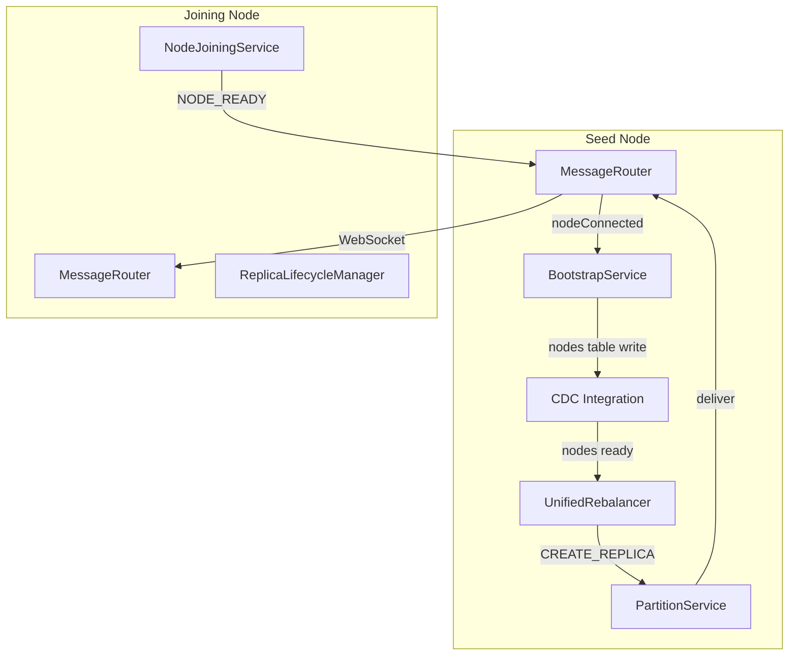
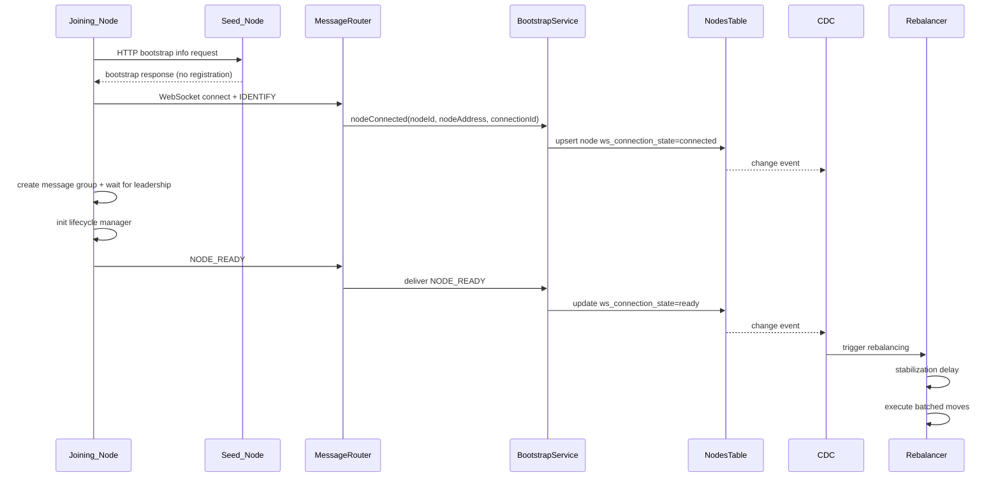

# Design Document: Node Joining Rebalancing Simplification

## Overview

This design removes race conditions between HTTP registration and WebSocket
identification, and prevents immediate rebalancing spikes on node join. The
approach is to make WebSocket IDENTIFY authoritative, store connection readiness
in the nodes system table, trigger rebalancing only from CDC, and execute moves
in small per-node batches after a short stabilization period.

## Architecture



## Join Sequence (Simplified)



## Components and Interfaces

### MessageRouter

- `handleIdentification(connectionId, ws, message)`:
  - Re-keys the connection by nodeId.
  - Emits `nodeConnected` with `{nodeId, nodeAddress, connectionId}`.
- `getConnectionState(nodeId)`:
  - Returns `connected` or `disconnected` for the current WebSocket.
- Optional `pingNode(nodeId)`:
  - Sends a lightweight `PING` via `deliver` to verify responsiveness.

### BootstrapService

- Subscribes to `nodeConnected` and registers the node in the nodes table with
  `ws_connection_state=connected`.
- Registers a handler at `${seedNodeId}/bootstrap/ready` for `NODE_READY`.
- Updates `ws_connection_state=ready` and stores any capabilities on ready.
- Does not trigger rebalancing directly; relies on CDC.

### BootstrapAPI

- HTTP bootstrap endpoint returns bootstrap info only.
- Removes any direct rebalancing trigger or node registration logic.

### NodeJoiningService

- Sends `IDENTIFY` over WebSocket using the bootstrap response.
- After message-group leadership and lifecycle manager initialization, sends
  `NODE_READY` to `${seedNodeId}/bootstrap/ready`.

### CDC Integration

- Watches nodes table updates and triggers rebalancing only when
  `ws_connection_state` transitions to `ready`.

### UnifiedRebalancer

- `scheduleRebalance(reason)` resets a stabilization timer.
- `isNodeReady(nodeId)` checks:
  - nodes table cache state is `ready`, and
  - MessageRouter connection state is `connected`, and
  - optional ping succeeds when configured.
- `executeRebalancingMoves(moves)` groups moves by target node and processes
  them in small batches with backpressure.

## Data Models

### Nodes Table Additions

```sql
ALTER TABLE nodes
ADD COLUMN ws_connection_state TEXT DEFAULT 'disconnected';
```

### Node Connection State Values

| ws_connection_state | Meaning |
| --- | --- |
| disconnected | No active WebSocket connection |
| connecting | Node attempting to connect (reserved) |
| connected | WebSocket identified but not ready |
| ready | Node can accept replica work |

## Algorithms

### Rebalance Trigger and Stabilization

```text
onNodesTableUpdate(row):
  if row.ws_connection_state == 'ready':
    scheduleRebalance('node_ready')

scheduleRebalance(reason):
  cancel existing timer
  set timer for stabilization_period_ms
  on timer: re-evaluate state and execute moves if still needed
```

### Readiness Check

```text
isNodeReady(nodeId):
  if nodesCache.state(nodeId) != 'ready': return false
  if messageRouter.getConnectionState(nodeId) != 'connected': return false
  if pingEnabled and ping fails: return false
  return true
```

### Batched Move Execution

```text
executeRebalancingMoves(moves):
  group moves by target node
  for each node:
    if not isNodeReady(node): continue
    for batches of size batchSize:
      run batch concurrently
      wait for completion
      delay interBatchDelayMs
```

## Correctness Properties

*A property is a characteristic or behavior that should hold true across all
valid executions of a system.*

### Property 1: Registration After IDENTIFY Only

*For any* node join, registration in the nodes table SHALL occur only after the
IDENTIFY message is processed.

**Validates: Requirements 1.1, 1.2, 1.3**

### Property 2: Rebalancing Triggered Only by CDC

*For any* rebalancing run, the trigger SHALL be a CDC update where
`ws_connection_state` transitions to `ready`.

**Validates: Requirements 4.1, 4.2, 4.3**

### Property 3: Stabilization Delay Enforcement

*For any* ready transition, no moves SHALL execute until the stabilization
period expires and state is re-evaluated.

**Validates: Requirements 5.1, 5.3, 5.4**

### Property 4: No Moves to Unready Nodes

*For any* move assignment, the target node SHALL pass `isNodeReady` before a
CREATE_REPLICA message is sent.

**Validates: Requirements 6.1, 6.2, 6.3, 6.4**

### Property 5: Batch Concurrency Bound

*For any* target node, the number of concurrent moves SHALL NOT exceed the
configured batch size.

**Validates: Requirements 7.1, 7.2, 7.3**

### Property 6: NODE_READY Updates State

*For any* NODE_READY message, the nodes table SHALL transition to
`ws_connection_state=ready`.

**Validates: Requirements 2.4, 3.2, 3.3**

### Property 7: System Cache Source of Truth

*For any* node readiness check, the decision SHALL use the nodes system table
cache derived from CDC, not ad hoc state.

**Validates: Requirements 2.6, 6.1**

## Error Handling

- If IDENTIFY is missing nodeId or nodeAddress, reject the connection and log
  the error.
- If NODE_READY arrives for an unknown nodeId, log and ignore the message.
- If `isNodeReady` fails due to ping timeout, skip moves and rely on the next
  CDC trigger to retry.
- If a node disconnects mid-batch, cancel remaining moves for that node and
  mark them as skipped.
- If stabilization timer fires but state is no longer suboptimal, exit without
  executing moves.

## Testing Strategy

### Unit Tests

1. MessageRouter emits `nodeConnected` on IDENTIFY with correct payload.
2. BootstrapService updates nodes table to `connected` and `ready`.
3. `isNodeReady` returns false for non-ready cache or disconnected WebSocket.
4. Batch executor respects batch size and inter-batch delay.

### Property-Based Tests

Property-based tests use fast-check with `{numRuns: 10}`.

1. Ready transitions never trigger immediate moves before stabilization.
2. No move is sent to a node that fails `isNodeReady`.
3. Concurrent moves per node never exceed batch size.

### Integration Tests

1. Join flow: rebalancing starts only after NODE_READY and stabilization.
2. HTTP bootstrap does not trigger rebalancing or registration.
3. Batched CREATE_REPLICA sends no more than two concurrent requests per node.
