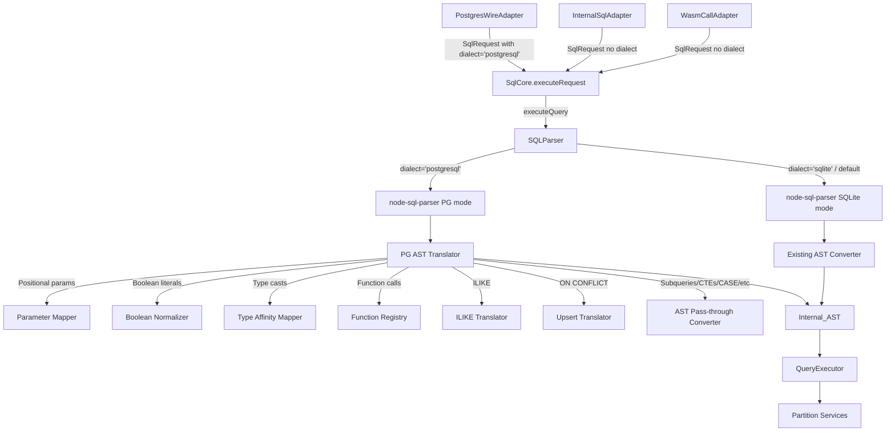

# Design Document: PostgreSQL SQL Compatibility Translation Layer

## Overview

This design adds a PostgreSQL-to-SQLite translation layer that sits inside the existing `SQLParser` class. When `dialect: 'postgresql'` is specified, the parser uses `node-sql-parser`'s PostgreSQL mode, then applies a series of AST transformations to produce the same Internal_AST that the SQLite-mode parser produces. The rest of the pipeline (QueryExecutor, partition handlers) remains completely unchanged.

The translation is a pure preprocessing step — no new execution paths are created. The `PostgresWireAdapter` passes dialect metadata through `SqlRequest`, and `SqlCore` forwards it to the parser. Internal system queries continue using SQLite dialect by default.

### Design Decisions

1. **Translation inside SQLParser, not a separate component**: The translation happens during AST conversion within `SQLParser.convertAst()`. This avoids creating a second parser class and keeps the single-path contract. The `SQLParser` constructor accepts an optional `options` object with a `dialect` field.

2. **Extensible function registry as a plain Map**: Function translation uses a `Map<string, TranslatorFn>` where each entry maps a PG function name to a function that transforms the AST node. This is extensible without modifying core logic.

3. **Type affinity map as a frozen object**: PG type names map to SQLite affinities via a constant frozen object. New types can be added by extending the map.

4. **Dialect flows through SqlRequest**: A new optional `dialect` field on `SqlRequest` carries the dialect hint from `PostgresWireAdapter` to `SqlCore` to `SQLParser`. Internal adapters omit it, defaulting to SQLite.

### Future Directions (Not Implemented)

- **Window functions**: SQLite supports them natively for single-partition queries; cross-partition needs in-memory handling in QueryExecutor.
- **Multi-partition transactions**: Distributed 2PC; currently limited to single partition.
- **EXPLAIN/EXPLAIN ANALYZE**: Need to synthesize plan output compatible with PG client expectations.
- **Schema introspection (pg_catalog, information_schema)**: Virtual table shims for PG system catalogs; biggest hurdle for real PG client compatibility.
- **PG-specific types (JSONB, ARRAY, UUID, SERIAL)**: Type mapping layer with SQLite affinity system.
- **Sequences and SERIAL**: PG sequence semantics vs SQLite AUTOINCREMENT.
- **NOTIFY/LISTEN**: Map to existing CDC pub/sub system.

## Architecture



The translation layer is entirely contained within the parse phase. QueryExecutor and partition handlers see the same Internal_AST regardless of source dialect.

### Data Flow

1. `PostgresWireAdapter.execute()` creates a `SqlRequest` with `dialect: 'postgresql'`
2. `SqlCore.executeRequest()` passes the request to `executeQuery()`
3. `executeQuery()` creates `SQLParser(sql, {dialect})` 
4. `SQLParser.parse()` selects `node-sql-parser` database mode based on dialect
5. `SQLParser.convertAst()` applies PG-specific translations when dialect is `'postgresql'`
6. The resulting Internal_AST is identical in structure to what SQLite-mode produces
7. QueryExecutor builds SQL from Internal_AST and sends to partitions (unchanged)

## Components and Interfaces

### Modified: SQLParser (`src/query/sql-parser.js`)

```javascript
// New constructor signature
constructor(sql, options = {}) {
  this.sql = sql;
  this.dialect = options.dialect || PARSER_DIALECT.SQLITE;
  this.parser = new Parser();
  this.logger = this.initLogger();
  // For PG mode: track positional params for reordering
  this.positionalParams = [];
}

// parse() selects database mode based on dialect
parse() {
  // ... existing transaction handling ...
  const dbMode = this.dialect === PARSER_DIALECT.POSTGRESQL
    ? PARSER_CONFIG.DATABASE_PG
    : PARSER_CONFIG.DATABASE;
  const externalAst = this.parser.astify(this.sql, {database: dbMode});
  const ast = this.convertAst(externalAst);
  // For PG mode: attach reordered params info
  if (this.dialect === PARSER_DIALECT.POSTGRESQL) {
    ast._paramMapping = this.positionalParams;
  }
  return ast;
}
```

### New: PG Translation Functions (`src/query/pg-translate.js`)

A module of pure functions that transform PG-specific AST nodes into SQLite-compatible Internal_AST nodes. Each function is stateless and testable in isolation.

```javascript
// Core translation functions
translateBooleanLiteral(expr)     // TRUE/FALSE → 1/0
translateTypeCast(expr)           // ::type and CAST → CAST with affinity
translateIlike(expr)              // ILIKE → LOWER() LIKE LOWER()
translatePositionalParam(expr)   // $N → ? with index tracking
translateOnConflict(ast)         // ON CONFLICT → orIgnore/orReplace
translateExtract(expr)           // EXTRACT(field FROM x) → strftime
translateDateTrunc(expr)         // DATE_TRUNC → strftime
translateFunctionCall(expr)      // PG func → SQLite equivalent via registry
```

### New: Function Registry (`src/query/pg-function-registry.js`)

```javascript
// Map<string, (args: ASTNode[]) => ASTNode>
const PG_FUNCTION_MAP = new Map([
  ['concat', translateConcat],      // (a,b,...) → (a || b || ...)
  ['substring', translateSubstring], // → SUBSTR
  ['now', translateNow],            // → datetime('now')
  ['current_timestamp', translateNow],
  ['current_date', translateCurrentDate],
  ['current_time', translateCurrentTime],
  ['extract', translateExtract],
  ['date_trunc', translateDateTrunc],
  // Pass-through (same name in SQLite):
  ['length', passThrough],
  ['lower', passThrough],
  ['upper', passThrough],
  ['trim', passThrough],
  ['coalesce', passThrough],
  ['nullif', passThrough],
  ['substr', passThrough],
]);
```

### New: Type Affinity Map (`src/query/pg-type-affinity.js`)

```javascript
const PG_TYPE_AFFINITY_MAP = Object.freeze({
  'varchar': 'TEXT',
  'text': 'TEXT',
  'char': 'TEXT',
  'character varying': 'TEXT',
  'integer': 'INTEGER',
  'int': 'INTEGER',
  'smallint': 'INTEGER',
  'bigint': 'INTEGER',
  'serial': 'INTEGER',
  'bigserial': 'INTEGER',
  'boolean': 'INTEGER',
  'real': 'REAL',
  'double precision': 'REAL',
  'float': 'REAL',
  'numeric': 'REAL',
  'decimal': 'REAL',
  'bytea': 'BLOB',
});
```

### New: PG Translation Constants (`src/query/pg-compat-constants.js`)

All string literals, error messages, and configuration values for the translation layer.

```javascript
const PARSER_DIALECT = Object.freeze({
  SQLITE: 'sqlite',
  POSTGRESQL: 'postgresql',
});

const PG_TRANSLATE_ERROR = Object.freeze({
  MISSING_PARAM_INDEX: 'Positional parameter $N references index ',
  PARAM_GAP: 'Non-sequential positional parameters: gap at $',
  UNSUPPORTED_EXTRACT_FIELD: 'Unsupported EXTRACT field: ',
  UNSUPPORTED_DATE_TRUNC_FIELD: 'Unsupported DATE_TRUNC precision: ',
});

const PG_EXTRACT_FORMAT = Object.freeze({
  year: '%Y',
  month: '%m',
  day: '%d',
  hour: '%H',
  minute: '%M',
  second: '%S',
  dow: '%w',
  doy: '%j',
  epoch: '%s',
});

const PG_DATE_TRUNC_FORMAT = Object.freeze({
  year: '%Y-01-01 00:00:00',
  month: '%Y-%m-01 00:00:00',
  day: '%Y-%m-%d 00:00:00',
  hour: '%Y-%m-%d %H:00:00',
  minute: '%Y-%m-%d %H:%M:00',
  second: '%Y-%m-%d %H:%M:%S',
});
```

### Modified: SqlRequest (`src/query/sql-request.js`)

Add optional `dialect` field:

```javascript
const request = {
  // ... existing fields ...
  dialect: fields.dialect ?? null,  // 'postgresql' or null (default sqlite)
};
```

### Modified: PostgresWireAdapter (`src/query/postgres-wire-adapter.js`)

Pass dialect in SqlRequest:

```javascript
async execute(sessionId, sql, params = [], options = {}) {
  // ... existing session validation ...
  const request = createSqlRequest({
    statement: sql,
    parameters: params,
    // ... existing fields ...
    dialect: PARSER_DIALECT.POSTGRESQL,
  });
  return await this.sqlCore.executeRequest(request);
}
```

### Modified: SQLQueryEngine (`src/query/sql-query-engine.js`)

Pass dialect to parser:

```javascript
async executeQuery(sql, params = [], options = {}) {
  // ...
  const parser = new SQLParser(sql, {dialect: options.dialect});
  ast = parser.parse();
  // If PG mode produced param mapping, reorder params
  if (ast._paramMapping && ast._paramMapping.length > 0) {
    params = reorderParams(params, ast._paramMapping);
  }
  // ... rest unchanged ...
}
```

### Modified: QueryExecutor (`src/query/query-executor.js`)

Extend `buildExpressionSQL` to handle new AST node types:

```javascript
// New cases in buildExpressionSQL:
case 'cast':
  return `CAST(${this.buildExpressionSQL(expr.expression)} AS ${expr.affinity})`;

case 'case':
  return this.buildCaseSQL(expr);

case 'subquery':
  return `(${this.buildSelectSQL(expr.query)})`;

case 'exists':
  return `EXISTS (${this.buildSelectSQL(expr.query)})`;

case 'function_call':
  const args = expr.args.map(a => this.buildExpressionSQL(a));
  return `${expr.name}(${args.join(', ')})`;
```

Extend `buildSelectSQL` for CTEs, RETURNING, set operations, derived tables:

```javascript
// CTE prefix
if (ast.ctes && ast.ctes.length > 0) {
  const recursive = ast.recursive ? 'RECURSIVE ' : '';
  const cteDefs = ast.ctes.map(c =>
    `${c.name} AS (${this.buildSelectSQL(c.query)})`
  );
  sql = `WITH ${recursive}${cteDefs.join(', ')} ` + sql;
}

// RETURNING suffix (for INSERT/UPDATE/DELETE)
if (ast.returning) {
  sql += ` RETURNING ${ast.returning === '*' ? '*' : ast.returning.join(', ')}`;
}
```

## Data Models

### Extended Internal_AST Node Types

New `EXPR_TYPE` constants added to `sql-parser.js`:

```javascript
const EXPR_TYPE = Object.freeze({
  // ... existing types ...
  CAST: 'cast',           // {type, expression, affinity}
  CASE: 'case',           // {type, operand?, conditions[], elseExpr?}
  SUBQUERY: 'subquery',   // {type, query: SelectAST}
  EXISTS: 'exists',       // {type, query: SelectAST}
  FUNCTION_CALL: 'function_call', // {type, name, args[]}
});
```

### CAST Node

```javascript
{
  type: 'cast',
  expression: ExprNode,  // The expression being cast
  affinity: string,      // SQLite affinity: TEXT, INTEGER, REAL, BLOB, NUMERIC
}
```

### CASE Node

```javascript
{
  type: 'case',
  operand: ExprNode | null,  // Simple CASE operand, null for searched CASE
  conditions: [
    { when: ExprNode, then: ExprNode },
    // ...
  ],
  elseExpr: ExprNode | null,
}
```

### Subquery Node

```javascript
{
  type: 'subquery',
  query: SelectAST,  // Full SELECT AST (same structure as convertSelect output)
}
```

### EXISTS Node

```javascript
{
  type: 'exists',
  query: SelectAST,
}
```

### Function Call Node

```javascript
{
  type: 'function_call',
  name: string,     // SQLite function name (after translation)
  args: ExprNode[], // Translated argument expressions
}
```

### Extended SELECT AST

```javascript
{
  type: 'SELECT',
  // ... existing fields ...
  ctes: [                    // NEW: Common Table Expressions
    { name: string, query: SelectAST, recursive: boolean },
  ] | null,
  recursive: boolean,        // NEW: WITH RECURSIVE flag
  setOperation: {            // NEW: UNION/INTERSECT/EXCEPT
    type: string,            // 'UNION', 'UNION ALL', 'INTERSECT', 'EXCEPT'
    right: SelectAST,
  } | null,
}
```

### Extended INSERT/UPDATE/DELETE AST

```javascript
{
  // ... existing fields ...
  returning: string[] | '*' | null,  // NEW: RETURNING clause columns
}
```

### Extended FROM Node (Derived Tables)

```javascript
{
  type: 'table',
  name: string | null,       // null for derived tables
  alias: string | null,
  subquery: SelectAST | null, // NEW: derived table subquery
}
```

### Parameter Mapping

When parsing PG-dialect SQL, the parser tracks positional parameter positions:

```javascript
// Attached to AST root as _paramMapping
ast._paramMapping = [
  2,  // first ? in SQL corresponds to $2 (params[1])
  1,  // second ? in SQL corresponds to $1 (params[0])
  3,  // third ? in SQL corresponds to $3 (params[2])
];
```

The `reorderParams()` utility uses this mapping to produce the correctly ordered params array for SQLite execution.


## Correctness Properties

*A property is a characteristic or behavior that should hold true across all valid executions of a system — essentially, a formal statement about what the system should do. Properties serve as the bridge between human-readable specifications and machine-verifiable correctness guarantees.*

### Property 1: Backward Compatibility — SQLite Mode Unchanged

*For any* valid SQLite SQL string, parsing with `dialect: 'sqlite'` (or no dialect option) SHALL produce the exact same Internal_AST as the current parser produces before this change.

**Validates: Requirements 1.2**

### Property 2: Dual-Dialect AST Equivalence

*For any* SQL string that is valid in both PostgreSQL and SQLite dialects (e.g., `SELECT id, name FROM users WHERE id = ?`), parsing in `'postgresql'` mode SHALL produce an Internal_AST structurally identical to parsing the same SQL in `'sqlite'` mode.

**Validates: Requirements 1.3**

### Property 3: Positional Parameter Round-Trip

*For any* SQL string containing N sequential positional parameters `$1` through `$N` in any order, and a corresponding params array of length N, the Translation_Layer SHALL produce an Internal_AST where all parameter nodes are `?` placeholders, and the reordered params array SHALL satisfy: `reorderedParams[i]` equals the original value bound to `$(i+1)` for all valid indices.

**Validates: Requirements 2.1, 2.2**

### Property 4: Boolean Literal Normalization

*For any* expression containing PostgreSQL boolean literals `TRUE` or `FALSE` in any expression context (WHERE, VALUES, SET), the Translation_Layer SHALL produce an Internal_AST where those literals are replaced with integer literal nodes having values `1` and `0` respectively.

**Validates: Requirements 5.1, 5.2**

### Property 5: Type Cast Translation Round-Trip

*For any* expression containing a type cast (either `::pg_type` or `CAST(expr AS pg_type)`) where `pg_type` is a key in the Type_Affinity_Map, the Translation_Layer SHALL produce a `cast` AST node whose `affinity` field equals the mapped SQLite affinity, and the QueryExecutor SHALL reconstruct it as valid `CAST(expr AS affinity)` SQL.

**Validates: Requirements 6.1, 6.2, 6.4**

### Property 6: Function Registry Translation

*For any* PG function call whose name exists in the Function_Registry, the Translation_Layer SHALL replace it with the corresponding SQLite expression as defined by the registry's translator function, and the resulting AST SHALL be reconstructable into valid SQLite SQL by the QueryExecutor.

**Validates: Requirements 7.2**

### Property 7: Unknown Function Pass-Through

*For any* function call whose name does NOT exist in the Function_Registry, the Translation_Layer SHALL produce a `function_call` AST node with the original function name and translated arguments, passing it through unchanged.

**Validates: Requirements 7.4**

### Property 8: EXTRACT Translation

*For any* supported EXTRACT field (year, month, day, hour, minute, second, dow, doy, epoch) and any column expression, `EXTRACT(field FROM expr)` SHALL be translated to `CAST(strftime(format, expr) AS INTEGER)` where `format` is the corresponding strftime format string from `PG_EXTRACT_FORMAT`.

**Validates: Requirements 8.2**

### Property 9: DATE_TRUNC Translation

*For any* supported DATE_TRUNC precision (year, month, day, hour, minute, second) and any column expression, `DATE_TRUNC(precision, expr)` SHALL be translated to `strftime(format, expr)` where `format` is the corresponding format string from `PG_DATE_TRUNC_FORMAT`.

**Validates: Requirements 8.3**

### Property 10: ON CONFLICT Translation

*For any* INSERT statement with `ON CONFLICT ... DO NOTHING`, the Translation_Layer SHALL produce an Internal_AST with `orIgnore: true`. *For any* INSERT statement with `ON CONFLICT ... DO UPDATE SET ...`, the Translation_Layer SHALL produce an Internal_AST with `orReplace: true`.

**Validates: Requirements 4.1, 4.2**

### Property 11: ILIKE Translation

*For any* expression containing `ILIKE` or `NOT ILIKE`, the Translation_Layer SHALL produce a LIKE AST node where both the expression and pattern operands are wrapped in `LOWER()` function calls, with the `negated` flag set correctly.

**Validates: Requirements 14.1, 14.2**

### Property 12: RETURNING Clause Round-Trip

*For any* INSERT, UPDATE, or DELETE statement with a `RETURNING` clause specifying column names or `*`, the Translation_Layer SHALL preserve the returning information in the Internal_AST, and the QueryExecutor SHALL reconstruct valid `RETURNING col1, col2` or `RETURNING *` SQL.

**Validates: Requirements 3.1, 3.2, 3.3**

### Property 13: Subquery Round-Trip

*For any* SQL containing subqueries in WHERE clauses (`WHERE x IN (SELECT ...)` or scalar subqueries), the Translation_Layer SHALL recursively convert the subquery into a valid Internal_AST subquery node, and the QueryExecutor SHALL reconstruct valid nested `(SELECT ...)` SQL.

**Validates: Requirements 9.1, 9.2, 9.4**

### Property 14: EXISTS Subquery Conversion

*For any* SQL containing `EXISTS (SELECT ...)`, the Translation_Layer SHALL produce an `exists` AST node containing a fully converted inner SELECT AST, and the QueryExecutor SHALL reconstruct valid `EXISTS (SELECT ...)` SQL.

**Validates: Requirements 9.3**

### Property 15: CTE Round-Trip

*For any* SQL containing a `WITH` clause (including `WITH RECURSIVE`) defining one or more CTEs, the Translation_Layer SHALL preserve CTE definitions in the Internal_AST, and the QueryExecutor SHALL reconstruct valid `WITH [RECURSIVE] name AS (SELECT ...) SELECT ...` SQL.

**Validates: Requirements 10.1, 10.2, 10.3**

### Property 16: CASE Expression Round-Trip

*For any* SQL containing `CASE WHEN ... THEN ... ELSE ... END` or simple `CASE expr WHEN value THEN result END` expressions, the Translation_Layer SHALL produce a `case` AST node, and the QueryExecutor SHALL reconstruct valid `CASE WHEN ... THEN ... ELSE ... END` SQL.

**Validates: Requirements 11.1, 11.2, 11.3**

### Property 17: Derived Table Round-Trip

*For any* SQL containing a derived table in the FROM clause (`SELECT * FROM (SELECT ...) AS t`), the Translation_Layer SHALL preserve the subquery and alias in the Internal_AST FROM node, and the QueryExecutor SHALL reconstruct valid `(SELECT ...) AS alias` SQL.

**Validates: Requirements 12.1, 12.2**

### Property 18: Set Operation Round-Trip

*For any* SQL containing `UNION`, `UNION ALL`, `INTERSECT`, or `EXCEPT` between SELECT statements, the Translation_Layer SHALL represent the set operation in the Internal_AST, and the QueryExecutor SHALL reconstruct valid `SELECT ... UNION/INTERSECT/EXCEPT SELECT ...` SQL.

**Validates: Requirements 13.1, 13.2**

## Error Handling

### Parse Errors

- When `node-sql-parser` fails to parse PG-dialect SQL, the error message includes the original SQL (truncated to 100 chars) and the parser error. This matches existing SQLite-mode error handling.
- Error code: `SYNTAX_ERROR` (existing `QUERY_ERROR_CODE.SYNTAX_ERROR`).

### Parameter Validation Errors

- When a positional parameter `$N` references an index beyond the params array length, throw with `PG_TRANSLATE_ERROR.MISSING_PARAM_INDEX + N`.
- When positional parameters have gaps (e.g., `$1, $3` without `$2`), throw with `PG_TRANSLATE_ERROR.PARAM_GAP + missingIndex`.
- These errors are thrown during the parse phase, before execution begins.

### Unsupported Translation Errors

- When `EXTRACT` is called with an unsupported field, throw with `PG_TRANSLATE_ERROR.UNSUPPORTED_EXTRACT_FIELD + field`.
- When `DATE_TRUNC` is called with an unsupported precision, throw with `PG_TRANSLATE_ERROR.UNSUPPORTED_DATE_TRUNC_FIELD + precision`.
- Unknown functions are passed through (not errors), since SQLite may support them natively.

### Backward Compatibility

- All errors from the existing SQLite-mode parser remain unchanged.
- Internal system queries never use PG dialect, so they are unaffected.
- The `dialect` field on `SqlRequest` is optional; omitting it preserves current behavior.

## Testing Strategy

### Property-Based Testing

Property-based tests use `fast-check` with `{numRuns: 10}` per the workspace testing guidelines. Each property test references its design document property number.

Tag format: **Feature: pg-sql-compat-layer, Property N: property_text**

Properties to implement as PBT:
- Property 1 (backward compat): Generate random valid SQLite SQL, verify AST unchanged
- Property 2 (dual-dialect equivalence): Generate SQL valid in both dialects, compare ASTs
- Property 3 (positional params): Generate random param orderings, verify reorder correctness
- Property 4 (boolean normalization): Generate expressions with TRUE/FALSE, verify 1/0
- Property 5 (type cast round-trip): Generate random casts with PG types, verify affinity + SQL
- Property 6 (function registry): Generate calls to registered functions, verify translation
- Property 7 (unknown function pass-through): Generate unknown function names, verify pass-through
- Property 8 (EXTRACT): Generate random supported fields, verify strftime format
- Property 9 (DATE_TRUNC): Generate random supported precisions, verify strftime format
- Property 10 (ON CONFLICT): Generate INSERT with ON CONFLICT variants, verify flags
- Property 11 (ILIKE): Generate ILIKE expressions, verify LOWER wrapping

Properties 12–18 (RETURNING, subquery, EXISTS, CTE, CASE, derived table, set operations) are best tested as unit tests with specific examples because generating syntactically valid complex SQL structures for these features is impractical with random generators.

### Unit Testing

Unit tests cover:
- Specific examples for each translation (CONCAT → ||, NOW() → datetime('now'), etc.)
- Edge cases: empty params, RETURNING *, recursive CTEs, nested subqueries
- Error conditions: invalid param indices, param gaps, unsupported EXTRACT fields
- Integration: PostgresWireAdapter passes dialect, SqlCore forwards it
- Type affinity map completeness: every PG type maps to a valid SQLite affinity
- Function registry completeness: all documented functions have entries

### Test Organization

- `test/query/pg-translate.test.js` — Unit tests for translation functions
- `test/query/pg-translate.property.test.js` — Property-based tests
- `test/query/pg-function-registry.test.js` — Function registry unit tests
- `test/query/sql-parser-pg.test.js` — SQLParser PG-mode integration tests

### PBT Library

Use `fast-check` (already a project dependency). All `fc.assert()` calls use `{numRuns: 10}`.
