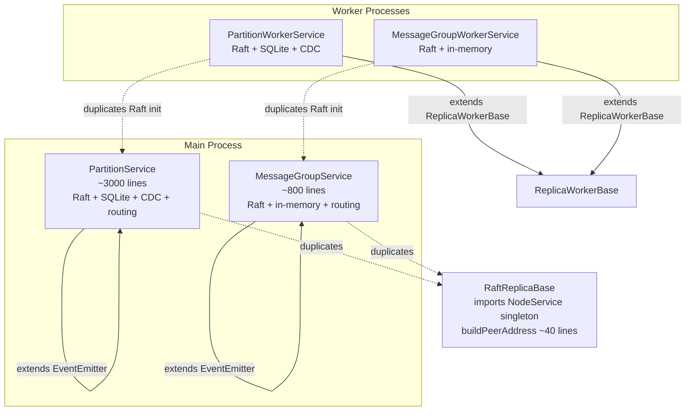
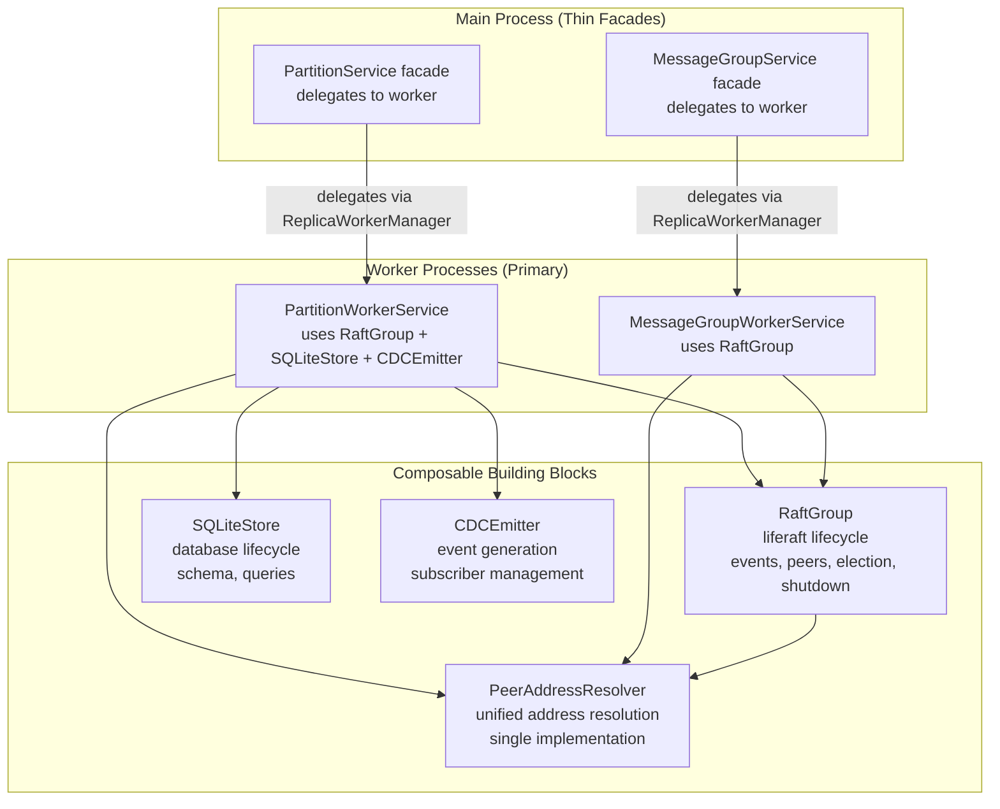

# Design Document: Raft Architecture Consolidation

## Overview

This design consolidates the duplicated Raft consensus integration across four service implementations into a composable architecture. The core strategy is:

1. Extract a `RaftGroup` class that owns the liferaft lifecycle — used by all replica types via composition
2. Extract a `PeerAddressResolver` utility — replaces ~40-line `buildPeerAddress()` duplicated in 4 places
3. Remove singleton imports from the Raft layer — all dependencies injected via constructor
4. Converge on worker-based architecture — main-process services become thin facades
5. Decompose `PartitionService` into `SQLiteStore`, `CDCEmitter`, and `PartitionCoordinator`

The refactoring is ordered so each step is independently shippable and testable. Step 1 (RaftGroup) and Step 2 (PeerAddressResolver) can be done in parallel. Step 3 (singleton removal) is a prerequisite for clean composition. Step 4 (worker convergence) and Step 5 (decomposition) build on the earlier extractions.

## Architecture

### Current Architecture (Before)



### Target Architecture (After)



## Components and Interfaces

### 1. PeerAddressResolver

A standalone utility class that resolves peer replica IDs to unified addresses. Replaces the duplicated `buildPeerAddress()` method found in `RaftReplicaBase`, `PartitionService`, `MessageGroupService`, and implicitly in worker services.

**Location:** `src/raft/peer-address-resolver.js`

```javascript
class PeerAddressResolver {
  /**
   * @param {Object} options
   * @param {Object} options.addressManager - AddressManager instance
   * @param {Object} options.systemTableCache - SystemTableCache for lookups
   * @param {string} options.entityType - Entity type for address formatting
   * @param {Object} [options.logger] - Logger instance
   */
  constructor(options) { }

  /**
   * Resolve a peer ID to a unified address.
   * Resolution order:
   *   1. Already unified format → validate and return
   *   2. peerAddresses array → search and return
   *   3. systemTableCache → lookup node_id, format address
   *   4. Throw with descriptive error
   *
   * @param {string} peerId - Peer replica ID or unified address
   * @param {Array<string>} [peerAddresses] - Known peer addresses
   * @return {string} Unified address
   * @throws {Error} If peer cannot be resolved
   */
  resolve(peerId, peerAddresses) { }
}
```

**Constants file:** `src/raft/peer-address-resolver-constants.js`

### 2. RaftGroup

A composable class that encapsulates the complete liferaft lifecycle. Both partition and message group services use it via composition instead of duplicating Raft setup.

**Location:** `src/raft/raft-group.js`

```javascript
class RaftGroup extends EventEmitter {
  /**
   * @param {Object} options
   * @param {string} options.replicaId - This replica's ID
   * @param {string} options.nodeId - Node ID hosting this replica
   * @param {Array<string>} options.replicaIds - All replica IDs in the group
   * @param {Object} options.transport - MessageRouter for Raft communication
   * @param {string} options.entityType - Entity type (partition or message-group)
   * @param {Object} options.peerAddressResolver - PeerAddressResolver instance
   * @param {Object} [options.logAdapter] - Log adapter for liferaft
   * @param {boolean} [options.deferElection] - Defer election start
   * @param {boolean} [options.isJoiningExistingGroup] - Joining existing group
   * @param {number} [options.heartbeatMs] - Heartbeat interval
   * @param {number} [options.electionMinMs] - Min election timeout
   * @param {number} [options.electionMaxMs] - Max election timeout
   * @param {number} [options.electionJitterPerReplicaMs] - Jitter per replica
   * @param {Object} [options.logger] - Logger instance
   */
  constructor(options) { }

  /** Create liferaft instance and wire events. */
  initialize() { }

  /** Join all peer replicas to the Raft cluster. */
  joinPeers() { }

  /** Start election timer (multi-replica) or promote to leader (single). */
  startElection() { }

  /** Handle incoming Raft packet. */
  handleRaftPacket(message) { }

  /** Shutdown: clear timers, end liferaft. */
  async shutdown() { }

  // State accessors
  getRole() { }
  isLeaderReplica() { }
  getLeaderId() { }
  getCurrentTerm() { }
  getRaftInstance() { }
}
```

**Events emitted:**
- `leader` — when this replica becomes leader (includes `{leaderId, term}`)
- `follower` — when this replica becomes follower
- `candidate` — when this replica becomes candidate
- `commit` — when a command is committed (includes the command)
- `leaderChange` — when leader changes (includes new leader ID)
- `termChange` — when term changes
- `shutdown` — when shutdown completes

**Constants file:** `src/raft/raft-group-constants.js`

### 3. SQLiteStore

A composable class that encapsulates SQLite database lifecycle. Used by `PartitionWorkerService` (and eventually `PartitionCoordinator`).

**Location:** `src/storage/sqlite-store.js`

```javascript
class SQLiteStore {
  /**
   * @param {Object} options
   * @param {string} [options.dbPath=':memory:'] - Path to SQLite database
   * @param {Object} [options.schema] - Table schema definition
   * @param {string} [options.tableName] - Table name
   * @param {Object} [options.logger] - Logger instance
   */
  constructor(options) { }

  /** Open database, set pragmas, create table if schema provided. */
  initialize() { }

  /**
   * Execute a SQL query.
   * @param {string} sql - SQL statement
   * @param {Array} [params] - Query parameters
   * @return {Object} Result with rows (SELECT) or changes (write)
   */
  executeQuery(sql, params) { }

  /** Close the database. */
  close() { }

  /** Get the raw database instance (for log adapter creation). */
  getDatabase() { }
}
```

**Constants file:** `src/storage/sqlite-store-constants.js`

### 4. CDCEmitter

A composable class that encapsulates CDC event generation and subscriber management. Extracted from the CDC logic duplicated in `PartitionService` and `PartitionWorkerService`.

**Location:** `src/cdc/cdc-emitter.js`

```javascript
class CDCEmitter {
  /**
   * @param {Object} options
   * @param {string} options.partitionId - Source partition ID
   * @param {string} options.replicaId - Source replica ID
   * @param {string} options.tableName - Default table name
   * @param {Object} options.hlcClock - HLC clock for timestamps
   * @param {Object} [options.logger] - Logger instance
   */
  constructor(options) { }

  /**
   * Generate and emit a CDC event.
   * @param {string} operation - CDC operation (INSERT, UPDATE, DELETE)
   * @param {Object} data - Changed data
   */
  async emit(operation, data) { }

  /**
   * Generate CDC event from a SQL statement.
   * @param {string} sql - SQL statement
   * @param {Array} params - Query parameters
   * @param {Object} info - SQLite run info
   */
  async emitFromSQL(sql, params, info) { }

  /** Subscribe to CDC events. */
  subscribe(subscriber) { }

  /** Unsubscribe from CDC events. */
  unsubscribe(subscriber) { }

  /** Shutdown and clear subscribers. */
  shutdown() { }
}
```

**Constants file:** `src/cdc/cdc-emitter-constants.js`

### 5. PartitionCoordinator

An orchestrator that wires `RaftGroup`, `SQLiteStore`, and `CDCEmitter` together. This replaces the monolithic `PartitionWorkerService.onInitialize()` and provides the same public API.

**Location:** `src/partition/partition-coordinator.js`

```javascript
class PartitionCoordinator {
  /**
   * @param {Object} options
   * @param {string} options.partitionId - Partition ID
   * @param {string} options.tableId - Table ID
   * @param {Object} options.raftGroup - RaftGroup instance
   * @param {Object} options.sqliteStore - SQLiteStore instance
   * @param {Object} options.cdcEmitter - CDCEmitter instance
   * @param {Object} [options.logger] - Logger instance
   */
  constructor(options) { }

  /** Initialize: SQLiteStore → RaftGroup → CDCEmitter. */
  async initialize() { }

  /** Execute a SQL query, generating CDC events for writes. */
  async executeQuery(sql, params) { }

  /** Shutdown: CDCEmitter → RaftGroup → SQLiteStore. */
  async shutdown() { }

  // Delegated accessors
  getRole() { }
  isLeaderReplica() { }
  startElection() { }
}
```

### 6. Thin Facade Services

Main-process `PartitionService` and `MessageGroupService` become thin facades that delegate to worker services via `ReplicaWorkerManager`.

**PartitionService facade** retains:
- `executeQuery(sql, params)` → sends query message to worker
- `startElection()` → sends election message to worker
- `shutdown()` → coordinates worker shutdown
- `getRole()`, `isLeaderReplica()`, `getLeaderId()` → queries worker status
- `subscribeToCDC()` → subscribes via message protocol

**MessageGroupService facade** retains:
- `deliver(targetAddress, payload)` → sends via worker
- `handleMessage(message)` → routes to worker
- `startElection()` → sends election message to worker
- `shutdown()` → coordinates worker shutdown
- `getRole()`, `isLeaderReplica()` → queries worker status

## Data Models

### RaftGroup State

```javascript
{
  replicaId: string,        // This replica's ID
  nodeId: string,           // Host node ID
  replicaIds: string[],     // All replicas in group
  entityType: string,       // 'partition' or 'message-group'
  role: string,             // 'follower' | 'candidate' | 'leader' | 'learner'
  leaderId: string | null,  // Current leader replica ID
  isLeader: boolean,        // Convenience flag
  initialized: boolean,     // Whether initialize() has been called
  electionStarted: boolean, // Whether election timer is running
  raft: LifeRaft | null,    // liferaft instance
}
```

### PeerAddressResolver Input/Output

```javascript
// Input
{
  peerId: string,                    // Replica ID or unified address
  peerAddresses: string[] | null,    // Known peer addresses (optional)
}

// Output
string  // Unified address: '{nodeId}/{entityType}/{replicaId}'
```

### SQLiteStore Query Result

```javascript
// SELECT result
{
  rows: Object[],
  rowCount: number,
}

// Write result (INSERT/UPDATE/DELETE)
{
  changes: number,
  lastInsertRowid: number,
}
```

### CDCEmitter Event

```javascript
{
  tableName: string,
  operation: string,       // 'INSERT' | 'UPDATE' | 'DELETE'
  data: Object,
  timestamp: string,       // HLC timestamp
  sourcePartition: string,
  sourceReplica: string,
}
```


## Correctness Properties

*A property is a characteristic or behavior that should hold true across all valid executions of a system — essentially, a formal statement about what the system should do. Properties serve as the bridge between human-readable specifications and machine-verifiable correctness guarantees.*

The following properties were derived from the acceptance criteria prework analysis. Each property is universally quantified and references the requirement it validates.

### Property 1: RaftGroup initialize wires all expected events

From prework 1.3: After initialize(), the raft instance must exist and all six liferaft events (leader, follower, candidate, commit, leader-change, term-change) must be wired. We can generate random valid configurations and verify the event listeners are registered.

*For any* valid RaftGroup configuration (with valid replicaId, replicaIds, transport, entityType, and peerAddressResolver), after calling initialize(), the liferaft instance should exist and have listeners registered for all six standard Raft events.

**Validates: Requirements 1.3**

### Property 2: RaftGroup joinPeers resolves all non-self peers

From prework 1.4: joinPeers must call the PeerAddressResolver for every peer in replicaIds except self. We can generate random replica ID lists and verify the resolver is called exactly (N-1) times.

*For any* RaftGroup with N replica IDs where N > 1, calling joinPeers() should invoke the PeerAddressResolver exactly (N - 1) times, once for each peer that is not the group's own replicaId.

**Validates: Requirements 1.4**

### Property 3: RaftGroup startElection on multi-replica group starts heartbeat

From prework 1.5: For groups with more than one replica, startElection must trigger the liferaft heartbeat timer. We can generate groups of varying sizes (>1) and verify the timer is started.

*For any* initialized RaftGroup with more than one replica, calling startElection() should result in the liferaft heartbeat timer being active.

**Validates: Requirements 1.5**

### Property 4: RaftGroup shutdown clears all state

From prework 1.7: After shutdown, no timers should remain and the raft instance should be null. This is an invariant that must hold regardless of what state the RaftGroup was in before shutdown.

*For any* initialized RaftGroup (regardless of current role or election state), after calling shutdown(), the raft instance should be null, no liferaft timers should remain, and all internal retry timers should be cleared.

**Validates: Requirements 1.7**

### Property 5: RaftGroup handleRaftPacket validates sender and emits to liferaft

From prework 1.8: For any Raft packet with a valid unified sender address, the packet should be emitted to the liferaft instance. For packets with invalid sender addresses, the packet should still be processed but responses should be skipped.

*For any* valid Raft packet (with type in {vote, voted, append, appended}) and a valid unified sender address, handleRaftPacket() should emit the packet to the liferaft instance and return an acknowledged result.

**Validates: Requirements 1.8**

### Property 6: PeerAddressResolver unified address idempotence

From prework 3.2: If a peerId is already in unified format, resolve should validate and return it unchanged. This is an idempotence property: resolve(resolve(x)) === resolve(x) for any valid unified address.

*For any* valid unified address string (matching the pattern `{nodeId}/{entityType}/{replicaId}`), calling resolve() should return the same address unchanged.

**Validates: Requirements 3.2**

### Property 7: PeerAddressResolver resolves from known sources

From prework 3.3 + 3.4 (combined): For any peerId that has a mapping in either the peerAddresses array or the systemTableCache, resolve should return a valid unified address containing that peerId. These two resolution paths are combined because they test the same invariant: "known peers resolve to valid addresses."

*For any* peerId that exists in either the peerAddresses array or the systemTableCache services table, calling resolve() should return a valid unified address that contains the peerId as the service ID component.

**Validates: Requirements 3.3, 3.4**

### Property 8: PeerAddressResolver throws for unknown peers

From prework 3.5: For any peerId not found in peerAddresses and not in the cache, resolve must throw with a message containing the peerId. This is an error condition property.

*For any* peerId that does not exist in the peerAddresses array and has no entry in the systemTableCache services table, calling resolve() should throw an error whose message includes the unresolved peerId string.

**Validates: Requirements 3.5**

### Property 9: SQLiteStore query round-trip

From prework 5.2 + 5.3 (combined): For any valid schema and data, inserting a row and then selecting it back should return the original data. This combines the read and write paths into a single round-trip property, which is stronger than testing them independently.

*For any* valid table schema and row data matching that schema, inserting the row via executeQuery() and then selecting it back via executeQuery() should return a row equivalent to the original data.

**Validates: Requirements 5.2, 5.3**

### Property 10: CDCEmitter generates complete events for all write operations

From prework 5.5: For any write operation (INSERT, UPDATE, DELETE), the emitted CDC event must contain all required fields: tableName, operation, data, timestamp, sourcePartition, and sourceReplica.

*For any* write operation with a valid operation type (INSERT, UPDATE, or DELETE) and non-empty data, the CDC event delivered to subscribers should contain non-null values for tableName, operation, data, timestamp, sourcePartition, and sourceReplica fields.

**Validates: Requirements 5.5**

## Error Handling

### RaftGroup Errors

- **Construction errors**: Missing required options (replicaId, entityType, transport, peerAddressResolver) throw immediately with descriptive messages. No partial construction.
- **Peer resolution failures**: If PeerAddressResolver throws during joinPeers() or packet handling, the error propagates to the caller. RaftGroup does not swallow resolution errors.
- **Raft packet delivery failures**: Failed deliveries during the liferaft `write()` callback are passed to liferaft's error callback. Liferaft handles retransmission internally.
- **Shutdown errors**: Shutdown is best-effort — timer clearing and raft.end() are called in sequence. Errors during shutdown are logged but do not prevent cleanup of remaining resources.

### PeerAddressResolver Errors

- **Invalid unified address**: If a peerId looks like a unified address (contains `/`) but fails validation, throw with the validation error details.
- **Invalid peerAddresses entry**: If a peerAddresses array entry fails validation, throw immediately rather than silently skipping.
- **Unresolvable peer**: If no source can resolve the peerId, throw with a message including the peerId for debugging.

### SQLiteStore Errors

- **Database open failures**: File system errors (permissions, disk full) propagate from better-sqlite3. No retry logic — the caller decides recovery strategy.
- **Query execution failures**: SQL syntax errors and constraint violations propagate from better-sqlite3. Errors are logged with the failing SQL (truncated to 100 chars) before re-throwing.
- **Close errors**: Database close errors are logged but do not throw, since close is typically called during shutdown.

### CDCEmitter Errors

- **Subscriber delivery failures**: If a subscriber's handler throws, the error is logged with subscriber details. Delivery continues to remaining subscribers — one failing subscriber does not block others.
- **Missing required fields**: If emit() is called without required fields (operation, data), throw immediately.

### General Error Handling Rules

Per project steering rules:
- No try/catch for control flow or communication
- Caught errors are either re-thrown or clearly logged — never swallowed
- No eslint exception comments for error handling patterns

## Testing Strategy

### Testing Framework

- **Unit tests**: `tap` (project standard)
- **Property-based tests**: `fast-check` with `{numRuns: 10}` per project steering rules
- **Test imports**: `import {test} from '../../src/test-helpers/tap.js';`
- **Test time limit**: 2-second hard limit per unit test

### Dual Testing Approach

Unit tests and property-based tests are complementary:

- **Unit tests** verify specific examples, edge cases, and error conditions (e.g., "constructing RaftGroup without replicaId throws", "shutdown on uninitialized group is safe", "single-replica group becomes leader immediately")
- **Property tests** verify universal properties across randomly generated inputs (e.g., "for all valid configurations, initialize produces a working raft instance", "for all known peers, resolve returns a valid address")

### Property-Based Test Configuration

Each property test:
- Uses `fast-check` with `{numRuns: 10}`
- References its design document property number in a comment tag
- Format: `// Feature: raft-architecture-consolidation, Property N: {title}`
- Is implemented as a single `fc.assert(fc.property(...))` call

### Test File Organization

| Component | Test File |
|-----------|-----------|
| PeerAddressResolver | `test/raft/peer-address-resolver.test.js` |
| PeerAddressResolver (properties) | `test/raft/peer-address-resolver.property.test.js` |
| RaftGroup | `test/raft/raft-group.test.js` |
| RaftGroup (properties) | `test/raft/raft-group.property.test.js` |
| SQLiteStore | `test/storage/sqlite-store.test.js` |
| SQLiteStore (properties) | `test/storage/sqlite-store.property.test.js` |
| CDCEmitter | `test/cdc/cdc-emitter.test.js` |
| CDCEmitter (properties) | `test/cdc/cdc-emitter.property.test.js` |

### Unit Test Focus Areas

- Constructor validation (missing required options throw)
- Lifecycle edge cases (double-initialize, shutdown before initialize, etc.)
- Single-replica leader promotion (edge case from Requirement 1.6)
- Error conditions (unresolvable peers, invalid addresses, SQL failures)
- Integration between components (PartitionCoordinator wiring order)

### Property Test Focus Areas

- RaftGroup lifecycle properties (Properties 1–5)
- PeerAddressResolver resolution properties (Properties 6–8)
- SQLiteStore round-trip property (Property 9)
- CDCEmitter completeness property (Property 10)
