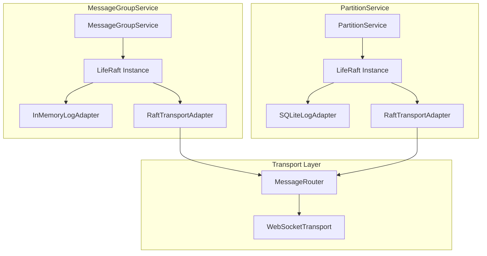

# Design Document: Raft Library Integration

## Overview

This design replaces the hand-rolled Raft consensus implementations in `MessageGroupService` and `PartitionService` with the `liferaft` library. The library handles all Raft state machine logic (term management, vote counting, log replication, leader election) while we provide transport and storage adapters.

The key insight is that a Raft library handles **consensus state** - the application only needs to:
1. Provide a transport mechanism (how messages flow between peers)
2. Provide a storage mechanism (where to persist Raft state)
3. Apply committed entries to the state machine

## Architecture



## Components and Interfaces

### RaftTransportAdapter

Bridges the `liferaft` library with our existing `MessageRouter` for WebSocket-based communication.

```javascript
/**
 * Transport adapter for liferaft that uses MessageRouter.
 * Implements the write() method required by liferaft.
 */
class RaftTransportAdapter {
  /**
   * @param {Object} options
   * @param {MessageRouter} options.messageRouter - WebSocket message router
   * @param {string} options.entityType - 'message-group' or 'partition'
   * @param {string} options.nodeId - This node's ID
   * @param {SystemTableCache} options.systemTableCache - For peer address lookup
   */
  constructor(options) {
    this.messageRouter = options.messageRouter;
    this.entityType = options.entityType;
    this.nodeId = options.nodeId;
    this.systemTableCache = options.systemTableCache;
  }

  /**
   * Send a Raft message to a peer.
   * Called by liferaft when it needs to communicate with other nodes.
   * @param {Object} packet - Raft protocol packet from liferaft
   * @param {Function} callback - Completion callback
   */
  async write(packet, callback) {
    const peerAddress = this.buildPeerAddress(packet.address);
    
    try {
      const result = await this.messageRouter.deliver(peerAddress, {
        type: this.getRaftMessageType(packet.type),
        ...packet.data
      });
      callback(null, result);
    } catch (error) {
      callback(error);
    }
  }

  /**
   * Build unified address for a peer.
   * Format: ${nodeId}/${entityType}/${entityId}
   */
  buildPeerAddress(peerId) {
    if (peerId.includes('/')) return peerId;
    
    // Look up nodeId from system table cache
    if (this.systemTableCache) {
      const service = this.systemTableCache.get('services', peerId);
      if (service?.node_id) {
        return `${service.node_id}/${this.entityType}/${peerId}`;
      }
    }
    
    // Fallback: assume same node during bootstrap
    return `${this.nodeId}/${this.entityType}/${peerId}`;
  }

  /**
   * Map liferaft packet types to our message types.
   */
  getRaftMessageType(packetType) {
    const typeMap = {
      'vote': 'RAFT_REQUEST_VOTE',
      'voted': 'RAFT_REQUEST_VOTE_RESPONSE',
      'append': 'RAFT_APPEND_ENTRIES',
      'appended': 'RAFT_APPEND_ENTRIES_RESPONSE'
    };
    return typeMap[packetType] || packetType;
  }
}
```

### InMemoryLogAdapter

Log storage for message groups using in-memory storage (ephemeral).

```javascript
/**
 * In-memory log adapter for liferaft.
 * Used by MessageGroupService for ephemeral message routing state.
 */
class InMemoryLogAdapter {
  constructor() {
    this.log = [];
    this.commitIndex = 0;
  }

  /**
   * Append entries to the log.
   * @param {Array} entries - Log entries to append
   * @param {Function} callback - Completion callback
   */
  append(entries, callback) {
    this.log.push(...entries);
    callback(null);
  }

  /**
   * Get entries from a starting index.
   * @param {number} startIndex - Starting index
   * @param {Function} callback - Callback with entries
   */
  getEntriesFrom(startIndex, callback) {
    callback(null, this.log.slice(startIndex));
  }

  /**
   * Get the last log entry.
   * @param {Function} callback - Callback with entry
   */
  getLastEntry(callback) {
    const entry = this.log.length > 0 ? this.log[this.log.length - 1] : null;
    callback(null, entry);
  }

  /**
   * Truncate log from a specific index.
   * @param {number} fromIndex - Index to truncate from
   * @param {Function} callback - Completion callback
   */
  truncateFrom(fromIndex, callback) {
    this.log = this.log.slice(0, fromIndex);
    callback(null);
  }

  /**
   * Get log length.
   * @param {Function} callback - Callback with length
   */
  getLength(callback) {
    callback(null, this.log.length);
  }
}
```

### SQLiteLogAdapter

Log storage for partitions using SQLite (durable).

```javascript
/**
 * SQLite log adapter for liferaft.
 * Used by PartitionService for durable data storage.
 */
class SQLiteLogAdapter {
  /**
   * @param {Database} db - better-sqlite3 database instance
   */
  constructor(db) {
    this.db = db;
    this.initializeTables();
  }

  initializeTables() {
    this.db.exec(`
      CREATE TABLE IF NOT EXISTS _raft_log (
        log_index INTEGER PRIMARY KEY,
        term INTEGER NOT NULL,
        command TEXT NOT NULL,
        timestamp INTEGER NOT NULL
      )
    `);
    
    this.db.exec(`
      CREATE TABLE IF NOT EXISTS _raft_state (
        key TEXT PRIMARY KEY,
        value TEXT
      )
    `);
  }

  /**
   * Append entries to the log.
   */
  append(entries, callback) {
    const stmt = this.db.prepare(
      'INSERT INTO _raft_log (log_index, term, command, timestamp) VALUES (?, ?, ?, ?)'
    );
    
    const insertMany = this.db.transaction((entries) => {
      for (const entry of entries) {
        stmt.run(entry.index, entry.term, JSON.stringify(entry.command), Date.now());
      }
    });
    
    try {
      insertMany(entries);
      callback(null);
    } catch (error) {
      callback(error);
    }
  }

  /**
   * Get entries from a starting index.
   */
  getEntriesFrom(startIndex, callback) {
    try {
      const entries = this.db.prepare(
        'SELECT log_index, term, command FROM _raft_log WHERE log_index >= ? ORDER BY log_index'
      ).all(startIndex);
      
      callback(null, entries.map(row => ({
        index: row.log_index,
        term: row.term,
        command: JSON.parse(row.command)
      })));
    } catch (error) {
      callback(error);
    }
  }

  /**
   * Truncate log from a specific index.
   */
  truncateFrom(fromIndex, callback) {
    try {
      this.db.prepare('DELETE FROM _raft_log WHERE log_index >= ?').run(fromIndex);
      callback(null);
    } catch (error) {
      callback(error);
    }
  }

  /**
   * Get/set persistent Raft state (term, votedFor).
   */
  getState(key, callback) {
    try {
      const row = this.db.prepare('SELECT value FROM _raft_state WHERE key = ?').get(key);
      callback(null, row ? row.value : null);
    } catch (error) {
      callback(error);
    }
  }

  setState(key, value, callback) {
    try {
      this.db.prepare('INSERT OR REPLACE INTO _raft_state (key, value) VALUES (?, ?)')
        .run(key, value);
      callback(null);
    } catch (error) {
      callback(error);
    }
  }
}
```

### Updated MessageGroupService

The service now delegates Raft logic to liferaft.

```javascript
class MessageGroupService extends EventEmitter {
  constructor(options) {
    super();
    // ... existing validation ...
    
    // Create transport adapter
    this.transportAdapter = new RaftTransportAdapter({
      messageRouter: options.transport,
      entityType: 'message-group',
      nodeId: this.nodeId,
      systemTableCache: this.systemTableCache
    });
    
    // Create log adapter
    this.logAdapter = new InMemoryLogAdapter();
    
    // Create liferaft instance
    this.raft = null; // Initialized in initialize()
  }

  async initialize() {
    // Create extended LifeRaft class with our transport
    const self = this;
    const RaftNode = LifeRaft.extend({
      initialize(options) {
        // Called when raft is ready
      },
      
      write(packet, callback) {
        self.transportAdapter.write(packet, callback);
      }
    });
    
    // Create raft instance
    this.raft = new RaftNode(this.replicaId, {
      heartbeat: ConfigurationManager.getInstance().get('raft.heartbeatIntervalMs') || 50,
      election: {
        min: ConfigurationManager.getInstance().get('raft.electionTimeoutMinMs') || 150,
        max: ConfigurationManager.getInstance().get('raft.electionTimeoutMaxMs') || 300
      },
      log: this.logAdapter
    });
    
    // Wire up events
    this.raft.on('leader', () => {
      this.role = RaftRole.LEADER;
      this.isLeader = true;
      this.leaderId = this.replicaId;
      this.emit('leaderElected', {
        leaderId: this.replicaId,
        term: this.raft.term,
        groupId: this.groupId
      });
    });
    
    this.raft.on('follower', () => {
      this.role = RaftRole.FOLLOWER;
      this.isLeader = false;
    });
    
    this.raft.on('commit', (command) => {
      this.applyCommittedEntry(command);
    });
    
    // Join peer nodes
    for (const peerId of this.replicaIds) {
      if (peerId !== this.replicaId) {
        this.raft.join(peerId);
      }
    }
    
    this.initialized = true;
    this.emit('initialized', {groupId: this.groupId, replicaId: this.replicaId});
  }

  /**
   * Apply a committed entry to the state machine.
   * This is called by liferaft when an entry is committed.
   */
  applyCommittedEntry(command) {
    switch (command.type) {
      case 'MESSAGE':
        // Handle message persistence
        break;
      case 'CDC':
        // Apply CDC event to cache
        this.systemTableCache.applySystemTableChange(
          command.tableName,
          command.operation,
          command.data
        );
        this.emit('cdcApplied', command);
        break;
      case 'ACK':
        // Handle acknowledgment
        this.acknowledgedMessages.add(command.messageId);
        break;
    }
  }

  /**
   * Handle incoming Raft message from transport.
   */
  handleRaftMessage(message) {
    // Forward to liferaft's data event
    this.raft.emit('data', message);
  }
}
```

## Data Models

### Raft Message Types

Messages exchanged between Raft peers via the transport adapter:

```javascript
// Vote request (RequestVote RPC)
{
  type: 'RAFT_REQUEST_VOTE',
  term: 5,
  candidateId: 'replica-1',
  lastLogIndex: 10,
  lastLogTerm: 4
}

// Vote response
{
  type: 'RAFT_REQUEST_VOTE_RESPONSE',
  term: 5,
  voteGranted: true
}

// Append entries (heartbeat or log replication)
{
  type: 'RAFT_APPEND_ENTRIES',
  term: 5,
  leaderId: 'replica-1',
  prevLogIndex: 9,
  prevLogTerm: 4,
  entries: [...],
  leaderCommit: 8
}

// Append entries response
{
  type: 'RAFT_APPEND_ENTRIES_RESPONSE',
  term: 5,
  success: true,
  matchIndex: 10
}
```

### Log Entry Structure

```javascript
{
  index: 10,
  term: 5,
  command: {
    type: 'CDC',  // or 'MESSAGE', 'ACK', 'SQL'
    tableName: 'nodes',
    operation: 'INSERT',
    data: { id: 'node-1', address: '...' },
    timestamp: '2026-01-22T...'
  }
}
```

## Correctness Properties

*A property is a characteristic or behavior that should hold true across all valid executions of a system-essentially, a formal statement about what the system should do. Properties serve as the bridge between human-readable specifications and machine-verifiable correctness guarantees.*

### Property 1: In-Memory Storage Round-Trip

*For any* Raft state (currentTerm, votedFor, log entries) stored in the InMemoryLogAdapter, retrieving that state should return the same values that were stored.

**Validates: Requirements 3.1, 3.2, 3.3**

### Property 2: SQLite Storage Round-Trip and Restart Recovery

*For any* Raft state (currentTerm, votedFor, log entries) stored in the SQLiteLogAdapter, retrieving that state (including after simulated restart) should return the same values that were stored.

**Validates: Requirements 4.1, 4.2, 4.3, 4.6**

### Property 3: Log Truncation Correctness

*For any* log with entries and any valid truncation index, after truncation all entries at or after the truncation index should be removed, and all entries before should be preserved.

**Validates: Requirements 3.4, 4.4**

### Property 4: Transport Adapter Message Delivery

*For any* Raft message that the library needs to send, the Transport_Adapter should deliver it via MessageRouter, and any incoming Raft message should be forwarded to the library.

**Validates: Requirements 2.1, 2.2**

### Property 5: Unified Address Format

*For any* peer ID, the Transport_Adapter should generate an address in the unified format `${nodeId}/${entityType}/${entityId}`.

**Validates: Requirements 2.3**

### Property 6: Committed Entry Application

*For any* entry committed by the Raft library, the state machine should apply it, update the appropriate state (cache or database), and emit a CDC event.

**Validates: Requirements 6.1, 6.2, 6.3, 6.4, 6.5**

### Property 7: Quorum-Based Write Availability

*For any* cluster configuration, writes should only succeed when a quorum of nodes is available, and should fail (not hang) when quorum is lost.

**Validates: Requirements 9.4, 9.5**

## Error Handling

### Transport Errors

When the transport adapter fails to deliver a message:
1. The error is passed to liferaft's callback
2. Liferaft handles retry logic internally
3. If the peer is persistently unreachable, liferaft will eventually time out

### Storage Errors

When storage operations fail:
1. The error is passed to liferaft's callback
2. Liferaft may retry or report the error
3. For SQLite, transaction rollback ensures consistency

### Quorum Loss

When the cluster loses quorum:
1. Liferaft stops accepting new commands
2. Existing commands may time out
3. The service reports unavailability to callers
4. When quorum is restored, normal operation resumes

## Testing Strategy

### Unit Tests

- Test InMemoryLogAdapter methods in isolation
- Test SQLiteLogAdapter methods in isolation
- Test RaftTransportAdapter address building
- Test message type mapping

### Property-Based Tests

Using fast-check with `{numRuns: 10}` per the testing guidelines:

1. **Storage round-trip tests**: Generate random Raft state, store it, retrieve it, verify equality
2. **Log truncation tests**: Generate random logs and truncation points, verify correct truncation
3. **Address format tests**: Generate random peer IDs, verify unified address format
4. **Committed entry tests**: Generate random entries, commit them, verify state machine updates

### Integration Tests

- Test full Raft cluster with 3 nodes
- Test leader election
- Test log replication
- Test failure scenarios (node down, network partition)

### Library Selection

The design uses `@markwylde/liferaft` because:
1. Pure JavaScript, no external dependencies like Redis or MQTT
2. Transport-agnostic (you provide the `write` method)
3. Storage-agnostic (you provide the log adapter)
4. Actively maintained (forked and updated in 2023)
5. Emits events for leader election, commits, state changes
6. Supports custom configuration for timeouts

