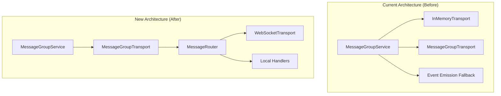

# Design Document: Remove In-Memory Transport from Message Groups

## Overview

This design removes all in-memory transport references from the MessageGroupService to enforce WebSocket-based transport exclusively. The change ensures that message groups fail hard when transport is unavailable rather than silently falling back to local event emission, which could mask production issues.

The key changes are:
1. MessageGroupService constructor validates transport is provided and WebSocket-based
2. All message delivery and Raft consensus operations throw errors when transport is unavailable
3. Bootstrap and Node Joining services use MessageRouter/MessageGroupTransport instead of InMemoryTransport
4. Tests are updated to use mock WebSocket transport

## Architecture



The MessageRouter already provides unified local/remote routing - it handles both local delivery (to handlers on the same node) and remote delivery (via WebSocket). This means we don't lose local message passing capability; we just route it through the proper transport layer.

## Components and Interfaces

### MessageGroupService Changes

```javascript
/**
 * MessageGroupService constructor - UPDATED
 * Now requires WebSocket-based transport and validates it.
 */
class MessageGroupService extends EventEmitter {
  constructor(options = {}) {
    super();
    
    // Existing required validations
    if (!options.groupId) {
      throw new Error('MessageGroupService requires groupId');
    }
    if (!options.replicaId) {
      throw new Error('MessageGroupService requires replicaId');
    }
    
    // NEW: Transport is now required
    if (!options.transport) {
      throw new Error('MessageGroupService requires transport - WebSocket transport is mandatory');
    }
    
    // NEW: Validate transport is WebSocket-based
    if (!this.isWebSocketBasedTransport(options.transport)) {
      throw new Error('MessageGroupService requires WebSocket-based transport (MessageGroupTransport or MessageRouter)');
    }
    
    this.transport = options.transport;
    // ... rest of constructor
  }
  
  /**
   * Check if transport is WebSocket-based.
   * Valid transports: MessageGroupTransport, MessageRouter
   * Invalid: InMemoryTransport, null, undefined
   */
  isWebSocketBasedTransport(transport) {
    if (!transport) return false;
    
    // Check for MessageGroupTransport or MessageRouter by duck typing
    // Both have: deliver(), initialize(), shutdown()
    // MessageRouter has: setServiceNodeResolver()
    // MessageGroupTransport has: setMessageRouter()
    const hasDeliver = typeof transport.deliver === 'function';
    const hasInitialize = typeof transport.initialize === 'function';
    const isMessageRouter = typeof transport.setServiceNodeResolver === 'function';
    const isMessageGroupTransport = typeof transport.setMessageRouter === 'function';
    
    return hasDeliver && hasInitialize && (isMessageRouter || isMessageGroupTransport);
  }
}
```

### Updated attemptDirectDelivery Method

```javascript
/**
 * Attempt direct delivery to target service.
 * UPDATED: Throws error instead of falling back to event emission.
 */
async attemptDirectDelivery(messageEnvelope) {
  const {id: messageId, targetService, payload} = messageEnvelope;
  
  // Transport is guaranteed to exist (validated in constructor)
  // but we still check at runtime for defense in depth
  if (!this.transport) {
    this.logger.error('WebSocket transport not available for message delivery', {
      messageId,
      targetService,
      groupId: this.groupId,
    });
    throw new Error('WebSocket transport required but not available');
  }
  
  let lastError = null;
  for (let attempt = 0; attempt < this.retryMaxAttempts; attempt++) {
    messageEnvelope.attempts++;
    
    try {
      if (attempt > 0) {
        const baseDelay = Math.min(
          this.retryInitialDelayMs * Math.pow(this.retryBackoffMultiplier, attempt - 1),
          this.retryMaxDelayMs,
        );
        const jitter = baseDelay * this.retryJitterFactor * Math.random();
        await this.sleep(baseDelay + jitter);
      }
      
      const result = await this.transport.deliver(targetService, {
        messageId,
        payload,
        sourceGroup: this.groupId,
        sourceReplica: this.replicaId,
      });
      
      if (result && result.acknowledged) {
        return {success: true, attempt: attempt + 1, result};
      }
    } catch (error) {
      lastError = error;
      this.logger.debug('Delivery attempt failed', {
        messageId,
        targetService,
        attempt: attempt + 1,
        error: error.message,
      });
    }
  }
  
  return {success: false, error: lastError?.message || 'Max retries exceeded'};
}
```

### Updated startElection Method

```javascript
/**
 * Start a leader election.
 * UPDATED: Throws error instead of falling back to event emission.
 */
async startElection() {
  if (this.role === RaftRole.LEADER) {
    return;
  }
  
  this.role = RaftRole.CANDIDATE;
  this.storage.currentTerm++;
  this.storage.votedFor = this.replicaId;
  
  // Single-node or self-hosted scenarios still become leader immediately
  if (this.replicaIds.length === 1 ||
      this.replicaIds.every((id) => id === this.replicaId) ||
      this.isSelfHostedGroup) {
    this.becomeLeader();
    return;
  }
  
  // Transport is guaranteed to exist (validated in constructor)
  if (!this.transport) {
    this.logger.error('WebSocket transport not available for Raft consensus', {
      term: this.storage.currentTerm,
      replicaId: this.replicaId,
      groupId: this.groupId,
    });
    throw new Error('WebSocket transport required for Raft consensus');
  }
  
  await this.requestVotesFromPeers();
  this.startElectionTimer();
}
```

### Bootstrap Service Changes

```javascript
/**
 * Phase 1: Infrastructure setup - UPDATED
 * MessageRouter is initialized first, InMemoryTransport removed for message groups.
 */
async phaseInfrastructure() {
  // ... existing config and node service initialization ...
  
  // Create MessageRouter for unified local/remote message routing
  this.messageRouter = new MessageRouter({
    nodeId: this.nodeId,
    nodeAddress: this.nodeAddress,
    wsPort: wsPort,
  });
  
  this.messageRouter.setServiceNodeResolver((address) => {
    const match = address.match(/^([^/]+)\//);
    return match ? match[1] : null;
  });
  
  // Initialize MessageRouter - this is now required before message groups
  await this.messageRouter.initialize({startServer: false});
  
  // Create MessageGroupTransport using MessageRouter
  // This replaces InMemoryTransport for message group communication
  this.messageGroupTransport = new MessageGroupTransport({
    localAddress: `${this.nodeId}/mg-transport`,
    localNodeId: this.nodeId,
    messageRouter: this.messageRouter,
  });
  await this.messageGroupTransport.initialize();
  
  // NOTE: InMemoryTransport is still created for partition services
  // which legitimately need local Raft consensus during bootstrap
  this.partitionTransport = new InMemoryTransport();
}

/**
 * Phase 2: Message group creation - UPDATED
 * Uses MessageGroupTransport instead of InMemoryTransport.
 */
async phaseMessageGroups() {
  const groupId = INITIAL_MESSAGE_GROUP_ID;
  const replicaIds = INITIAL_MESSAGE_GROUP_REPLICA_IDS;
  
  for (const replicaId of replicaIds) {
    const messageGroup = new MessageGroupService({
      groupId,
      replicaId,
      nodeId: this.nodeId,
      replicaIds,
      transport: this.messageGroupTransport, // Changed from this.transport
      isSelfHostedGroup: true,
    });
    
    // Register with MessageRouter for message delivery
    this.messageRouter.register(replicaId, (envelope) => {
      return messageGroup.receiveMessage(envelope);
    });
    
    await messageGroup.initialize();
    this.messageGroupServices.set(replicaId, messageGroup);
  }
  
  // ... rest of method unchanged ...
}
```

### Node Joining Service Changes

Similar changes to Bootstrap Service - use MessageGroupTransport instead of InMemoryTransport for message group communication.

## Data Models

No data model changes required. This is a transport layer change only.

## Correctness Properties

*A property is a characteristic or behavior that should hold true across all valid executions of a system-essentially, a formal statement about what the system should do. Properties serve as the bridge between human-readable specifications and machine-verifiable correctness guarantees.*

### Property 1: Transport Type Validation

*For any* transport object passed to MessageGroupService constructor, if the transport is not WebSocket-based (lacks deliver/initialize methods or is InMemoryTransport), the constructor SHALL throw an error.

**Validates: Requirements 1.2**

### Property 2: No Silent Delivery Failures

*For any* message delivery attempt when transport is null or unavailable, the MessageGroupService SHALL throw an error rather than silently skipping delivery or emitting local events.

**Validates: Requirements 4.3, 1.3**

### Property 3: Error Message Consistency

*For any* transport unavailability error thrown by MessageGroupService, the error message SHALL contain "WebSocket transport" to clearly indicate the transport requirement.

**Validates: Requirements 4.1, 4.2**

## Error Handling

### Transport Validation Errors

| Error Condition | Error Message | Recovery Action |
|----------------|---------------|-----------------|
| No transport provided | "MessageGroupService requires transport - WebSocket transport is mandatory" | Provide MessageGroupTransport or MessageRouter |
| Invalid transport type | "MessageGroupService requires WebSocket-based transport (MessageGroupTransport or MessageRouter)" | Replace InMemoryTransport with WebSocket-based transport |
| Transport unavailable at runtime | "WebSocket transport required but not available" | Check transport initialization, restart service |
| Transport unavailable for Raft | "WebSocket transport required for Raft consensus" | Check transport initialization, restart service |

### Bootstrap Failure Handling

If MessageRouter fails to initialize during bootstrap:
1. Log error with full context (nodeId, wsPort, error details)
2. Emit 'phaseFailed' event with phase='infrastructure'
3. Throw error to halt bootstrap process
4. Do not attempt fallback to InMemoryTransport

## Testing Strategy

### Unit Tests

Unit tests will verify specific error conditions and initialization behavior:

1. **Constructor validation tests**: Verify errors thrown for missing/invalid transport
2. **Error message tests**: Verify exact error messages match requirements
3. **Initialization order tests**: Verify MessageRouter initialized before message groups

### Property-Based Tests

Property tests will use fast-check with `{numRuns: 10}` per testing guidelines:

1. **Transport type validation property**: Generate various transport-like objects and verify only valid WebSocket transports are accepted
2. **No silent failures property**: Generate message delivery scenarios with null transport and verify all throw errors
3. **Error message property**: Generate transport failure scenarios and verify error messages contain required text

### Mock WebSocket Transport

Tests will use a mock WebSocket transport that implements the required interface:

```javascript
class MockWebSocketTransport {
  constructor(options = {}) {
    this.shouldFail = options.shouldFail || false;
    this.deliveredMessages = [];
  }
  
  async initialize() {
    if (this.shouldFail) {
      throw new Error('Mock transport initialization failed');
    }
  }
  
  async deliver(target, message) {
    if (this.shouldFail) {
      throw new Error('Mock transport delivery failed');
    }
    this.deliveredMessages.push({target, message});
    return {acknowledged: true};
  }
  
  setMessageRouter(router) {
    this.router = router;
  }
  
  async shutdown() {}
}
```

### Test Configuration

- Property tests: 10 iterations per test (per testing guidelines)
- Test timeout: 2 seconds maximum (per testing guidelines)
- No real delays - use immediate promises
