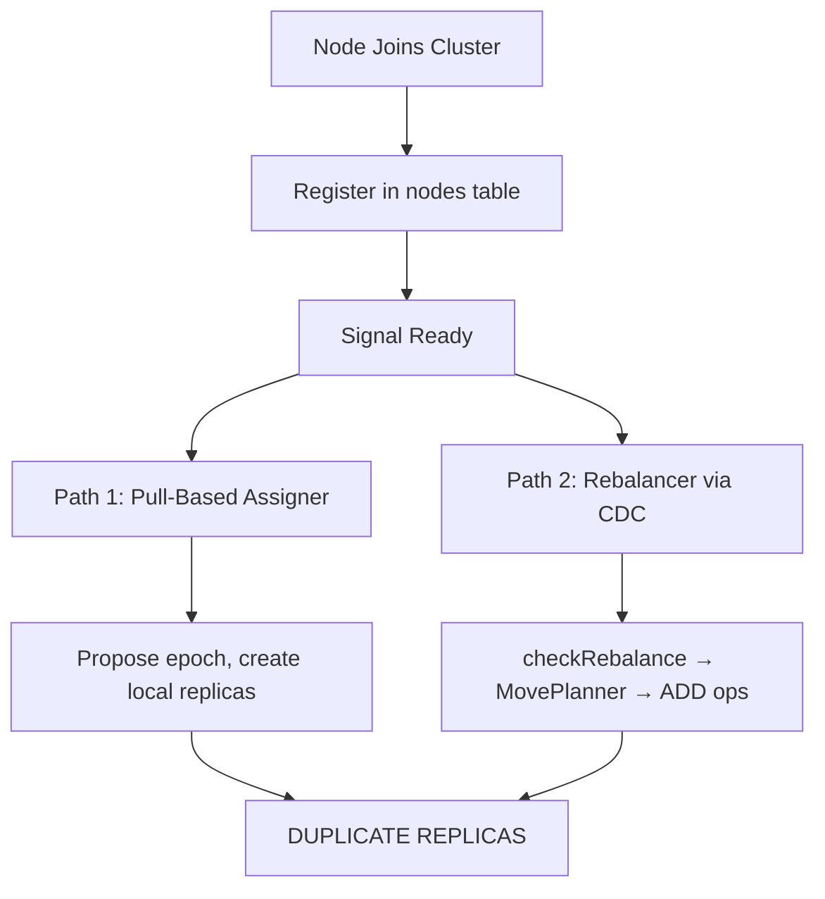
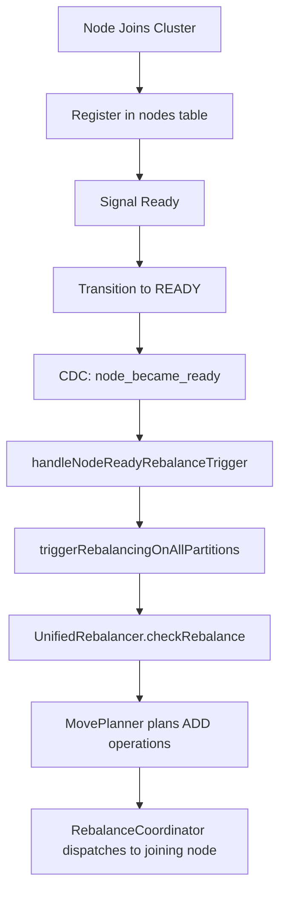

# Design Document: Remove Pull-Based Replica Assignment

## Overview

This design removes the pull-based replica assignment path from the node joining service, consolidating replica placement under the single authority of the `UnifiedRebalancer`. The joining node's responsibility simplifies to: contact seed → connect WebSocket → create/join message group → wait leadership → initialize replica handler → register node → signal ready → transition to READY. The rebalancer on partition leaders handles all replica creation asynchronously after the node signals readiness.

The change eliminates three categories of problems caused by the dual-path architecture:
- Duplicate replica creation (healthy replica count reaching 4-5 instead of target 3)
- Even replica counts violating the Raft odd-replica invariant
- Replica sync timeout failures and log spam

## Architecture

The current join flow has two parallel replica placement paths:



After the change, only the rebalancer path remains:



## Components and Interfaces

### Modified Components

#### NodeJoiningService (`src/bootstrap/node-joining-service.js`)

Changes to the `join()` method flow:

**Before:**
```
signalReadyForReplicas() → initializePullBasedAssignment() → transition(SYNCING) → syncPulledReplicas() → transition(READY)
```

**After:**
```
signalReadyForReplicas() → transition(READY)
```

Removed members:
- `this.pullBasedAssigner` instance variable
- `this.epochManager` instance variable
- `this._replicasToPull` tracking state
- `initializePullBasedAssignment()` method
- `syncPulledReplicas()` method
- `getBootstrapCurrentEpoch()` method
- `readAuthoritativeEpochConfig()` method
- `persistProposedEpochWithCas()` method
- `executeEpochSql()` method
- `applyCurrentEpochFromCache()` method
- `getPullBasedAssigner()` accessor
- `getEpochManager()` accessor

Removed imports:
- `PullBasedReplicaAssigner` from `pull-based-replica-assigner.js`
- `AssignmentEpochManager` from `assignment-epoch-manager.js`
- `AssignmentEpoch` from `assignment-epoch.js`
- `EPOCH_CONFIG_KEY` from `cdc-integration-service.js`
- `JOINING_SEED_PROPOSER` from `node-joining-constants.js`
- `CONFIG_VALUE_TYPE` from `config-constants.js`

Removed from join result object:
- `pullBasedAssigner` field
- `epochManager` field

CDC event handlers: Remove the `applyCurrentEpochFromCache()` calls from both CDC subscription sites (the `subscribeToCDCEvents` handler and the partition CDC handler in `initializeReplicaHandler`). The CDC handler itself remains — only the epoch-specific branch is removed.

#### NodeLifecycleStateMachine (`src/node/node-lifecycle-state-machine.js`)

Add `NodeState.READY` as a valid transition from `NodeState.JOINING`:

```javascript
// Before
[NodeState.JOINING]: [NodeState.SYNCING, NodeState.STOPPED],

// After
[NodeState.JOINING]: [NodeState.SYNCING, NodeState.READY, NodeState.STOPPED],
```

This allows the joining flow to skip SYNCING while preserving the seed node's auto-transition path (JOINING → SYNCING → READY) in `NodeService`.

#### Node Joining Constants (`src/bootstrap/node-joining-constants.js`)

Remove constants only used by the pull-based path:

From `JOINING_DEFAULT`:
- `replicaSyncTimeoutMs`
- `replicaSyncRetryAttempts`
- `replicaSyncRetryDelayMs`

From `JOINING_LOG_MSG`:
- `PULL_ASSIGN_INIT`
- `READY_NODES_MISSING`
- `PULL_ASSIGN_FAILED`
- `REBALANCE_NOT_NEEDED`
- `EPOCH_PROPOSAL_FAILED`
- `EPOCH_PROPOSED`
- `LOCAL_REPLICAS_CREATED`
- `NO_REPLICAS_TO_SYNC`
- `SYNCING_REPLICAS`
- `REPLICA_SYNC_SUCCESS`
- `REPLICA_SYNC_FAILED`
- `REPLICA_SYNC_COMPLETE`

From `JOINING_ERROR_MSG`:
- `READY_NODES_REQUIRED`
- `pullAssignFailed`
- `epochProposalFailed`
- `localReplicaCreateFailed`
- `replicaSyncFailed`
- `RPC_CLIENT_REQUIRED`

Remove `JOINING_SEED_PROPOSER` export entirely.

#### Rebalancer Constants (`src/rebalancer/rebalancer-constants.js`)

Remove `PULL_ASSIGNER_ERROR_MSG` constant and its export.

### Deleted Components

#### PullBasedReplicaAssigner (`src/rebalancer/pull-based-replica-assigner.js`)

Delete entirely. This class is only imported by `NodeJoiningService` and its own test files.

#### Test Files to Delete

- `test/rebalancer/pull-based-replica-assigner.test.js` — unit tests for the deleted class
- `test/rebalancer/autonomous-placement-decisions.property.test.js` — property tests for the deleted class

### Preserved Components (No Changes)

- `AssignmentEpochManager` (`src/rebalancer/assignment-epoch-manager.js`) — used by seed bootstrap and CDC
- `AssignmentEpoch` (`src/rebalancer/assignment-epoch.js`) — used by seed bootstrap and CDC
- `UnifiedRebalancer` — the kept path, no changes needed
- `RebalanceCoordinator` — dispatches operations, no changes needed
- `BootstrapService.handleNodeReadyRebalanceTrigger()` — triggers rebalancing on node ready, no changes needed
- Rebalancer index exports for `AssignmentEpochManager` and `AssignmentEpoch` — still needed

## Data Models

No data model changes. The `nodes`, `services`, `partitions`, and `config` system tables remain unchanged. The `config.current_epoch` row continues to be managed by the seed node's `AssignmentEpochManager`.

The join result object shape changes:

```javascript
// Before
{
  success, nodeId, duration,
  messageGroupServices, partitionServices,
  replicaHandler, replicaStateMachine,
  transport, messageRouter, bootstrapResponse,
  lifecycleStateMachine,
  pullBasedAssigner,  // REMOVED
  epochManager,       // REMOVED
}

// After
{
  success, nodeId, duration,
  messageGroupServices, partitionServices,
  replicaHandler, replicaStateMachine,
  transport, messageRouter, bootstrapResponse,
  lifecycleStateMachine,
}
```

</text>
</invoke>

## Correctness Properties

*A property is a characteristic or behavior that should hold true across all valid executions of a system — essentially, a formal statement about what the system should do. Properties serve as the bridge between human-readable specifications and machine-verifiable correctness guarantees.*

This feature is primarily a code removal task. Most acceptance criteria are structural (methods/files removed, imports cleaned up) rather than behavioral. The key behavioral properties are:

**Property 1: Join result contains no pull-based artifacts**
*For any* successful join invocation, the result object SHALL NOT contain `pullBasedAssigner` or `epochManager` keys, and the service instance SHALL NOT have `pullBasedAssigner`, `epochManager`, or `_replicasToPull` set to non-null values.
**Validates: Requirements 1.1, 1.2, 1.4, 6.5**

**Property 2: State machine allows JOINING to READY transition**
*For any* NodeLifecycleStateMachine instance in JOINING state, transitioning to READY SHALL succeed, and transitioning through JOINING → SYNCING → READY SHALL also succeed (preserving the seed node path).
**Validates: Requirements 4.1, 4.2, 4.3**

**Property 3: Rebalance trigger fires on node ready CDC event**
*For any* CDC event where a node transitions to READY state with a valid lease, the bootstrap service's handleNodeReadyRebalanceTrigger SHALL schedule a rebalance on all partition leaders.
**Validates: Requirements 3.1**

## Error Handling

No new error handling is introduced. The removal simplifies error handling by eliminating:
- Epoch proposal failures and CAS retry logic
- Replica sync timeout handling
- Pull-based assignment analysis failures
- Local replica creation failures

The remaining join flow error handling is unchanged:
- HTTP bootstrap request failures → retry with backoff
- WebSocket connection failures → throw and fail join
- Message group creation failures → throw and fail join
- Leadership wait timeout → throw and fail join
- Node registration failures → throw and fail join

## Testing Strategy

### Unit Tests

Focus on verifying the structural changes:

1. **Removed members test**: Verify `NodeJoiningService.prototype` does not have `initializePullBasedAssignment`, `syncPulledReplicas`, `getPullBasedAssigner`, `getEpochManager`, `getBootstrapCurrentEpoch`, `readAuthoritativeEpochConfig`, `persistProposedEpochWithCas`, `executeEpochSql`, or `applyCurrentEpochFromCache`.

2. **State machine transition test**: Verify JOINING → READY is a valid transition. Verify JOINING → SYNCING → READY still works.

3. **Join flow test**: Verify a mocked join completes with lifecycle state READY, without passing through SYNCING, and the result object has no `pullBasedAssigner` or `epochManager`.

4. **Existing node-joining-service tests**: Update mocked stubs that override `initializePullBasedAssignment` and `syncPulledReplicas` — these stubs should be removed since the methods no longer exist.

5. **Existing node-lifecycle-state-machine tests**: Add test for JOINING → READY transition.

### Property-Based Tests

Property-based testing has limited applicability here since this is a removal task. The existing property test file `autonomous-placement-decisions.property.test.js` is deleted along with the class it tests.

The state machine transition property (Property 2) could be expressed as a property test but is better served by specific example tests given the small, fixed state space.

### Test Configuration

- Testing framework: Node.js built-in test runner with tap
- Property-based testing library: fast-check (max 10 iterations per workspace rules)
- Unit test time limit: 2 seconds per test
- Run targeted tests only during implementation; full suite at checkpoints
