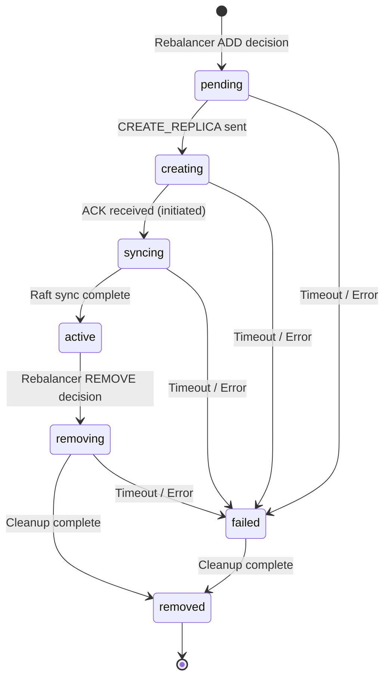

# Design Document: Replica Lifecycle State Machine

## Overview

This design introduces a formal state machine for replica lifecycle management that unifies the currently scattered state tracking across `ReplicaLifecycleManager` and `UnifiedRebalancer`. The state machine provides a single source of truth for replica status, enforces valid transitions, handles timeouts, and emits events for observability.

## Architecture



### State Definitions

| State | Description | Entry Trigger | Exit Triggers |
|-------|-------------|---------------|---------------|
| `pending` | Rebalancer decided to add replica, not yet sent | ADD move generated | CREATE_REPLICA sent, timeout, error |
| `creating` | CREATE_REPLICA message sent, awaiting ACK | Message sent | ACK received, timeout, error |
| `syncing` | Target node acknowledged, syncing Raft log | ACK with `initiated` | Sync complete, timeout, error |
| `active` | Replica fully operational | Sync complete | REMOVE decision, node failure |
| `removing` | REMOVE_REPLICA in progress | REMOVE move generated | Cleanup complete, timeout, error |
| `removed` | Replica fully removed | Cleanup complete | Terminal state |
| `failed` | Operation failed, needs cleanup | Any error/timeout | Cleanup to `removed` |

## Components and Interfaces

### ReplicaStateMachine Class

The core state machine implementation that tracks all replicas and enforces transitions.

```javascript
/**
 * ReplicaStateMachine - Central state machine for replica lifecycle.
 * Enforces valid transitions and emits events for all state changes.
 */
class ReplicaStateMachine extends EventEmitter {
  constructor(options = {}) {
    super();
    this.systemTableCache = options.systemTableCache;
    this.cdcIntegrationService = options.cdcIntegrationService;
    this.nodeId = options.nodeId;
    
    // State tracking: Map<replicaId, ReplicaState>
    this.replicas = new Map();
    
    // Timeout configuration (ms)
    this.timeouts = {
      pending: options.pendingTimeoutMs || 30000,
      creating: options.creatingTimeoutMs || 60000,
      syncing: options.syncingTimeoutMs || 300000,
      removing: options.removingTimeoutMs || 60000,
    };
    
    // Concurrent operation limits
    this.limits = {
      maxConcurrentAdds: options.maxConcurrentAdds || 5,
      maxConcurrentRemoves: options.maxConcurrentRemoves || 5,
    };
    
    // Timeout check interval
    this.timeoutCheckInterval = null;
  }
  
  /**
   * Transition a replica to a new state.
   * @param {string} replicaId - Replica identifier
   * @param {string} newState - Target state
   * @param {Object} context - Additional context (reason, error, etc.)
   * @returns {boolean} True if transition succeeded
   */
  transition(replicaId, newState, context = {}) { }
  
  /**
   * Check if a transition is valid.
   * @param {string} currentState - Current state (or null for new replica)
   * @param {string} newState - Target state
   * @returns {boolean} True if transition is valid
   */
  isValidTransition(currentState, newState) { }
  
  /**
   * Get replicas in transitional states.
   * @returns {Array<ReplicaState>} Replicas in pending/creating/syncing/removing
   */
  getTransitionalReplicas() { }
  
  /**
   * Check if concurrent operation limits allow new operations.
   * @param {string} operationType - 'add' or 'remove'
   * @returns {boolean} True if operation can proceed
   */
  canStartOperation(operationType) { }
  
  /**
   * Get current state of a replica.
   * @param {string} replicaId - Replica identifier
   * @returns {ReplicaState|null} Current state or null if not tracked
   */
  getState(replicaId) { }
  
  /**
   * Get metrics about state machine operations.
   * @returns {Object} Metrics object
   */
  getMetrics() { }
}
```

### ReplicaState Interface

```javascript
/**
 * @typedef {Object} ReplicaState
 * @property {string} replicaId - Unique replica identifier
 * @property {string} partitionId - Parent partition identifier
 * @property {string} nodeId - Node hosting this replica
 * @property {string} state - Current state
 * @property {number} stateEnteredAt - Timestamp when current state was entered
 * @property {string} previousState - Previous state (for debugging)
 * @property {string} triggerReason - What triggered the current state
 * @property {string|null} errorMessage - Error message if in failed state
 * @property {Object} metadata - Additional metadata (table_name, etc.)
 */
```

### Valid Transitions Matrix

```javascript
const VALID_TRANSITIONS = {
  null: ['pending'],                    // New replica
  pending: ['creating', 'failed'],      // Send message or timeout
  creating: ['syncing', 'failed'],      // ACK received or timeout
  syncing: ['active', 'failed'],        // Sync complete or timeout
  active: ['removing', 'failed'],       // Remove decision or node failure
  removing: ['removed', 'failed'],      // Cleanup complete or timeout
  failed: ['removed'],                  // Cleanup after failure
  removed: [],                          // Terminal state
};
```

## Data Models

### Services Table Extension

The existing `services` table already has a `status` column. We'll use it with the new state values:

```sql
-- Existing services table, status column values updated
-- status: 'pending', 'creating', 'syncing', 'active', 'removing', 'removed', 'failed'

-- Add columns for state machine tracking
ALTER TABLE services ADD COLUMN state_entered_at INTEGER;
ALTER TABLE services ADD COLUMN previous_state TEXT;
ALTER TABLE services ADD COLUMN trigger_reason TEXT;
ALTER TABLE services ADD COLUMN error_message TEXT;
```

### State Transition Event

```javascript
/**
 * @typedef {Object} StateTransitionEvent
 * @property {string} eventType - 'replica_state_transition'
 * @property {string} replicaId - Replica identifier
 * @property {string} partitionId - Partition identifier
 * @property {string} nodeId - Node identifier
 * @property {string} previousState - State before transition
 * @property {string} newState - State after transition
 * @property {number} timestamp - Transition timestamp
 * @property {string} triggerReason - What triggered the transition
 * @property {string|null} errorMessage - Error if transitioning to failed
 * @property {number} timeInPreviousState - Milliseconds spent in previous state
 */
```

## Integration Points

### Rebalancer Integration

The `UnifiedRebalancer` will query the state machine before generating moves:

```javascript
// In UnifiedRebalancer.calculateMoves()
calculateMoves(currentReplicas, targetState) {
  // Query state machine for transitional replicas
  const transitional = this.stateMachine.getTransitionalReplicas();
  
  // Filter out replicas already being added/removed
  const pendingAdds = transitional.filter(r => 
    ['pending', 'creating', 'syncing'].includes(r.state)
  );
  const pendingRemoves = transitional.filter(r => 
    r.state === 'removing'
  );
  
  // Check concurrent operation limits
  if (!this.stateMachine.canStartOperation('add')) {
    this.logger.warn('Concurrent ADD limit reached, skipping new adds');
    // Don't generate ADD moves
  }
  
  // ... rest of move calculation
}
```

### Lifecycle Manager Integration

The `ReplicaLifecycleManager` will use the state machine for all transitions:

```javascript
// In ReplicaLifecycleManager.handleCreateReplica()
async handleCreateReplica(message) {
  const { replica_id, partition_id } = message;
  
  // Check current state
  const currentState = this.stateMachine.getState(replica_id);
  
  if (currentState?.state === 'active') {
    return { status: 'already_exists', replica_id };
  }
  
  if (['creating', 'syncing'].includes(currentState?.state)) {
    return { status: 'in_progress', replica_id };
  }
  
  // Transition to creating (from pending or null)
  this.stateMachine.transition(replica_id, 'creating', {
    partitionId: partition_id,
    nodeId: this.nodeId,
    reason: 'CREATE_REPLICA received',
  });
  
  // ... continue with creation
}
```

## Timeout Handling

The state machine runs a periodic check for stuck operations:

```javascript
startTimeoutChecker() {
  this.timeoutCheckInterval = setInterval(() => {
    const now = Date.now();
    
    for (const [replicaId, state] of this.replicas) {
      const timeout = this.timeouts[state.state];
      if (!timeout) continue; // No timeout for this state
      
      const elapsed = now - state.stateEnteredAt;
      if (elapsed > timeout) {
        this.logger.warn('Replica operation timed out', {
          replicaId,
          state: state.state,
          elapsed,
          timeout,
        });
        
        this.transition(replicaId, 'failed', {
          reason: `Timeout in ${state.state} state after ${elapsed}ms`,
          errorMessage: `Operation timed out after ${timeout}ms`,
        });
      }
    }
  }, 5000); // Check every 5 seconds
}
```


## Correctness Properties

*A property is a characteristic or behavior that should hold true across all valid executions of a system—essentially, a formal statement about what the system should do. Properties serve as the bridge between human-readable specifications and machine-verifiable correctness guarantees.*

### Property 1: Valid Transition Enforcement

*For any* state transition attempt on the Replica_State_Machine, the transition SHALL succeed if and only if the (currentState, newState) pair exists in the valid transitions matrix. Invalid transitions SHALL be rejected and logged.

**Validates: Requirements 1.2, 1.3**

### Property 2: Failure Transitions from Transitional States

*For any* replica in a transitional state (`creating`, `syncing`, or `removing`) that encounters an error, the state machine SHALL allow transition to `failed` state.

**Validates: Requirements 2.7**

### Property 3: No Duplicate ADD Moves for Transitional Replicas

*For any* partition that has a replica in `pending`, `creating`, or `syncing` state on a target node, the Rebalancer SHALL NOT generate an ADD move for that partition on that node.

**Validates: Requirements 3.2**

### Property 4: No Duplicate REMOVE Moves for Removing Replicas

*For any* replica that is already in `removing` state, the Rebalancer SHALL NOT generate a REMOVE move for that replica.

**Validates: Requirements 3.3**

### Property 5: Cleanup Moves for Failed Replicas

*For any* replica in `failed` state, the Rebalancer SHALL generate a cleanup move to transition it to `removed` state.

**Validates: Requirements 3.4**

### Property 6: State Persistence via CDC

*For any* state transition, the Replica_State_Machine SHALL persist the new state to the `services` system table via CDC before the transition method returns.

**Validates: Requirements 4.1**

### Property 7: Recovery State Handling

*For any* replica found in a transitional state (`creating`, `syncing`, `removing`) after node recovery, the Lifecycle_Manager SHALL transition it appropriately: `creating`/`syncing` → `failed`, `removing` → `removed`.

**Validates: Requirements 4.3, 4.4**

### Property 8: Event Emission Completeness

*For any* state transition, the Replica_State_Machine SHALL emit an event containing: replica_id, partition_id, node_id, previous_state, new_state, timestamp, trigger_reason. For transitions to `failed`, the event SHALL also include error_message.

**Validates: Requirements 5.1, 5.3**

### Property 9: Entry Time Tracking

*For any* replica entering a transitional state (`pending`, `creating`, `syncing`, `removing`), the Replica_State_Machine SHALL record the entry timestamp and make it available via `getState()`.

**Validates: Requirements 6.1**

### Property 10: Timeout-Triggered Failures

*For any* replica that remains in a transitional state longer than the configured timeout for that state, the Replica_State_Machine SHALL automatically transition it to `failed` state with a timeout error message.

**Validates: Requirements 6.2, 6.3, 6.4, 6.5**

### Property 11: State Count Accuracy

*For any* sequence of state transitions, the Replica_State_Machine SHALL maintain accurate counts of replicas in each state, queryable via `getStateCounts()`.

**Validates: Requirements 7.1**

### Property 12: Concurrent Operation Limits

*For any* operation type (add or remove), when the count of replicas in the corresponding transitional states exceeds the configured limit, the state machine SHALL report `canStartOperation()` as false.

**Validates: Requirements 7.2, 7.3**

### Property 13: Idempotent Operations

*For any* duplicate CREATE_REPLICA or REMOVE_REPLICA message, the Lifecycle_Manager SHALL return an appropriate status (`already_exists`, `in_progress`, `not_found`) without changing the replica's state.

**Validates: Requirements 9.1, 9.2, 9.3, 9.4**

### Property 14: Metrics Accuracy

*For any* sequence of state transitions, the Replica_State_Machine SHALL maintain accurate metrics including: transition counts per state pair, time spent in each state, failure counts, and peak concurrent operations.

**Validates: Requirements 10.1, 10.2, 10.3, 10.4**

## Error Handling

### Transition Errors

When a transition fails:
1. Log the error with full context (replica_id, current_state, attempted_state, reason)
2. If in a transitional state, transition to `failed`
3. Emit a `transitionError` event for observers
4. Return false from the `transition()` method

### Timeout Errors

When a timeout occurs:
1. Log a warning with the replica details and elapsed time
2. Transition to `failed` with reason "timeout"
3. Emit a `timeout` event for observers
4. The Rebalancer will generate a cleanup move on next cycle

### Recovery Errors

When recovery finds inconsistent state:
1. Log the inconsistency with full details
2. Attempt to transition to a safe state (`failed` or `removed`)
3. If transition fails, log critical error and continue with other replicas
4. Emit a `recoveryError` event

### CDC Write Errors

When CDC persistence fails:
1. Log the error with full context
2. Retry up to 3 times with exponential backoff
3. If all retries fail, transition to `failed` state
4. Emit a `persistenceError` event

## Testing Strategy

### Unit Tests

Unit tests will cover:
- State machine initialization and configuration
- Individual state transitions (valid and invalid)
- Timeout configuration and checking
- Metrics collection and reporting
- Observer registration and event emission

### Property-Based Tests

Property-based tests using fast-check with `numRuns: 10`:

1. **Valid Transition Property**: Generate random (currentState, newState) pairs and verify transitions match the valid transitions matrix
2. **Idempotency Property**: Generate duplicate operations and verify state preservation
3. **Concurrent Limits Property**: Generate sequences of operations and verify limits are enforced
4. **Metrics Accuracy Property**: Generate transition sequences and verify metrics match expected values
5. **Event Completeness Property**: Generate transitions and verify all required fields are present in events

### Integration Tests

Integration tests will cover:
- Rebalancer querying state machine before generating moves
- Lifecycle Manager using state machine for CREATE/REMOVE handling
- CDC persistence and recovery
- Admin CLI state display

### Test Configuration

```javascript
// Property test configuration
const propertyTestConfig = {
  numRuns: 10,  // Per testing guidelines
  seed: Date.now(),
};

// Timeout configuration for tests (shorter than production)
const testTimeouts = {
  pending: 100,
  creating: 200,
  syncing: 500,
  removing: 200,
};
```
