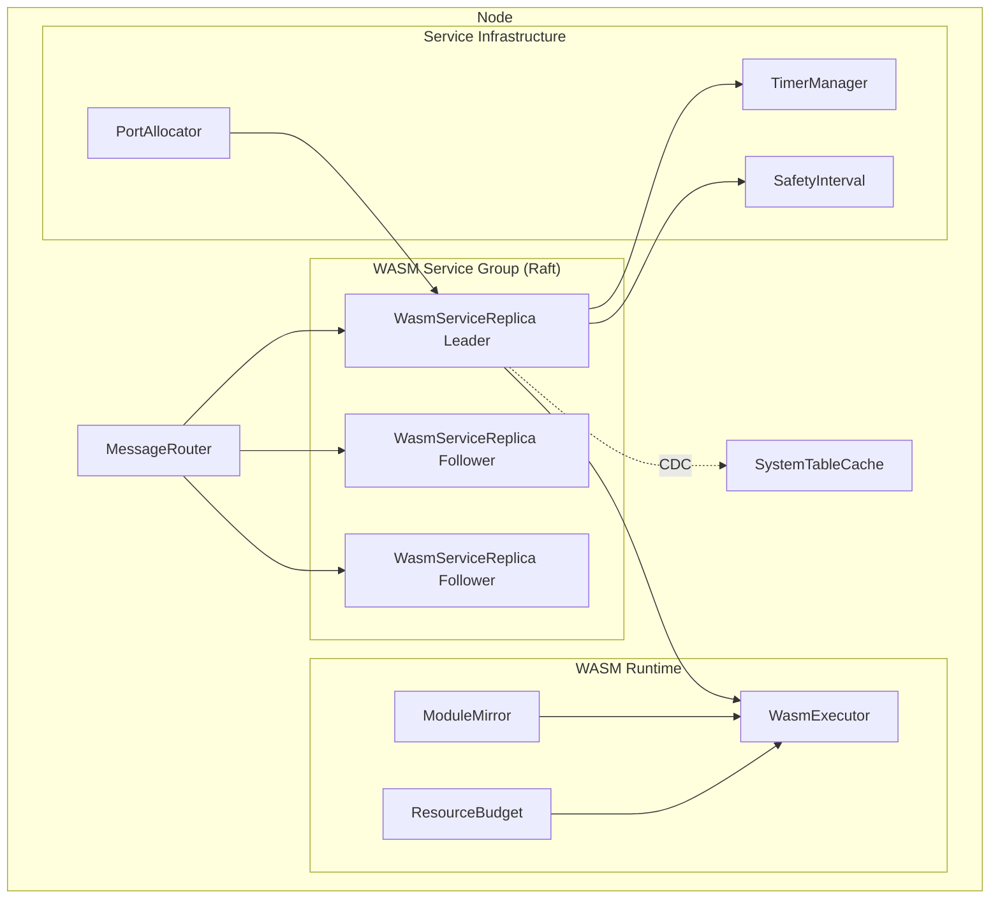
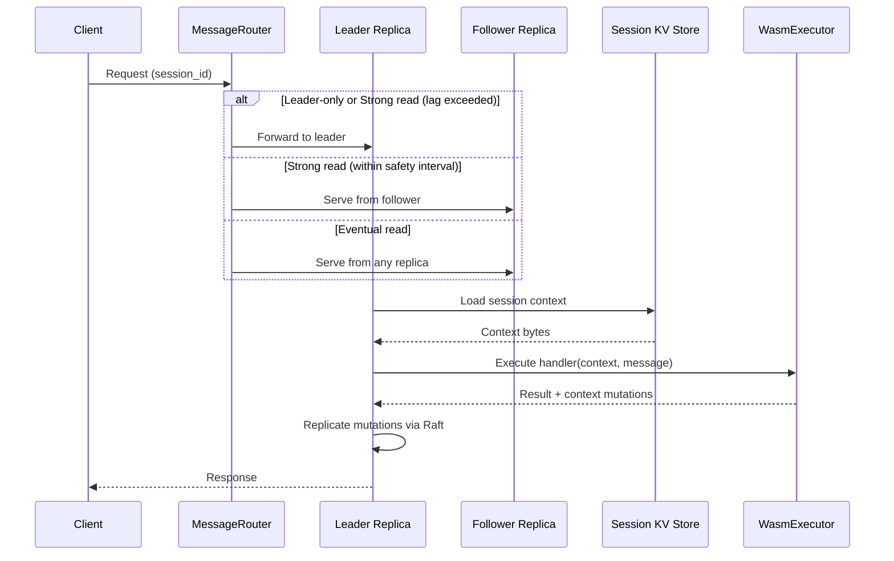

# Design Document: Replicated WASM Services

## Overview

This feature introduces a third Raft group type — WASM service groups — alongside the existing partitions (data storage) and message groups (communication). Each WASM service group is a persistent Raft consensus group that hosts a WASI/WASM handler function with a replicated key-value store for session context, configurable read/write consistency, persistent timers, and external communication ports.

The design follows the existing codebase patterns:
- Extends `RaftReplicaBase` for Raft consensus (same as `PartitionService` and `MessageGroupService`)
- Registers in the `services` table with a new `wasm_service` service type
- Integrates with `UnifiedRebalancer` for replica placement
- Uses CDC events for system table updates
- Routes all communication through `MessageRouter`

### Key Design Decisions

1. **Extend RaftReplicaBase** rather than building from scratch — reuses election, log replication, and peer management.
2. **SQLite-backed KV store** for session context — same storage model as partitions, replicated through Raft log.
3. **Safety interval for strong reads** — leader broadcasts committed index + timestamp; followers track apply lag. This avoids routing all reads to the leader while bounding staleness.
4. **Timer state in Raft log** — timers are replicated state machine entries, not external. Only the leader runs active timers. New leaders reconstruct from KV store.
5. **Node-controlled port allocation** — services request ports from the node, not self-allocate. The node owns all port management.
6. **Module pull on replica assignment** — WASM binaries are pulled from peers on demand, not eagerly pushed to all nodes.

## Architecture



### Component Interaction Flow



## Components and Interfaces

### 1. WasmServiceReplica (extends RaftReplicaBase)

The core Raft group member for WASM services. Extends `RaftReplicaBase` (same base class as `PartitionService` and `MessageGroupService`).

```javascript
class WasmServiceReplica extends RaftReplicaBase {
  constructor(options) {
    super({
      ...options,
      entityType: ENTITY_TYPE.WASM_SERVICE,
      subsystemName: WASM_SERVICE_SUBSYSTEM.REPLICA,
    });
    
    this.serviceDefinitionId = options.serviceDefinitionId;
    this.kvStore = new SessionKVStore(options.dbPath);
    this.timerManager = new TimerManager(this);
    this.safetyInterval = new SafetyInterval(options.safetyIntervalMs);
    this.wasmExecutor = null; // Set after module mirror confirms availability
    this.portAllocation = null; // Set by node port allocator
  }

  // Raft state machine apply — called when entries are committed
  async applyCommittedEntry(entry) { /* ... */ }
  
  // Handle incoming service messages
  async handleMessage(message) { /* ... */ }
  
  // Leader election callback
  onBecameLeader() { /* reconstruct timers, start safety interval broadcasts */ }
  onLostLeadership() { /* stop timers, stop broadcasts */ }
}
```

**Registers in `services` table** with:
- `service_type`: `'wasm_service'`
- `service_id`: `{serviceDefinitionId}-r{N}`
- `partition_id`: null (not a partition)
- `group_id`: `{serviceDefinitionId}` (the service definition ID serves as the group ID)

### 2. SessionKVStore

SQLite-backed key-value store for session context, replicated through Raft.

```javascript
class SessionKVStore {
  constructor(dbPath) { /* open SQLite db */ }
  
  // Read operations (local, consistency handled by caller)
  get(sessionId, key) { /* returns Buffer */ }
  getAll(sessionId) { /* returns Map<string, Buffer> */ }
  
  // Write operations (called only when Raft entry is committed)
  applySet(sessionId, key, value) { /* ... */ }
  applyDelete(sessionId, key) { /* ... */ }
  applyDeleteSession(sessionId) { /* ... */ }
  
  // Size tracking for resource budget enforcement
  getSessionSize(sessionId) { /* returns bytes */ }
  getTotalSize() { /* returns bytes */ }
}
```

**SQL Schema** (internal to each replica's SQLite):
```sql
CREATE TABLE IF NOT EXISTS _kv_store (
  session_id TEXT NOT NULL,
  key TEXT NOT NULL,
  value BLOB NOT NULL,
  updated_at INTEGER NOT NULL,
  PRIMARY KEY (session_id, key)
);

CREATE INDEX IF NOT EXISTS idx_kv_session ON _kv_store(session_id);
```

### 3. SafetyInterval

Implements CockroachDB-style closed timestamp reads for strong consistency without routing all reads to the leader.

```javascript
class SafetyInterval {
  constructor(intervalMs) {
    this.intervalMs = intervalMs;
    this.lastLeaderIndex = 0;
    this.lastLeaderTimestamp = 0;
    this.localAppliedIndex = 0;
  }
  
  // Called by leader periodically
  broadcastState(committedIndex, timestamp) { /* ... */ }
  
  // Called by followers when they receive leader broadcast
  updateLeaderState(committedIndex, timestamp) { /* ... */ }
  
  // Called by followers to check if they can serve a read
  canServeRead() {
    // true if localAppliedIndex >= lastLeaderIndex
    // AND (now - lastLeaderTimestamp) < intervalMs
  }
  
  // Called when a Raft entry is applied locally
  updateLocalAppliedIndex(index) { /* ... */ }
}
```

### 4. TimerManager

Manages persistent timers. Only active on the leader. Timer state is replicated through Raft.

```javascript
class TimerManager {
  constructor(replica) {
    this.replica = replica;
    this.activeTimers = new Map(); // timerId -> setTimeout handle
  }
  
  // Create a timer (proposes Raft entry)
  async createTimer(timerId, delayMs, payload) { /* ... */ }
  
  // Cancel a timer (proposes Raft entry)
  async cancelTimer(timerId) { /* ... */ }
  
  // Called on leader election — reconstruct from KV store
  async reconstructTimers() { /* ... */ }
  
  // Called when timer fires — marks as fired in Raft, then invokes handler
  async onTimerFired(timerId) { /* ... */ }
  
  // Stop all active timers (on leadership loss)
  stopAll() { /* ... */ }
}
```

Timer entries in the KV store use a reserved session prefix `_timers`:
- Key: `_timers/{timerId}`
- Value: JSON `{ timerId, delayMs, fireAt, payload, status: 'active'|'fired'|'cancelled' }`

### 5. WasmExecutor

Registers with the existing `FunctionRegistry` as executor type `'wasm_service'`. Handles WASM module instantiation, context injection, and resource budget enforcement.

```javascript
class WasmExecutor {
  constructor(options) {
    this.resourceBudget = options.resourceBudget;
    this.moduleMirror = options.moduleMirror;
    this.functionRegistry = options.functionRegistry;
  }
  
  // FunctionRegistry executor interface
  async execute(func, context, args) {
    // 1. Get WASM module from mirror cache
    // 2. Instantiate with WASI imports + context injection
    // 3. Set CPU/memory limits from resource budget
    // 4. Run handler function
    // 5. Collect context mutations
    // 6. Return result + mutations
  }
}
```

### 6. ModuleMirror

Ensures WASM binaries are available on nodes hosting replicas. Pulls from peers on demand.

```javascript
class ModuleMirror {
  constructor(options) {
    this.localCache = new Map(); // functionId -> { version, wasmBytes }
    this.messageRouter = options.messageRouter;
  }
  
  // Check if module is available locally
  hasModule(functionId, version) { /* ... */ }
  
  // Pull module from a peer node
  async pullModule(functionId, version, sourceNodeId) { /* ... */ }
  
  // Get module bytes for instantiation
  getModule(functionId) { /* ... */ }
  
  // Called when code table CDC event indicates new version
  async onCodeUpdate(functionId, version) { /* ... */ }
}
```

### 7. PortAllocator (Node-level)

Node-level service that manages port allocation for WASM service replicas.

```javascript
class PortAllocator {
  constructor(options) {
    this.portRangeStart = options.portRangeStart;
    this.portRangeEnd = options.portRangeEnd;
    this.allocatedPorts = new Map(); // serviceId -> port
  }
  
  // Allocate a port for a service replica
  allocate(serviceId) { /* returns port number */ }
  
  // Release a port
  release(serviceId) { /* ... */ }
  
  // Check if a port is available
  isAvailable(port) { /* ... */ }
}
```

### 8. ServiceDefinitionValidator

Validates service definitions before creation.

```javascript
class ServiceDefinitionValidator {
  constructor(options) {
    this.sqlQueryEngine = options.sqlQueryEngine;
  }
  
  // Validate a service definition
  async validate(definition) {
    // 1. Check handler function exists in code table
    // 2. Check replica count is odd and >= 3
    // 3. Check read/write consistency modes are valid
    // 4. Check resource budget values are within bounds
    // Returns { valid: boolean, errors: string[] }
  }
}
```

## Data Models

### New System Tables

#### service_definitions

```javascript
const SERVICE_DEFINITIONS_SCHEMA = {
  tableName: 'service_definitions',
  columns: [
    { name: 'service_id', type: 'TEXT', primaryKey: true },
    { name: 'service_name', type: 'TEXT', notNull: true, unique: true },
    { name: 'handler_function_id', type: 'TEXT', notNull: true },
    { name: 'read_consistency', type: 'TEXT', notNull: true, defaultValue: "'strong'" },
    { name: 'write_consistency', type: 'TEXT', notNull: true, defaultValue: "'strong'" },
    { name: 'replica_count', type: 'INTEGER', notNull: true, defaultValue: 3 },
    { name: 'protocol', type: 'TEXT', notNull: true, defaultValue: "'websocket'" },
    { name: 'resource_budget', type: 'TEXT', notNull: true, defaultValue: "'{}'" },
    { name: 'safety_interval_ms', type: 'INTEGER', notNull: true, defaultValue: 500 },
    { name: 'status', type: 'TEXT', notNull: true, defaultValue: "'active'" },
    { name: 'created_at', type: 'INTEGER', notNull: true },
    { name: 'updated_at', type: 'INTEGER', notNull: true },
  ],
  indices: [
    { name: 'idx_svc_def_name', columns: ['service_name'] },
    { name: 'idx_svc_def_handler', columns: ['handler_function_id'] },
    { name: 'idx_svc_def_status', columns: ['status'] },
  ],
};
```

#### service_endpoints

```javascript
const SERVICE_ENDPOINTS_SCHEMA = {
  tableName: 'service_endpoints',
  columns: [
    { name: 'endpoint_id', type: 'TEXT', primaryKey: true },
    { name: 'service_id', type: 'TEXT', notNull: true },
    { name: 'node_id', type: 'TEXT', notNull: true },
    { name: 'protocol', type: 'TEXT', notNull: true },
    { name: 'address', type: 'TEXT', notNull: true },
    { name: 'port', type: 'INTEGER', notNull: true },
    { name: 'health_status', type: 'TEXT', notNull: true, defaultValue: "'healthy'" },
    { name: 'metadata', type: 'TEXT', notNull: true, defaultValue: "'{}'" },
    { name: 'created_at', type: 'INTEGER', notNull: true },
    { name: 'updated_at', type: 'INTEGER', notNull: true },
  ],
  indices: [
    { name: 'idx_svc_ep_service', columns: ['service_id'] },
    { name: 'idx_svc_ep_node', columns: ['node_id'] },
    { name: 'idx_svc_ep_health', columns: ['health_status'] },
  ],
};
```

#### service_timers

```javascript
const SERVICE_TIMERS_SCHEMA = {
  tableName: 'service_timers',
  columns: [
    { name: 'timer_id', type: 'TEXT', primaryKey: true },
    { name: 'service_id', type: 'TEXT', notNull: true },
    { name: 'delay_ms', type: 'INTEGER', notNull: true },
    { name: 'fire_at', type: 'INTEGER', notNull: true },
    { name: 'payload', type: 'TEXT', notNull: true, defaultValue: "'{}'" },
    { name: 'status', type: 'TEXT', notNull: true, defaultValue: "'active'" },
    { name: 'created_at', type: 'INTEGER', notNull: true },
    { name: 'updated_at', type: 'INTEGER', notNull: true },
  ],
  indices: [
    { name: 'idx_svc_timer_service', columns: ['service_id'] },
    { name: 'idx_svc_timer_status', columns: ['status'] },
    { name: 'idx_svc_timer_fire', columns: ['fire_at'] },
  ],
};
```

### Modified Existing Tables/Constants

#### SERVICE_TYPE constant (src/constants/service.js)

```javascript
const SERVICE_TYPE = Object.freeze({
  PARTITION: 'partition',
  MESSAGE_GROUP: 'message_group',
  MESSAGE_GROUP_REPLICA: 'message_group_replica',
  WASM_SERVICE: 'wasm_service',  // NEW
});
```

#### TABLES constant (src/constants/tables.js)

```javascript
// Add to existing TABLES:
SERVICE_DEFINITIONS: 'service_definitions',
SERVICE_ENDPOINTS: 'service_endpoints',
SERVICE_TIMERS: 'service_timers',
```

#### REBALANCER_ENTITY_TYPE (src/rebalancer/rebalancer-constants.js)

```javascript
const REBALANCER_ENTITY_TYPE = Object.freeze({
  PARTITION: SERVICE_TYPE.PARTITION,
  MESSAGE_GROUP: SERVICE_TYPE.MESSAGE_GROUP,
  WASM_SERVICE: SERVICE_TYPE.WASM_SERVICE,  // NEW
});
```

### Resource Budget Model

```javascript
// Serialized as JSON in service_definitions.resource_budget
const ResourceBudget = {
  cpuTimeLimitMs: 5000,        // Max CPU time per invocation
  memoryLimitBytes: 67108864,  // Max memory per invocation (64MB default)
  sessionSizeLimitBytes: 1048576,  // Max context size per session (1MB default)
  serviceSizeLimitBytes: 104857600, // Max total context size per service (100MB default)
};
```

### Timer Entry Model

```javascript
// Serialized as JSON in the Raft-replicated KV store under _timers/ prefix
const TimerEntry = {
  timerId: 'string',
  serviceId: 'string',
  delayMs: 0,
  fireAt: 0,          // Absolute timestamp
  payload: {},         // Arbitrary JSON
  status: 'active',   // 'active' | 'fired' | 'cancelled'
  createdAt: 0,
};
```

### Service Definition Model

```javascript
const ServiceDefinition = {
  serviceId: 'string',
  serviceName: 'string',
  handlerFunctionId: 'string',
  readConsistency: 'strong',    // 'leader_only' | 'strong' | 'eventual'
  writeConsistency: 'strong',   // 'strong' | 'async'
  replicaCount: 3,
  protocol: 'websocket',
  resourceBudget: ResourceBudget,
  safetyIntervalMs: 500,
  status: 'active',
};
```


## Correctness Properties

*A property is a characteristic or behavior that should hold true across all valid executions of a system — essentially, a formal statement about what the system should do. Properties serve as the bridge between human-readable specifications and machine-verifiable correctness guarantees.*

### Property 1: Service definition validation rejects invalid definitions

*For any* service definition, the validator SHALL accept it if and only if: (a) the referenced handler function exists in the code table, AND (b) the replica count is an odd number >= 3. For all other definitions, the validator SHALL reject with a descriptive error.

**Validates: Requirements 1.1, 1.4, 1.5**

### Property 2: KV store round-trip preserves opaque bytes

*For any* session identifier, key string, and arbitrary byte sequence stored in the SessionKVStore, reading back the same session+key SHALL return the identical byte sequence.

**Validates: Requirements 3.2, 3.3**

### Property 3: Read routing correctness across consistency modes

*For any* read consistency mode, replica role (leader/follower), and follower state (applied index, last leader broadcast index, last leader broadcast timestamp, safety interval), the read routing decision SHALL satisfy:
- leader_only mode → route to leader always
- strong mode → serve locally iff applied index >= last leader broadcast index AND (now - last leader broadcast timestamp) < safety interval; otherwise forward to leader
- eventual mode → serve locally always

**Validates: Requirements 3.4, 4.1, 4.3, 4.4, 4.5**

### Property 4: Size limit enforcement rejects oversized writes

*For any* session context write, if the resulting session size exceeds the per-session limit OR the resulting total service size exceeds the per-service limit, the write SHALL be rejected with an error that identifies which specific limit was breached. If neither limit is exceeded, the write SHALL be accepted.

**Validates: Requirements 3.5, 3.6, 10.3, 10.4, 10.5**

### Property 5: Timer reconstruction skips non-active timers

*For any* set of timer entries in the KV store with mixed statuses (active, fired, cancelled), reconstructing timers SHALL produce active timer handles only for entries with status 'active', and SHALL skip all entries with status 'fired' or 'cancelled'.

**Validates: Requirements 7.3, 7.6**

### Property 6: Service endpoint metadata completeness

*For any* service endpoint record, the metadata field SHALL contain the service name, version, and protocol fields required for service discovery.

**Validates: Requirements 11.4**

### Property 7: ServiceDefinition serialization round-trip

*For any* valid ServiceDefinition object, serializing it to a table row (with JSON-encoded resource_budget) and deserializing back SHALL produce an equivalent ServiceDefinition object.

**Validates: Requirements 1.3, 14.1**

### Property 8: ResourceBudget serialization round-trip

*For any* valid ResourceBudget object with non-negative numeric fields (cpuTimeLimitMs, memoryLimitBytes, sessionSizeLimitBytes, serviceSizeLimitBytes), serializing to JSON and deserializing back SHALL produce an equivalent object.

**Validates: Requirements 14.2**

### Property 9: TimerEntry serialization round-trip

*For any* valid TimerEntry object, serializing to JSON (for Raft log storage) and deserializing back SHALL produce an equivalent TimerEntry object with identical timerId, serviceId, delayMs, fireAt, payload, and status.

**Validates: Requirements 14.3**

## Error Handling

### Validation Errors
- Invalid handler function reference → reject with `HANDLER_FUNCTION_NOT_FOUND` error
- Even replica count → reject with `ODD_REPLICA_COUNT_REQUIRED` error
- Invalid consistency mode → reject with `INVALID_CONSISTENCY_MODE` error

### Resource Limit Errors
- CPU time exceeded → terminate WASM execution, return `CPU_TIME_LIMIT_EXCEEDED` with the configured limit
- Memory exceeded → terminate WASM execution, return `MEMORY_LIMIT_EXCEEDED` with the configured limit
- Session context size exceeded → reject write, return `SESSION_SIZE_LIMIT_EXCEEDED` with session ID and limit
- Service total context size exceeded → reject write, return `SERVICE_SIZE_LIMIT_EXCEEDED` with service ID and limit

### Raft Errors
- No leader available → retry with backoff (same pattern as existing partition/message group services)
- Write rejected (not leader) → forward to leader via MessageRouter
- Raft group not ready → return `SERVICE_NOT_READY` error

### Module Mirror Errors
- Module not available on any node → return `MODULE_NOT_AVAILABLE` error, block replica readiness
- Module pull failed → retry with backoff, keep replica in non-ready state

### Port Allocation Errors
- No ports available → return `PORT_EXHAUSTED` error, log warning
- Port conflict → retry with next available port

### Timer Errors
- Timer creation fails (Raft not committed) → return error to caller, no timer scheduled
- Timer handler invocation fails → log error, mark timer as fired (do not retry to preserve exactly-once)

All errors follow the existing codebase pattern:
- Errors are logged with structured metadata (service ID, node ID, operation)
- Transient errors trigger retries with exponential backoff
- Errors are never swallowed — always re-thrown or logged
- No try/catch for control flow

## Testing Strategy

### Unit Tests

Unit tests cover specific examples, edge cases, and error conditions:

- ServiceDefinitionValidator: valid definition accepted, missing function rejected, even replica count rejected, invalid consistency mode rejected
- SessionKVStore: get/set/delete operations, empty session returns null, size calculation accuracy
- SafetyInterval: canServeRead() with various lag scenarios, broadcast update, stale broadcast detection
- TimerManager: reconstructTimers() with mixed statuses, timer creation serialization
- PortAllocator: allocate/release, port exhaustion, double-release handling
- ResourceBudget: parsing from JSON, default values, boundary conditions
- ModuleMirror: hasModule check, cache hit/miss

### Property-Based Tests

Property-based tests use `fast-check` with `{numRuns: 10}` per the project testing guidelines. Each property test references its design document property.

- **Property 1** (Service definition validation): Generate random service definitions with random function IDs and backing code tables. Verify validator accept/reject matches the validity rules.
  - Tag: `Feature: replicated-wasm-services, Property 1: Service definition validation rejects invalid definitions`

- **Property 2** (KV store round-trip): Generate random session IDs, keys, and byte arrays. Store in KV, read back, verify identical.
  - Tag: `Feature: replicated-wasm-services, Property 2: KV store round-trip preserves opaque bytes`

- **Property 3** (Read routing correctness): Generate random consistency modes, replica roles, applied indices, leader broadcast states, and safety intervals. Verify routing decision matches the mode's rules.
  - Tag: `Feature: replicated-wasm-services, Property 3: Read routing correctness across consistency modes`

- **Property 4** (Size limit enforcement): Generate random session data sizes and resource budget limits. Verify accept/reject matches size comparison and error identifies the breached limit.
  - Tag: `Feature: replicated-wasm-services, Property 4: Size limit enforcement rejects oversized writes`

- **Property 5** (Timer reconstruction): Generate random sets of timer entries with mixed statuses. Verify reconstruction produces active handles only for 'active' entries.
  - Tag: `Feature: replicated-wasm-services, Property 5: Timer reconstruction skips non-active timers`

- **Property 6** (Endpoint metadata completeness): Generate random service endpoint records. Verify metadata contains service_name, version, and protocol.
  - Tag: `Feature: replicated-wasm-services, Property 6: Service endpoint metadata completeness`

- **Property 7** (ServiceDefinition round-trip): Generate random valid ServiceDefinition objects. Serialize to row, deserialize, verify equivalence.
  - Tag: `Feature: replicated-wasm-services, Property 7: ServiceDefinition serialization round-trip`

- **Property 8** (ResourceBudget round-trip): Generate random ResourceBudget objects with non-negative numbers. JSON.stringify, JSON.parse, verify equivalence.
  - Tag: `Feature: replicated-wasm-services, Property 8: ResourceBudget serialization round-trip`

- **Property 9** (TimerEntry round-trip): Generate random TimerEntry objects. Serialize to JSON, deserialize, verify equivalence.
  - Tag: `Feature: replicated-wasm-services, Property 9: TimerEntry serialization round-trip`

### Testing Configuration

- Framework: Node.js built-in test runner with tap
- Property-based testing: fast-check with `{numRuns: 10}`
- All tests must complete under 2 seconds
- No skipped tests
- Each property-based test is a single test case implementing one design property
- Tests are co-located with implementation under `test/wasm-service/`
