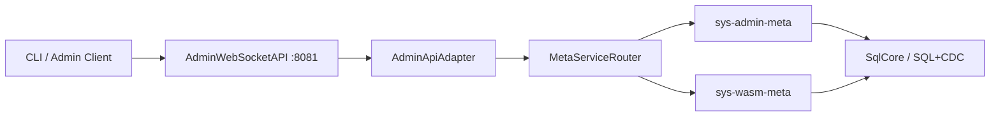
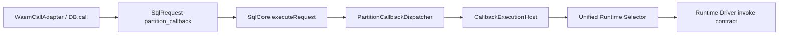

# Design Document: Runtime Ownership Closure

## Overview

This design resolves the audit shortcoming set (`S1`..`S10`) by converging the
runtime/admin/SQL implementation on one consistent ownership model:

1. one canonical service-definition contract
2. one execution-mode dispatch owner (`SqlCore.executeRequest`)
3. one runtime selection owner (`Runtime_Driver_Registry`)
4. one runtime lifecycle owner (`Service_Runtime_Lifecycle`)
5. one admin ingress ownership model (adapter ingress, service-owned commands)

The design is intentionally closure-focused. It does not add new runtime
capabilities beyond what is required to remove contradictions and sharp corners.

## Goals

1. Remove contradictions between schema, model, runtime mapping, and docs.
2. Make documented ownership claims true in production wiring.
3. Eliminate callback runtime ambiguity and fallback behavior.
4. Make admin ingress behavior match serviceized control-plane ownership.
5. Introduce explicit verification gates so status cannot drift from reality.

## Non-Goals

1. Adding new runtime kinds beyond existing `native_js`, `wasm_component`, and
   gated `oci_container`.
2. Replacing SQL/CDC mutation ownership.
3. Rewriting all admin/SQL APIs; this is a closure and wiring spec.
4. Removing compatibility ingress (`8081`) during this workstream.

## Decision Summary

| Decision ID | Decision |
|---|---|
| D1 | Canonical `service_definitions` contract includes `service_profile`; `handler_function_id` is nullable for non-WASM runtime kinds. |
| D2 | Canonical SQL-engine runtime mapping is `SQL_ENGINE_RUNTIME_KIND = native_js` until a future spec changes it explicitly. |
| D3 | `SqlCore.executeRequest` becomes the active owner for `sql_statement`, `partition_callback`, `stage`, and `plan` execution modes. |
| D4 | Admin node ingress (`AdminWebSocketAPI`) remains fixed port adapter and routes through adapter/meta-service ownership contracts. |
| D5 | Startup/runtime wiring uses `Runtime_Driver_Registry` + `Service_Runtime_Lifecycle` in live paths. |
| D6 | Callback runtime selection is unified with runtime ownership; parallel selector ownership is removed (or reduced to strict adapter over unified registry). |
| D7 | Callback runtime intent is explicit; implicit fallback to `native_js` is removed. |
| D8 | Runtime descriptor validation is enforced at create/update and activation boundaries. |
| D9 | Docs encode active vs target state explicitly and are a release gate. |
| D10 | Completion status requires shortcoming-level closure evidence (`S1`..`S10`). |

## Target Architecture

### Admin Ingress and Command Ownership



Rules:

1. Node endpoint remains fixed and predictable (`8081`).
2. WebSocket layer owns envelope/protocol behavior only.
3. Service commands own mutation intent and SQL/CDC execution.

### Runtime Selection and Lifecycle Ownership

```mermaid
graph LR
  DEF[service_definitions row] --> REG[Runtime_Driver_Registry]
  REG --> ND[Native_JS_Driver]
  REG --> WD[Wasm_Component_Driver]
  REG --> OD[OCI_Container_Driver (gated)]
  REG --> LIFECYCLE[Service_Runtime_Lifecycle]
  LIFECYCLE --> SQLPATH[SQL/CDC operation + endpoint writes]
```

Rules:

1. Driver selection is deterministic and fail-closed.
2. Lifecycle orchestration is centralized.
3. Drivers do not directly mutate system metadata.

### Partition Callback Runtime Ownership



Rules:

1. Callback invocation remains in one host surface.
2. Runtime kind is explicit on callback path.
3. No callback fallback to statement execution.

## Detailed Design

### 1) Canonical Service Definition Contract (S1)

#### Problem

`service_definitions` schema, serializers, and command generation currently use
non-identical contracts.

#### Design

1. Define one canonical contract source for service-definition columns used by:
   - table schema generation
   - row serializer/deserializer
   - command insert/update column list
   - bootstrap seeding
2. Include `service_profile` in schema when model/command layers require it.
3. Make `handler_function_id` nullable at schema level.
4. Keep runtime compatibility mapping for old rows (`runtime_kind` missing).

#### Compatibility

1. Existing rows remain readable.
2. New writes use canonical contract only.
3. Migration path is additive/compatible.

### 2) Canonical SQL Engine Runtime Mapping (S8)

#### Problem

`sql_engine` runtime defaults are contradictory across docs and mapping code.

#### Design

1. Introduce canonical constant: `SQL_ENGINE_RUNTIME_KIND = native_js`.
2. Use constant in:
   - legacy runtime inference
   - SQL profile factory defaults
   - architecture/docs runtime mapping statements
3. Any future change to SQL engine runtime kind requires explicit spec update,
   not implicit drift.

#### Rationale

Current SQL execution stack is JS-owned; `native_js` is consistent with active
implementation and avoids hidden WASM assumptions.

### 3) Production Execution-Mode Ownership (S2)

#### Problem

Docs claim `stage` and `plan` dispatch in `SqlCore.executeRequest`; code still
throws not-wired errors.

#### Design

1. Implement stage/plan dispatch branches in `SqlCore.executeRequest`.
2. Delegate to existing stage/plan runtime modules rather than duplicating
   execution logic.
3. Remove not-wired branch behavior once wired.
4. Keep explicit typed error for truly unsupported unknown modes.

#### Invariants

1. Adapters never own dispatch logic.
2. `partition_callback` remains separate from `sql_statement`.
3. No fallback dispatch path.

### 4) Admin Ingress Ownership Closure (S3)

#### Problem

Admin ingress currently performs direct SQL execution in live path.

#### Design

1. `AdminWebSocketAPI` uses `AdminApiAdapter` as routing core.
2. Adapter routes action ownership to meta-service command handlers.
3. SQL execution still occurs through owned meta command execution path
   (`SqlCore` + SQL/CDC), not direct ad-hoc ingress mutation paths.
4. Guard modes (`observe` and `enforce`) remain explicit for migration.

#### Operational Behavior

1. Fixed port and CLI envelope remain stable.
2. Unknown/unroutable leader behavior remains explicit
   (`META_SERVICE_UNAVAILABLE`).

### 5) Unified Runtime Lifecycle Activation (S4)

#### Problem

Runtime lifecycle components are implemented but not active in startup flow.

#### Design

1. Startup path instantiates unified runtime registry and lifecycle manager.
2. Register runtime drivers once in startup wiring.
3. Service activation/deactivation routes through lifecycle owner.
4. Existing WASM lifecycle is invoked through WASM driver boundaries only.

#### Boundary Rule

No runtime kind may bypass `Service_Runtime_Lifecycle` for lifecycle
orchestration.

### 6) Callback Runtime Ownership Unification (S5, S6)

#### Problem

Callback runtime uses a separate registry owner and defaults to `native_js` when
runtime kind is omitted.

#### Design

1. Replace parallel callback runtime selector ownership with unified selector
   ownership.
2. Extend callback request contract with explicit runtime intent.
3. Remove implicit default to `native_js`.
4. Require runtime-compatible invocation prerequisites:
   - `native_js`: explicit handler function
   - `wasm_component`: executable module/runtime binding
   - `oci_container`: explicit gated rejection until enabled
5. Keep `CallbackExecutionHost` as single invocation owner.

#### SELECT Contract

`partition_callback` statement validation must explicitly enforce SELECT-only
contract before dispatch planning.

### 7) Runtime Descriptor Validation Enforcement (S7)

#### Problem

Runtime descriptor validation exists but is not mandatory in create/update and
activation boundaries.

#### Design

1. `createService` and relevant update paths validate runtime descriptor using
   shared validator.
2. Validation policy checks are runtime/profile-aware.
3. Activation path validates descriptor before lifecycle transitions.
4. Failures return typed and auditable errors.

### 8) Documentation Truthfulness (S9)

#### Problem

Architecture/user docs include stale or contradictory active-state claims.

#### Design

1. Documentation sections use explicit state tags: `Active`, `Target`,
   `Planned`.
2. Remove stale statements (for example, claims that executor is still stubbed
   when implementation is real).
3. Align `README.md`, `architecture.md`, and admin/wasm operator docs with the
   same ownership definitions and runtime mappings.

### 9) Completion Governance (S10)

#### Problem

Tasks can be marked complete without production wiring evidence.

#### Design

1. Add shortcoming closure matrix as required release artifact.
2. Require production-path integration evidence for completion.
3. Add contract tests specifically tied to each shortcoming ID.

## Migration Plan

### Phase 1: Canonical Contract Alignment

1. Fix `service_definitions` schema/model/command parity.
2. Introduce canonical SQL-engine runtime mapping constant.
3. Add compatibility migrations/tests.

### Phase 2: Runtime and Dispatch Wiring

1. Wire stage/plan in `SqlCore.executeRequest`.
2. Wire unified runtime lifecycle into startup paths.
3. Route admin ingress through adapter/serviceized command path.

### Phase 3: Callback Ownership Closure

1. Unify callback runtime selection ownership.
2. Require explicit callback runtime descriptors.
3. Remove implicit runtime fallbacks.

### Phase 4: Docs + Governance Closure

1. Update architecture/README/operator docs to truthful state.
2. Enforce closure matrix and verification gates.
3. Mark prior specs complete only after closure evidence exists.

## Risks and Mitigations

1. **Risk:** schema changes break old clusters.
   **Mitigation:** additive/compatible migration and backfill tests.
2. **Risk:** admin path regression for CLI users.
   **Mitigation:** keep envelope compatibility tests and fixed endpoint policy.
3. **Risk:** callback runtime behavior changes unexpectedly.
   **Mitigation:** explicit descriptor validation and runtime-kind contract tests.
4. **Risk:** lifecycle wiring introduces startup regressions.
   **Mitigation:** startup integration tests for seed and joining node flows.
5. **Risk:** documentation drifts again.
   **Mitigation:** docs parity checks as completion gate.

## Testing Strategy

### Unit Tests

1. canonical service-definition schema/model/command parity
2. runtime mapping parity (`SQL_ENGINE_RUNTIME_KIND` usage)
3. callback descriptor validation and select-only enforcement
4. runtime descriptor fail-closed behavior

### Integration Tests

1. startup-wired runtime lifecycle operations (prepare/start/stop/health)
2. admin ingress routing via adapter/meta-service contracts
3. `executeRequest` stage/plan/partition callback production dispatch
4. callback runtime invocation across runtime kinds and gated errors

### Compatibility Tests

1. existing CLI WebSocket envelope behavior
2. existing WASM meta operations and SQL workflows
3. legacy row runtime inference and serialization roundtrip

### Governance Tests

1. shortcoming closure matrix checks (`S1`..`S10`)
2. docs parity checks for ownership statements and runtime mapping constants

## Architecture Delta Summary

`architecture.md` must be updated by this workstream to:

1. mark active vs target runtime ownership sections explicitly
2. set SQL-engine runtime mapping to canonical value (`native_js`)
3. describe callback runtime ownership as unified (no parallel selector owner)
4. describe admin ingress as adapter-only command routing path in active state
