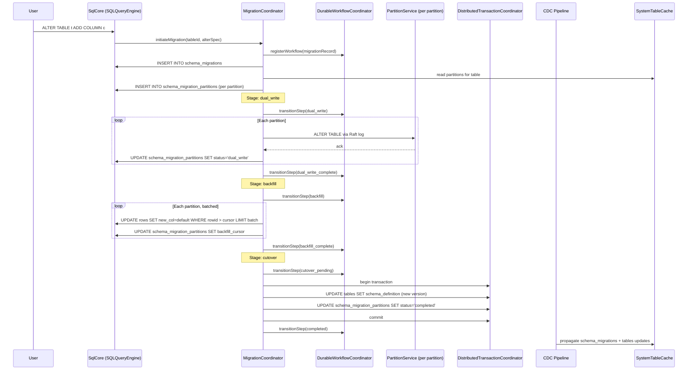
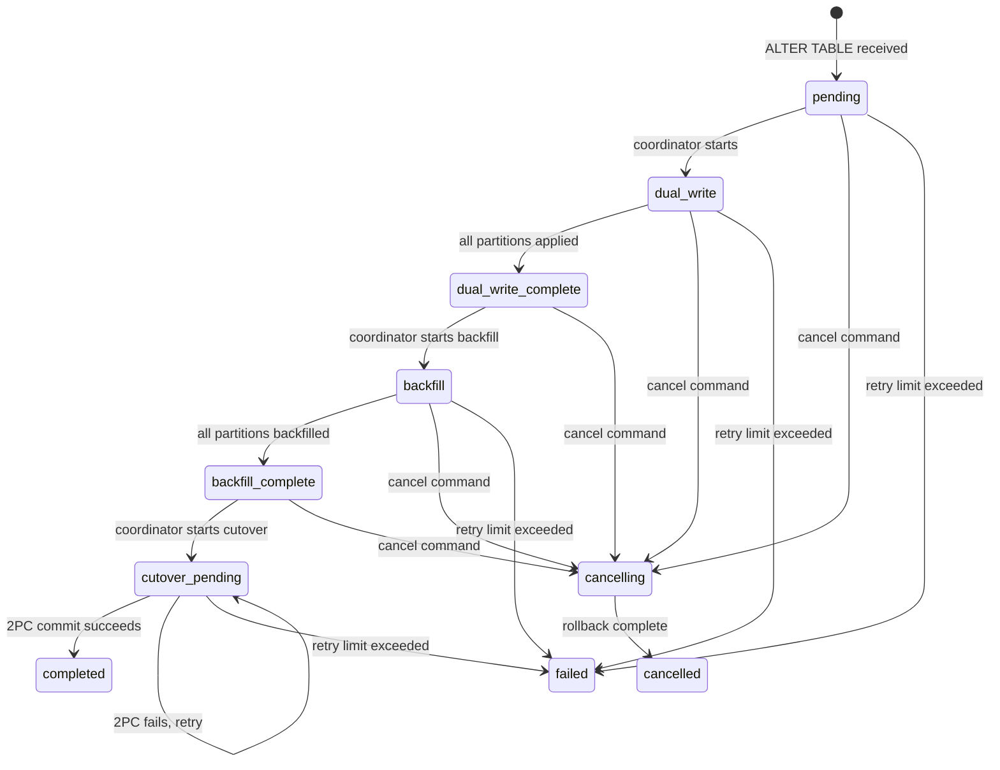

# Design Document: Schema Migration Workflow

## Overview

The schema migration workflow provides a coordinated, distributed pipeline for
evolving user table schemas across all partition replicas in a Lagrange cluster.
When a user issues an ALTER TABLE statement, the system orchestrates a
multi-stage migration: dual-write (apply schema change to all replicas while
maintaining write availability), backfill (update existing rows to conform to
the new schema), and cutover (atomically advance the schema version cluster-wide).

The design composes existing Lagrange building blocks:
- `DurableWorkflowCoordinator` for monotonic stage transitions and recovery
- `DistributedTransactionCoordinator` for atomic cutover
- `OperationLane` for single-flight execution per migration owner key
- `TimeoutPolicy` for budget-derived timeout enforcement
- `WorkflowStepRunner` for durable step execution
- `SqlCore` for all SQL execution (ALTER TABLE, backfill queries, metadata writes)
- `SystemTableCache` for partition enumeration and migration status reads
- CDC pipeline for propagating migration status to all nodes

The pipeline introduces one new owner component (`MigrationCoordinator`) and
two new system tables (`schema_migrations`, `schema_migration_partitions`).
No new caches, fallback paths, or parallel execution mechanisms are introduced.

### Design Decisions

1. **Single coordinator per migration**: `MigrationCoordinator` is the sole
   owner of migration workflow state. It runs on the partition leader that
   hosts the `schema_migrations` system table. No other component writes
   migration workflow fields.

2. **Compose, don't duplicate**: The coordinator composes
   `DurableWorkflowCoordinator`, `OperationLane`, `TimeoutPolicy`, and
   `WorkflowStepRunner` — the same building blocks used by
   `ManagedSplitWorkflow` and `RebalanceCoordinator`. No workflow mechanics
   are reimplemented.

3. **ALTER TABLE through Raft log**: Schema changes on user table partitions
   are applied by sending the ALTER TABLE statement through each partition's
   Raft log, ensuring all replicas apply the change deterministically.

4. **Backfill via SqlCore**: Backfill operations are regular UPDATE statements
   routed through `SqlCore` to partition leaders, not direct SQLite calls.
   This preserves the single SQL execution path.

5. **Atomic cutover via DistributedTransactionCoordinator**: The final schema
   version switch uses 2PC to atomically update the `tables` system table
   and all `schema_migration_partitions` rows, ensuring no partition serves
   a stale schema version after commit.

6. **CDC propagation for `schema_migrations` only**: The top-level migration
   status table is CDC-propagated so operators on any node can query migration
   progress. The per-partition detail table (`schema_migration_partitions`) is
   non-propagated since only the coordinator needs it.

## Architecture

### Component Interaction Diagram



### Ownership Boundaries

| Concern | Owner | Notes |
|---------|-------|-------|
| Migration workflow state | `MigrationCoordinator` | Sole writer of `schema_migrations` lifecycle fields |
| Per-partition migration progress | `MigrationCoordinator` | Sole writer of `schema_migration_partitions` |
| Schema version in `tables` | `MigrationCoordinator` via `DistributedTransactionCoordinator` | Updated atomically at cutover |
| ALTER TABLE execution on replicas | `PartitionService` | Receives ALTER via Raft log, applies to local SQLite |
| Backfill SQL execution | `SqlCore` | Standard UPDATE routed to partition leaders |
| Dual-write column default application | `PartitionService` | SQLite column defaults handle new writes during dual-write |
| Migration status CDC propagation | CDC pipeline | Standard CDC path for `schema_migrations` |

### Stage Transition State Machine



## Components and Interfaces

### MigrationCoordinator

The single owner for schema migration workflow lifecycle. Composes
`DurableWorkflowCoordinator` for durable step transitions,
`OperationLane` for single-flight execution, `TimeoutPolicy` for
budget enforcement, and `WorkflowStepRunner` for step execution.

**Location**: `src/migration/migration-coordinator.js`

**Constructor dependencies** (injected, not created internally):

| Dependency | Type | Purpose |
|-----------|------|---------|
| `sqlCore` | `SQLQueryEngine` | Execute all SQL (metadata writes, backfill, ALTER dispatch) |
| `systemTableCache` | `SystemTableCache` | Read partition list for target table |
| `transactionCoordinator` | `DistributedTransactionCoordinator` | Atomic cutover |
| `workflowCoordinator` | `DurableWorkflowCoordinator` | Durable step transitions |
| `logger` | Logger | Structured logging |
| `now` | `() => number` | Clock function |

**Key methods**:

```
initiateMigration(tableId, alterSpec)
  → Creates Migration_Record + Partition_Migration_Records
  → Returns migration_id

advanceMigration(migrationId)
  → Resumes migration from current stage
  → Runs through dual_write → backfill → cutover

cancelMigration(migrationId)
  → Transitions to cancelling, waits for in-flight ops, rolls back

recoverMigrations()
  → Called on leader election / restart
  → Loads non-terminal Migration_Records and resumes
```

**Internal composition**:

```javascript
// Constructed in MigrationCoordinator constructor
this.workflowCoordinator = options.workflowCoordinator ||
  new DurableWorkflowCoordinator({
    persistWorkflow: async (workflow) =>
      this.persistMigrationTransition(workflow),
    now: this.now,
  });

this.migrationOperationLane = new OperationLane({
  name: 'schema-migration',
  workflowCoordinator: this.workflowCoordinator,
  ownerKeyFactory: ({migrationId}) => String(migrationId || ''),
});

this.migrationTimeoutPolicy = new TimeoutPolicy({
  operationName: 'schema_migration',
  configuredBudgetMs: MIGRATION_TIMEOUT_BUDGET_MS,
  now: this.now,
});

this.workflowStepRunner = new WorkflowStepRunner({
  workflowCoordinator: this.workflowCoordinator,
  operationLane: this.migrationOperationLane,
  timeoutPolicy: this.migrationTimeoutPolicy,
  now: this.now,
});
```

### MigrationPipeline

Thin entry-point adapter that connects `SqlCore` ALTER TABLE parsing to
`MigrationCoordinator`. Validates the ALTER statement, checks for
conflicting active migrations, and delegates to the coordinator.

**Location**: `src/migration/migration-pipeline.js`

**Responsibilities**:
- Parse ALTER TABLE AST to extract migration type and target schema
- Validate migration type is supported (ADD COLUMN, DROP COLUMN,
  RENAME COLUMN, ALTER COLUMN TYPE)
- Check `schema_migrations` for active migration on same table
- Delegate to `MigrationCoordinator.initiateMigration()`

### SqlCore Integration

`SqlCore.executeQuery()` gains an `ALTER_TABLE` case in its AST type
switch that delegates to `MigrationPipeline`. This is the single entry
point for user-initiated schema migrations. No alternate ALTER TABLE
path exists.

```
case QUERY_AST_TYPE.ALTER_TABLE:
  result = await this.migrationPipeline.handleAlterTable(ast, sessionId);
  break;
```

### PartitionService Integration

`PartitionService` gains a handler for migration-related Raft log entries:

- **ALTER TABLE application**: When the coordinator sends an ALTER TABLE
  command via the Raft log, the partition applies it to local SQLite.
  Column defaults defined in the ALTER statement are registered in SQLite
  so that new writes during dual-write automatically populate new columns.

- **Backfill execution**: Standard UPDATE statements routed through SqlCore
  to partition leaders. No special partition-side logic needed — backfill
  is regular SQL.

### Constants

**Location**: `src/migration/migration-constants.js`

```javascript
const MIGRATION_STATUS = Object.freeze({
  PENDING: 'pending',
  DUAL_WRITE: 'dual_write',
  DUAL_WRITE_COMPLETE: 'dual_write_complete',
  BACKFILL: 'backfill',
  BACKFILL_COMPLETE: 'backfill_complete',
  CUTOVER_PENDING: 'cutover_pending',
  COMPLETED: 'completed',
  CANCELLING: 'cancelling',
  CANCELLED: 'cancelled',
  FAILED: 'failed',
});

const MIGRATION_TYPE = Object.freeze({
  ADD_COLUMN: 'add_column',
  DROP_COLUMN: 'drop_column',
  RENAME_COLUMN: 'rename_column',
  ALTER_COLUMN_TYPE: 'alter_column_type',
});

const MIGRATION_STAGE_ORDER = Object.freeze([
  MIGRATION_STATUS.PENDING,
  MIGRATION_STATUS.DUAL_WRITE,
  MIGRATION_STATUS.DUAL_WRITE_COMPLETE,
  MIGRATION_STATUS.BACKFILL,
  MIGRATION_STATUS.BACKFILL_COMPLETE,
  MIGRATION_STATUS.CUTOVER_PENDING,
  MIGRATION_STATUS.COMPLETED,
]);

const MIGRATION_CANCELLABLE_STAGES = Object.freeze(new Set([
  MIGRATION_STATUS.PENDING,
  MIGRATION_STATUS.DUAL_WRITE,
  MIGRATION_STATUS.DUAL_WRITE_COMPLETE,
  MIGRATION_STATUS.BACKFILL,
  MIGRATION_STATUS.BACKFILL_COMPLETE,
]));

const MIGRATION_DEFAULT = Object.freeze({
  BACKFILL_BATCH_SIZE: 1000,
  MAX_RETRY_COUNT: 10,
  RETRY_BASE_DELAY_MS: 1000,
  RETRY_MAX_DELAY_MS: 30000,
  TIMEOUT_BUDGET_MS: 600000,
});
```

## Data Models

### schema_migrations System Table (CDC-Propagated)

| Column | Type | Constraints | Description |
|--------|------|-------------|-------------|
| `migration_id` | TEXT | PRIMARY KEY | Unique migration identifier |
| `table_id` | TEXT | NOT NULL | Target table identifier |
| `table_name` | TEXT | NOT NULL | Target table name |
| `migration_type` | TEXT | NOT NULL | One of MIGRATION_TYPE values |
| `source_schema` | TEXT | NOT NULL | JSON: schema before migration |
| `target_schema` | TEXT | NOT NULL | JSON: schema after migration |
| `status` | TEXT | NOT NULL | Current MIGRATION_STATUS |
| `current_stage` | TEXT | NOT NULL | Current workflow stage |
| `error_message` | TEXT | | Last error message if failed |
| `created_at` | INTEGER | NOT NULL | Creation timestamp |
| `updated_at` | INTEGER | NOT NULL | Last update timestamp |
| `completed_at` | INTEGER | | Completion timestamp |

**Primary key**: `migration_id`

**CDC classification**: Propagated (MEMBERSHIP rule — migration status affects
query planning and schema resolution on all nodes).

**Indices**: `idx_schema_migrations_table` on `table_id`,
`idx_schema_migrations_status` on `status`.

### schema_migration_partitions System Table (Non-Propagated)

| Column | Type | Constraints | Description |
|--------|------|-------------|-------------|
| `migration_id` | TEXT | NOT NULL | Parent migration identifier |
| `partition_id` | TEXT | NOT NULL | Target partition identifier |
| `status` | TEXT | NOT NULL | Per-partition migration status |
| `backfill_cursor` | TEXT | | Last backfilled row cursor |
| `retry_count` | INTEGER | NOT NULL, DEFAULT 0 | Retry attempts |
| `error_message` | TEXT | | Last error for this partition |
| `updated_at` | INTEGER | NOT NULL | Last update timestamp |

**Primary key**: Composite (`migration_id`, `partition_id`)

**CDC classification**: Non-propagated. Per-partition progress is only needed
by the `MigrationCoordinator` on the owning partition leader. It is
high-write-rate during backfill (cursor updates per batch) and scoped to the
migration workflow context.

**Indices**: `idx_schema_migration_partitions_status` on
(`migration_id`, `status`).

### Row Ownership Matrix

| Table | Field Subset | Owner | Mutation Rule |
|-------|-------------|-------|---------------|
| `schema_migrations` | All fields | `MigrationCoordinator` | Full row created on initiation; lifecycle fields updated via `DurableWorkflowCoordinator.transitionStep()` |
| `schema_migration_partitions` | All fields | `MigrationCoordinator` | Full row created per partition on initiation; status/cursor updated per-batch during backfill; status set to `completed` atomically at cutover via `DistributedTransactionCoordinator` |
| `tables` | `schema_definition` | `MigrationCoordinator` via `DistributedTransactionCoordinator` | Updated atomically at cutover only |

### Mutation Patterns

All mutations to `schema_migrations` are primary-key-addressed
(`WHERE migration_id = ?`). All mutations to `schema_migration_partitions`
are primary-key-addressed (`WHERE migration_id = ? AND partition_id = ?`).
No broad predicate updates are used. This satisfies the CDC-replicated
row mutation contract (system guidelines §1.4.13).

## Correctness Properties

*A property is a characteristic or behavior that should hold true across all
valid executions of a system — essentially, a formal statement about what the
system should do. Properties serve as the bridge between human-readable
specifications and machine-verifiable correctness guarantees.*

### Property 1: Migration record creation completeness

*For any* valid ALTER TABLE statement on a user table, initiating a migration
SHALL produce a Migration_Record containing the table identifier, current
schema version, target schema definition, a valid migration type, status
`pending`, and a creation timestamp.

**Validates: Requirements 1.1, 1.2**

### Property 2: Active migration exclusion

*For any* table with an active (non-terminal) migration, attempting to initiate
a new migration on the same table SHALL be rejected with an error referencing
the conflicting migration identifier.

**Validates: Requirements 1.3**

### Property 3: Partition migration record enumeration

*For any* table with N partitions, when a Migration_Record reaches `pending`
status, exactly N Partition_Migration_Records SHALL be created, one per
partition, each with status `pending`.

**Validates: Requirements 1.4**

### Property 4: Dual-write schema shape acceptance

*For any* migration in the `dual_write` stage, writes using the old schema
shape (without new columns) and writes using the new schema shape (with new
columns) SHALL both be accepted without error.

**Validates: Requirements 2.2**

### Property 5: Dual-write default application and query inclusion

*For any* migration in the `dual_write` stage, when a write arrives without
values for new columns that have defaults, the stored row SHALL contain the
default values; and any query on the table SHALL return new columns with
default or null values for rows not yet backfilled.

**Validates: Requirements 2.3, 2.4**

### Property 6: ALTER TABLE application to all partition replicas

*For any* migration transitioning to `dual_write`, the ALTER TABLE statement
SHALL be applied to every partition replica through the Raft log, and after
completion all replicas SHALL have the new schema columns.

**Validates: Requirements 2.1**

### Property 7: Partition operation retry with backoff and recording

*For any* partition operation (ALTER TABLE application or backfill batch) that
fails, the coordinator SHALL retry with exponential backoff and record the
failure count and error in the Partition_Migration_Record.

**Validates: Requirements 2.5, 3.5**

### Property 8: Aggregate partition completion triggers parent transition

*For any* migration with N partitions, when all N Partition_Migration_Records
reach a stage-complete status (e.g., `dual_write` or `backfill_complete`),
the parent Migration_Record SHALL transition to the corresponding aggregate
complete status (`dual_write_complete` or `backfill_complete`).

**Validates: Requirements 2.6, 3.7**

### Property 9: Backfill batch size enforcement

*For any* backfill operation, each batch SHALL process at most the configured
batch size number of rows per partition.

**Validates: Requirements 3.2**

### Property 10: Backfill cursor resumption round trip

*For any* migration interrupted during backfill, the cursor position persisted
in the Partition_Migration_Record SHALL allow backfill to resume from the
exact row where it stopped, and the final backfilled state SHALL be identical
to an uninterrupted backfill.

**Validates: Requirements 3.4**

### Property 11: Per-partition backfill completion detection

*For any* partition, when all rows have been backfilled (no more rows match
the backfill predicate beyond the cursor), the Partition_Migration_Record
SHALL transition to `backfill_complete`.

**Validates: Requirements 3.6**

### Property 12: Atomic cutover via distributed transaction

*For any* migration transitioning to cutover, the
`DistributedTransactionCoordinator` transaction SHALL atomically update the
`tables.schema_definition` to the new version AND transition all
Partition_Migration_Records to `completed`. Either all updates commit or
none do.

**Validates: Requirements 4.1**

### Property 13: Post-cutover migration completion

*For any* migration whose cutover transaction commits, the Migration_Record
SHALL have status `completed` and a non-null `completed_at` timestamp.

**Validates: Requirements 4.2**

### Property 14: Cutover failure keeps cutover_pending

*For any* migration whose cutover transaction fails, the Migration_Record
SHALL remain in `cutover_pending` status and the schema version in `tables`
SHALL be unchanged.

**Validates: Requirements 4.3**

### Property 15: Post-completion schema version usage

*For any* completed migration, all subsequent queries through SqlCore on the
migrated table SHALL use the new schema version for planning and execution.

**Validates: Requirements 4.5**

### Property 16: Durable transition persistence

*For any* stage transition, the `DurableWorkflowCoordinator` SHALL persist
a transition record containing previous stage, next stage, reason, and
timestamp.

**Validates: Requirements 5.1**

### Property 17: Recovery resumes from last persisted stage

*For any* non-terminal migration, after coordinator restart, recovery SHALL
load the Migration_Record and resume execution from the last persisted stage
without re-executing completed stages.

**Validates: Requirements 5.2**

### Property 18: Monotonic stage transitions

*For any* migration, stage transitions SHALL only move forward through the
defined stage order (`pending` → `dual_write` → `dual_write_complete` →
`backfill` → `backfill_complete` → `cutover_pending` → `completed`).
The only permitted backward transition is to `failed` or `cancelling`.

**Validates: Requirements 5.3**

### Property 19: Retry exhaustion transitions to failed

*For any* migration that exhausts the configured retry limit without making
progress, the Migration_Record SHALL transition to `failed` with a non-empty
error message.

**Validates: Requirements 5.4**

### Property 20: Timeout budget derivation

*For any* migration, the top-level timeout budget SHALL be created once at
initiation, and all nested stage operations SHALL derive their budgets from
the remaining parent budget, never from a fresh default.

**Validates: Requirements 5.5**

### Property 21: Cancellation transitions and stops new work

*For any* active migration in a cancellable stage, issuing a cancel command
SHALL transition the Migration_Record to `cancelling` and no new backfill
batches SHALL be issued after the transition.

**Validates: Requirements 8.1, 8.2**

### Property 22: Cancellation rollback completes to cancelled

*For any* migration in `cancelling` status, after all in-flight operations
complete, the coordinator SHALL reverse the schema change on all partitions
and transition the Migration_Record to `cancelled`.

**Validates: Requirements 8.3**

### Property 23: Cancel rejection for post-cutover migrations

*For any* migration in `cutover_pending` or `completed` stage, a cancel
command SHALL be rejected with a descriptive error.

**Validates: Requirements 8.4**

## Error Handling

### Transient Errors

| Error Type | Handling | Owner |
|-----------|---------|-------|
| Partition ALTER TABLE failure | Exponential backoff retry, record in Partition_Migration_Record | `MigrationCoordinator` |
| Backfill batch failure | Exponential backoff retry from cursor, record retry count | `MigrationCoordinator` |
| Cutover transaction failure | Rollback, stay in `cutover_pending`, retry | `MigrationCoordinator` via `DistributedTransactionCoordinator` |
| Partition leader unavailable | Retry after backoff (leader election in progress) | `MigrationCoordinator` |

### Terminal Errors

| Error Type | Handling | Owner |
|-----------|---------|-------|
| Retry limit exhausted | Transition to `failed` with error message | `MigrationCoordinator` |
| Timeout budget exhausted | Transition to `failed` with timeout classification | `MigrationCoordinator` via `TimeoutPolicy` |
| Conflicting active migration | Reject ALTER TABLE with conflict error | `MigrationPipeline` |
| Unsupported migration type | Reject ALTER TABLE with unsupported type error | `MigrationPipeline` |
| Cancel after cutover | Reject cancel with past-point-of-no-return error | `MigrationCoordinator` |

### Error Propagation Rules

1. Errors from partition operations are caught by the coordinator, recorded
   in `Partition_Migration_Record.error_message`, and retried up to the
   configured limit. They are never swallowed.

2. Errors from `DurableWorkflowCoordinator.transitionStep()` are propagated
   to the caller. Idempotent transitions (same step already reached) are
   handled by the coordinator's built-in idempotency check.

3. Errors from `DistributedTransactionCoordinator` during cutover trigger
   a rollback and the migration stays in `cutover_pending`. The error is
   logged and the coordinator retries.

4. Timeout budget exhaustion produces a typed `TimeoutClassification` error
   that is recorded in the Migration_Record before transitioning to `failed`.

## Testing Strategy

### Unit Tests

Unit tests cover specific examples, edge cases, and error conditions:

- Migration initiation with each supported migration type
- Rejection of unsupported ALTER TABLE types
- Rejection of duplicate active migration on same table
- Correct Partition_Migration_Record count for tables with 1, 3, and 5 partitions
- Stage transition ordering (forward transitions accepted, backward rejected)
- Cancel rejection for `cutover_pending` and `completed` stages
- Cancel acceptance for each cancellable stage
- Timeout budget derivation (child budget ≤ remaining parent budget)
- Recovery loads correct stage after simulated restart
- CDC classification: `schema_migrations` in `CDC_PROPAGATED_TABLES`,
  `schema_migration_partitions` in `CDC_NON_PROPAGATED_TABLES`
- System table schema definitions match requirements

### Property-Based Tests

Property-based tests use `fast-check` with `{numRuns: 10}` per the project
testing guidelines. Each test references its design document property.

| Property | Test Description | Generator Strategy |
|----------|-----------------|-------------------|
| Property 1 | Generate random valid ALTER specs, verify record completeness | `fc.record({tableName: fc.string(), columnName: fc.string(), columnType: fc.constantFrom(...)})` |
| Property 2 | Generate random table IDs with pre-existing active migration, verify rejection | `fc.string()` for table IDs |
| Property 3 | Generate random partition counts (1-20), verify exact record count | `fc.integer({min: 1, max: 20})` |
| Property 4 | Generate writes with/without new columns during dual_write, verify acceptance | `fc.record()` with optional new column fields |
| Property 5 | Generate writes without new column values, verify defaults stored and queryable | `fc.record()` without new columns |
| Property 7 | Generate random failure sequences, verify retry count and backoff recording | `fc.integer({min: 1, max: 10})` for failure count |
| Property 8 | Generate random partition counts, complete all, verify parent transition | `fc.integer({min: 1, max: 20})` |
| Property 9 | Generate random row counts and batch sizes, verify batch ≤ configured size | `fc.integer()` for row count and batch size |
| Property 10 | Generate random interruption points, verify cursor resumption produces same result | `fc.integer()` for interruption row |
| Property 12 | Verify cutover transaction includes both tables update and all partition updates | `fc.integer({min: 1, max: 10})` for partition count |
| Property 18 | Generate random transition sequences, verify only forward transitions accepted | `fc.array(fc.constantFrom(...MIGRATION_STATUS values))` |
| Property 20 | Generate random budget and elapsed time, verify child ≤ remaining | `fc.integer()` for budget and elapsed |
| Property 21 | Generate random cancellable stages, verify transition and no new batches | `fc.constantFrom(...MIGRATION_CANCELLABLE_STAGES)` |
| Property 23 | Generate cancel attempts on cutover_pending/completed, verify rejection | `fc.constantFrom('cutover_pending', 'completed')` |

Each property test MUST include a comment tag:
```javascript
// Feature: schema-migration-workflow, Property N: <property text>
```

### Integration Tests

- End-to-end migration of a single-partition table through all stages
- Multi-partition migration with simulated partition failure and recovery
- Concurrent migration attempt on same table (conflict rejection)
- Migration cancellation during backfill stage
- Coordinator recovery after restart mid-backfill
- Cutover transaction failure and retry
- Schema version propagation via CDC after completion
