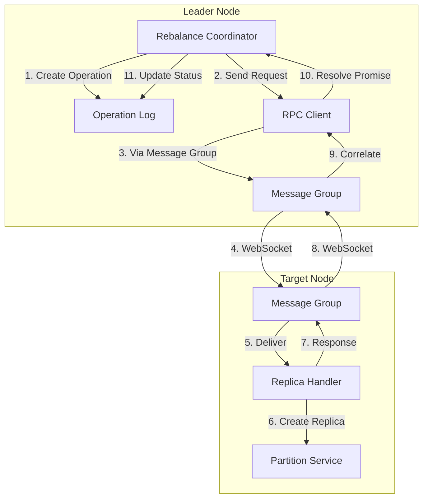

# Design Document: Simplified Rebalancing Architecture

## Overview

This design simplifies the service communication and rebalancing workflow by consolidating scattered state tracking into a single owner, providing an RPC abstraction over message groups, and creating a unified operation log for debugging. The goal is to make the system easier to understand and debug while maintaining the decentralized, scalable architecture.

## Component Responsibilities

This section documents the clear boundaries between components as required by Requirement 10.4.

### RebalanceCoordinator (Leader Node)

The RebalanceCoordinator is the single source of truth for all rebalancing operations. It is responsible for:

1. **Decision Making**: Evaluating when rebalancing is needed based on policies
2. **Operation Creation**: Creating and persisting Operation records to the operation log
3. **Progress Tracking**: Tracking workflow steps (PENDING → SENDING → CREATING → SYNCING → ACTIVE)
4. **Timeout Handling**: Centralized timeout checking for all operations (Requirements 6.1, 6.4)
5. **Recovery**: Handling incomplete operations after node restart (Requirements 7.1-7.4)
6. **State Ownership**: Single owner of operation state - no other component modifies operation state

The coordinator does NOT:
- Create local replicas (that's the target node's job)
- Sync data (that's the target node's job)
- Track local replica state (that's ReplicaHandler's job)

### ReplicaHandler (Target Node)

The ReplicaHandler executes replica operations on the target node. It is responsible for:

1. **Request Handling**: Processing CREATE_REPLICA and REMOVE_REPLICA requests
2. **Idempotency**: Ensuring duplicate requests are handled correctly
3. **Local Execution**: Creating/removing local partition services
4. **Status Reporting**: Reporting status back to coordinator via CDC
5. **Local State Tracking**: Tracking replicas that exist on this node

The handler does NOT:
- Decide when to create/remove replicas (that's the coordinator's job)
- Track operation progress (that's the coordinator's job)
- Handle timeouts (that's the coordinator's job)

### RPCClient (Transport Layer)

The RPCClient provides request-response semantics over message groups. It is responsible for:

1. **Correlation**: Matching responses to requests via correlation IDs
2. **Timeout**: Rejecting promises after configured timeout
3. **Transport**: Sending requests via message groups

The RPCClient does NOT:
- Retry failed requests (caller handles retry)
- Track operation state (that's the coordinator's job)
- Make decisions about what to send (caller provides request)

### Deprecated Components

The following components are deprecated and kept only for backward compatibility:

1. **ReplicaStateMachine**: Functionality absorbed by RebalanceCoordinator
2. **ReplicaStatus enum in ReplicaLifecycleManager**: Use ReplicaStatus from replica-status.js
3. **pendingMoves in UnifiedRebalancer**: Use RebalanceCoordinator.getInFlightOperations()

## Architecture

The simplified architecture consolidates three overlapping components (`ReplicaStateMachine`, `ReplicaLifecycleManager`, `UnifiedRebalancer`) into a cleaner separation of concerns:



## Message Flow

This section documents the complete message flow for ADD and REMOVE operations.

### ADD Operation Flow

```
1. RebalanceCoordinator.createOperation({type: 'ADD', partitionId, nodeId})
   └─> Persists Operation to replica_operations table (status: PENDING)
   
2. RebalanceCoordinator.executeOperation(operation)
   └─> Updates step to SENDING
   └─> Calls RPCClient.call(target, {type: 'CREATE_REPLICA', ...})
   
3. RPCClient sends message via MessageGroupService
   └─> Message routed to ${targetNodeId}/replica-handler
   
4. ReplicaHandler.handleCreateReplica(request)
   └─> Checks idempotency (returns 'already_exists' or 'in_progress' if duplicate)
   └─> Returns {status: 'initiated'} immediately
   └─> Starts async replica creation
   
5. RPCClient receives response, resolves Promise
   └─> RebalanceCoordinator updates step to CREATING
   
6. ReplicaHandler creates PartitionService
   └─> Updates replica status to SYNCING via CDC
   └─> Syncs data from leader
   └─> Updates replica status to ACTIVE via CDC
   
7. RebalanceCoordinator detects ACTIVE status (via CDC or polling)
   └─> Updates operation step to ACTIVE
   └─> Marks operation as completed
```

### REMOVE Operation Flow

```
1. RebalanceCoordinator.createOperation({type: 'REMOVE', partitionId, nodeId, replicaId})
   └─> Persists Operation to replica_operations table (status: PENDING)
   
2. RebalanceCoordinator.executeOperation(operation)
   └─> Updates step to SENDING
   └─> Calls RPCClient.call(target, {type: 'REMOVE_REPLICA', ...})
   
3. RPCClient sends message via MessageGroupService
   └─> Message routed to ${targetNodeId}/replica-handler
   
4. ReplicaHandler.handleRemoveReplica(request)
   └─> Checks idempotency (returns 'not_found' or 'in_progress' if appropriate)
   └─> Returns {status: 'initiated'} immediately
   └─> Starts async replica removal
   
5. RPCClient receives response, resolves Promise
   └─> RebalanceCoordinator updates step to STOPPING
   
6. ReplicaHandler removes PartitionService
   └─> Gracefully shuts down service
   └─> Cleans up local resources (SQLite files)
   └─> Deletes service row from services table
   
7. RebalanceCoordinator detects removal (via CDC or polling)
   └─> Updates operation step to REMOVED
   └─> Marks operation as completed
```

### Recovery Flow

```
1. Node restarts
   └─> RebalanceCoordinator.handleRecovery() called
   
2. Query replica_operations for incomplete operations
   └─> Operations in PENDING, SENDING, CREATING: Mark as FAILED
   └─> Operations in SYNCING: Check actual replica status and reconcile
   └─> Operations in STOPPING: Mark as FAILED
   
3. For SYNCING operations:
   └─> If replica is ACTIVE: Complete the operation
   └─> If replica is FAILED: Fail the operation
   └─> If replica not found: Fail the operation (orphaned)
   └─> If replica still SYNCING: Leave operation, timeout will handle
```

### Key Simplifications

1. **Single State Owner**: `RebalanceCoordinator` owns all operation state. No more `pendingMoves` in rebalancer + `localReplicas` in lifecycle manager + `replicas` in state machine.

2. **RPC over Message Groups**: New `RPCClient` provides request-response semantics while using message groups as transport. Handles correlation IDs and timeouts internally.

3. **Unified Status Enum**: One `ReplicaStatus` enum used everywhere. No more translating between `starting/syncing/active` and `pending/creating/syncing/active`.

4. **Persistent Operation Log**: All operations logged to `replica_operations` system table for debugging and recovery.

## Components and Interfaces

### RebalanceCoordinator

The unified component that owns the complete rebalancing workflow.

```javascript
/**
 * RebalanceCoordinator - Owns the complete rebalancing workflow.
 * Consolidates functionality from UnifiedRebalancer, ReplicaStateMachine,
 * and the coordination parts of ReplicaLifecycleManager.
 */
class RebalanceCoordinator extends EventEmitter {
  constructor(options = {}) {
    this.nodeId = options.nodeId;
    this.systemTableCache = options.systemTableCache;
    this.cdcIntegrationService = options.cdcIntegrationService;
    this.rpcClient = options.rpcClient;
    this.tablePolicyService = options.tablePolicyService;
    
    // Single source of truth for operations
    this.operations = new Map(); // operation_id -> Operation
    
    // Configuration (centralized)
    this.config = {
      pendingTimeoutMs: 30000,
      creatingTimeoutMs: 60000,
      syncingTimeoutMs: 300000,
      removingTimeoutMs: 60000,
      maxConcurrentAdds: 5,
      maxConcurrentRemoves: 5,
      periodicCheckIntervalMs: 60000,
    };
  }
  
  /**
   * Evaluate and execute rebalancing for a partition.
   * This is the main entry point - owns the complete workflow.
   */
  async rebalance(partitionId) {
    const decision = this.evaluateRebalancing(partitionId);
    if (!decision.needsRebalancing) return;
    
    for (const move of decision.moves) {
      const operation = await this.createOperation(move);
      await this.executeOperation(operation);
    }
  }
  
  /**
   * Create an operation record (persisted to operation log).
   */
  async createOperation(move) {
    const operation = {
      operationId: uuidv4(),
      type: move.type, // 'ADD' or 'REMOVE'
      partitionId: move.partitionId,
      targetNodeId: move.nodeId,
      sourceNodeId: this.nodeId,
      status: ReplicaStatus.PENDING,
      workflowStep: 'PENDING',
      createdAt: Date.now(),
      updatedAt: Date.now(),
      stepsHistory: [{step: 'PENDING', timestamp: Date.now()}],
      errorMessage: null,
    };
    
    // Persist to operation log
    await this.persistOperation(operation);
    this.operations.set(operation.operationId, operation);
    
    return operation;
  }
  
  /**
   * Execute an operation (ADD or REMOVE).
   * Uses RPC for request-response over message groups.
   */
  async executeOperation(operation) {
    try {
      await this.updateStep(operation, 'SENDING');
      
      const response = await this.rpcClient.call(
        `${operation.targetNodeId}/replica-handler`,
        {
          type: operation.type === 'ADD' ? 'CREATE_REPLICA' : 'REMOVE_REPLICA',
          operationId: operation.operationId,
          partitionId: operation.partitionId,
          // ... other fields
        },
        {timeout: this.config.creatingTimeoutMs}
      );
      
      if (response.status === 'initiated') {
        await this.updateStep(operation, 'CREATING');
        // Wait for sync completion (via CDC or polling)
        await this.waitForCompletion(operation);
      } else {
        await this.failOperation(operation, response.error);
      }
    } catch (error) {
      await this.failOperation(operation, error.message);
    }
  }
  
  /**
   * Update operation workflow step.
   */
  async updateStep(operation, step) {
    operation.workflowStep = step;
    operation.updatedAt = Date.now();
    operation.stepsHistory.push({step, timestamp: Date.now()});
    
    // Map workflow step to replica status
    operation.status = this.stepToStatus(step);
    
    await this.persistOperation(operation);
    
    this.logger.info('Operation step changed', {
      operationId: operation.operationId,
      step,
      partitionId: operation.partitionId,
    });
  }
  
  /**
   * Handle node recovery - process incomplete operations.
   */
  async handleRecovery() {
    const incompleteOps = await this.loadIncompleteOperations();
    
    for (const op of incompleteOps) {
      if (['PENDING', 'SENDING', 'CREATING'].includes(op.workflowStep)) {
        await this.failOperation(op, 'Node recovery - incomplete operation');
      } else if (op.workflowStep === 'SYNCING') {
        // Check actual replica status and reconcile
        await this.reconcileSyncingOperation(op);
      }
    }
  }
}
```

### RPCClient

Request-response abstraction over message groups.

```javascript
/**
 * RPCClient - Request-response pattern over message groups.
 * Handles correlation IDs and timeouts internally.
 */
class RPCClient {
  constructor(options = {}) {
    this.messageGroupService = options.messageGroupService;
    this.defaultTimeoutMs = options.defaultTimeoutMs || 30000;
    
    // Pending requests: correlationId -> {resolve, reject, timeout}
    this.pendingRequests = new Map();
  }
  
  /**
   * Make an RPC call to a target service.
   * @param {string} target - Target service address
   * @param {Object} request - Request payload
   * @param {Object} options - Options including timeout
   * @returns {Promise<Object>} Response from target
   */
  async call(target, request, options = {}) {
    const correlationId = uuidv4();
    const timeoutMs = options.timeout || this.defaultTimeoutMs;
    
    return new Promise((resolve, reject) => {
      // Set up timeout
      const timeoutHandle = setTimeout(() => {
        this.pendingRequests.delete(correlationId);
        reject(new Error(`RPC timeout after ${timeoutMs}ms`));
      }, timeoutMs);
      
      // Track pending request
      this.pendingRequests.set(correlationId, {
        resolve,
        reject,
        timeout: timeoutHandle,
        sentAt: Date.now(),
      });
      
      // Send via message group
      this.messageGroupService.sendMessage(target, {
        correlationId,
        ...request,
      }).catch((error) => {
        clearTimeout(timeoutHandle);
        this.pendingRequests.delete(correlationId);
        reject(error);
      });
    });
  }
  
  /**
   * Handle response from target (called by message handler).
   */
  handleResponse(correlationId, response) {
    const pending = this.pendingRequests.get(correlationId);
    if (pending) {
      clearTimeout(pending.timeout);
      this.pendingRequests.delete(correlationId);
      pending.resolve(response);
    }
  }
}
```

### ReplicaHandler

Target node component that handles replica creation/removal requests.

```javascript
/**
 * ReplicaHandler - Handles replica operations on target node.
 * Simplified from ReplicaLifecycleManager - only handles execution,
 * not tracking (that's the coordinator's job).
 */
class ReplicaHandler {
  constructor(options = {}) {
    this.nodeId = options.nodeId;
    this.partitionServiceFactory = options.partitionServiceFactory;
    this.cdcIntegrationService = options.cdcIntegrationService;
    this.rpcClient = options.rpcClient;
  }
  
  /**
   * Handle CREATE_REPLICA request.
   * Returns immediately with 'initiated', then does async work.
   */
  async handleCreateReplica(request) {
    const {operationId, partitionId, correlationId} = request;
    
    // Check idempotency
    const existing = this.getLocalReplica(partitionId);
    if (existing) {
      return {
        correlationId,
        status: existing.status === 'active' ? 'already_exists' : 'in_progress',
        replicaId: existing.replicaId,
      };
    }
    
    // Start async creation
    this.createReplicaAsync(request).catch((error) => {
      this.logger.error('Async replica creation failed', {
        operationId,
        error: error.message,
      });
    });
    
    return {
      correlationId,
      status: 'initiated',
      operationId,
    };
  }
  
  /**
   * Async replica creation - reports progress via CDC.
   */
  async createReplicaAsync(request) {
    const {operationId, partitionId, schema, leaderAddress} = request;
    const replicaId = uuidv4();
    
    try {
      // Create partition service
      const service = await this.partitionServiceFactory.create({
        partitionId,
        replicaId,
        schema,
      });
      
      // Update status to syncing (via CDC - coordinator will see this)
      await this.updateReplicaStatus(replicaId, ReplicaStatus.SYNCING);
      
      // Sync from leader
      await service.syncFromLeader(leaderAddress);
      
      // Update status to active
      await this.updateReplicaStatus(replicaId, ReplicaStatus.ACTIVE);
      
    } catch (error) {
      await this.updateReplicaStatus(replicaId, ReplicaStatus.FAILED, {
        errorMessage: error.message,
      });
    }
  }
}
```

### Unified ReplicaStatus Enum

Single status enum used by all components.

```javascript
/**
 * ReplicaStatus - Single source of truth for replica states.
 * Used by RebalanceCoordinator, ReplicaHandler, CDC, and Admin CLI.
 */
const ReplicaStatus = {
  PENDING: 'pending',     // Operation created, not yet sent
  CREATING: 'creating',   // Request sent, awaiting creation
  SYNCING: 'syncing',     // Replica created, syncing data
  ACTIVE: 'active',       // Fully operational
  REMOVING: 'removing',   // Removal in progress
  REMOVED: 'removed',     // Fully removed
  FAILED: 'failed',       // Operation failed
};

// Workflow steps map to statuses
const WORKFLOW_STEP_TO_STATUS = {
  'PENDING': ReplicaStatus.PENDING,
  'SENDING': ReplicaStatus.PENDING,
  'CREATING': ReplicaStatus.CREATING,
  'SYNCING': ReplicaStatus.SYNCING,
  'ACTIVE': ReplicaStatus.ACTIVE,
  'STOPPING': ReplicaStatus.REMOVING,
  'REMOVED': ReplicaStatus.REMOVED,
};
```

## Data Models

### replica_operations System Table

Persistent log of all replica operations.

```sql
CREATE TABLE replica_operations (
  operation_id TEXT PRIMARY KEY,
  type TEXT NOT NULL,              -- 'ADD' or 'REMOVE'
  partition_id TEXT NOT NULL,
  replica_id TEXT,
  source_node_id TEXT NOT NULL,
  target_node_id TEXT NOT NULL,
  status TEXT NOT NULL,            -- ReplicaStatus value
  workflow_step TEXT NOT NULL,
  created_at INTEGER NOT NULL,
  updated_at INTEGER NOT NULL,
  completed_at INTEGER,
  error_message TEXT,
  steps_history TEXT NOT NULL,     -- JSON array of {step, timestamp}
  FOREIGN KEY (partition_id) REFERENCES partitions(partition_id)
);

CREATE INDEX idx_replica_ops_status ON replica_operations(status);
CREATE INDEX idx_replica_ops_partition ON replica_operations(partition_id);
CREATE INDEX idx_replica_ops_created ON replica_operations(created_at);
```

### Operation Record Structure

```javascript
/**
 * @typedef {Object} Operation
 * @property {string} operationId - Unique operation identifier
 * @property {string} type - 'ADD' or 'REMOVE'
 * @property {string} partitionId - Target partition
 * @property {string} replicaId - Replica being created/removed
 * @property {string} sourceNodeId - Node that initiated the operation
 * @property {string} targetNodeId - Node where replica is created/removed
 * @property {string} status - Current ReplicaStatus
 * @property {string} workflowStep - Current workflow step
 * @property {number} createdAt - Creation timestamp
 * @property {number} updatedAt - Last update timestamp
 * @property {number|null} completedAt - Completion timestamp
 * @property {string|null} errorMessage - Error if failed
 * @property {Array<{step: string, timestamp: number}>} stepsHistory - Step history
 */
```


## Correctness Properties

*A property is a characteristic or behavior that should hold true across all valid executions of a system—essentially, a formal statement about what the system should do. Properties serve as the bridge between human-readable specifications and machine-verifiable correctness guarantees.*

### Property 1: State Ownership Invariant

*For any* replica state change in the system, the change SHALL originate from the RebalanceCoordinator (for operations it owns) or the ReplicaHandler (for local execution status). No other component SHALL directly modify replica state.

**Validates: Requirements 1.2, 8.3**

### Property 2: Operation Record Completeness

*For any* rebalancing decision that results in a move, the RebalanceCoordinator SHALL create an Operation record containing: operation_id, type, partition_id, target_node, status, created_at. When the operation completes or fails, the record SHALL be updated with completed_at and final status.

**Validates: Requirements 2.2, 2.3, 2.4**

### Property 3: RPC Correlation Correctness

*For any* RPC request sent via RPCClient, the response SHALL be correctly matched to the original request using the correlation ID. No response SHALL be delivered to the wrong caller.

**Validates: Requirements 3.3, 3.4**

### Property 4: RPC Timeout Behavior

*For any* RPC request that does not receive a response within the configured timeout, the RPCClient SHALL reject the Promise with a timeout error. The pending request SHALL be cleaned up.

**Validates: Requirements 3.2, 3.4**

### Property 5: ADD Workflow Step Progression

*For any* ADD operation, the workflow steps SHALL progress in order: PENDING → SENDING → CREATING → SYNCING → ACTIVE. Each step transition SHALL be logged with timestamp.

**Validates: Requirements 4.1, 4.3**

### Property 6: REMOVE Workflow Step Progression

*For any* REMOVE operation, the workflow steps SHALL progress in order: PENDING → SENDING → STOPPING → REMOVED. Each step transition SHALL be logged with timestamp.

**Validates: Requirements 4.2, 4.3**

### Property 7: Timeout Triggers Failure

*For any* operation that remains in a transitional state (PENDING, SENDING, CREATING, SYNCING, STOPPING) longer than the configured timeout, the RebalanceCoordinator SHALL transition it to FAILED status.

**Validates: Requirements 6.2**

### Property 8: Recovery Handles Incomplete Operations

*For any* operation found in SENDING or CREATING state after node recovery, the RebalanceCoordinator SHALL mark it as FAILED. For operations in SYNCING state, the coordinator SHALL check actual replica status and reconcile.

**Validates: Requirements 7.2, 7.3**

### Property 9: No Orphaned Replicas After Recovery

*For any* node recovery, the system SHALL not leave replicas in transitional states without a corresponding operation tracking them. All orphaned replicas SHALL be cleaned up or marked as failed.

**Validates: Requirements 7.4**

### Property 10: Operation Log Persistence

*For any* operation created by the RebalanceCoordinator, the operation SHALL be persisted to the replica_operations system table. The persisted record SHALL contain all required fields.

**Validates: Requirements 9.1, 9.2**

## Error Handling

### RPC Errors

When an RPC call fails:
1. **Timeout**: RPCClient rejects with timeout error, caller (RebalanceCoordinator) marks operation as failed
2. **Network Error**: Message group delivery failure, RPCClient rejects, caller handles retry or failure
3. **Target Error**: Target returns error response, RPCClient resolves with error status, caller handles

### Operation Failures

When an operation fails:
1. Update operation status to FAILED with error message
2. Persist to operation log
3. Log error with full context
4. Emit 'operationFailed' event for monitoring
5. Rebalancer will retry on next cycle if appropriate

### Recovery Errors

When recovery finds inconsistent state:
1. Log the inconsistency with full details
2. Attempt to transition to safe state (FAILED or REMOVED)
3. If transition fails, log critical error and continue with other operations
4. Emit 'recoveryError' event

## Testing Strategy

### Unit Tests

Unit tests will cover:
- RebalanceCoordinator operation lifecycle
- RPCClient correlation and timeout handling
- ReplicaHandler request processing
- Status enum consistency

### Property-Based Tests

Property-based tests using fast-check with `numRuns: 10`:

1. **State Ownership**: Generate random state change sequences and verify single-writer semantics
2. **Operation Completeness**: Generate operations and verify all required fields present
3. **RPC Correlation**: Generate concurrent RPC calls and verify correct response matching
4. **Workflow Progression**: Generate operations and verify step ordering
5. **Timeout Handling**: Generate operations with delays and verify timeout behavior
6. **Recovery Correctness**: Generate crash scenarios and verify recovery handles all cases

### Integration Tests

Integration tests will cover:
- End-to-end ADD operation flow
- End-to-end REMOVE operation flow
- Recovery after simulated crash
- Concurrent operations
- Timeout scenarios

### Test Configuration

```javascript
// Property test configuration
const propertyTestConfig = {
  numRuns: 10,  // Per testing guidelines
};

// Timeout configuration for tests (shorter than production)
const testTimeouts = {
  pending: 100,
  creating: 200,
  syncing: 500,
  removing: 200,
  rpcDefault: 100,
};
```

## Migration Path

To migrate from the current architecture:

1. **Phase 1**: Add RPCClient alongside existing message patterns
2. **Phase 2**: Add replica_operations table and RebalanceCoordinator
3. **Phase 3**: Migrate UnifiedRebalancer to use RebalanceCoordinator
4. **Phase 4**: Simplify ReplicaLifecycleManager to ReplicaHandler
5. **Phase 5**: Remove ReplicaStateMachine (functionality absorbed by RebalanceCoordinator)
6. **Phase 6**: Consolidate status enums

Each phase can be deployed independently with feature flags for gradual rollout.

