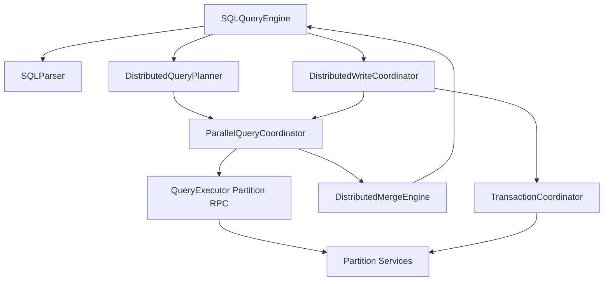

# Design Document: Distributed SQL Multi-Partition and Multi-Table Operations

## Overview

This design upgrades distributed SQL execution from table-local routing to a
full multi-table, multi-partition planning and execution architecture.

Key principles:

1. One planner owner.
2. One execution coordinator owner.
3. One write coordinator owner.
4. One transaction coordinator owner.
5. No fallback execution paths in final state.

The design reuses the strongest existing components where possible:

- `SQLQueryEngine` remains SQL entrypoint and orchestration owner.
- `ParallelQueryCoordinator` is promoted to canonical fragment execution owner.
- `StreamingAggregator` is used for memory-bounded global merge operations.
- `QueryExecutor` remains SQL reconstruction and partition RPC helper (not
  planner owner).

## Goals

1. Correct multi-table read semantics across partitions and nodes.
2. Correct multi-partition write semantics with `RETURNING`.
3. Explicit distributed transaction model with deterministic failure behavior.
4. Scalable execution under high partition counts without silent partition loss.
5. Full observability and explainability for planner and execution decisions.

## Non-Goals

1. Replacing SQLite storage engine semantics at partition level.
2. Introducing a second SQL execution pipeline.
3. Preserving legacy ad-hoc distributed branches after cutover.
4. Defining a new SQL dialect; parser and PG translation stay as-is.

## Current Gaps to Close

1. Join execution is gated by external `joinPartitions` wiring, but planning
   does not consistently produce it.
2. Partition pruning is mostly literal-based and does not fully use bound
   parameters/composite keys.
3. Parallel partition execution currently truncates partition lists at a max
   limit instead of chunking all partitions.
4. Partial failures can be under-reported in aggregated read and write results.
5. Transaction scope is effectively single-partition, not distributed.
6. `CREATE TABLE` currently creates a single partition and split/merge logic is
   not part of SQL lifecycle orchestration.

## Target Architecture

## Ownership Model

1. `SQLQueryEngine`:
   - Owns statement dispatch, request context, and transaction context mapping.
   - Delegates plan construction/execution to dedicated owners only.

2. `DistributedQueryPlanner` (new):
   - Owns logical + physical distributed plan creation for SELECT and write
     statements.
   - Owns table graph, join strategy choice, pushdown decisions, and partition
     pruning decisions.

3. `ParallelQueryCoordinator` (existing, promoted):
   - Owns fanout execution across partitions with batching, timeout, retry, and
     per-fragment status.
   - Must execute all target partitions; never truncate.

4. `DistributedMergeEngine` (new wrapper; reuses `StreamingAggregator`):
   - Owns global relational semantics: DISTINCT, ORDER BY, LIMIT/OFFSET, GROUP,
     HAVING, set operations.

5. `DistributedWriteCoordinator` (new):
   - Owns INSERT/UPDATE/DELETE routing plans, per-partition execution, retry,
     and result/returning merge.

6. `TransactionCoordinator` (new):
   - Owns distributed transaction lifecycle and participant coordination.

## High-Level Flow



## Plan and Execution Contracts

### DistributedQueryPlan

```text
DistributedQueryPlan {
  planId: string,
  statementType: 'SELECT'|'INSERT'|'UPDATE'|'DELETE',
  tablePlans: Map<tableAlias, TableAccessPlan>,
  joinPlan: JoinPlan|null,
  setOpPlan: SetOperationPlan|null,
  fragmentPlans: FragmentPlan[],
  mergePlan: MergePlan,
  executionPolicy: ExecutionPolicy
}
```

### TableAccessPlan

```text
TableAccessPlan {
  tableName: string,
  tableAlias: string,
  partitions: string[],
  localPredicate: Expression|null,
  projectedColumns: string[]|null,
  keyPredicateShape: 'eq'|'range'|'in'|'between'|'scatter'
}
```

### FragmentPlan

```text
FragmentPlan {
  fragmentId: string,
  tableAlias: string,
  partitionId: string,
  sql: string,
  params: any[],
  roleHint: 'leader'|'follower-ok'
}
```

### MergePlan

```text
MergePlan {
  needsDistinct: boolean,
  groupBy: Expression[]|null,
  aggregates: AggregateSpec[]|null,
  having: Expression|null,
  orderBy: OrderSpec[]|null,
  limit: {count:number, offset:number}|null
}
```

### DistributedWritePlan

```text
DistributedWritePlan {
  operationId: string,
  statementType: 'INSERT'|'UPDATE'|'DELETE',
  partitionStatements: Map<partitionId, FragmentPlan[]>,
  returningSpec: '*'|string[]|null,
  idempotencyKey: string
}
```

## Core Execution Semantics

## Read Path

1. Parse SQL and bind params.
2. Planner builds `DistributedQueryPlan` for all table aliases.
3. Coordinator executes all fragment plans in bounded parallel chunks.
4. Merge engine applies global semantics in SQL-correct order:
   - local rows -> global DISTINCT/GROUP/AGG/HAVING -> global ORDER -> LIMIT.
5. Result returns with complete partition accounting.

### Join Strategy Rules

1. `broadcast`:
   - used when one side is below configured side-size threshold.
2. `repartition`:
   - used for large equi-joins with distributable join keys.
3. `nested_loop`:
   - last-resort strategy for unsupported join predicates.

Every join edge must have an explicit strategy recorded in diagnostics.

### Pushdown Rules

1. Predicates referencing one table alias only are eligible for local pushdown.
2. Multi-table predicates are post-join filters.
3. Projection pushdown always includes required join keys and output expressions.

## Write Path

1. Planner creates `DistributedWritePlan`.
2. Write coordinator groups statements by partition.
3. Coordinator executes partition statements with retry + idempotency key.
4. `RETURNING` rows are merged centrally and returned as one result.
5. Result exposes full participant status, not inferred totals only.

## Transaction Model

Final target is distributed commit support for multi-partition writes.

### Protocol

1. `BEGIN` creates transaction context.
2. First write enlists participant partition(s), not a single fixed partition.
3. `PREPARE` phase requests participant durable intent.
4. `COMMIT` phase finalizes all prepared participants.
5. `ROLLBACK` aborts all enlisted participants.

### Transaction Persistence

New system tables:

1. `sql_transactions`:
   - tx_id, session_id, status, created_at, updated_at.
2. `sql_transaction_participants`:
   - tx_id, partition_id, status, last_error, updated_at.
3. `sql_write_operations`:
   - operation_id, tx_id nullable, statement_type, status, idempotency_key,
     payload_hash, updated_at.

These tables provide recovery and observability for distributed commit.

## Failure Semantics

## Reads

Default policy is fail-closed if any required fragment fails. Optional relaxed
mode can be introduced as explicit query policy in the future, but not as hidden
fallback behavior.

## Writes

1. Any participant failure marks write as failed unless transaction protocol
   reaches committed terminal state.
2. Retries reuse the same idempotency key.
3. User-visible errors include failed participant details.

## Scaling and Resource Control

1. Max parallelism limits are enforced via chunked execution, not truncation.
2. Large result merges use `StreamingAggregator`.
3. Coordinator records memory and chunk telemetry for diagnostics.

## Observability and Explainability

Per-query diagnostics record:

1. table partition sets before and after pruning
2. join strategy per edge
3. pushdown decisions
4. fragment execution times and errors
5. merge-stage timings and row counts
6. write participant states and retries

`EXPLAIN DISTRIBUTED` should render canonical planner output.

## Integration With Existing Components

## SQLQueryEngine

Changes:

1. replace ad-hoc partition resolution with `DistributedQueryPlanner`.
2. route all distributed reads/writes through coordinators.
3. preserve parser and dialect wiring as already implemented.

## QueryExecutor

Changes:

1. stop owning ad-hoc join partition discovery.
2. continue to own fragment SQL reconstruction and partition RPC handling.
3. enforce complete partition accounting from coordinator inputs.

## PartitionResolver

Changes:

1. consume bound parameter values for pruning.
2. support composite partition keys.
3. expose predicate classification metadata to planner diagnostics.

## ParallelQueryCoordinator

Changes:

1. become canonical fanout execution owner.
2. add deterministic chunk scheduling over full partition list.
3. add per-fragment status envelope for merge/failure policy.

## Hard Cutover Plan

1. Introduce planner/coordinator contracts and wire in shadow tests.
2. Switch SqlCore read path to canonical planner + coordinator.
3. Switch write path to distributed write coordinator.
4. Introduce transaction coordinator and participant tables.
5. Remove old distributed branches from `SQLQueryEngine` and `QueryExecutor`.
6. Remove fallback flags and dead path tests.

Final state must have one distributed SQL path only.

## Risks and Mitigations

1. Risk: behavior drift during cutover.
   - Mitigation: dual-run comparison tests in CI until switch.
2. Risk: join strategy regressions under skew.
   - Mitigation: strategy telemetry and skew-focused property tests.
3. Risk: high memory usage on global merges.
   - Mitigation: mandatory streaming merge mode beyond threshold.
4. Risk: distributed transaction deadlock/recovery complexity.
   - Mitigation: explicit transaction state machine and restart recovery tests.

## Open Decisions (Resolved by This Spec)

1. Reuse existing strong coordinator components instead of adding parallel
   executors: **Yes** (`ParallelQueryCoordinator`, `StreamingAggregator`).
2. Keep single-partition transaction model in final state: **No**.
3. Keep legacy ad-hoc distributed branches after migration: **No**.
