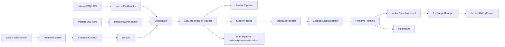
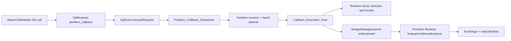

# Design Document: Unified SQL Runtime v0 on Replicated WASM Services

## Overview

This design defines the v0 execution model where SQL and programmatic WASM
execution share one production runtime path.

Core decisions:

- One SQL engine (`SqlCore`)
- One scaling model (replicated WASM services)
- One programmatic entry surface:
  - `runtime.run(async (ctx) => { ... }, opts?)`
  - `ctx.call(query, params?, handler?, opts?)`
  - `ctx.emit(...)`, `ctx.out(...)`
  - `ctx.broadcast(...)`, `ctx.useBroadcast(...)`
- One restricted movement model for distributed traffic:
  `lookup`, `emit`, `broadcast`

## Goals

1. Keep SQL semantics unified across internal, protocol, and runtime calls.
2. Make programmatic distributed execution explicit and bounded.
3. Prevent N+1 fan-out and unbounded nested call patterns.
4. Keep retries safe with deterministic lineage and dedupe.
5. Ensure runtime behavior is production-wired, not test-harness-only.

## Non-Goals

1. Running two SQL engines in parallel.
2. Allowing unrestricted nested distributed calls inside stage handlers.
3. Guaranteeing exactly-once exchange delivery in v0.
4. Full PostgreSQL protocol parity in v0.

## High-Level Architecture



## Runtime API Design

### `runtime.run(userFn, opts?)`

`runtime.run` constructs the execution context and invokes `userFn`.

Input options (v0):

- `session`: auth/session identity
- `snapshot`: `{mode: 'readCommitted' | 'snapshot', ts?: number}`
- `budgets`: default runtime budgets for stage execution and nested calls

### `ctx.call(query, params?, handler?, opts?)`

Unified entrypoint with three behaviors:

1. Iterator mode:
   - no `handler`
   - returns async iterator
2. Stage mode:
   - `handler` provided
   - executes a distributed stage over selected partitions
3. Plan mode:
   - `query` is plan object (v0 includes `reduceByKey`, `useBroadcast`)

### `ctx.emit` and `ctx.out`

- `ctx.emit(key, value, meta?)` writes keyed intermediates into exchange streams.
- `ctx.out(value, meta?)` writes final output rows to an output stream.

`ctx.out` is a dedicated output primitive; it is not treated as cross-partition
movement.

## SqlCore Request Model

`SqlCore` consumes canonical `SqlRequest` objects and dispatches by execution
mode and query kind.

Required dispatch behaviors:

1. SQL statement execution path
2. Partition callback / stage path
3. Plan-object path (`reduceByKey`, `useBroadcast`)

No fallback planner/executor is allowed.

## Partition_Callback Bridge Delta

`partition_callback` must become an explicit runtime path rather than metadata
attached to a normal SQL statement execution.

### Current Gap

1. Adapter layer can construct `partition_callback` requests.
2. Dispatch currently does not execute callback runtime as a dedicated path.
3. This leaves callback execution semantics inconsistent with unified runtime
   ownership.

### Target Ownership

1. `SqlCore.executeRequest` owns mode dispatch.
2. `Partition_Callback_Dispatcher` (inside SqlCore ownership) owns callback
   route selection and partition batch preparation.
3. `Callback_Execution_Host` owns per-batch callback invocation.
4. Runtime-kind selection for callback invocation uses shared runtime-driver
   ownership (native/WASM now, container later behind gate).

### Target Flow



### Callback Execution Host Contract

`Callback_Execution_Host` provides one invocation contract:

1. validate callback descriptor and runtime selection inputs
2. invoke callback for each partition batch using selected runtime
3. apply budget/cancellation checks before and after batch invoke
4. attach lineage IDs and consult dedupe registry on retries
5. return structured per-partition batch results

No alternate callback executor path is allowed outside this host.

### Runtime Kind Integration

For callback execution, runtime selection follows shared runtime abstraction:

1. `native_js` for in-process callback handlers
2. `wasm_component` for module-export callbacks
3. `oci_container` only when feature gate and policy checks are enabled

This keeps callback execution compatible with future runtime expansion while
preserving one invocation surface.

## Stage Runtime Design

### StageCoordinator

Responsibilities:

1. Resolve target partitions for stage input query.
2. Batch rows per partition.
3. Invoke `CallbackStageExecutor`.
4. Connect primitives to shared budget and lineage context.
5. Route `ctx.out` to result stream.

### CallbackStageExecutor

Per-batch callback invocation with:

- cancellation checks
- lineage attachment
- retry dedupe lookup/registration

Execution retries are coarse-grained at batch/stage boundaries.

### Primitive Runtime

Shared runtime primitive objects:

- `LookupPrimitive` (vectorized + dedupe + access path enforcement)
- `EmitPrimitive` (backpressure + spill + exchange sink)
- `BroadcastStore` (versioned side dataset)
- `OutStream` (final result sink with output budget enforcement)

## Exchange and ReduceByKey

### Exchange Semantics (`exchangeBy`)

Stage options declare whether emit output is:

1. `local` (no shuffle), or
2. `key` (shuffle by key hash/partitioner).

Guarantees in v0:

1. At-least-once delivery
2. No global ordering guarantee
3. Optional dedupe keys in emit metadata

### `reduceByKey` Contract

`ctx.call({kind: 'reduceByKey', stream}, [], handler, opts)` receives grouped
batches:

```typescript
type GroupRecord = {key: string; records: unknown[]; continuation?: string};
type GroupBatch = GroupRecord[];
```

Reduce limits:

- `maxGroupsPerBatch`
- `maxRecordsPerGroup`
- `maxBatchBytes`

Large groups may be chunked with continuation tokens.

## Nested `ctx.call` Classification

Nested calls inside stage handlers are classified before execution:

Allowed inline in v0:

1. pk/unique point lookup
2. capped batched key lookup (`IN` / `ANY` with limit)
3. strict indexed limit query

Rejected in v0:

1. unbounded scans
2. join/range/subquery patterns without strict bounds

Error contract must be teachable and direct users to `emit + reduceByKey`.

## Budget and Backpressure Model

Budgets enforced per stage invocation:

- `maxNestedCalls`
- `maxNestedKeys`
- `maxNestedBytes`
- `maxEmitBytes`
- `maxOutBytes`
- `maxWallMs`
- `maxInflight`
- CPU/memory/wall-time limits

Backpressure policy:

1. emit can block/await
2. intermediate buffers can spill
3. exceeded limits fail operation with typed budget error

## Failure, Retry, and Idempotency

1. Retries occur for failed/timeout/rebalanced stage work.
2. Lineage IDs are attached to stage and primitive artifacts.
3. Dedupe uses lineage + stage identity for replay safety.
4. Handlers are documented as re-runnable; non-idempotent side effects are out
   of scope for v0.

## WASM Module Runtime Contract

Module manifest requirements remain:

- identity + digest
- exports + `run_export`
- dependencies + capabilities

Runtime execution in v0 must invoke actual loaded module exports (no stub path).

## Current State vs Target Delta

Current groundwork exists for adapters, primitives, strategy, lineage, dedupe,
and cancellation. The missing delta to hit v0 is production wiring:

1. `runtime.run` and unified `ctx.call`/`ctx.out` API
2. `SqlCore.executeRequest` dispatch by execution mode/query kind
3. integrated stage runtime using existing primitive/budget modules
4. nested call classifier and explicit unbounded-call rejection
5. `reduceByKey` and exchange manager execution path
6. replacement of stubbed WASM executor invocation path

## Testing Strategy

1. Unit tests for runtime API contract, nested-call classifier, exchange
   semantics, and reduce batch limits.
2. Integration tests that use real runtime wiring (not only test context
   factories).
3. Failure-path tests for budget exceed, retry dedupe, continuation flows, and
   cancellation.
4. Compatibility tests for existing SQL semantics through unified SqlCore path.

## Migration Plan

1. Add `runtime.run` and unified context API while preserving existing adapters.
2. Introduce `SqlCore.executeRequest` and migrate adapters to it.
3. Wire stage runtime primitives and budgets into production execution.
4. Add plan-object execution (`reduceByKey`, `useBroadcast`) and exchange path.
5. Enforce nested-call classifier and remove parallel callback wiring.
6. Replace WASM execution stub with real module export invocation.
7. Update architecture/README for final v0 ownership model.
