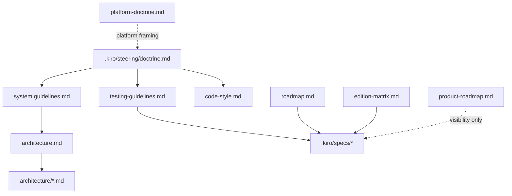

# Design Document: Steering Single-Path Consolidation

## Overview

This design restructures the repository documentation stack so each document
class owns one concern:

1. implementation doctrine
2. stable implementation rules
3. stable testing policy
4. style and lint guidance
5. current subsystem ownership and data flow
6. implementation-driving roadmap scope
7. workstream-local procedure

The cleanup follows the same repository rule that the code follows: one concern,
one owner, one path.

## Design Reasoning

### Why This Needs A Full Consolidation

The current steering set is directionally strong, but it mixes several kinds of
content in the same places:

1. stable repo-wide rules
2. current component maps
3. narrow workstream procedure
4. broad roadmap titles
5. ambiguous doctrine references

When those layers overlap, contributors have to reconcile competing statements
by hand. That is the document equivalent of multi-path runtime logic. The fix is
not more text. The fix is one owner per rule class.

### Why The Target Model Is Small

The target model is intentionally narrow:

1. one short doctrine
2. one stable implementation-rules document
3. one stable testing-policy document
4. one style guide
5. one architecture entrypoint for concrete subsystem detail
6. one implementation-driving roadmap
7. one location for workstream-local procedure

Anything outside that model should justify itself before it becomes durable
project guidance.

## Goals

1. Give every document class one job.
2. Remove ambiguous doctrine references.
3. State each repo-wide rule once.
4. Keep concrete owner maps in architecture documents.
5. Keep workstream-local procedure inside specs or support docs.
6. Make roadmap items sharp enough to drive work.
7. Preserve the repository rule that one runtime function has one active code
   path at a time.

## Non-Goals

1. Introduce new product capabilities.
2. Change AGPL feature scope.
3. Replace `roadmap.md` as the implementation-driving roadmap.
4. Turn architecture documents into end-user documentation.
5. Keep multiple authoritative statements for the same rule class.

## Decision Summary

| Decision ID | Decision |
| --- | --- |
| D1 | `.kiro/steering/doctrine.md` is the implementation doctrine for coding work. |
| D2 | The repository root doctrine document is renamed to `platform-doctrine.md` so doctrine references are unambiguous. |
| D3 | `code-style.md` covers style and lint only. |
| D4 | `system guidelines.md` keeps durable implementation rules and points to architecture documents for current concrete owner maps. |
| D5 | `testing-guidelines.md` keeps durable testing policy and points to specs or test support docs for workstream-local procedure. |
| D6 | `architecture.md` becomes the index for current subsystem owner maps and links to detailed support documents. |
| D7 | `roadmap.md` remains the only implementation-driving roadmap, with sharper links for broad open items. |
| D8 | Active specs are updated so their steering references match the final document model. |

## Target Document Model

| Document | Owner Concern | Content Type |
| --- | --- | --- |
| `.kiro/steering/doctrine.md` | Implementation doctrine | Short repo-wide architectural intent |
| `.kiro/steering/system guidelines.md` | Stable implementation rules | Durable rules that apply to all code changes |
| `.kiro/steering/testing-guidelines.md` | Stable testing policy | Durable testing rules that apply to all code changes |
| `.kiro/steering/code-style.md` | Style and lint | Formatting, lint, and local coding-style guidance |
| `.kiro/steering/roadmap.md` | Roadmap pointer | Pointer to roadmap and scope documents |
| `architecture.md` | Architecture entrypoint | Index for current owner maps and current subsystem shape |
| `architecture/*.md` | Subsystem detail | Current owner maps, data flow, and subsystem-specific design detail |
| `roadmap.md` | Implementation-driving roadmap | Allowed implementation scope and status |
| `product-roadmap.md` | Visibility board | Cross-edition visibility only |
| `edition-matrix.md` | Scope matrix | Edition and implementation-home mapping |
| `.kiro/specs/*` | Workstream-local procedure | Requirements, design, tasks, thresholds, checklists, closure artifacts |
| `platform-doctrine.md` | Platform philosophy | Root-level platform framing that does not govern coding-path decisions |

## Authority Flow

## Detailed Design

### 1. Authority Headers

Every steering document receives a short header section with:

1. what this document governs
2. what it does not govern
3. where to go for adjacent concerns

This makes document ownership explicit at the point of use instead of relying on
contributors to infer it from repository history.

### 2. Doctrine Naming

The implementation doctrine remains:

- `.kiro/steering/doctrine.md`

The repository root doctrine document is renamed to:

- `platform-doctrine.md`

This keeps platform framing available without allowing loose `doctrine.md`
references to point at two different files.

### 3. Style Guide Narrowing

`code-style.md` is reduced to:

1. lint rules
2. formatting rules
3. local coding-style rules
4. a short conformance reminder that points to the implementation doctrine,
   system guidelines, and testing guidelines

Rules about ownership, cache discipline, routing discipline, roadmap duties, and
architecture update duties move out of `code-style.md`.

### 4. Stable System Rules vs Current Architecture

`system guidelines.md` keeps rules that should remain correct even when current
class names change:

1. one owner per concern
2. one active code path per function and semantic decision
3. no shadow state or parallel read models
4. cache discipline
5. communication discipline
6. timeout-budget discipline
7. idempotency
8. user-model discipline

Concrete owner maps, current workflow compositions, and current subsystem
procedures move into `architecture.md` or focused support documents under
`architecture/`.

The steering document then points at architecture documents for current concrete
owner assignments.

### 5. Testing Policy vs Workstream Procedure

`testing-guidelines.md` keeps only durable testing policy:

1. test-first bug fixing
2. owner-path and single-path regression expectations
3. no skipped tests
4. no test-only production paths
5. targeted-before-broad execution
6. touched-area accountability

Workstream-local details move out:

1. exact script names
2. narrow threshold tables
3. single-file mandates for one scenario
4. closure ladders tied to one workstream

Those details belong in specs, test README files, or support documents next to
the subsystems they serve.

### 6. Roadmap Sharpening

`roadmap.md` remains the implementation-driving roadmap, but broad open rows are
made more actionable by adding one of:

1. acceptance notes in the row
2. a linked spec
3. a linked architecture document

The steering roadmap pointer remains short and simply explains how `roadmap.md`,
`product-roadmap.md`, and `edition-matrix.md` must be used together.

### 7. Missing Governance Additions

The steering set adds three repo-governance rules:

1. AGPL preparatory-work boundary for shared substrate work
2. architectural exception process with owner, recording location, and removal
   checkpoint
3. spec-readiness rule for roadmap rows before implementation tasks begin

These rules belong in steering because they shape how contributors decide
whether work may start at all.

### 8. Active Spec Alignment

After the steering stack is cleaned up, active specs are updated so they point
to:

1. the exact implementation doctrine path
2. the final document roles
3. the correct home for current subsystem detail

This keeps ongoing work aligned with the final document model.

## Implementation Shape

### Phase A: Authority And Naming

1. Add authority headers to steering documents and `architecture.md`.
2. Rename the root doctrine document to `platform-doctrine.md`.
3. Update all steering references to use exact doctrine paths.

### Phase B: Steering Slice

1. Narrow `code-style.md`.
2. Refactor `system guidelines.md` to stable rules plus pointers.
3. Refactor `testing-guidelines.md` to stable policy plus pointers.

### Phase C: Architecture And Roadmap

1. Move current concrete owner maps and subsystem-specific procedures into
   architecture documents.
2. Tighten broad roadmap rows with links or acceptance notes.

### Phase D: Alignment And Audit

1. Update active specs.
2. Run final repository audits for document ownership, doctrine references, and
   single ownership of rule classes.

## Validation Strategy

The cleanup is complete only when all of the following are true:

1. a contributor can identify the owning document for a rule class from the top
   of each steering file
2. steering files no longer contain ambiguous doctrine references
3. `code-style.md`, `system guidelines.md`, and `testing-guidelines.md` do not
   compete for the same rule class
4. moved concrete owner maps are reachable from `architecture.md`
5. broad open roadmap items point to sufficient design context before work
   starts
6. active specs cite the final steering model rather than stale document roles

## Tradeoffs

This design deliberately keeps steering documents shorter and more durable at
the cost of moving some current implementation detail into architecture support
docs. That tradeoff is correct. Current subsystem detail changes more often than
repo-wide rules, and it should live where that change is expected.
