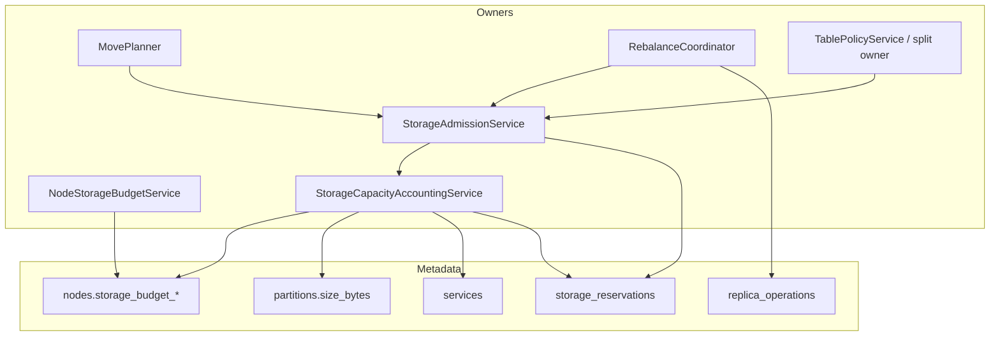

# Design Document: Storage Capacity-Aware Placement

## Overview

This design introduces strict storage-capacity ownership into placement,
rebalancing, and partition-split workflows.

Current state:
- node disk is considered as one scoring signal (`disk_usage_percent`)
- no hard budget gate exists for storage-increasing operations
- in-flight operation storage is not reservation-accounted

Target state:
- every node has an explicit allocatable storage budget
- every storage-increasing operation is admission-gated
- in-flight reservations prevent concurrent over-commit
- planner and coordinator use one shared capacity owner path

## Goals

- Add explicit, persisted node storage budgets.
- Add mandatory admission + reservation for storage-increasing operations.
- Integrate capacity into `MovePlanner` without creating a second planner.
- Include split/merge capacity semantics and pressure-state behavior.
- Provide admin-visible diagnostics and rollout-safe migration.

## Non-Goals

- Replacing existing quorum/readiness/correctness constraints.
- Building a second system metadata cache.
- Introducing manual per-operation placement overrides.
- Redesigning table partitioning policy beyond required capacity gates.

## Ownership Map

| Concern | Owner | Notes |
| --- | --- | --- |
| Budget resolution/registration | `NodeStorageBudgetService` | Seed/join startup-owned integration |
| Replica size estimation + capacity snapshot | `StorageCapacityAccountingService` | Derives used/reserved/available from metadata |
| Admission decision + reservation API | `StorageAdmissionService` | Single gate for ADD/REPLACE/SPLIT increases |
| Operation lifecycle transitions | `RebalanceCoordinator` | Delegates reservation state changes |
| Placement planning | `MovePlanner` | Consumes admission/accounting APIs; no duplicate planner |
| Split gating integration | `TablePolicyService` + split owner | Calls admission owner for feasibility |

No other component may implement independent storage admission or reservation
logic.

## Architecture

## Data Model

### 1. `nodes` extension

Add budget ownership fields:
- `storage_budget_bytes` (INTEGER, not null after migration)
- `storage_budget_source` (TEXT: `absolute` | `ratio` | `backfill`)
- `storage_budget_updated_at` (INTEGER)

Existing capacity signals (`disk_gb`, `disk_usage_percent`) remain and are used
as diagnostics/scoring inputs, not as hard admission authority.

### 2. `storage_reservations` table

New system table for in-flight reservations:
- `reservation_id` (pk)
- `operation_id`
- `entity_type`
- `entity_id`
- `partition_id`
- `target_node_id`
- `estimated_bytes`
- `amplification_factor`
- `status` (`active`, `released`, `expired`)
- `reason_code`
- `created_at`
- `updated_at`
- `expires_at`
- `released_at`

Recommended indices:
- `(target_node_id, status)`
- `(operation_id)`
- `(entity_type, entity_id, status)`
- `(expires_at, status)`

### 3. Capacity snapshot projection (derived)

`StorageCapacityAccountingService` produces per-node snapshots:
- `budget_bytes`
- `used_bytes` (from replica + partition metadata)
- `reserved_bytes` (active reservations)
- `available_bytes` (`budget - used - reserved`)
- `pressure_state` (`normal`, `soft`, `hard`, `exhausted`)

This projection is derived, not an additional persisted source of truth.

## Algorithms

### 1. Replica size estimation

For each storage-increasing operation:

`estimated_bytes = max(partition.size_bytes, minimumReplicaBytes) + overhead`

Where overhead is resolved by constants per entity/runtime type. Split paths
apply configurable amplification:

`estimated_bytes = estimated_bytes * splitAmplificationFactor`

### 2. Admission decision

Given `target_node_id` and `estimated_bytes`:
1. Build node capacity snapshot.
2. Compute projected available bytes after reservation.
3. Reject if projected availability violates hard limit or policy headroom.
4. For critical replacement operations, allow only when emergency-headroom rule
   passes.
5. Emit structured decision (`allow|deny`, reason code, projected utilization).

### 3. Reservation lifecycle

1. Create reservation atomically with operation create.
2. Keep reservation `active` through non-terminal workflow states.
3. On terminal completion/failure/cancel, mark `released`.
4. Reconcile stale `active` reservations by operation status/TTL on startup and
   periodic sweep.

### 4. Planner integration

`MovePlanner` candidate pipeline:
1. Start with ready nodes.
2. Apply capacity feasibility filter via `StorageAdmissionService`.
3. Sort remaining nodes by existing suitability score + storage tie-breakers.
4. Produce target state with explicit degradation reason when capacity-limited.

### 5. Split/merge integration

- Split owner calls admission preflight before scheduling split-derived adds.
- If no feasible plan, split is deferred with reason `insufficient_capacity`.
- Merge operations remain eligible and may be prioritized under hard pressure.

## Policy and Config Extensions

### Node-level startup config

- `node.storageBudgetBytes`
- `node.storageBudgetRatio`

### Rebalancer/global config

- `rebalancer.storageSoftPressurePercent`
- `rebalancer.storageHardPressurePercent`
- `rebalancer.storageReservationTtlMs`
- `rebalancer.storageEmergencyHeadroomPercent`
- `rebalancer.minimumReplicaBytes`
- `rebalancer.splitAmplificationFactor`
- `rebalancer.partitionReplicaOverheadBytes`
- `rebalancer.messageGroupReplicaOverheadBytes`
- `rebalancer.serviceReplicaOverheadBytes`

### Table/message-group policy extensions

- `placementConstraints.minFreeBytesPerNode`
- `placementConstraints.maxBudgetUtilizationPercent`
- `placementConstraints.reserveEmergencyHeadroom`

All keys are centrally defined, validated, and surfaced through existing policy
read paths.

## Failure Handling

- **Budget missing/invalid**: node stays non-placement-eligible; explicit error.
- **Unknown partition size**: estimator uses bounded fallback minimum and logs
  diagnostic reason.
- **Reservation leak risk**: periodic + startup reconciliation releases expired
  or orphaned reservations.
- **Metadata lag**: admission uses latest available cache/SQL snapshot and emits
  confidence diagnostics.

## Observability

### Logs

- Admission allow/deny with reason code and projected utilization.
- Reservation create/release/expire events.
- Pressure-state transitions.
- Split deferrals caused by capacity feasibility failure.

### Metrics

- `storage_budget_bytes{node_id}`
- `storage_used_bytes{node_id}`
- `storage_reserved_bytes{node_id}`
- `storage_available_bytes{node_id}`
- `storage_admission_denied_total{reason}`
- `storage_pressure_state{node_id,state}`

### Admin/CLI

- Queryable `storage_reservations` table.
- Derived node-capacity view in admin node details.
- Placement diagnostics showing capacity filter effects.

## Rollout Plan

### Phase 1: Metadata + accounting read path

- Add schema/config/constants.
- Implement budget resolution and derived capacity snapshots.
- Observe-only diagnostics; no hard admission enforcement yet.

### Phase 2: Admission + reservations

- Enforce admission for ADD/REPLACE/SPLIT paths.
- Introduce reservation lifecycle and reconciliation.
- Integrate planner degradation reasoning.

### Phase 3: Policy and split integration

- Enforce policy constraints and pressure-state behavior.
- Add split amplification handling and deferral semantics.
- Expose admin/CLI diagnostics and metrics.

### Phase 4: Enforcement closure

- Remove legacy disk-only placement assumptions as sole gate.
- Keep disk usage as scoring input only.
- Verify no bypass path remains.

## Testing Strategy

### Unit

- Budget resolution and validation.
- Size estimation and pressure-state thresholds.
- Admission allow/deny logic and reason-code determinism.
- Reservation create/release/expiry/reconciliation behavior.

### Property

- Never over-commit invariant under randomized operation sequences.
- Deterministic admission decisions for identical metadata snapshots.
- Reservation accounting invariant: `available = budget - used - reserved`.

### Integration

- Seed/join budget registration and placement eligibility.
- Rebalancer rejection when nodes exceed hard pressure.
- Critical replacement behavior with emergency headroom.
- Split deferral and later success after capacity improves.
- Crash recovery reconciliation of reservations.

## Documentation Impact

Update `.kiro/steering/architecture.md` with:
- storage-capacity owner map
- admission/reservation flow in rebalancing lifecycle
- pressure-state behavior and policy interaction

Update operator docs with:
- startup budget configuration
- low-space diagnostics and remediation workflow
