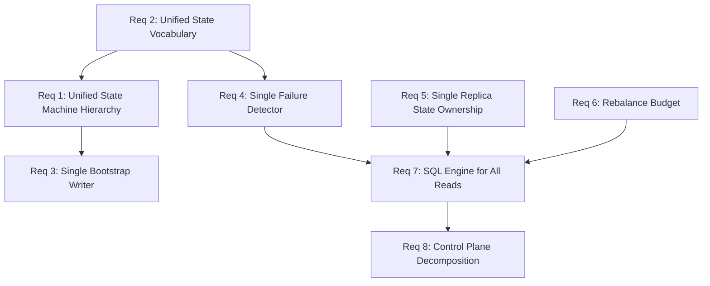

# Design Document: System Architecture Consolidation

## Overview

This design consolidates eight architectural issues into a coherent set of changes that eliminate duplicated logic, unify state vocabularies, and enforce the system's core principles. The changes are ordered to minimize risk: state vocabulary unification first (foundational), then component consolidation (removes duplication), then new capabilities (rebalance budget), then access pattern enforcement (SQL engine reads), and finally decomposition (control plane).

The guiding principle is "one way to do things" — each concern has exactly one owner, one code path, and one source of truth.

## Architecture

### Change Dependency Graph



Changes are grouped into three phases:

1. **Foundation** (Req 2, 1): Unify state vocabulary, then collapse state machine hierarchy
2. **Consolidation** (Req 3, 4, 5, 6): Remove duplicate writers, detectors, replica trackers; add rebalance budget
3. **Enforcement & Decomposition** (Req 7, 8): Route all reads through SQL engine; break up ControlPlaneService

### Before vs After: State Machine Hierarchy

**Before:**
```
NodeLifecycleStateMachine (independent)
BootstrapPhaseStateMachine (independent)
JoiningPhaseStateMachine (independent)
EnhancedBootstrapStateMachine (extends BootstrapPhaseStateMachine)
```

**After:**
```
NodeLifecycleStateMachine
├── subPhase: BootstrapSubPhase (internal, when state=STARTING)
│   └── INFRASTRUCTURE → MESSAGE_GROUPS → PARTITIONS → REGISTRATION → CACHE_HYDRATION
├── subPhase: JoiningSubPhase (internal, when state=JOINING)
│   └── CONTACTING_SEED → CONNECTING_WEBSOCKET → CREATING/JOINING_MG → WAITING_LEADERSHIP → QUERYING_STATE
└── phaseGates: Map<subPhase, PhaseGate> (absorbed from EnhancedBootstrapStateMachine)
```

### Before vs After: Failure Detection

**Before:**
```
FailureDetector (standalone, reads cache directly)
NodeLifecycleService.detectFailedNodes() (duplicate, reads cache directly)
```

**After:**
```
FailureDetector (single detector, reads via SQL engine)
NodeLifecycleService (heartbeat + node registration only, no failure detection)
```

### Before vs After: Replica State

**Before:**
```
ReplicaStateMachine.replicas Map → writes CDC
ReplicaLifecycleManager.localReplicas Map → writes CDC
ReplicaHandler.localReplicas Map → writes CDC
```

**After:**
```
ReplicaStateMachine.replicas Map → writes CDC (single owner)
ReplicaLifecycleManager → delegates to ReplicaStateMachine
ReplicaHandler → delegates to ReplicaStateMachine
```

## Components and Interfaces

### Component 1: Unified NODE_STATE Enum

**File:** `src/constants/node-state.js` (new)

Replaces both `STATE` (from `src/constants/states.js`) and `NODE_STATUS` (from `src/node/node-constants.js`).

```javascript
const NODE_STATE = Object.freeze({
  // Lifecycle states (in-memory + persisted)
  INITIALIZING: 'initializing',
  STARTING: 'starting',
  CONNECTING: 'connecting',
  DISCOVERING: 'discovering',
  JOINING: 'joining',
  READY: 'ready',
  ACTIVE: 'active',
  SUSPECTED: 'suspected',
  FAILED: 'failed',
  RECOVERING: 'recovering',
  DRAINING: 'draining',
  SHUTTING_DOWN: 'shutting_down',
  STOPPED: 'stopped',
});
```

The old `STATE` enum retains non-node values (CONNECTED, DISCONNECTED, NORMAL) for use by other components (e.g., WebSocket connection state). Node-specific states are removed from it and consolidated into `NODE_STATE`.

### Component 2: Unified NodeLifecycleStateMachine with Sub-Phases

**File:** `src/node/node-lifecycle-state-machine.js` (modified)

The state machine gains sub-phase tracking as an internal implementation detail. Sub-phases are only valid within specific parent states.

```javascript
class NodeLifecycleStateMachine extends EventEmitter {
  constructor(options = {}) {
    // ... existing constructor
    this.subPhase = null;
    this.subPhaseStartTime = null;
    this.phaseGates = new Map();  // absorbed from EnhancedBootstrapStateMachine
    this.phaseTimeouts = new Map();
    this.subPhaseDurations = new Map();
  }

  // Existing top-level transition method unchanged
  transition(newState) { /* ... */ }

  // New: sub-phase transitions
  transitionSubPhase(newSubPhase) {
    // Validates sub-phase is valid for current parent state
    // Emits 'subPhaseChange' event with {parentState, from, to, timestamp}
    // Records duration of previous sub-phase
  }

  // New: sub-phase transition with gate validation
  transitionSubPhaseWithValidation(newSubPhase, context) {
    // Validates gate if registered for current sub-phase
    // Throws PhaseGateError on failure
    // Then calls transitionSubPhase
  }

  // New: register a gate for a sub-phase
  registerPhaseGate(subPhase, gate) { /* ... */ }

  // New: get current sub-phase
  getSubPhase() { return this.subPhase; }

  // New: clear sub-phase (called on parent state transition)
  clearSubPhase() { /* ... */ }
}
```

**Sub-phase validity map:**

```javascript
const VALID_SUB_PHASES = Object.freeze({
  [NODE_STATE.STARTING]: [
    'INFRASTRUCTURE', 'MESSAGE_GROUPS', 'PARTITIONS',
    'REGISTRATION', 'CACHE_HYDRATION',
  ],
  [NODE_STATE.JOINING]: [
    'CONTACTING_SEED', 'CONNECTING_WEBSOCKET',
    'CREATING_MESSAGE_GROUP', 'JOINING_MESSAGE_GROUP',
    'WAITING_LEADERSHIP', 'QUERYING_STATE',
  ],
});
```

**Sub-phase transition map:**

```javascript
const VALID_SUB_PHASE_TRANSITIONS = Object.freeze({
  // Bootstrap sub-phases
  null: ['INFRASTRUCTURE', 'CONTACTING_SEED'],
  INFRASTRUCTURE: ['MESSAGE_GROUPS'],
  MESSAGE_GROUPS: ['PARTITIONS'],
  PARTITIONS: ['REGISTRATION'],
  REGISTRATION: ['CACHE_HYDRATION'],
  CACHE_HYDRATION: [],  // completion triggers parent transition

  // Joining sub-phases
  CONTACTING_SEED: ['CONNECTING_WEBSOCKET'],
  CONNECTING_WEBSOCKET: ['CREATING_MESSAGE_GROUP', 'JOINING_MESSAGE_GROUP'],
  CREATING_MESSAGE_GROUP: ['WAITING_LEADERSHIP'],
  JOINING_MESSAGE_GROUP: ['WAITING_LEADERSHIP'],
  WAITING_LEADERSHIP: ['QUERYING_STATE'],
  QUERYING_STATE: [],  // completion triggers parent transition
});
```

### Component 3: Single Bootstrap Writer (CDCIntegrationService bootstrap mode)

**Files modified:** `src/bootstrap/bootstrap-service.js`, `src/bootstrap/registration-phase.js`
**Files removed:** `src/bootstrap/bootstrap-partition-writer.js`

The `BootstrapPartitionWriter` is removed. All callers migrate to `CDCIntegrationService.setBootstrapMode(true, partitionServices)`. The `BootstrapSystemTableWriter` wrapper class is also removed since it was just a thin wrapper around `CDCIntegrationService.setBootstrapMode()`.

The registration phase changes from:

```javascript
// Before
const writer = new BootstrapPartitionWriter({partitionServices, nodeId});
await writer.write('nodes', 'UPSERT', data);
writer.disable();
```

To:

```javascript
// After
cdcIntegrationService.setBootstrapMode(true, partitionServices);
await cdcIntegrationService.upsertSystemTableRow('nodes', data);
cdcIntegrationService.clearBootstrapMode();
```

### Component 4: Single Failure Detector

**File modified:** `src/node/failure-detector.js` — reads via SQL engine instead of direct cache
**File modified:** `src/node/node-lifecycle-service.js` — `startFailureDetection()`, `detectFailedNodes()`, `stopFailureDetection()` removed

The `FailureDetector` constructor gains an `sqlQueryEngine` dependency. Its `getNodes()`, `getPartitionReplicasOnNode()`, and `getMessageGroupReplicasOnNode()` methods change from `this.systemTableCache.getAll()` / `this.systemTableCache.filter()` to SQL queries via the engine:

```javascript
async getNodes() {
  const result = await this.sqlQueryEngine.executeQuery(
    'SELECT * FROM nodes'
  );
  return result.rows || [];
}

async getPartitionReplicasOnNode(nodeId) {
  const result = await this.sqlQueryEngine.executeQuery(
    'SELECT * FROM services WHERE node_id = ? AND service_type = ?',
    [nodeId, SERVICE_TYPE.PARTITION]
  );
  return result.rows || [];
}
```

### Component 5: Single Replica State Ownership

**File modified:** `src/node/replica-state-machine.js` — remains the single authority
**File modified:** `src/node/replica-lifecycle-manager.js` — removes own state tracking, delegates to ReplicaStateMachine
**File modified:** `src/node/replica-handler.js` — removes own state tracking, delegates to ReplicaStateMachine

The `ReplicaLifecycleManager` changes:
- Removes `VALID_STATUS_TRANSITIONS` (uses ReplicaStateMachine's transitions)
- Removes `updateReplicaStatus()` (delegates to ReplicaStateMachine.transition())
- `localReplicas` becomes a read-through reference to ReplicaStateMachine

The `ReplicaHandler` changes:
- Removes its own `localReplicas` Map
- Removes its own `updateReplicaStatus()` method
- Receives `replicaStateMachine` as a constructor dependency
- All state reads/writes go through `replicaStateMachine`

### Component 6: Rebalance Budget

**No new tables.** Uses existing `config` and `replica_operations` system tables.

The budget is stored as a row in the `config` table:

```javascript
{
  config_key: 'rebalance_budget',
  config_value: '10',  // max concurrent cluster-wide moves
}
```

**File modified:** `src/rebalancer/unified-rebalancer.js`

Before planning moves, the rebalancer queries in-flight operations cluster-wide:

```javascript
async getClusterInFlightCount() {
  const result = await this.sqlQueryEngine.executeQuery(
    `SELECT COUNT(*) as count FROM replica_operations
     WHERE status NOT IN (?, ?, ?)`,
    [ReplicaStatus.ACTIVE, ReplicaStatus.REMOVED, ReplicaStatus.FAILED]
  );
  return result.rows[0]?.count || 0;
}

async getRebalanceBudget() {
  const result = await this.sqlQueryEngine.executeQuery(
    `SELECT config_value FROM config WHERE config_key = ?`,
    [CONFIG_KEYS.REBALANCE_BUDGET]
  );
  return parseInt(result.rows[0]?.config_value, 10) || DEFAULT_REBALANCE_BUDGET;
}
```

The `rebalance()` method gains a budget check:

```javascript
async rebalance(trigger, policy) {
  const budget = await this.getRebalanceBudget();
  const inFlight = await this.getClusterInFlightCount();

  if (inFlight >= budget) {
    // Back off with jitter, retry next cycle
    this.scheduleNextCheckWithJitter();
    return { skipped: true, reason: 'budget_exceeded' };
  }

  const maxMoves = budget - inFlight;
  // ... plan moves, but cap at maxMoves
  const moves = this.calculateMoves(currentReplicas, targetState)
    .slice(0, maxMoves);
  // ... execute moves
}
```

Critical moves (under-replicated from node failure) get a separate budget or bypass:

```javascript
const isCritical = this.isCriticalState(currentReplicas, policy);
const effectiveBudget = isCritical ?
  budget * CRITICAL_BUDGET_MULTIPLIER : budget;
```

### Component 7: SQL Engine for All System Reads

**Files modified:** `src/node/node-reintegration-service.js`, `src/node/failure-detector.js`

Both services gain `sqlQueryEngine` as a constructor dependency and replace all `systemTableCache.getAll()` / `systemTableCache.filter()` calls with SQL queries.

`NodeReintegrationService` changes:

```javascript
// Before
getNodes() {
  return this.systemTableCache.getAll(SystemTableName.NODES);
}

// After
async getNodes() {
  const result = await this.sqlQueryEngine.executeQuery(
    'SELECT * FROM nodes'
  );
  return result.rows || [];
}
```

### Component 8: ControlPlaneService Decomposition

**File removed:** `src/control-plane/control-plane-service.js`
**Files created:**
- `src/control-plane/heartbeat-service.js` — periodic heartbeat updates, consecutive failure tracking
- `src/control-plane/lease-service.js` — lease-based readiness tracking, lease sweeping
- `src/control-plane/endpoint-service.js` — endpoint registration and management
- `src/control-plane/replica-dispatch-service.js` — replica operation dispatch, message forwarding to leaders

Each service follows the existing lifecycle interface (CREATED → INITIALIZED → RUNNING → STOPPED) and receives dependencies via constructor injection.

```javascript
class HeartbeatService extends EventEmitter {
  constructor({ nodeId, nodeAddress, cdcIntegrationService, systemTableCache }) {
    // ...
  }
  initialize() { /* CREATED → INITIALIZED */ }
  start() { /* INITIALIZED → RUNNING, starts heartbeat timer */ }
  stop() { /* RUNNING → STOPPED, clears timer */ }
}

class LeaseService extends EventEmitter {
  constructor({ nodeId, cdcIntegrationService, systemTableCache }) {
    // ...
  }
  initialize() { /* ... */ }
  start() { /* starts lease sweep timer */ }
  stop() { /* clears timer */ }
}

class EndpointService extends EventEmitter {
  constructor({ nodeId, cdcIntegrationService, systemTableCache }) {
    // ...
  }
  initialize() { /* ... */ }
  registerEndpoint(endpointData) { /* ... */ }
  removeEndpoint(endpointId) { /* ... */ }
}

class ReplicaDispatchService extends EventEmitter {
  constructor({
    nodeId, messageRouter, cdcIntegrationService,
    systemTableCache, rebalanceCoordinator
  }) {
    // ...
  }
  initialize() { /* ... */ }
  dispatchOperation(operation) { /* ... */ }
  forwardToLeader(partitionId, message) { /* ... */ }
}
```

## Data Models

### NODE_STATE Enum (replaces STATE + NODE_STATUS)

| Value | Usage | Persisted to nodes table |
|-------|-------|--------------------------|
| INITIALIZING | Node is initializing before bootstrap | Yes |
| STARTING | Seed node bootstrap in progress | Yes |
| CONNECTING | Establishing connections | Yes |
| DISCOVERING | Discovering cluster topology | Yes |
| JOINING | Joining node bootstrap in progress | Yes |
| READY | Node ready to serve queries | Yes |
| ACTIVE | Node fully operational (alias for READY in persisted context) | Yes |
| SUSPECTED | Heartbeat delayed, under suspicion | Yes |
| FAILED | Confirmed failure | Yes |
| RECOVERING | Recovery detected, health checks in progress | Yes |
| DRAINING | Graceful shutdown, draining traffic | Yes |
| SHUTTING_DOWN | Shutdown in progress | Yes |
| STOPPED | Fully stopped | Yes |

### Config Table: Rebalance Budget

| config_key | config_value | Description |
|------------|-------------|-------------|
| rebalance_budget | 10 | Max concurrent cluster-wide replica moves |
| rebalance_critical_multiplier | 2 | Multiplier for critical move budget |

### Sub-Phase Constants

**File:** `src/node/node-lifecycle-constants.js` (new or merged into node-constants.js)

```javascript
const BOOTSTRAP_SUB_PHASE = Object.freeze({
  INFRASTRUCTURE: 'INFRASTRUCTURE',
  MESSAGE_GROUPS: 'MESSAGE_GROUPS',
  PARTITIONS: 'PARTITIONS',
  REGISTRATION: 'REGISTRATION',
  CACHE_HYDRATION: 'CACHE_HYDRATION',
});

const JOINING_SUB_PHASE = Object.freeze({
  CONTACTING_SEED: 'CONTACTING_SEED',
  CONNECTING_WEBSOCKET: 'CONNECTING_WEBSOCKET',
  CREATING_MESSAGE_GROUP: 'CREATING_MESSAGE_GROUP',
  JOINING_MESSAGE_GROUP: 'JOINING_MESSAGE_GROUP',
  WAITING_LEADERSHIP: 'WAITING_LEADERSHIP',
  QUERYING_STATE: 'QUERYING_STATE',
});
```


## Correctness Properties

*A property is a characteristic or behavior that should hold true across all valid executions of a system — essentially, a formal statement about what the system should do. Properties serve as the bridge between human-readable specifications and machine-verifiable correctness guarantees.*

### Property 1: Sub-phase tracking correctness

*For any* parent state that supports sub-phases (STARTING or JOINING), and *for any* valid sub-phase sequence for that parent state, the NodeLifecycleStateMachine shall correctly track each sub-phase transition, with `getSubPhase()` returning the current sub-phase after each transition.

**Validates: Requirements 1.2, 1.3**

### Property 2: Sub-phase events contain correct context

*For any* valid sub-phase transition, the emitted `subPhaseChange` event shall contain the correct parent state, the previous sub-phase, and the new sub-phase.

**Validates: Requirements 1.4**

### Property 3: Terminal sub-phase auto-advances parent state

*For any* terminal sub-phase (CACHE_HYDRATION for STARTING, QUERYING_STATE for JOINING), completing the sub-phase shall cause the parent state to advance to the next top-level state (STARTING → CONNECTING, JOINING → READY).

**Validates: Requirements 1.6**

### Property 4: State machine to CDC consistency

*For any* valid state transition in the NodeLifecycleStateMachine, the state value written to the nodes system table via CDC shall be identical to the state machine's current state value from the unified NODE_STATE enum.

**Validates: Requirements 2.3**

### Property 5: Cache state values are from unified enum

*For any* node state value read from the system cache, the value shall be a member of the NODE_STATE enum.

**Validates: Requirements 2.5**

### Property 6: Bootstrap mode routing enforcement

*For any* write operation attempted when CDCIntegrationService bootstrap mode is disabled, the write shall be routed through the SQL engine and shall not execute directly on local partitions.

**Validates: Requirements 3.5**

### Property 7: Failure detector single CDC write per status change

*For any* node that transitions from ACTIVE to SUSPECTED or from SUSPECTED to FAILED, the FailureDetector shall produce exactly one CDC write for the node status change. When transitioning to FAILED, it shall also produce exactly one CDC write per affected replica.

**Validates: Requirements 4.3, 4.4**

### Property 8: Failure detector recovery detection

*For any* node in FAILED state that resumes heartbeating within the failure threshold, the FailureDetector shall write RECOVERING status to the nodes table via CDC.

**Validates: Requirements 4.5**

### Property 9: Adaptive threshold increases on flapping

*For any* node that fails repeatedly within the flapping window (exceeding the flapping threshold), the FailureDetector's effective failure threshold shall increase, up to the configured maximum.

**Validates: Requirements 4.6**

### Property 10: Single CDC write path for replica state changes

*For any* replica state transition, exactly one CDC write to the services system table shall occur, and it shall originate from the ReplicaStateMachine.

**Validates: Requirements 5.4**

### Property 11: Rebalance budget enforcement

*For any* rebalance cycle, the number of proposed moves shall be at most `max(0, rebalance_budget - in_flight_count)`. When `in_flight_count >= rebalance_budget`, zero moves shall be proposed.

**Validates: Requirements 6.3, 6.4**

### Property 12: Critical moves prioritized over optimization moves

*For any* set of planned moves containing both critical (under-replicated) and optimization (spread improvement) moves, all critical moves shall appear before optimization moves in the execution order.

**Validates: Requirements 6.5**

### Property 13: Heartbeat service periodic writes

*For any* running HeartbeatService instance, after N heartbeat intervals have elapsed, the service shall have issued N heartbeat update writes via CDC (within a tolerance of ±1 for timing).

**Validates: Requirements 8.2**

### Property 14: Lease sweep removes expired leases

*For any* set of nodes with expired ready leases, after a lease sweep cycle, those nodes shall no longer have valid ready leases in the system table.

**Validates: Requirements 8.3**

### Property 15: Endpoint registration round-trip

*For any* valid endpoint data, registering the endpoint and then querying for it shall return the same endpoint data.

**Validates: Requirements 8.4**

### Property 16: Replica dispatch forwards to correct leader

*For any* replica operation dispatch request with a known partition leader, the ReplicaDispatchService shall forward the message to the address of the current leader for that partition.

**Validates: Requirements 8.5**

## Error Handling

### State Machine Errors

- **Invalid top-level transition**: `transition()` returns `false` and logs the invalid attempt. No exception thrown (existing behavior preserved).
- **Invalid sub-phase transition**: `transitionSubPhase()` throws `PhaseTransitionError` with current sub-phase, target sub-phase, and valid transitions.
- **Phase gate failure**: `transitionSubPhaseWithValidation()` throws `PhaseGateError` with validation errors and diagnostics (absorbed from EnhancedBootstrapStateMachine).

### Bootstrap Writer Errors

- **Write in disabled mode**: `CDCIntegrationService.executeSQLDirectToLocalPartition()` throws if `bootstrapMode` is false. This is the existing behavior.
- **Missing partition service**: Throws with descriptive error including table name and available partitions.

### Failure Detector Errors

- **SQL engine unavailable**: `getNodes()` and related methods throw if SQL engine returns an error. The periodic check loop catches and logs the error, then re-throws (per system guidelines: errors must not be swallowed).
- **CDC write failure**: Status update failures are logged and re-thrown. The next check cycle will retry.

### Rebalance Budget Errors

- **Budget query failure**: If the SQL query for in-flight count fails, the rebalancer logs the error and skips the cycle (conservative — no moves when budget is unknown).
- **Config missing**: If `rebalance_budget` is not in the config table, a default value is used.

### Control Plane Decomposition Errors

- **Missing dependency at construction**: Each focused service validates required dependencies in the constructor via `assertCritical()`, throwing `DependencyError` immediately.
- **Lifecycle violation**: Calling `start()` on a non-INITIALIZED service throws `LifecycleError`.

## Testing Strategy

### Property-Based Testing

Property-based tests use `fast-check` with `{numRuns: 10}` per the project's testing guidelines.

Each correctness property maps to a single property-based test. Tests are tagged with:
```
Feature: system-architecture-consolidation, Property N: <property_text>
```

**Key generators needed:**
- Valid state transition sequences (for state machine properties)
- Valid sub-phase sequences (for sub-phase tracking properties)
- Random node heartbeat scenarios (for failure detector properties)
- Random replica state transitions (for replica state machine properties)
- Random budget/in-flight combinations (for rebalance budget properties)
- Random move lists with critical/optimization classification (for move priority properties)

### Unit Testing

Unit tests cover specific examples and edge cases:

- State machine: invalid transitions rejected, sub-phase cleared on parent transition, gate validation failure
- Bootstrap writer: mode toggle, write rejection when disabled
- Failure detector: specific heartbeat timeout scenarios, flapping detection with exact threshold values
- Rebalance budget: budget=0 (no moves), budget=1 with 1 in-flight (no moves), critical bypass
- Control plane decomposition: each service initializes, starts, stops correctly; dependency validation at construction

### Integration Testing

Integration tests use real Raft consensus (per testing guidelines):

- End-to-end bootstrap with unified state machine (seed node boots through all sub-phases)
- Failure detection → rebalancing flow (node fails, detector marks it, rebalancer respects budget)
- Replica lifecycle through single state machine (create → sync → active → remove, all via ReplicaStateMachine)

### Test File Organization

```
test/
├── node/
│   ├── node-lifecycle-state-machine.test.js  (updated: sub-phase tests)
│   ├── failure-detector.test.js              (updated: SQL engine reads)
│   └── replica-state-machine.test.js         (updated: single ownership)
├── rebalancer/
│   └── unified-rebalancer.test.js            (updated: budget enforcement)
├── control-plane/
│   ├── heartbeat-service.test.js             (new)
│   ├── lease-service.test.js                 (new)
│   ├── endpoint-service.test.js              (new)
│   └── replica-dispatch-service.test.js      (new)
└── integration/
    └── architecture-consolidation.test.js    (new)
```
