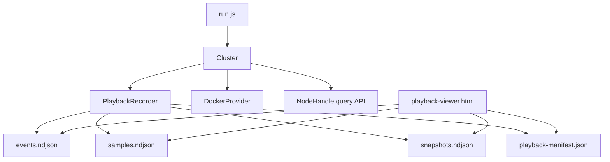

# Design Document: Test Run Playback Visualization

## Overview

This design adds an end-to-end playback pipeline to the distributed test harness:

1. **Capture** high-level events from cluster lifecycle, chaos/load calls, topology diffs, and resource telemetry.
2. **Persist** a structured playback bundle under each scenario output directory.
3. **Visualize** the run in a static HTML viewer with timeline stepping and topology diagram updates.

The implementation extends existing harness boundaries (`Cluster`, `DockerProvider`, `ReportWriter`, and `run.js`) without changing scenario contracts.

## Architecture



## Components

### PlaybackRecorder (`test/distributed/harness/playback-recorder.js`)

Single owner for playback artifact capture and persistence.

Responsibilities:

- Emit structured events from explicit API calls (`recordEvent`)
- Run periodic topology snapshot polling (system table queries)
- Run periodic resource sampling (container stats)
- Compute topology diffs and emit derived events
- Stream NDJSON artifacts and manifest to scenario output directory

Core API:

```javascript
class PlaybackRecorder {
  constructor(options) {}

  async start(context) {}
  async stop(summary) {}

  recordEvent(event) {}

  getManifest() {}
  getWarnings() {}
}
```

### Topology Diff Engine

Implemented inside recorder module to avoid duplicate topology parsing logic.

Inputs:

- previous snapshot (`nodes`, `partitions`, `services`)
- current snapshot (`nodes`, `partitions`, `services`)

Outputs:

- `partition.created`
- `partition.removed`
- `partition.split` (heuristic)
- `partition.merge` (heuristic)
- `replica.created`
- `replica.removed`
- `replica.moved`

Split/merge heuristic:

- Split: one removed partition and two added partitions on same table with contiguous boundary relationship.
- Merge: two removed partitions and one added partition on same table with unioned range.

### DockerProvider Stats API Extension

Add a method to fetch one-shot container stats and normalize to harness metrics:

```javascript
async getContainerStats(containerId) {}
```

Output shape:

```javascript
{
  timestamp,
  cpuPercent,
  memoryUsageBytes,
  memoryLimitBytes,
  rxBytes,
  txBytes,
}
```

### Cluster Integration

`Cluster` will own one PlaybackRecorder instance.

Integration points:

- `start()` / `stop()` lifecycle events
- `_startNode()` node create/start events
- chaos wrapper methods (`killNode`, `restartNode`, etc.)
- `startLoad()` to mark load run start/completion

### Report Integration

`ReportWriter` scenario entries will include:

```json
"playback": {
  "manifestPath": ".../playback-manifest.json",
  "eventsPath": ".../events.ndjson",
  "samplesPath": ".../samples.ndjson",
  "snapshotsPath": ".../snapshots.ndjson",
  "warnings": []
}
```

### Playback Viewer (`test/distributed/harness/playback-viewer.html`)

A static client-side page that:

- Loads `playback-manifest.json`
- Fetches NDJSON files
- Builds an indexed timeline
- Renders selected event details
- Renders node/partition/replica topology summary
- Renders per-node load cards (CPU/memory/network)
- Supports step controls and keyboard arrows

## Data Model

### Event Schema

```json
{
  "timestamp": 1730000000000,
  "type": "replica.moved",
  "scope": "topology",
  "entityId": "services-p1-r2",
  "details": {
    "partitionId": "services-p1",
    "fromNodeId": "node-a",
    "toNodeId": "node-b"
  }
}
```

### Sample Schema

```json
{
  "timestamp": 1730000000100,
  "nodeId": "node-a",
  "containerId": "abcd1234",
  "cpuPercent": 37.2,
  "memoryUsageBytes": 241172480,
  "memoryLimitBytes": 536870912,
  "rxBytes": 12450982,
  "txBytes": 9456123
}
```

### Snapshot Schema

```json
{
  "timestamp": 1730000000000,
  "nodes": [...],
  "partitions": [...],
  "services": [...]
}
```

## Error Handling

- Recorder warnings are accumulated and exposed via manifest/report.
- Capture failures do not fail scenarios.
- IO failures during finalization are surfaced in report playback warnings.

## Performance and Safety

- Poll intervals default to 1s for topology and 1s for resource samples.
- Writes are append-only NDJSON streams; no full-history in-memory requirement.
- Minimal per-tick allocations beyond parsed query/stats payloads.
