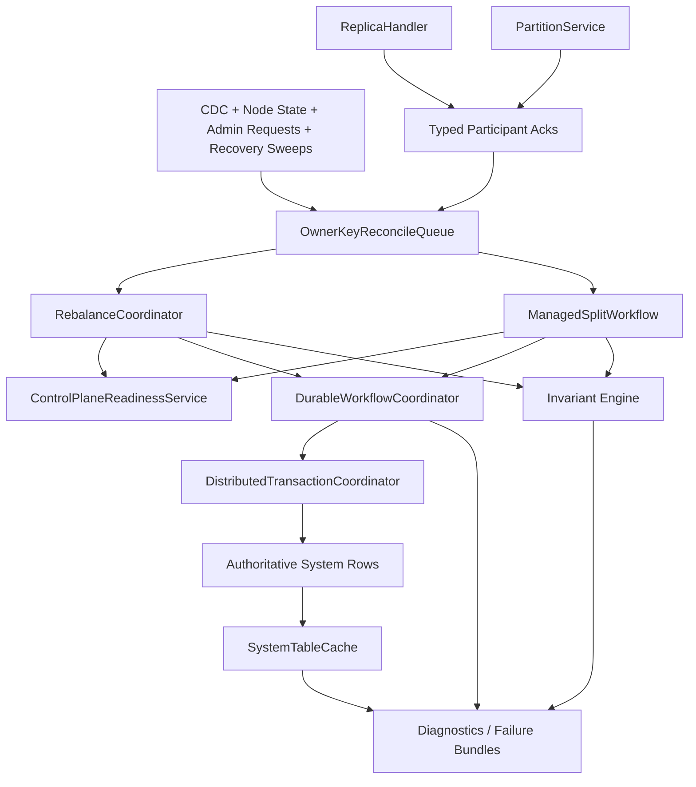

# Design Document: Topology Workflow Single-Owner Stabilization

## Overview

This design closes the architectural contradictions that still make topology
workflows brittle, with managed partition split as the highest-priority case.

The intent is not to add another workflow framework. The system already has the
right building blocks:

1. `OwnerKeyReconcileQueue` for serialized owner-key progression
2. `DurableWorkflowCoordinator` for durable workflow state, participant
   persistence, recovery, and idempotent transitions
3. `DistributedTransactionCoordinator` for atomic multi-row cut points
4. `ControlPlaneReadinessService` for canonical readiness projection

The work in this spec reuses those pieces to enforce one writer per topology
workflow, durable split progression, explicit participant acknowledgements,
repair-vs-serving readiness separation, and fail-closed owner wiring.

This spec complements
`.kiro/specs/control-plane-predictability-and-determinism/` by focusing on the
remaining workflow-owner contradictions that still surface during partitioning
and rebalance-heavy runs.

## Goals

1. Make `replica_operations` a true single-writer workflow surface.
2. Make managed split one durable owner-driven workflow from admission through
   cleanup.
3. Advance workflow state from explicit acknowledgements, not inferred cache
   timing.
4. Separate internal repair eligibility from external serving readiness.
5. Make atomic topology cut points mandatory and fail-closed.
6. Eliminate owner-bypassing fallback logic in active topology decision paths.

## Non-Goals

1. Introduce a special degraded-mode control path.
2. Preserve optional or parallel workflow semantics.
3. Replace `SystemTableCache` as the steady-state read model.
4. Treat longer timeouts as a valid fix for stuck topology workflows.

## Decision Summary

| Decision ID | Decision |
| --- | --- |
| D1 | `RebalanceCoordinator` remains the canonical `replica_operations` owner and becomes the only writer of owner-owned workflow fields. |
| D2 | `ManagedSplitWorkflow` becomes the only durable split owner from admission through cleanup. |
| D3 | Executor components report typed outcomes through participant acknowledgements instead of mutating workflow rows directly. |
| D4 | `ControlPlaneReadinessService` exposes one snapshot with separate `repairEligible` and `serveEligible` decisions. |
| D5 | `DistributedTransactionCoordinator` is mandatory for atomic topology cut points; no sequential fallback remains. |
| D6 | Owner dependencies required for active production topology decisions must be wired before start; missing owners fail closed. |
| D7 | Cache visibility informs observation and diagnostics, not workflow completion semantics. |

## Target Architecture



## Core Design

### 1. Reuse the Existing Workflow Runtime Instead of Inventing Another One

The correct high-level move is to extend the existing durable workflow runtime,
not to add a second control-plane workflow framework.

Shared runtime responsibilities:

1. `OwnerKeyReconcileQueue` remains the only progression entry for owner-keyed
   topology work.
2. `DurableWorkflowCoordinator` remains the reusable owner for:
   - workflow registration
   - monotonic step transitions
   - idempotent replays
   - participant persistence
   - recovery from rows
3. `DistributedTransactionCoordinator` remains the reusable owner for atomic
   multi-row commit when a topology step requires one semantic cut point.

New rule:

1. Workflow-specific components may own semantics, but they must compose the
   shared runtime. They may not reimplement workflow persistence, participant
   tracking, or alternate step-transition logic.

### 2. `replica_operations` Becomes a Real Single-Writer Workflow Table

The main contradiction in the current rebalance path is that
`RebalanceCoordinator` is intended to own `replica_operations`, while
`ReplicaHandler` still transitions `workflow_step` directly.

Target model:

1. `RebalanceCoordinator` creates and advances `replica_operations`.
2. `ReplicaDispatchService` still dispatches work, but any workflow-step claim
   required before dispatch is performed through the coordinator-owned workflow
   transition path rather than by an independent writer.
3. `ReplicaHandler` no longer mutates owner-owned workflow fields. Instead it
   emits typed outcome records such as:
   - `replica_create_started`
   - `replica_create_syncing`
   - `replica_create_active`
   - `replica_create_failed`
   - `replica_remove_failed`
4. The coordinator consumes those outcomes through the same owner queue and
   decides whether to transition the workflow.

Field ownership after cutover:

1. Identity and workflow fields on `replica_operations` remain coordinator-owned.
2. Executor-local transient progress stays local or is persisted as workflow
   participant state through the durable workflow runtime.
3. Recovery logic reads executor outcomes and authoritative rows, then routes
   all state changes through the coordinator.

### 3. Managed Split Becomes One Durable Workflow End to End

The current split path is fragmented across `SQLQueryEngine`,
`ManagedSplitWorkflow`, and `PartitionService`, with source execution state
still living partly in memory.

Target model:

1. `ManagedSplitWorkflow` owns the split from admission through cleanup.
2. `SQLQueryEngine.executeManagedSplit()` becomes a thin ingress path that
   delegates to the split owner.
3. `PartitionService` becomes a split execution participant for source-side
   work:
   - snapshot start
   - backfill progress
   - catch-up readiness
   - cutover apply
   - cleanup completion
4. Child provisioning and source execution are represented as workflow
   participants inside `DurableWorkflowCoordinator`.

Durable split metadata must include, at minimum:

```json
{
  "workflowId": "split-...",
  "ownerKey": "partition-...",
  "phase": "backfilling",
  "fenceToken": "epoch-or-lease",
  "participants": {
    "left-child": {"status": "acknowledged"},
    "right-child": {"status": "acknowledged"},
    "source-partition": {"status": "catchup_ready"}
  },
  "sourceCheckpoint": {
    "snapshotRevision": 123,
    "lastAppliedDelta": 456
  },
  "cleanupState": {
    "sourceMirrorRemoved": false
  }
}
```

The exact persisted shape may differ, but the architecture requirements do not:

1. the split owner must be able to reconstruct the full in-flight workflow from
   durable rows
2. no in-memory split phase is allowed to be the only truth needed for resume
3. process-local helpers may cache active execution handles, but not canonical
   workflow state

### 4. Participant Acknowledgements Are the Progress Contract

Topology workflows currently infer too much from side effects:
cache visibility, elapsed time, or indirect row changes. That is why executor
success can coexist with owner-side workflow stalls.

Target acknowledgement model:

1. Every executor-owned boundary produces a typed acknowledgement payload.
2. The acknowledgement is routed to the workflow owner through the owner-key
   reconcile queue.
3. The owner validates:
   - workflow identity
   - owner key
   - fence token
   - participant identity
4. The owner persists participant state through `DurableWorkflowCoordinator`.
5. Only after durable participant acknowledgement may the owner advance the
   next step.

Benefits:

1. executor completion and workflow completion stop being inferred from the
   same side effects
2. duplicate or stale reports become safe and explainable
3. recovery can replay from durable participant state instead of guessing from
   timers or cache visibility

### 5. One Readiness Snapshot, Two Different Decisions

The same readiness service must support two different questions:

1. Can this node safely participate in internal repair/provisioning work?
2. Can this node safely serve normal client traffic and benchmark load?

These are not the same decision.

Target readiness contract:

| Consumer | Required dimension |
| --- | --- |
| `ReplicaDispatchService` | `repairEligible` |
| `RebalanceCoordinator` | `repairEligible` |
| `ManagedSplitWorkflow` admission/provisioning | `repairEligible` |
| routing / external readiness / benchmark admission | `serveEligible` |

Rules:

1. Both decisions come from the same `ControlPlaneReadinessService` snapshot.
2. Reason codes remain shared and machine-readable.
3. Internal topology work cannot be blocked solely by lack of serve readiness
   if repair eligibility is true.
4. Client-serving and benchmark readiness remain strict and must continue to
   use `serveEligible`.

### 6. Atomic Topology Cut Points Must Be Mandatory

Optional transaction semantics are incompatible with stable topology workflows.
If a step requires multi-row atomicity, the system must either perform that
atomic cut point correctly or refuse to run the path.

Target transaction contract:

1. Partition metadata creation for split children is an atomic cut point.
2. Cutover steps that change multiple authoritative rows are atomic cut points.
3. Workflow transition persistence and authoritative owner-row mutation commit
   together when they represent one semantic state change.
4. Missing `DistributedTransactionCoordinator` for such a path is a startup or
   construction failure, not a runtime fallback branch.

### 7. Owner Dependencies Must Be Wired, Not Reconstructed Locally

Some control-plane components still accept canonical owners but keep local
fallbacks when those dependencies are absent. That undermines single source of
truth guarantees.

Target dependency contract:

1. Production wiring in control-plane setup must supply all required owner
   dependencies for active topology paths.
2. If a readiness, capacity, or publication decision is required, the
   corresponding owner must be present.
3. Local reconstruction from raw row fields is allowed only in:
   - pure diagnostics
   - explicitly inactive paths
4. Constructors or startup hooks fail closed when a required owner is missing.

### 8. Cache Remains a Read Model and Divergence Signal

`SystemTableCache` is still necessary and correct as the observational read
model. The mistake is treating cache visibility as proof that a workflow phase
semantically completed.

Target cache contract:

1. Owners may read cache for steady-state observation and decision inputs where
   the cache is the declared read model.
2. Owners do not advance executor-owned workflow phases from cache visibility
   alone.
3. Cache-vs-authoritative divergence becomes:
   - a typed diagnostic
   - an invariant input
   - a recovery enqueue signal through the same owner queue
4. No direct alternate mutation path is introduced to "fix cache lag" outside
   the canonical owner path.

## Migration Plan

### Phase 1: Owner and Wiring Closure

1. Inventory all non-owner writes to `replica_operations`.
2. Inventory all split phases and identify which component currently acts as
   de facto owner.
3. Wire required owner dependencies in production setup and remove active
   fallback logic.

Exit gate:

1. No active topology decision path executes with missing owner dependencies.
2. All current non-owner workflow writers are identified and scheduled for
   removal.

### Phase 2: `replica_operations` Single-Writer Cutover

1. Replace direct executor writes with typed outcome acknowledgements.
2. Route all workflow advancement through `RebalanceCoordinator`.
3. Route recovery through the same owner queue.

Exit gate:

1. `ReplicaHandler` no longer transitions `workflow_step`.
2. Tests prove owner-path-only workflow mutation.

### Phase 3: Durable Split Workflow Cutover

1. Persist complete split workflow identity, phase, participant state, and
   source checkpoint durably.
2. Convert `PartitionService` to an execution participant.
3. Remove process-memory-only split correctness state.

Exit gate:

1. A split can be recovered after restart without reconstructing canonical
   phase from memory.
2. `ManagedSplitWorkflow` owns the full lifecycle.

### Phase 4: Readiness Stratification and Cache Boundary Closure

1. Introduce `repairEligible` and `serveEligible`.
2. Rewire internal topology consumers to `repairEligible`.
3. Remove cache-as-proof completion branches.

Exit gate:

1. Internal topology workflows are no longer blocked by serve-only readiness.
2. Owner advancement requires authoritative commit plus acknowledgement.

### Phase 5: Deterministic Closure and Harness Confirmation

1. Add deterministic repros and invariants for each bug class.
2. Run targeted suites first.
3. Run the seven-node harness only after lower layers are green.

Exit gate:

1. Harness reruns are confirmation only.
2. Timeout-based failures are either eliminated or reduced to typed,
   deterministic reproductions with open ownership.

## Risks and Mitigations

1. Risk: the split cutover touches several components at once.
   Mitigation: keep owner semantics centralized in `ManagedSplitWorkflow` and
   convert other components into adapters/participants incrementally.
2. Risk: participant acknowledgements add more persisted state.
   Mitigation: reuse `DurableWorkflowCoordinator` participant persistence
   instead of inventing a second persistence mechanism.
3. Risk: fail-closed wiring exposes missing dependencies quickly.
   Mitigation: that is the intended behavior; add targeted startup tests so the
   failures are immediate and actionable rather than latent.
