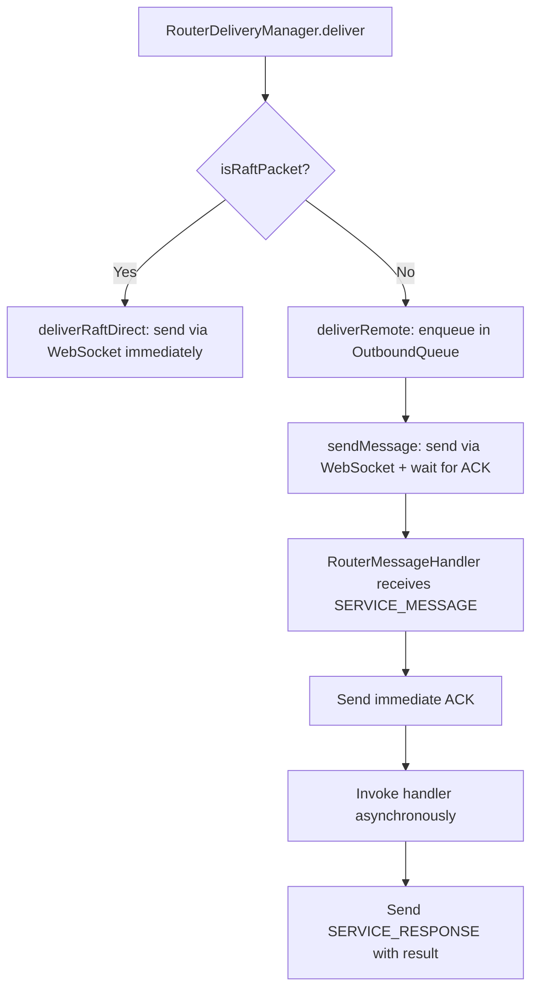
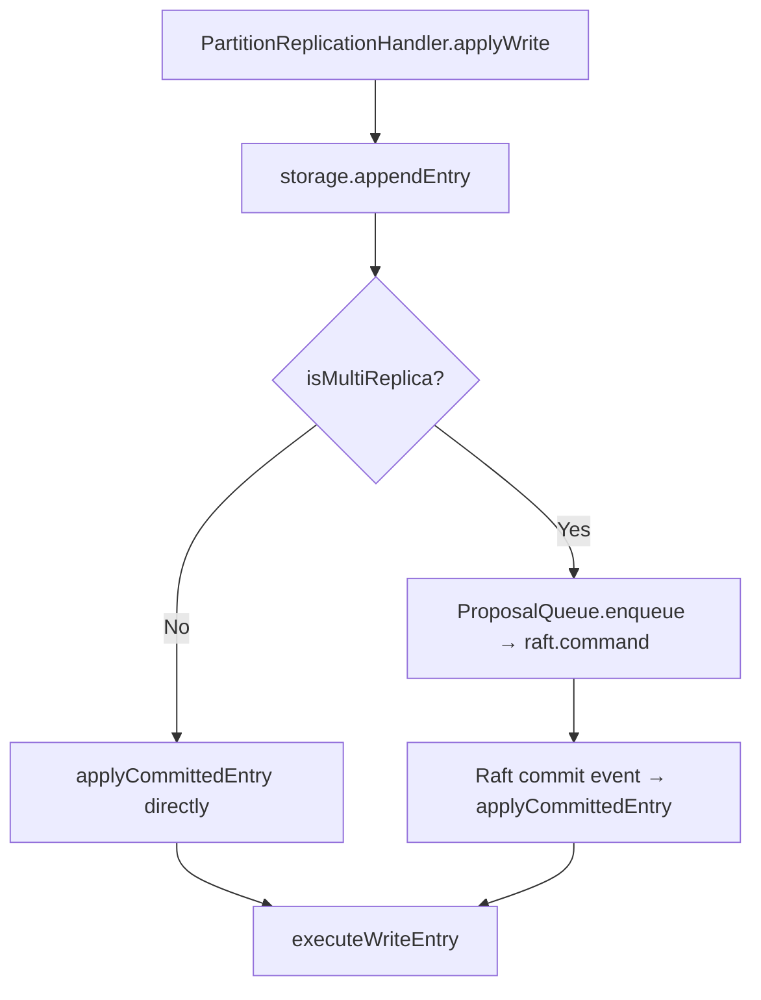

# Design Document: Transport Architecture Improvements

## Overview

This design addresses six architectural gaps in the transport and Raft consensus layers by introducing four patterns: a separate Raft transport channel, immediate ACK with deferred response, a bounded proposal queue with backpressure, and a unified write path through Raft. Two cleanup items (removing RaftTransportAdapter and its console.log usage) are also covered.

The changes are scoped to the transport layer (`src/transport/`), the Raft layer (`src/raft/`), and the partition replication handler (`src/partition/partition-replication-handler.js`). The core Raft consensus (liferaft) and SQLite storage layers are not modified.

## Architecture

The current message flow for all traffic (Raft protocol, application writes, CDC, heartbeats) goes through a single per-node outbound queue in `RouterOutboundQueue`. This creates priority inversion where application messages can starve Raft protocol messages.

After this change, the delivery path splits based on message type:



The write path is also unified:



## Components and Interfaces

### 1. RouterDeliveryManager Changes

**File:** `src/transport/router-delivery-manager.js`

Add a `deliverRaftDirect` method that bypasses the outbound queue for Raft packets. Modify `deliverRemote` to check `isRaftPacket(payload)` before deciding the delivery path.

```javascript
// New import
import { isRaftPacket } from '../raft/raft-packet-utils.js';

// In deliverRemote, before enqueuing:
async deliverRemote(targetAddress, messageId, payload, targetNodeId) {
  // Raft packets bypass the outbound queue entirely
  if (isRaftPacket(payload)) {
    return this.deliverRaftDirect(
      targetAddress, messageId, payload, targetNodeId
    );
  }
  // Non-Raft: enqueue as before
  return this.outboundQueue.enqueueOutbound(targetNodeId, () => {
    // ... existing logic
  });
}

// New method: direct WebSocket delivery for Raft packets
async deliverRaftDirect(targetAddress, messageId, payload, targetNodeId) {
  const connection = this.nodeConnections.get(targetNodeId);
  if (!connection || connection.state !== ConnectionState.CONNECTED) {
    return {
      messageId,
      acknowledged: false,
      error: ROUTER_ERROR_MSG.noConnectionToNode(targetNodeId),
    };
  }
  // Send directly, no queue, no ACK wait
  const message = {
    type: RouterMessageType.SERVICE_MESSAGE,
    messageId,
    targetAddress,
    sourceAddress: ROUTER_ADDRESS.buildSourceAddress(this.nodeId),
    sourceNodeId: this.nodeId,
    payload,
    timestamp: Date.now(),
  };
  this.sendRaw(connection.ws, message);
  return { messageId, acknowledged: true, direct: true };
}
```

### 2. RouterMessageHandler Changes (Immediate ACK)

**File:** `src/transport/router-message-handler.js`

Modify `handleServiceMessage` to send ACK immediately, then invoke the handler asynchronously and send a `SERVICE_RESPONSE` with the result.

```javascript
handleServiceMessage(ws, message) {
  const { targetAddress, messageId, payload } = message;
  const handler = this.handlers.get(targetAddress);

  // Send ACK immediately — release outbound queue slot on sender
  this.sendRaw(ws, {
    type: RouterMessageType.ACK,
    messageId,
    acknowledged: true,
  });

  if (!handler) {
    this.emit(TRANSPORT_EVENT.MESSAGE, { ... });
    return;
  }

  // Invoke handler asynchronously, send SERVICE_RESPONSE when done
  const envelope = { messageId, sourceAddress, targetAddress, payload, ... };
  Promise.resolve(handler(envelope))
    .then((result) => {
      this.sendRaw(ws, {
        type: RouterMessageType.SERVICE_RESPONSE,
        messageId,
        sourceAddress: message.sourceAddress,
        result,
      });
    })
    .catch((error) => {
      this.sendRaw(ws, {
        type: RouterMessageType.SERVICE_RESPONSE,
        messageId,
        sourceAddress: message.sourceAddress,
        error: error.message,
      });
    });
}
```

A new `SERVICE_RESPONSE` message type is added to `ROUTER_MESSAGE_TYPE` in `src/constants/transport.js`. The `handleMessage` dispatch in `RouterMessageHandler` gains a case for `SERVICE_RESPONSE` that resolves pending response callbacks.

### 3. Pending Response Tracking in RouterDeliveryManager

**File:** `src/transport/router-delivery-manager.js`

Add a `pendingResponses` map alongside the existing `pendingMessages` map. When a caller needs the handler result (not just ACK), they register a pending response. The ACK resolves immediately; the SERVICE_RESPONSE resolves the pending response.

```javascript
// New: pendingResponses map for deferred handler results
this.pendingResponses = new Map();

// In sendMessage, after ACK resolves:
// Register pending response if caller wants handler result
registerPendingResponse(messageId, timeoutMs) {
  return new Promise((resolve, reject) => {
    const timeoutId = setTimeout(() => {
      this.pendingResponses.delete(messageId);
      reject(new Error(TRANSPORT_ERROR_MSG.MESSAGE_TIMEOUT));
    }, timeoutMs);
    this.pendingResponses.set(messageId, { resolve, reject, timeoutId });
  });
}

// Called by RouterMessageHandler when SERVICE_RESPONSE arrives
resolvePendingResponse(messageId, result, error) {
  const pending = this.pendingResponses.get(messageId);
  if (!pending) return false;
  clearTimeout(pending.timeoutId);
  this.pendingResponses.delete(messageId);
  if (error) {
    pending.reject(new Error(error));
  } else {
    pending.resolve(result);
  }
  return true;
}
```

### 4. ProposalQueue

**File:** `src/partition/proposal-queue.js` (new file)

A bounded queue for pending Raft write proposals. Wraps the existing `pendingCommits` Map in `PartitionReplicationHandler` with capacity enforcement.

```javascript
class ProposalQueue {
  constructor(options = {}) {
    this.maxCapacity = options.maxCapacity || PROPOSAL_QUEUE_DEFAULT.MAX_CAPACITY;
    this.pendingCommits = new Map();
  }

  get size() { return this.pendingCommits.size; }
  get isFull() { return this.size >= this.maxCapacity; }

  enqueue(entryId, entry) {
    if (this.isFull) {
      throw new Error(PROPOSAL_QUEUE_ERROR_MSG.BACKPRESSURE);
    }
    this.pendingCommits.set(entryId, entry);
  }

  resolve(entryId, result) { ... }
  reject(entryId, error) { ... }
  clear(reason) { ... }
  getStats() { return { size: this.size, maxCapacity: this.maxCapacity }; }
}
```

**Constants file:** `src/partition/proposal-queue-constants.js`

```javascript
const PROPOSAL_QUEUE_DEFAULT = Object.freeze({
  MAX_CAPACITY: 1000,
});
const PROPOSAL_QUEUE_ERROR_MSG = Object.freeze({
  BACKPRESSURE: 'Proposal queue at capacity — backpressure applied',
});
```

### 5. PartitionReplicationHandler Changes (Unified Write Path)

**File:** `src/partition/partition-replication-handler.js`

Remove the `isLiferaftLeader` branch in `applyWrite`. Both single-replica and multi-replica groups go through the same path:

1. `storage.appendEntry(entry)` — append to local Raft log
2. For multi-replica: `proposalQueue.enqueue()` → `raft.command()` → commit event → `applyCommittedEntry`
3. For single-replica: call `applyCommittedEntry` directly (simulating what Raft would do)

The key insight is that `applyCommittedEntry → executeWriteEntry` is the single SQL execution path for both cases. The only difference is the trigger mechanism.

```javascript
async applyWrite(entry) {
  const logEntry = this.storage.appendEntry(entry);
  const entryId = uuidv4();
  entry.entryId = entryId;

  if (this.isMultiReplica()) {
    // Multi-replica: propose through Raft consensus
    return this.proposeAndWaitForCommit(entry, logEntry);
  }

  // Single-replica: simulate Raft commit by calling applyCommittedEntry directly
  // This uses the same code path as multi-replica after Raft commit
  this.applyCommittedEntry(entry);
  const pending = this.proposalQueue.resolve(entryId);
  return { ...pending, logIndex: logEntry.index };
}
```

A new `isMultiReplica()` method checks `this.replicaIds.length > 1` instead of checking liferaft state.

### 6. Remove RaftTransportAdapter

**Files to delete:**
- `src/raft/raft-transport-adapter.js`

**Files to modify:**
- `src/raft/index.js` — remove export
- `src/raft/constants.js` — remove `RAFT_TRANSPORT_LOG_MSG` and `RAFT_TRANSPORT_ERROR_MSG`
- `test/raft/raft-transport-adapter.test.js` — delete
- `test/raft/unified-address-format.property.test.js` — delete
- `test/raft/raft-packet-round-trip.property.test.js` — update to test through PartitionRaftNode instead

### 7. Constants Updates

**File:** `src/constants/transport.js`

Add `SERVICE_RESPONSE` to `ROUTER_MESSAGE_TYPE`:

```javascript
const ROUTER_MESSAGE_TYPE = Object.freeze({
  SERVICE_MESSAGE: 'service_message',
  SERVICE_RESPONSE: 'service_response',  // NEW
  ACK: 'ack',
  IDENTIFY: 'identify',
  // ... rest unchanged
});
```

Add log messages and error messages for the new patterns.

**File:** `src/partition/proposal-queue-constants.js` (new)

Constants for the proposal queue capacity and error messages.

## Data Models

### SERVICE_RESPONSE Message Format

```javascript
{
  type: 'service_response',       // ROUTER_MESSAGE_TYPE.SERVICE_RESPONSE
  messageId: '<original-id>',     // Correlates with original SERVICE_MESSAGE
  sourceAddress: '<handler-addr>',// Address of the handler that produced the result
  result: { ... },                // Handler result (when successful)
  error: '<error-message>',       // Error message (when handler failed)
  timestamp: Date.now(),
}
```

### ProposalQueue Entry

```javascript
{
  resolve: Function,    // Promise resolve callback
  reject: Function,     // Promise reject callback
  timeoutId: number,    // setTimeout ID for commit timeout
  logIndex: number,     // Raft log index from storage.appendEntry
  enqueuedAt: number,   // Date.now() when enqueued
}
```

</text>
</invoke>

## Correctness Properties

*A property is a characteristic or behavior that should hold true across all valid executions of a system — essentially, a formal statement about what the system should do. Properties serve as the bridge between human-readable specifications and machine-verifiable correctness guarantees.*

### Property 1: Raft packet delivery path determination

*For any* message payload, the RouterDeliveryManager SHALL deliver it directly (bypassing the outbound queue) if and only if `isRaftPacket(payload)` returns true; otherwise it SHALL enqueue the message in the outbound queue.

**Validates: Requirements 1.1, 1.2**

### Property 2: Immediate ACK before handler invocation

*For any* SERVICE_MESSAGE received by the RouterMessageHandler, the ACK SHALL be sent to the sender before the registered handler is invoked. Specifically, the sendRaw call for the ACK SHALL occur before the handler function is called.

**Validates: Requirements 2.1**

### Property 3: SERVICE_RESPONSE correlation and completeness

*For any* SERVICE_MESSAGE whose handler completes (either successfully or with an error), the RouterMessageHandler SHALL send exactly one SERVICE_RESPONSE message with the same messageId as the original SERVICE_MESSAGE, containing either the handler result or the error message.

**Validates: Requirements 2.2, 2.3**

### Property 4: Pending response round-trip

*For any* message sent by the RouterDeliveryManager that expects a handler result, registering a pending response and then receiving a SERVICE_RESPONSE with the matching messageId SHALL resolve the pending response promise with the result from the SERVICE_RESPONSE.

**Validates: Requirements 2.5**

### Property 5: Proposal queue capacity enforcement

*For any* sequence of write proposals, the ProposalQueue SHALL accept proposals when its size is below maxCapacity and reject proposals with a backpressure error when its size equals maxCapacity.

**Validates: Requirements 3.2, 3.3**

### Property 6: Proposal queue size invariant

*For any* sequence of enqueue, resolve, reject, and timeout operations on the ProposalQueue, the value returned by `getStats().size` SHALL equal the number of entries that have been enqueued but not yet resolved, rejected, or timed out.

**Validates: Requirements 3.4, 3.5, 3.6**

### Property 7: Unified write path through applyCommittedEntry

*For any* write entry applied to a PartitionReplicationHandler, regardless of whether the group has one replica or multiple replicas, the entry SHALL pass through `applyCommittedEntry` which calls `executeWriteEntry` — the single place where write SQL is executed.

**Validates: Requirements 4.1, 4.2, 4.4, 4.5**

## Error Handling

### Raft Direct Delivery Failures

When `deliverRaftDirect` cannot find a connected WebSocket for the target node, it returns `{ acknowledged: false, error: ... }` — the same pattern used by the existing `deliverRemote`. The caller (liferaft's write callback) receives the error and handles retransmission through Raft's built-in retry mechanism.

### SERVICE_RESPONSE Timeout

When a pending response times out (no SERVICE_RESPONSE received within `messageTimeoutMs`), the pending response promise is rejected with a timeout error. The timeout ID is cleared and the entry is removed from the `pendingResponses` map. This mirrors the existing timeout pattern for pending messages.

### Proposal Queue Backpressure

When the proposal queue is full, `proposeAndWaitForCommit` throws immediately with a backpressure error. The caller (`proposeWrite`) propagates this to the client as a retriable error. The client can retry after a delay. No resources are leaked because the proposal is never enqueued.

### Proposal Queue Timeout

When a pending commit times out (Raft doesn't commit within `RAFT_COMMIT_TIMEOUT_MS`), the entry is removed from the proposal queue, the timeout is cleared, and the promise is rejected. This frees capacity for new proposals.

### Handler Errors in Deferred Response

When a handler throws during asynchronous execution after the ACK has been sent, the error is caught and sent as a SERVICE_RESPONSE with the error field set. The error is not swallowed — it is logged and propagated to the original caller through the pending response mechanism.

## Testing Strategy

### Testing Framework

- **Unit tests:** `tap` test framework
- **Property-based tests:** `fast-check` library with `numRuns: 10` per workspace guidelines
- **Integration tests:** Real Raft consensus (no mocking Raft), real SQLite

### Unit Tests

Unit tests cover specific examples and edge cases:

- Raft packet detection edge cases (malformed packets, null payloads)
- SERVICE_RESPONSE timeout behavior
- Proposal queue at exact capacity boundary
- Single-replica write path produces correct SQL results
- RaftTransportAdapter removal verification (file does not exist, no imports remain)
- No console.log in src/raft/ after cleanup

### Property-Based Tests

Each correctness property maps to a single property-based test. All tests use `fast-check` with `{numRuns: 10}`.

| Property | Test Description | Tag |
|----------|-----------------|-----|
| Property 1 | Generate random payloads (Raft and non-Raft), verify delivery path matches isRaftPacket result | Feature: transport-architecture-improvements, Property 1: Raft packet delivery path determination |
| Property 2 | Generate random SERVICE_MESSAGEs, verify ACK sendRaw call index < handler call index | Feature: transport-architecture-improvements, Property 2: Immediate ACK before handler invocation |
| Property 3 | Generate random handler outcomes (success/error), verify SERVICE_RESPONSE has correct messageId and outcome | Feature: transport-architecture-improvements, Property 3: SERVICE_RESPONSE correlation and completeness |
| Property 4 | Generate random messageIds and results, register pending response, deliver SERVICE_RESPONSE, verify resolution | Feature: transport-architecture-improvements, Property 4: Pending response round-trip |
| Property 5 | Generate random sequences of proposals up to and beyond capacity, verify accept/reject behavior | Feature: transport-architecture-improvements, Property 5: Proposal queue capacity enforcement |
| Property 6 | Generate random sequences of enqueue/resolve/reject operations, verify getStats().size matches expected count | Feature: transport-architecture-improvements, Property 6: Proposal queue size invariant |
| Property 7 | Generate random write entries, apply to both single-replica and multi-replica handlers, verify both call applyCommittedEntry → executeWriteEntry | Feature: transport-architecture-improvements, Property 7: Unified write path through applyCommittedEntry |

### Integration Tests

Integration tests verify the patterns work end-to-end with real Raft consensus:

- Multi-node cluster with Raft packets flowing through the direct delivery path while application messages use the outbound queue
- Write operations completing through the unified path on both single-replica and multi-replica partitions
- Backpressure behavior under concurrent write load
