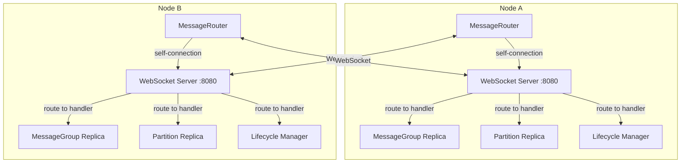

# Design Document: Unified Remote Transport

## Overview

This design simplifies the transport architecture by treating all services as remote, even those on the same node. Every message flows through WebSocket connections, including messages between services on the same node via a self-connection (loopback).

The key insight is that in a 100+ node cluster with 3 replicas per service, replicas are almost always on different nodes. Optimizing for the rare "local" case adds complexity without meaningful benefit. By using a single code path for all messages, we get:

- **Simpler code**: One delivery method, one registration point, one code path
- **Easier debugging**: All messages can be traced the same way
- **Fewer edge cases**: No special handling for local vs remote
- **Uniform behavior**: Local and remote messages have identical semantics

## Architecture



All messages, whether to a service on the same node or a different node, flow through WebSocket connections. The MessageRouter maintains connections to all nodes including itself.

## Components and Interfaces

### Unified Address Format

All services use the address format: `${nodeId}/${entityType}/${entityId}`

```javascript
// Examples:
'node-abc/message-group/mg-replica-1'
'node-abc/partition/partition-nodes-replica-1'
'node-abc/lifecycle/manager'
'node-xyz/partition/partition-tables-replica-2'

// Parsing is trivial:
function parseAddress(address) {
  const [nodeId, entityType, entityId] = address.split('/');
  return { nodeId, entityType, entityId };
}
```

### MessageRouter (Simplified)

```javascript
/**
 * MessageRouter - Unified WebSocket-based message routing.
 * All messages go through WebSocket, including local messages via self-connection.
 */
class MessageRouter extends EventEmitter {
  constructor(options = {}) {
    super();
    
    this.nodeId = options.nodeId;
    this.wsPort = options.wsPort;
    
    // Node connections (nodeId -> WebSocket connection)
    // Includes self-connection for local routing
    this.nodeConnections = new Map();
    
    // Registered handlers (address -> handler function)
    // Handlers are invoked when messages arrive via WebSocket
    this.handlers = new Map();
    
    // Pending messages awaiting acknowledgment
    this.pendingMessages = new Map();
    
    this.server = null;
    this.initialized = false;
  }

  /**
   * Initialize the router.
   * Starts WebSocket server and establishes self-connection.
   */
  async initialize() {
    // 1. Start WebSocket server
    await this.startServer();
    
    // 2. Establish self-connection (loopback)
    await this.connectToSelf();
    
    this.initialized = true;
  }

  /**
   * Start WebSocket server to accept connections.
   */
  async startServer() {
    return new Promise((resolve, reject) => {
      this.server = new WebSocketServer({ port: this.wsPort });
      
      this.server.on('connection', (ws) => {
        this.handleIncomingConnection(ws);
      });
      
      this.server.on('listening', resolve);
      this.server.on('error', reject);
    });
  }

  /**
   * Connect to self via loopback.
   * This enables uniform routing for all messages.
   */
  async connectToSelf() {
    const selfAddress = `ws://localhost:${this.wsPort}`;
    await this.connectToNode(this.nodeId, selfAddress);
  }

  /**
   * Connect to a remote node.
   */
  async connectToNode(nodeId, address) {
    return new Promise((resolve, reject) => {
      const ws = new WebSocket(address);
      
      ws.on('open', () => {
        this.nodeConnections.set(nodeId, { ws, nodeId, address });
        this.sendIdentification(ws);
        resolve();
      });
      
      ws.on('message', (data) => this.handleMessage(nodeId, ws, data));
      ws.on('close', () => this.handleDisconnect(nodeId));
      ws.on('error', reject);
    });
  }

  /**
   * Register a service handler.
   * The handler will be invoked when messages arrive for this address.
   */
  register(address, handler) {
    if (!this.isValidAddress(address)) {
      throw new Error(`Invalid address format: ${address}`);
    }
    this.handlers.set(address, handler);
  }

  /**
   * Unregister a service handler.
   */
  unregister(address) {
    this.handlers.delete(address);
  }

  /**
   * Deliver a message to a target address.
   * Always uses WebSocket, even for local addresses.
   */
  async deliver(targetAddress, message) {
    const { nodeId } = this.parseAddress(targetAddress);
    const connection = this.nodeConnections.get(nodeId);
    
    if (!connection) {
      return {
        acknowledged: false,
        error: `No connection to node ${nodeId}`,
      };
    }
    
    return this.sendMessage(connection.ws, targetAddress, message);
  }

  /**
   * Parse address to extract nodeId.
   */
  parseAddress(address) {
    const parts = address.split('/');
    return {
      nodeId: parts[0],
      entityType: parts[1],
      entityId: parts[2],
    };
  }

  /**
   * Validate address format.
   */
  isValidAddress(address) {
    const parts = address.split('/');
    if (parts.length !== 3) return false;
    
    const validTypes = ['message-group', 'partition', 'lifecycle', 'service'];
    return validTypes.includes(parts[1]);
  }

  /**
   * Handle incoming WebSocket message.
   */
  handleMessage(connectionId, ws, data) {
    const message = JSON.parse(data.toString());
    
    if (message.type === 'IDENTIFY') {
      this.handleIdentification(connectionId, ws, message);
      return;
    }
    
    if (message.type === 'ACK') {
      this.handleAcknowledgment(message);
      return;
    }
    
    if (message.type === 'SERVICE_MESSAGE') {
      this.handleServiceMessage(ws, message);
      return;
    }
  }

  /**
   * Handle service message - route to registered handler.
   */
  handleServiceMessage(ws, message) {
    const { targetAddress, messageId, payload } = message;
    const handler = this.handlers.get(targetAddress);
    
    if (!handler) {
      this.sendAck(ws, messageId, false, 'No handler for address');
      return;
    }
    
    Promise.resolve(handler(payload))
      .then((result) => {
        this.sendAck(ws, messageId, true, null, result);
      })
      .catch((error) => {
        this.sendAck(ws, messageId, false, error.message);
      });
  }

  /**
   * Send message through WebSocket.
   */
  sendMessage(ws, targetAddress, payload) {
    return new Promise((resolve) => {
      const messageId = uuidv4();
      
      const timeout = setTimeout(() => {
        this.pendingMessages.delete(messageId);
        resolve({ acknowledged: false, error: 'Message timeout' });
      }, this.messageTimeoutMs);
      
      this.pendingMessages.set(messageId, { resolve, timeout });
      
      ws.send(JSON.stringify({
        type: 'SERVICE_MESSAGE',
        messageId,
        targetAddress,
        sourceNodeId: this.nodeId,
        payload,
        timestamp: Date.now(),
      }));
    });
  }

  /**
   * Handle acknowledgment.
   */
  handleAcknowledgment(message) {
    const pending = this.pendingMessages.get(message.messageId);
    if (pending) {
      clearTimeout(pending.timeout);
      this.pendingMessages.delete(message.messageId);
      pending.resolve({
        acknowledged: message.acknowledged,
        error: message.error,
        ...message.result,
      });
    }
  }

  /**
   * Send acknowledgment.
   */
  sendAck(ws, messageId, acknowledged, error, result) {
    ws.send(JSON.stringify({
      type: 'ACK',
      messageId,
      acknowledged,
      error,
      ...result,
    }));
  }

  /**
   * Handle node disconnection.
   */
  handleDisconnect(nodeId) {
    this.nodeConnections.delete(nodeId);
    
    // Don't reconnect to self automatically - that's a fatal error
    if (nodeId === this.nodeId) {
      this.emit('selfDisconnect');
      return;
    }
    
    // Schedule reconnection for other nodes
    this.scheduleReconnect(nodeId);
  }

  /**
   * Shutdown the router.
   */
  async shutdown() {
    for (const [, connection] of this.nodeConnections) {
      connection.ws.terminate();
    }
    this.nodeConnections.clear();
    this.handlers.clear();
    
    if (this.server) {
      await new Promise((resolve) => this.server.close(resolve));
    }
  }
}
```

### Bootstrap Sequence

```javascript
/**
 * Bootstrap sequence for a node.
 */
async function bootstrap(options) {
  const { nodeId, wsPort } = options;
  
  // 1. Create MessageRouter
  const router = new MessageRouter({ nodeId, wsPort });
  
  // 2. Initialize (starts server + self-connection)
  await router.initialize();
  
  // 3. Now services can be created and registered
  const messageGroup = new MessageGroupService({
    groupId: 'mg-1',
    replicaId: 'mg-replica-1',
    nodeId,
  });
  
  // 4. Register with unified address
  const address = `${nodeId}/message-group/mg-replica-1`;
  router.register(address, (message) => messageGroup.handleMessage(message));
  
  // 5. Initialize service
  await messageGroup.initialize();
  
  return { router, messageGroup };
}
```

### Service Registration Pattern

All services follow the same registration pattern:

```javascript
// Message Group
const mgAddress = `${nodeId}/message-group/${replicaId}`;
router.register(mgAddress, (msg) => messageGroup.handleMessage(msg));

// Partition
const partitionAddress = `${nodeId}/partition/${replicaId}`;
router.register(partitionAddress, (msg) => partition.handleMessage(msg));

// Lifecycle Manager
const lifecycleAddress = `${nodeId}/lifecycle/manager`;
router.register(lifecycleAddress, (msg) => lifecycleManager.handleMessage(msg));
```

## Data Models

### Message Envelope

```javascript
{
  type: 'SERVICE_MESSAGE',
  messageId: 'uuid',
  targetAddress: 'node-abc/partition/replica-1',
  sourceNodeId: 'node-xyz',
  payload: { /* service-specific data */ },
  timestamp: 1234567890
}
```

### Acknowledgment

```javascript
{
  type: 'ACK',
  messageId: 'uuid',
  acknowledged: true,
  error: null,
  // ... handler result fields spread here
}
```

### Connection Info

```javascript
{
  nodeId: 'node-abc',
  ws: WebSocket,
  address: 'ws://10.0.0.1:8080',
  state: 'connected',
  reconnectAttempts: 0
}
```

## Correctness Properties

*A property is a characteristic or behavior that should hold true across all valid executions of a system-essentially, a formal statement about what the system should do. Properties serve as the bridge between human-readable specifications and machine-verifiable correctness guarantees.*

### Property 1: Address Format and Parsing

*For any* valid address string, parsing SHALL extract the correct nodeId, entityType, and entityId components, and the address SHALL match the format `${nodeId}/${entityType}/${entityId}` where entityType is one of the valid types.

**Validates: Requirements 1.1, 1.2, 1.3, 9.1, 10.1, 10.3**

### Property 2: Address Uniqueness

*For any* two services registered with the MessageRouter, their addresses SHALL be different. Attempting to register a duplicate address SHALL fail or replace the existing handler.

**Validates: Requirements 1.4**

### Property 3: Uniform WebSocket Delivery

*For any* message delivery (whether to local or remote address), the message SHALL be sent through a WebSocket connection. There SHALL be no separate code path for local delivery.

**Validates: Requirements 2.4, 3.2, 3.3, 9.3**

### Property 4: Routing Correctness

*For any* message sent to a registered address, the MessageRouter SHALL invoke the correct handler. The handler invoked SHALL be the one registered for that exact address.

**Validates: Requirements 5.1, 5.2, 5.3**

### Property 5: Delivery Semantics

*For any* message delivery attempt, the result SHALL be either:
- Success with the handler's response (acknowledged: true)
- Failure with an error message (acknowledged: false, error: string)

There SHALL be no silent failures or fallback delivery methods.

**Validates: Requirements 6.2, 7.1, 7.2, 7.3, 7.4**

### Property 6: Reconnection Backoff

*For any* connection failure to a remote node, reconnection attempts SHALL follow exponential backoff. The delay between attempt N and N+1 SHALL be greater than or equal to the delay between attempt N-1 and N.

**Validates: Requirements 2.3, 6.1**

## Error Handling

| Error Condition | Behavior | Recovery |
|----------------|----------|----------|
| No connection to target node | Return `{acknowledged: false, error: 'No connection to node X'}` | Caller retries or fails |
| Message timeout | Return `{acknowledged: false, error: 'Message timeout'}` | Caller retries or fails |
| No handler for address | Return `{acknowledged: false, error: 'No handler for address'}` | Caller checks address |
| Self-connection lost | Emit 'selfDisconnect' event, halt operations | Node must restart |
| Remote connection lost | Schedule reconnection with backoff | Automatic recovery |
| Invalid address format | Throw error on registration | Fix address format |

## Testing Strategy

### Unit Tests

1. **Address parsing**: Verify correct extraction of nodeId, entityType, entityId
2. **Address validation**: Verify valid types accepted, invalid rejected
3. **Handler registration**: Verify handlers stored and retrieved correctly
4. **Message serialization**: Verify correct JSON format

### Property-Based Tests

Using fast-check with `{numRuns: 10}` per testing guidelines:

1. **Address format property**: Generate random valid addresses, verify parsing roundtrip
2. **Routing property**: Generate random registrations and messages, verify correct handler called
3. **Delivery semantics property**: Generate success/failure scenarios, verify correct result type
4. **Backoff property**: Generate reconnection sequences, verify delays increase

### Integration Tests

1. **Self-connection**: Verify node can send messages to itself
2. **Cross-node delivery**: Verify messages reach handlers on other nodes
3. **Bootstrap sequence**: Verify correct ordering of initialization steps
4. **Disconnection handling**: Verify reconnection after connection loss

### Test Configuration

- Property tests: 10 iterations per test (per testing guidelines)
- Test timeout: 2 seconds maximum (per testing guidelines)
- No real delays - use immediate promises or mocked timers
