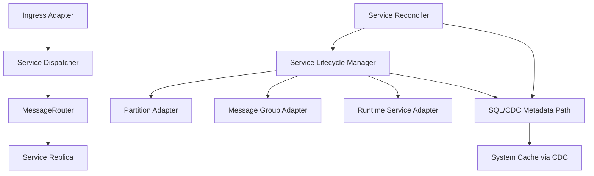

# Design Document: Unified Service Lifecycle Hard Cutover

## Overview

This design unifies all service startup, maintenance, and invocation under a
single architecture:

1. one lifecycle owner (`Service_Lifecycle_Manager`)
2. one reconciliation owner (`Service_Reconciler`)
3. one invocation envelope (`Service_Message`) and routing contract
4. one metadata mutation path (SQL/CDC)

The migration may be implemented incrementally in development branches, but the
completion target is a hard cutover with no legacy runtime path in the shipped
state.

## Goals

1. One way to start, stop, and maintain any service class.
2. One way to invoke services from all ingress protocols.
3. One control-loop model for desired -> actual convergence.
4. Built-ins and userland services treated uniformly.
5. Zero legacy lifecycle paths in final state.

## Non-Goals

1. Rewriting partition/message-group internals for this migration.
2. Introducing a second control plane for userland services.
3. Maintaining fallback compatibility paths after cutover.
4. Allowing runtime feature flags that preserve old orchestration owners.

## Current State and Problem

Current code already has strong pieces:

1. protocol adapters exist (`AdminWebSocketAPI` is adapter-oriented)
2. runtime drivers and lifecycle abstractions exist for replicated runtime
   services
3. metadata mutation ownership is SQL/CDC-centric

The gap is that service classes still have multiple startup and maintenance
paths (for example bootstrap-managed partition/message-group creation vs runtime
service lifecycle for meta/userland services).

## Target Architecture

### Core Components

1. `Service_Lifecycle_Manager`
   - Owns create/start/stop/restart for all service replicas.
   - Delegates per-type behavior to `Service_Type_Adapter` implementations.
   - Owns lifecycle state transitions and operation journaling hooks.

2. `Service_Reconciler`
   - Periodically and event-driven computes desired vs actual state.
   - Emits lifecycle operations through `Service_Lifecycle_Manager` only.
   - Owns convergence and drift correction.

3. `Service_Type_Adapter` (interface)
   - `partition` adapter wraps current partition service lifecycle calls.
   - `message_group` adapter wraps current message-group lifecycle calls.
   - `runtime_service` adapter bridges to runtime driver lifecycle.

4. `Service_Dispatcher`
   - Accepts canonical `Service_Message` envelopes.
   - Resolves routable target leader endpoint.
   - Uses `MessageRouter` for message delivery.

5. `Ingress_Adapters`
   - protocol-specific translation only (WS now, future protocols later).
   - no lifecycle ownership.
   - no metadata ownership.

### High-Level Flow



## Canonical Data Model

### Desired State

`service_definitions` (plus policy tables) is the single desired-state source.
Required canonical fields for unified lifecycle:

1. `service_id`
2. `service_type` (partition, message_group, runtime_service)
3. `runtime_kind`
4. `runtime_ref`
5. `runtime_config`
6. `replica_count`
7. consistency and budget policy fields

No service kind may use out-of-band descriptor structures.

### Actual State

`services` table is the single actual-state source for service replicas.

1. current node/endpoint/role/state
2. lifecycle status
3. health and last update metadata

### Endpoint State

`service_endpoints` remains the single endpoint publication table.
Adapters and drivers publish endpoint intent through `Service_Lifecycle_Manager`
which writes via SQL/CDC.

### Operation Journal

Lifecycle-changing actions are recorded in operation tables.

1. request accepted -> `pending`
2. dispatch started -> `in_progress`
3. completion -> terminal state

Recovery and idempotency use these records.

## Service Type Adapter Contract

All adapters implement one contract:

```text
validateDefinition(definition) -> ValidationResult
createReplica(context) -> ReplicaHandle
startReplica(handle, context) -> StartResult
stopReplica(handle, context) -> StopResult
health(handle, context) -> HealthResult
```

Rules:

1. adapters do not write metadata directly
2. adapters report intent and outcomes to lifecycle owner
3. adapters are deterministic and side-effect bounded

## Startup and Join Unification

### Seed Startup

1. initialize storage, transport, router, SQL/CDC, cache
2. initialize `Service_Lifecycle_Manager` and `Service_Reconciler`
3. register adapters
4. hydrate desired state
5. reconciler starts and converges built-in services (message groups,
   partitions, meta services) through unified lifecycle API

### Join Startup

1. initialize node infrastructure
2. initialize lifecycle manager + reconciler
3. consume desired/actual snapshots
4. reconciler converges local responsibilities through same lifecycle API

No direct partition/message-group creation outside lifecycle manager remains.

## Invocation Unification

### Canonical Service Message

All protocol ingress adapters output:

1. `message_id`
2. `service_id`
3. `operation`
4. `payload`
5. identity and trace metadata
6. budget and policy metadata

Dispatcher validates and routes this envelope only.

### Protocol Expansion

Future ingress (gRPC, HTTP APIs, other streams) plugs in by implementing only
adapter translation to `Service_Message`; no new lifecycle or metadata paths.

## Runtime Unification

Runtime service adapter delegates runtime-specific work through existing runtime
driver registry and lifecycle plumbing.

1. `native_js`, `wasm_component`, `oci_container` selection remains centralized
2. unknown runtime kind fails closed
3. runtime drivers do not own metadata mutation

## Hard Cutover Strategy (No Legacy in Final State)

### Implementation Sequence

1. Introduce new unified components and adapters.
2. Migrate bootstrap/join and invocation call sites to unified owners.
3. Migrate tests to unified paths.
4. Delete legacy paths in same delivery cycle before completion.

### Forbidden Final-State Artifacts

1. deprecated lifecycle branches kept behind flags
2. fallback "old path" calls in bootstrap/join/invocation
3. direct service startup APIs bypassing lifecycle manager
4. parallel reconciler loops

### Definition of Done

1. legacy lifecycle code removed from source
2. old entrypoints non-existent or hard-failed
3. integration tests cover only unified path
4. architecture docs describe only unified model

## Failure Handling and Recovery

1. Lifecycle operations are idempotent using operation keys.
2. Reconciler retries are bounded and recorded.
3. Node restart resumes pending operations from journal.
4. Drift is continuously corrected from desired/actual comparison.

## Observability

Required dimensions in logs/metrics/traces:

1. `service_id`
2. `service_type`
3. `runtime_kind`
4. `operation_id`
5. `node_id`

Reconciler exposes decision traces:

1. observed drift
2. chosen action
3. reason and policy inputs
4. action result

## Security and Policy Enforcement

1. Ingress adapters attach authenticated principal context.
2. Dispatcher enforces authorization per operation.
3. Reconciler/lifecycle enforce placement and runtime policy preconditions.
4. Denials are fail-closed and auditable.

## Testing Strategy

### Unit

1. adapter contract conformance
2. lifecycle owner state transitions
3. reconciler diff planner
4. dispatcher envelope validation

### Integration

1. seed bootstrap converges all built-ins via unified lifecycle
2. node join converges services via unified lifecycle
3. rebalance transitions executed via operation journal + lifecycle manager
4. userland service create/scale/rollout through same path

### Negative/Cutover

1. legacy startup entrypoints removed or hard fail
2. no fallback branches reachable
3. grep/static checks enforce banned symbols and modules

## Documentation Updates Required

1. `architecture.md` owner map updated for lifecycle/reconciler/dispatcher
2. operations docs updated for unified service lifecycle controls
3. protocol docs updated to canonical `Service_Message` model
4. contributor docs updated with "no parallel lifecycle" rules
