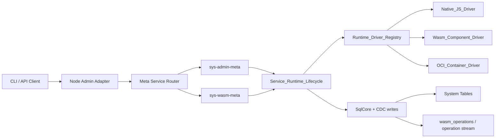

# Design Document: Unified Service Runtime (Native + WASM + Container-Ready)

## Overview

This design introduces a runtime-agnostic execution architecture for replicated
services. It keeps one lifecycle owner and one control-plane mutation path while
allowing three runtime kinds:

1. `native_js` (immediate use for current admin handlers)
2. `wasm_component` (current WASM services)
3. `oci_container` (future, feature-gated)

Core intent:

1. Move admin execution into replicated services without forcing a WASM rewrite.
2. Preserve WASM investments and distribution controls.
3. Add a clean runway for classical container workloads later.

## Goals

1. One runtime selection owner (`Runtime_Driver_Registry`).
2. One runtime lifecycle owner (`Service_Runtime_Lifecycle`).
3. One mutation path (SQL/CDC).
4. Compatibility with existing admin CLI and WASM services.
5. Explicit, policy-driven future container support.

## Non-Goals

1. Running parallel lifecycle systems per runtime kind.
2. Replacing SQL/CDC with direct runtime writes.
3. Full container orchestration parity in v1 of this change.
4. Breaking existing admin or WASM flows during initial migration.

## High-Level Architecture



## Ownership Model

1. Runtime driver selection:
   - Owned by `Runtime_Driver_Registry` only.
2. Runtime lifecycle orchestration:
   - Owned by `Service_Runtime_Lifecycle` only.
3. Metadata mutation:
   - Owned by SQL/CDC path only.
4. Node-local admin API:
   - Compatibility adapter only, no direct mutation ownership.

## Service Definition Model

## Existing Context

Current `service_definitions` is WASM-centric (`handler_function_id`, consistency,
budget, etc.).

## Proposed Additions

Add runtime-aware fields:

1. `runtime_kind` (`native_js`, `wasm_component`, `oci_container`)
2. `runtime_ref` (runtime artifact identifier)
3. `runtime_config` (JSON string, runtime-specific)

Retain legacy fields for compatibility during migration.

### Mapping Rules

1. Legacy WASM service:
   - `runtime_kind = wasm_component`
   - `runtime_ref = handler_function_id`
2. Admin service (as-is code path):
   - `runtime_kind = native_js`
   - `runtime_ref = <module_or_handler_id>`
3. Future container service:
   - `runtime_kind = oci_container`
   - `runtime_ref = registry/repo@sha256:<digest>`

## Runtime Driver Contract

Each runtime driver implements a common interface:

```typescript
interface RuntimeDriver {
  kind: 'native_js' | 'wasm_component' | 'oci_container';
  validateDescriptor(definition): ValidationResult;
  prepare(definition, context): Promise<PrepareResult>;
  start(replicaContext): Promise<StartResult>;
  stop(replicaContext): Promise<void>;
  health(replicaContext): Promise<HealthResult>;
}
```

Contract rules:

1. No driver writes system metadata directly.
2. All driver failures return typed errors.
3. Driver lifecycle calls are idempotent where possible.

## Runtime Driver Registry

`Runtime_Driver_Registry` provides:

1. Driver registration keyed by `runtime_kind`
2. Immutable read-only lookup API
3. Deterministic unknown-kind failure behavior

No fallback selection is allowed.

## Service Runtime Lifecycle

`Service_Runtime_Lifecycle` responsibilities:

1. Resolve runtime kind -> driver.
2. Execute prepare/start/stop/health with shared lifecycle semantics.
3. Coordinate endpoint registration through one path.
4. Coordinate operation journaling transitions.
5. Emit lifecycle telemetry with runtime dimensions.

This component replaces runtime-specific lifecycle branching as the primary
owner.

## Admin Serviceization Target

`sys-admin-meta` and `sys-wasm-meta` run as replicated services.

### Adapter Behavior

Node-level admin endpoint:

1. Validate protocol envelope.
2. Route to meta-service leader.
3. Return response in existing CLI-compatible envelope.

No direct SQL mutation ownership remains in adapter mode after enforcement.

## Data and Schema Changes

Required schema updates:

1. Extend `service_definitions` with runtime fields.
2. Add migration defaults for existing rows.
3. Add indexes for `runtime_kind` and `runtime_ref`.

Optional (container phase):

1. Add registry/source policy metadata fields where needed.
2. Add container-specific runtime status fields only if truly required by
   lifecycle owner.

## Security and Policy Model

1. Shared authn/authz at command layer.
2. Runtime-specific policy gate:
   - Native: module allowlist/path policy.
   - WASM: capability + dependency + manifest policy.
   - Container: image source + digest + execution policy.
3. Fail-closed on policy ambiguity.

## Operation Lifecycle Integration

Mutating commands create operation records:

1. `pending`
2. `in_progress`
3. terminal state (`completed` / `failed` / `cancelled`)

Idempotency is keyed by tenant + idempotency key + command signature rules.

## Endpoint and Port Strategy

1. Endpoint write path remains centralized via existing endpoint builder path.
2. Runtime drivers provide endpoint intent, not direct endpoint writes.
3. Administrative endpoint policy remains explicit (fixed node-level admin
   adapter endpoint) while service endpoints remain runtime-managed.

## Migration Plan

### Phase 1: Introduce Runtime Abstraction (Compatibility Mode)

1. Add runtime fields + driver registry + lifecycle owner.
2. Implement `native_js` and `wasm_component` drivers.
3. Map legacy rows automatically to runtime descriptors.

### Phase 2: Serviceize Admin Execution

1. Route admin adapter commands through meta-service routing.
2. Run admin command handlers under `native_js` replicated service execution.
3. Keep compatibility envelope for CLI/API clients.

### Phase 3: Enforcement

1. Turn on rejection for direct node-local mutation paths.
2. Ensure operation and trace flows are complete.
3. Remove bypass branches.

### Phase 4: Container Feature Gate

1. Add `oci_container` descriptor validation and policy checks.
2. Implement driver behind feature gate.
3. Add integration tests and staged rollout guidance.

## Risks and Mitigations

1. Risk: partial migration leaves dual execution paths.
   - Mitigation: enforce routing through adapter -> router -> meta services,
     plus guard mode.
2. Risk: schema migration breaks existing services.
   - Mitigation: additive fields, deterministic defaults, compatibility mapping.
3. Risk: container runtime expands security surface too early.
   - Mitigation: strict feature gate + digest-only references + fail-closed
     policy checks.

## Testing Strategy

1. Unit:
   - driver registry selection
   - descriptor validation per runtime
   - mapping from legacy fields
2. Integration:
   - admin adapter routing to replicated services
   - operation lifecycle and idempotency
   - endpoint registration path invariants
3. Compatibility:
   - existing CLI flows
   - existing WASM service execution
4. Future gated:
   - container driver contract tests behind feature flag.

## Architecture Documentation Changes

`architecture.md` must be updated with:

1. Runtime abstraction ownership (`Runtime_Driver_Registry`,
   `Service_Runtime_Lifecycle`)
2. Runtime kind model (`native_js`, `wasm_component`, `oci_container`)
3. Admin serviceization flow (adapter-only node endpoint)
4. Explicit anti-patterns:
   - no parallel lifecycle systems
   - no direct mutation from adapters
   - no runtime fallback selection
